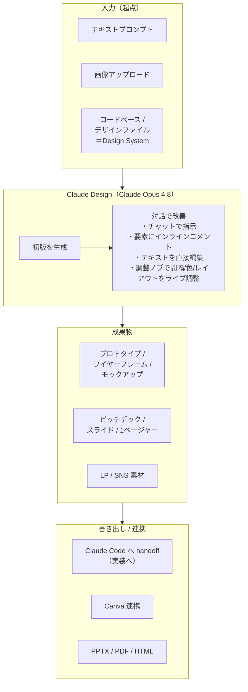

# Claude Design を使用してデザイン・プロトタイプ・スライドを自動生成する

Anthropic Labs が提供する [Claude Design](https://claude.ai/design) を使用して、Claude と対話しながらプロトタイプ・モックアップ・スライド・LP などのビジュアル成果物を自動生成する方法を紹介する。
Figma や Illustrator などのデザインツールの専門知識がなくても、「青いボタンをここに置いて」「もっとモダンな雰囲気に」のように自然言語で指示するだけで、画面上のデザインをリアルタイムに書き換えていける。
Anthropic Labs の **research preview（リサーチプレビュー）** として提供されており、デザイン向けの最新鋭 vision モデルで動作する。対象プラン・料金・提供形態・動作モデルは、後述の「[利用環境・課金体系](#利用環境課金体系2026-06-05-時点)」を参照。

## Claude Design でできること

入力（テキスト / 画像 / コードベース・デザインファイル）を起点に、Claude と対話しながらビジュアル成果物を生成・改善し、各種フォーマットへ書き出せる。



- 生成できる成果物
    - インタラクティブな**プロトタイプ**・**ワイヤーフレーム**・**モックアップ**（Web / モバイルアプリの UI）。コードレビューや PR なしでユーザーテストやフィードバック収集に使える。
    - **ピッチデック / プレゼン資料 / 1 ページャー**。
    - **LP（ランディングページ）や SNS 素材**などのマーケティング用クリエイティブ。
    - voice・video・シェーダー・3D などを含む、コード駆動の高度なプロトタイプ。

- 対話による改善方法
    - チャットで自然言語の指示を出す。
    - 特定の要素に**インラインコメント**を付ける。
    - **テキストを直接編集**する。
    - **調整ノブ（adjustment knobs）** で間隔・色・レイアウトをライブに微調整する。

- Design System の自動適用
    - オンボーディング時に、Claude がコードベースやデザインファイルを読み取って**Design System**（色・タイポグラフィ・コンポーネント）を構築する。
    - 以降のプロジェクトに自動適用されるため、社内デザインと一貫した成果物になる。

- 書き出し・他ツールへの連携
    - 作成した UI を **Claude Code に handoff** して実装につなげる。
    - **Canva** へ連携する。
    - **PPTX / PDF / スタンドアロン HTML** として書き出す。

## 利用環境・課金体系（2026-06-05 時点）

- 対象プラン: **Claude Pro / Max / Team / Enterprise**（research preview）。Free プランは対象外。Enterprise は管理者が **Organization Settings → Capabilities → Anthropic Labs** から有効化する必要がある。
- 提供形態: Web（`claude.ai/design`）のコンソール UI。公開 API は提供されていない。
- 動作モデル: デザイン向けの最新鋭の vision モデルで動作する。research preview 開始時は **Claude Opus 4.7**、2026年5月28日の Opus 4.8 リリース以降は **Claude Opus 4.8** に対応。
- 使用量（クレジット）の扱い（**別建て / 共有のどちらかが不確定。要確認**）:
    - **週次の利用枠**を消費し、使い切った後は**追加の使用量クレジット（extra usage）** を購入して継続できる（サブスク料金とは別請求。Team / Enterprise では管理者が購入・管理する）。基本利用は追加課金なしでプランに含まれる。
    - 「チャット / Claude Code と別建てか、同じ枠を共有か」は情報が錯綜している。
        - 公式ヘルプセンターの記載は **別建て**（`Claude Design is metered separately from chat and Claude Code, so design activity never draws from those other limits`）。専用の週次アローワンスがチャット / Claude Code 枠の「外」に並ぶ、という説明。
        - 一方、**2026年5月27〜28日頃**からアプリ内に `Claude Design now shares usage limits with Claude.ai and Claude Code` という通知が出て、**チャット / Claude Code と同じ週次枠を共有**するようになったとの利用者報告が多数ある（公式の発表・チェンジログはなく、サーバーサイドの段階的ロールアウト。公式ヘルプの記載が未追随の可能性）。
    - 2026-06-05 時点ではロールアウト途中で挙動が一定しないため、**自分のアカウントの使用量画面で実際の消費先を確認する**のが確実。

## 使用方法

ここでは「**SaaS のダッシュボード UI のプロトタイプを作り、Claude Code に handoff して実装につなげる**」という実際のユースケースを例に、一連の流れを説明する。
（プロトタイプ作成だけでなく、ピッチデックや LP の作成でも、入力 → 生成 → 改善 → 書き出しという基本の流れは同じ。）

1. Claude Design にアクセスする<br>
    Claude Pro / Max / Team / Enterprise のサブスクリプションでログインした状態で [`claude.ai/design`](https://claude.ai/design) を開く（対象プラン・料金は「[利用環境・課金体系](#利用環境課金体系2026-06-05-時点)」を参照）。
    Enterprise の場合は、事前に管理者が **Organization Settings → Capabilities → Anthropic Labs** から有効化しておく必要がある。<br>

1. （推奨・初回のみ）Design System を構築する<br>
    プロジェクトを作り始める前に、ワークスペースに対して一度だけ Design System を用意しておくと、生成物が自社ブランドと一貫したものになる（用意しないと「動くが汎用的な」見た目になりやすい）。
    `Set up your design system` 画面で、会社情報とブランド・プロダクトの参考素材（コードリポジトリ、既存のデザインファイルやスライド、ロゴ・カラーパレットなどの個別アセット）を読み込ませ、右上の `Continue to generation` で生成を開始する。

    > 補足: Figma の `.fig` ファイルはアップロードして取り込める（後述の通り、ブラウザ内でローカル解析され、サーバーにはアップロードされない）。<br>

    

    

    上の Design System 設定（`Set up your design system`）画面の各項目は次の通り。

    - **Company name and blurb**（or name of your design system）: 会社名（または Design System 名）と短い説明文を入力する。どんなプロダクト／ブランドかを Claude に伝え、生成のベースにする。
    - **Provide examples of your design system and products（all optional）**: Design System や既存プロダクトの参考素材を渡すセクション。すべて任意で、渡すほど自社ブランドに沿った抽出になる。
        - **Link code on GitHub**: GitHub リポジトリの URL を貼って `Add` する。コードベースを読み、色・タイポグラフィ・コンポーネントを抽出する。
        - **Link code from your computer**: ローカルのコードフォルダをドラッグ＆ドロップ（または browse）で取り込む。
        - **Upload a .fig file**: Figma の `.fig` ファイルをアップロードする。`Parsed locally in your browser — never uploaded` とある通り、`.fig` は**ブラウザ内でローカル解析され、サーバーにはアップロードされない**。
        - **Add fonts, logos and assets**: フォント・ロゴ・画像などの個別アセットファイルを追加する。
    - **Any other notes?**: 上記で表現しきれないブランドのトーンを自由記述する（例: 暖色系のアースカラー、角丸、遊び心はあるがプロフェッショナルな声色 など）。
    - 右上の **Continue to generation**: 入力内容をもとに、Design System の生成へ進む。

    作成ボタン（`Continue to generation`）をクリックすると、Claude が連携した GitHub リポジトリを自動で探索し（ファイル構成の把握・主要ファイルの読み取り）、Design System を生成していく。完了後は、上部の `Design System` / `Design Files` タブで生成結果を確認・編集できる。

    

1. 生成された Design System をレビュー・公開する<br>
    生成が一段落すると、`Review draft design system`（生成された Design System のレビュー画面）に切り替わる。Claude が抽出したブランドカラーやタイポグラフィなどを項目ごとに確認・承認し、問題なければ `Published` トグルで公開する（`Claude is still working` とある通り、レビューしながら裏で生成が継続する）。

    

    この `Review draft design system` 画面の主な要素は次の通り。

    - **`Published` トグル**: Design System を公開する。公開すると以降の新規プロジェクトがこの設定を引き継ぐ。
    - **`Missing brand fonts` バナー**: Claude が代替 Web フォントで描画している状態を知らせる。`Upload fonts` から自社フォントをアップロードして差し替えられる。
    - **`Needs review` → `Brand colors`**: 抽出されたブランドカラーのランプ（Navy / Blue / Cyan など、各色の HEX と用途付き）。項目ごとに `Looks good`（承認）/ `Needs work…`（要修正）で評価できる。
    - **折りたたみセクション**: `Type`（Sans specimen / Type scale / Mono, labels & meta）、`Colors`（Brand colors / Neutrals / Status colors / Logo mark palettes）、`Spacing` などで、生成された Design System の各要素を確認・調整する。
    - **左ペイン**: コンポーネント生成やスクショ検証といった Claude の作業ログがリアルタイムに流れる。

1. 新規プロジェクトを作成し、コンテキストを渡す<br>
    1. **New project** をクリックしてプロジェクト名を付け、fidelity（忠実度。High fidelity など）を選ぶ。<br>
        

    1. 作りたいもののコンテキストを入力で渡す。複数の入力を組み合わせられる。
        - **テキストプロンプト**: 目的・レイアウト・コンテンツ・対象ユーザーを記述する。「`Create a dashboard showing [目的] with [レイアウトの要件] for [対象ユーザー]`」のように、目的・要件・対象を盛り込むと精度が上がる。
        - **画像 / ドキュメント**: スクリーンショットや既存アセット、DOCX / PPTX / XLSX など。
        - **Web キャプチャ**: 既存サイトから要素を取り込む。
        - **コードリポジトリ**: ブランド理解のために参照させる。<br>

        

        左の `Start with context`（`Design System` / `Add screenshot` / `Attach codebase` / `Drag in a Figma file`）で context を足しつつ、下部の `Describe what you want to create…` に作りたいものを記述する。

        本ユースケース（SaaS ダッシュボードのプロトタイプ）なら、`Describe what you want to create…` への入力例は次の通り（目的・対象ユーザー・レイアウト・トーンを具体的に書く）。

        ```text
        SaaS の管理ダッシュボードのプロトタイプを作成して。
        対象ユーザー: 中小企業のカスタマーサポート管理者。
        レイアウト:
        - 左サイドバーにナビ（ダッシュボード / チケット / 顧客 / レポート / 設定）
        - 上部に KPI カードを 4 枚（未対応チケット数 / 平均応答時間 / 本日の解決数 / CSAT）
        - 中央に最近のチケット一覧テーブル（件名・ステータス・優先度・担当者・更新日時）
        - 右側にチケット件数の推移を示す折れ線グラフ
        トーンは公開済みの Design System に合わせてクリーン＆モダンに。High fidelity で。
        ```

    1. プロンプトを記述し（必要なら上記の context を添付して）、`Send` を押す。これで初版の生成が始まる。

1. 初版が生成される（2 ペイン構成で確認する）<br>
    画面は左に**チャットパネル**、右に**ライブキャンバス**の 2 ペイン構成。指示に情報が足りない場合は、Claude が描画前に確認の質問を返すことがある。回答するとキャンバスに初版のダッシュボード UI が生成される。<br>

    

    

1. 対話・直接操作でデザインを改善する<br>
    次の 4 つの方法を組み合わせて、思いどおりになるまで反復する。
    - **チャットで指示**: 「`もっと暗いテーマにして`」「`レイアウト案を 3 つ見せて`」など、広い変更を依頼する。
    - **インラインコメント**: キャンバスを **Comment モード**に切り替え、対象要素をクリックして「`このボタンの左右パディングを広げて`」のように指示する。場所を言葉で説明しなくても、要素を指定して直接依頼できる。
    - **テキストの直接編集**: コピー（文言）はキャンバス上で直接書き換えられる（新しいプロンプトを打つ必要がない）。
    - **調整ノブ（スライダー）**: 間隔・色・レイアウト用に Claude が生成したコントロールで、値を動かすとライブに反映される。

    

1. （任意）別案（バリエーション）を探索する<br>
    今の案を残したまま別方向を試したい場合は、「`save what we have and try a completely different approach`（今のものを保存して、まったく別のアプローチを試して）」のように指示する。バージョン履歴を保ちながら方向性を比較検討できる。

1. （任意）チームで共有・コラボレーションする<br>
    共有はオーガニゼーション単位で、アクセスレベルを Private / View-only（閲覧のみ）/ Comment（フィードバックのみ）/ Edit（同時に編集・Claude との対話が可能）から選べる。レビューやユーザーテストに使う。

1. 成果物を書き出す / Claude Code へ handoff する<br>
    画面右上の **Export** メニューから書き出し先を選ぶ。
    - **本ユースケースの主役**: 「**Hand off to Claude Code**」をクリックすると、デザインの意図が 1 つのパッケージにまとめられ、単一の指示で Claude Code に渡される。プロトタイプからコード実装へシームレスにつながる（「アイデア → プロトタイプ → コード」という流れ）。

        

        

        > Hand off to Claude Code: Claude Design で作成したデザイン → 実装の引き継ぎを Claude Code 向けに行う機能

    - スライド・資料の用途なら **PPTX / PDF** で書き出す、または **Canva** へ連携する。

        

    - Web ページとして使うなら **スタンドアロン HTML** で書き出す。
    - チーム内共有用に**オーガニゼーション URL** として共有することもできる。<br>

1. Claude Code で handoff したデザインを実装する<br>

    上記 Claude Code への **Export**　から取得したコマンドを、ローカルでの Claude Code のチャットセッションに貼り付ける。
    ```bash
    Fetch this design file, read its readme, and implement the relevant aspects of the design. https://api.anthropic.com/v1/design/h/xxx?open_file=xxx.html
    Implement: サポート管理ダッシュボード.html
    ```

    すると、Claude Design で作成したデザインに従って、Claude Code が自動的に UI を実装してくれる

    ```bash
    ❯ Fetch this design file, read its readme, and implement the relevant aspects of the design. https://api.anthropic.com/v1/design/h/xxx?open_file=xxx.html                                                                   
    Implement: サポート管理ダッシュボード.html                                                                                                                                      

    ● これは README で説明している「Hand off to Claude Code」の実際のワークフローですね。デザインファイルを取得して README を読み、サポート管理ダッシュボード.html
    を実装します。まずデザインファイルを取得します。

    ● Fetch(https://api.anthropic.com/v1/design/h/xxx)
    ⎿  Received 157.6KB (200 OK)

    ● バンドルは gzip 圧縮ファイル（157.6KB）として保存されました。展開して中身を確認します。

    ● Bash(xxx)
    ⎿  Shell cwd was reset to xxx

    ● The handoff bundle extracted successfully. Let me read the README and the key files.

    Read 1 file (ctrl+o to expand)

    ● README の指示に従い、まずチャット履歴を読み、次に主デザインファイル サポート管理ダッシュボード.html とそのインポートを読みます。

    Read 2 files (ctrl+o to expand)

    ● 全体像を把握しました。xxx Design System に沿った日本語サポート管理ダッシュボードで、サポート管理ダッシュボード.html が React(Babel standalone) で dashboard.css /
    icons.jsx / data.jsx / chrome.jsx / widgets.jsx / tickets.jsx / app.jsx を読み込む構成です。README の指示通り、ピクセル忠実に再現します。各ソースを読みます。

    Read 2 files (ctrl+o to expand)

    ● CSS とトークンを把握しました。残りの JSX（コンポーネント・データ）を読みます。

    Read 3 files (ctrl+o to expand)

    ● 残りのコンポーネント（chrome / widgets / tickets）を読みます。

    Read 3 files (ctrl+o to expand)

    ● ソース一式を読み切りました。xxx Design System に沿った日本語サポート管理ダッシュボード（サイドバー・KPI
    4枚・チケットテーブル＋絞り込み・推移グラフ・優先度内訳・担当者負荷・行クリック→詳細ドロワー）です。

    README の指示（「プロトタイプの内部構造をそのままコピーせず、ターゲットに合う技術でピクセル忠実に再現。CSS
    が合うなら流用」）に従い、このリポジトリ（ビルド無しの静的サイト）に合う形＝Babel/React ランタイム CDN に依存しない素の HTML/CSS/JS
    で実装します。CSS・デザイントークン・フォント・アセット・データは合致するので流用し、React コンポーネントは vanilla JS で同じ DOM・同じインタラクションを再構築します。

    まず実装先ディレクトリを作り、流用する静的アセット（CSS・フォント・画像）をそのままコピーします。
    ```

    1. handoff バンドルを取得する。バンドルは次の構成になっている。
        - `README.md`（`CODING AGENTS: READ THIS FIRST`）: コーディングエージェント向けの読み順・実装方針。
        - `chats/`: ユーザーとデザインアシスタントの会話履歴。「何を作りたかったか」「反復してどこに着地したか」という**意図**が入っている。
        - `project/`: HTML/CSS/JS のプロトタイプ本体・アセット（フォント・画像）・コンポーネント・Design System のトークン（`colors_and_type.css` など）。
    1. Claude Code はバンドルの `README.md` の指示に従って実装する。
        - まず `chats/` の会話履歴を読み、ユーザーの意図と最終的な着地点を把握する。
        - 次に主デザインファイル（例: `サポート管理ダッシュボード.html`）を上から読み、import をたどって全体構成（共有コンポーネント・CSS・スクリプト）を理解する。
        - 曖昧な点があれば、実装前にユーザーへ確認する。
        - ターゲットのコードベースに合う技術（React / Vue / ネイティブなど）で**ピクセル忠実に再現**する。プロトタイプはあくまで「本実装の設計図」なので、内部構造をそのままコピーするのではなく、見た目（寸法・色・レイアウト）を一致させる。

## 参考サイト

- Introducing Claude Design by Anthropic Labs（公式発表）: https://www.anthropic.com/news/claude-design-anthropic-labs

- Claude Design: https://claude.ai/design

- Claude Design subscription usage and pricing（公式ヘルプ・プラン/料金）: https://support.claude.com/en/articles/14667344-claude-design-subscription-usage-and-pricing

- Claude 3.5 Sonnet の Artifacts を使用してアプリのコードとデモを自動生成する（本リポジトリの Tip）: https://github.com/Yagami360/ai-product-dev-tips/tree/master/nlp_processing/26
