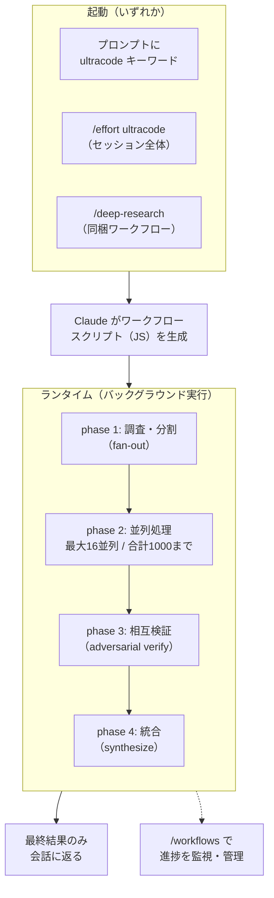

# Claude Code の Dynamic Workflows（ultracode）を使用して大規模タスクをマルチエージェントで並列実行する

Claude Code は、Anthropic 社が提供するターミナル上で動作する AI コーディングエージェントである。

通常の Claude Code は、1 つの会話の中で Claude 自身がオーケストレーター（指揮役）となり、必要に応じてサブエージェントを起動しながらターン単位でタスクを進める。これに対し **Dynamic Workflows（動的ワークフロー）** は、Claude が「オーケストレーションの段取り（ループ・分岐・各段階の処理）」を JavaScript スクリプトとして書き出し、専用ランタイムがそのスクリプトをバックグラウンドで実行して、**数十〜数百のサブエージェントを並列に動かす**仕組みである。会話のコンテキストには各エージェントの中間結果ではなく最終結果だけが返るため、1 つの会話では捌ききれない規模のタスク（コードベース全体のバグ調査・大規模リファクタ／移行・複数ソースを突き合わせる調査など）を扱える。

この Dynamic Workflows を手軽に呼び出すための入口が **ultracode** である。プロンプトに `ultracode` というキーワードを含める（または `/effort ultracode` をセッションに設定する）と、Claude はそのタスクをワークフローとして組み立てて実行する。

> [!NOTE]
> Dynamic Workflows は **research preview（リサーチプレビュー）** 段階の機能で、**Claude Code v2.1.154 以降**で利用できる（2026年5月28日に Claude Opus 4.8 とともに公開）。当初のトリガーキーワードは `workflow` だったが、**v2.1.160（2026年6月2日）で `ultracode` に改名**された。本 Tip は 2026-06-05 時点の仕様に基づく。

## Dynamic Workflows / ultracode でできること

プロンプト（`ultracode` キーワード / `/effort ultracode` / 同梱の `/deep-research`）を起点に、Claude がオーケストレーション用の JavaScript スクリプトを生成し、ランタイムがバックグラウンドでサブエージェントを並列実行する。各段階の中間結果はスクリプト内の変数に保持され、独立したエージェント同士で結果を相互検証（adversarial verification）したうえで、最終結果だけが会話に返る。



- 何ができるか（向いているタスク）
    - **コードベース全体のバグ調査・セキュリティ監査**（多数のファイル／観点を並列にスキャンし、見つかった指摘を別エージェントで裏取りする）。
    - **大規模なリファクタ・移行**（数百〜数千ファイルの変更を分割して並列実行する）。
    - **複数ソースを突き合わせる調査**（同梱の `/deep-research` が代表例。複数の角度で Web 検索 → 取得 → 相互検証 → 引用付きレポート）。
    - **重要な変更の二重チェック**（独立したエージェントに互いの成果を批判的にレビューさせる、設計案を複数案出して比較する、など）。

- 通常のサブエージェントとの違い
    - 段取り（ループ・分岐・中間結果）が **Claude の会話コンテキストではなくスクリプト側**に置かれるため、規模を大きくしても会話コンテキストを圧迫しない。
    - オーケストレーション自体がスクリプトとして残るので、**同じ手順を繰り返し実行（再利用）** できる。
    - 「より多くのエージェントを動かす」だけでなく、**相互検証や複数案比較といった品質パターン**をコードとして組み込める。

### 並列実行のしくみ（サブエージェント / Skills / Agent Teams との違い）

Claude Code でマルチステップのタスクを並列・分担して進める手段は複数あり、「誰が段取り（プラン）を保持するか」で使い分ける。

| | サブエージェント | Skills | Agent Teams（実験的） | Workflows |
| :-- | :-- | :-- | :-- | :-- |
| 実体 | Claude が起動するワーカー | Claude が従う手順書 | ピアセッションを統括するリード | ランタイムが実行するスクリプト |
| 次に何を動かすか決めるのは | Claude（ターンごと） | Claude（手順に従い） | リードエージェント（ターンごと） | スクリプト |
| 中間結果の置き場所 | Claude のコンテキスト | Claude のコンテキスト | 共有タスクリスト | スクリプト変数 |
| 規模 | 1 ターンに数件 | 同左 | 長時間動く数体 | 1 実行あたり数十〜数百エージェント |

> Agent Teams（複数の Claude Code セッションが共有タスクリストで協調する仕組み）は実験的機能で、`CLAUDE_CODE_EXPERIMENTAL_AGENT_TEAMS` で有効化する。本 Tip の対象は Workflows。

## 利用環境（2026-06-05 時点）

- 提供形態: **research preview**。**Claude Code v2.1.154 以降**が必須。CLI / Desktop アプリ / IDE 拡張 / 非対話モード（`claude -p`）/ Agent SDK で利用できる。
- 対象プラン: **Pro / Max / Team / Enterprise**（全有料プラン）。Anthropic API のほか、Amazon Bedrock / Google Cloud Vertex AI / Microsoft Foundry でも利用可能。
    - **Pro プランでは既定で無効**なので、`/config` の「Dynamic workflows」項目から有効化する。
- ultracode が使えるモデル: `ultracode` は **`xhigh` 推論努力レベル（reasoning effort）＋ ワークフローの自動オーケストレーション**を組み合わせた **Claude Code 側の設定**であり、モデルの effort level そのものではない（`--effort` フラグや `CLAUDE_CODE_EFFORT_LEVEL` とは別物）。`xhigh` に対応するモデル（**Claude Opus 4.8 / Opus 4.7**）でのみ利用でき、対応しないモデルでは `/effort` メニューに `ultracode` が出てこない。
- 実行上の制限:
    - 同時実行は**最大 16 エージェント**（CPU コア数が少ないマシンではそれ未満）。
    - 1 回の実行あたり**合計 1,000 エージェントまで**（暴走ループの防止）。
    - ワークフロー自体はファイルシステムやシェルに直接アクセスしない（読み書き・コマンド実行は各エージェントが行い、スクリプトはエージェントの調整に徹する）。
    - 実行中のユーザー入力は受け付けない（段階ごとに承認を挟みたい場合は、各段階を別々のワークフローとして実行する）。

## 使用方法

ここでは「まず同梱ワークフローで体験する → 自分の開発タスクで `ultracode` を使う」という流れで、簡単なユースケースを 2 つ紹介する。

### ユースケース1: `/deep-research` コマンドで Dynamic Workflow を体験する（最も手軽）

ワークフローの動きを最短で確認できるのが、同梱（built-in）ワークフローの `/deep-research` コマンドである。1 つの問いに対して複数の角度で Web 検索をファンアウトし、ソースを取得・相互検証（クロスチェック）したうえで、引用付きのレポートを 1 本にまとめて返す。

1. Claude Code を起動する
    ```sh
    claude --dangerously-skip-permissions
    ```

1. 調べたい問いを付けて `/deep-research` を実行する<br>
    ```bash
    /deep-research AI業界の今週の動向を調査して
    ```
    ```bash
    ● 「AI業界の今週の動向」は時間軸（2026年6月上旬の週）とトピックが明確なので、直接調査できる粒度と判断しました。ワークフローを起動します。

    Today is 2026-06-05, so "this week" = roughly June 1–5, 2026.

    ● Workflow(dynamic workflow: deep-research)
    ⎿  Running in background · /workflows to monitor and save

    ● ディープリサーチのワークフローをバックグラウンドで起動しました。

    - 調査テーマ: AI業界の今週（2026年6月1〜5日）の動向
    - 対象: 大手AIラボの新モデル・製品発表、資金調達・M&A、規制・政策、注目論文、重要ニュース
    - 進行: スコープ分解 → 5つの並列Web検索 → ソース取得・主張抽出 → 3票の敵対的検証 → 引用付きレポート合成

    完了したら通知が届きます。進捗をリアルタイムで見たい場合は /workflows を実行してください。
    ```

1. 進捗を監視する<br>
    実行はバックグラウンドで進む。`/workflows` を実行し、矢印キーで対象を選んで Enter を押すと、フェーズごとのエージェント数・トークン量・経過時間を確認できる。

    ```bash
    /workflows
    ```

    ```bash
    deep-research
    Deep research harness — fan-out web searches, fetch sources, adversarially verify claims, synthesize a cited report.                                    1/6 agents · 1m07s 

    ╭ Phases ────────┬ Scope · 1 agent ──────────────────────────────────────────────────────────────────────────────────────────────────────────────────────────────────────╮
    │ ❯ ✔ Scope  1/1 │  ✔ scope                    Opus 4.8 (1M context)                                                                            11.8k tok · 1 tool · 16s │
    │   2 Search 0/5 │                                                                                                                                                       │
    │   3 Fetch      │                                                                                                                                                       │
    │   4 Verify     │                                                                                                                                                       │
    │   5 Synthesize │
    ```

1. レポートを受け取る<br>
    実行が終わると、引用付きのレポートが会話に返る（相互検証を通らなかった主張は除外済み）。

### ユースケース2: `ultracode:` プロンプトで特定の指示を Dynamic Workflow で実行する

自分のリポジトリに対するタスクをワークフローとして実行したい場合は、プロンプトに **`ultracode` キーワード**を含める。例えば「`src/routes/` 配下の全 API エンドポイントに認証チェック漏れがないか監査する」といった、ファイル横断・観点横断のタスクが向いている。

1. プロンプトに `ultracode:` を含めて依頼する<br>
    ```text
    ultracode: src/routes/ 配下の全 API エンドポイントを調べ、認証チェック漏れがないか監査して
    ```

    ```bash
    ● まず src/routes/ の場所と構成を把握してから、Workflow でファン・アウト監査を組みます。
                                    
    Searched for 2 patterns (ctrl+o to expand)

    ● src/routes/ は存在せず、src/routers/ がメインプロジェクト ${REPO_NAME} にあります。そちらを監査対象とします。まず構成と認証の仕組みを把握します。

    ● Bash(cd ${REPO_NAME} && echo "=== routers ===" && ls -la src/routers/ && echo "=== auth-related files ===" && find src -iname '*auth*' -o -iname '*depend*…)
    ⎿  === routers ===
        total 264
        drwxr-xr-x  3 sakai sakai  4096 Jun  3 03:05 .
        … +29 lines (ctrl+o to expand)

    ● Bash(cd ${REPO_NAME} && echo "=== src/auth ===" && ls src/auth/ && echo "=== keycloak_auth.py (deps) ===" && grep -nE 'def |Depends|require|verify|HTTPBea…)
    ⎿  Error: Exit code 1
        /bin/bash: line 1: cd: ${REPO_NAME}: No such file or directory

    Searched for 1 pattern, listed 1 directory (ctrl+o to expand)

    ● Bash(echo "=== main.py 100-150 ===" && sed -n '110,150p' src/main.py; echo "=== any global auth middleware? ===" && grep -niE 'auth|middleware|dependencies' src/main…)
    ⎿  === main.py 100-150 ===
        _exact_origins = [
            "http://localhost",
        … +45 lines (ctrl+o to expand)

    · Percolating… (35s · ↑ 1.7k tokens)
    ...

    ● 認証モデルを完全に把握しました。重要な点：

    - グローバル認証ミドルウェアは存在しない（CORS のみ）。認証は各エンドポイントが Depends(require_authentication) / require_authorization（チャット所有権検証）/ require_role([...])
    を個別に宣言することで成立する。
    - つまり依存を付け忘れたエンドポイント = 認証バイパス。これが監査の核心。

    14 個の router ファイルを並列監査 → 疑わしい所見を敵対的に検証する Workflow を組みます。

    ...

    ● Bash(echo "endpoint counts per router:" && for f in src/routers/*.py; do n=$(grep -cE '@router\.(get|post|put|delete|patch|websocket)' "$f"); echo "$n  $f"; done)
    ⎿  endpoint counts per router:
        0  src/routers/__init__.py
        0  src/routers/_message_helpers.py
        … +15 lines (ctrl+o to expand)

    ● 56 エンドポイント / 14 ファイル。Workflow を起動します。
    ```

    - キーワードは入力欄でバイオレット（紫）にハイライトされ、Claude はターン単位で進める代わりにワークフロースクリプトを生成する。自分の言葉で「ワークフローで」「use a workflow」のように頼んでも同じ扱いになる。
    - ワークフロー化するつもりがなかった場合は、ハイライト直後に macOS なら `Option+W`、Windows / Linux なら `Alt+W` で当該プロンプトのハイライトを解除できる（キーワード直後でバックスペースでも可）。

1. 生成されたワークフローを承認する<br>
    実行前に、計画されたフェーズの一覧とともに承認を求められる。内容を確認し **Yes, run it** で開始する（`View raw script` で生成スクリプトを確認してから判断することもできる）。

1. バックグラウンド実行を監視し、結果を受け取る<br>
    `/workflows` で進捗を確認し（各フェーズ・エージェントの結果や使用トークンを確認できる）、完了すると最終結果（監査結果）が会話に返る。

#### `/effort ultracode` コマンドでセッション全体での指示を Dynamic Workflow で実行する

毎回キーワードを付けるのではなく、**セッション中のあらゆる実質的なタスクで Claude にワークフローを自動的に組ませたい**場合は、`/effort ultracode` を設定する。

```text
/effort ultracode
```

- 有効にすると、Claude が「このタスクはワークフローに値するか」を毎回判断する。1 つの依頼が複数のワークフローに分かれることもある（例: コードを理解する → 変更を加える → 検証する）。
- そのぶん各リクエストのトークン消費・所要時間は増える。
- ultracode は**現在のセッション限り**で、新しいセッションを始めるとリセットされる。通常作業に戻るときは `/effort high` などに戻す。

### ワークフローの承認

ワークフロー開始時の承認プロンプトの表示有無は、[パーミッションモード](https://code.claude.com/docs/en/permission-modes)によって異なる。

| パーミッションモード | プロンプトのタイミング |
| :-- | :-- |
| Default / accept edits | 毎回（そのプロジェクトの当該ワークフローで「Yes, and don't ask again」を選ぶと以降スキップ） |
| Auto | 初回のみ（`ultracode` が有効なときは完全にスキップ） |
| Bypass permissions / `claude -p` / Agent SDK | プロンプトなし（即実行） |

なお、起動プロンプトで制御できるのは「実行を始めてよいか」だけで、**ワークフローが起動するサブエージェントは常に `acceptEdits` モードで動作し**、セッションの [tool allowlist](https://code.claude.com/docs/en/settings) を引き継ぐ。許可リストにないシェルコマンド・Web フェッチ・MCP ツールは実行中に確認を求めることがあるため、長時間の実行では事前に必要なコマンドを許可リストに追加しておくとよい。

## ワークフローの監視・管理（`/workflows`）

実行中・完了済みのワークフローは `/workflows` ビューで管理する。主な操作キーは次の通り。

| キー | 操作 |
| :-- | :-- |
| `↑` / `↓` | フェーズ／エージェントを選択 |
| `Enter` / `→` | 選択したフェーズ → エージェントへドリルダウン（プロンプト・直近のツール呼び出し・結果を確認） |
| `Esc` | 1 階層戻る |
| `p` | 実行の一時停止／再開 |
| `x` | 選択エージェントを停止（実行全体にフォーカス時はワークフロー全体を停止） |
| `r` | 選択中の実行エージェントを再起動 |
| `s` | 実行したスクリプトをコマンドとして[保存](#ワークフローの保存再利用) |

- 一時停止したワークフローは**同じセッション内なら再開可能**で、完了済みエージェントはキャッシュ結果を返し、残りだけが実行される。ただし Claude Code を終了すると、次のセッションではワークフローは最初からやり直しになる。
- 入力欄の下のタスクパネルにも、実行中のワークフローの 1 行サマリーが表示される。

```bash
deep-research
 Deep research harness — fan-out web searches, fetch sources, adversarially verify claims, synthesize a cited report.                                 33/105 agents · 3m42s 

 ╭ Phases ─────────┬ Verify · 75 agents ──────────────────────────────────────────────────────────────────────────────────────────────────────────────────────────────────╮
 │   ✔ Scope   1/1 │  ● v0:Anthropic confidenti… Opus 4.8 (1M context)                                                                                  14k tok · 5 tools │
 │   ✔ Search  5/5 │  ● v1:Anthropic confidenti… Opus 4.8 (1M context)                                                                                13.7k tok · 5 tools │
 │   ✔ Fetch 24/24 │  ✔ v2:Anthropic confidenti… Opus 4.8 (1M context)                                                                          14.6k tok · 5 tools · 27s │
 │ ❯ 4 Verify 3/75 │  ● v0:Anthropicは2026年6月… Opus 4.8 (1M context)                                                                                13.9k tok · 4 tools │
 │   5 Synthesize  │  ✔ v1:Anthropicは2026年6月… Opus 4.8 (1M context)                                                                          13.1k tok · 4 tools · 24s │
 │                 │  ✔ v2:Anthropicは2026年6月… Opus 4.8 (1M context)                                                                          13.2k tok · 4 tools · 25s │
 │                 │  ● v0:欧州委員会は2026年6…  Opus 4.8 (1M context)                                                                                  9.8k tok · 1 tool │
 │                 │  ● v1:欧州委員会は2026年6…  Opus 4.8 (1M context)                                                                                           9.8k tok │
 │                 │  ● v2:欧州委員会は2026年6…  Opus 4.8 (1M context)                                                                                                    │
 │                 │  ◌ v0:パッケージには「クラ… Opus 4.8 (1M context)                                                                                             queued │
 │                 │  ◌ v1:パッケージには「クラ… Opus 4.8 (1M context)                                                                                             queued │
 │                 │  ◌ v2:パッケージには「クラ… Opus 4.8 (1M context)                                                                                             queued │
 │                 │  ◌ v0:2026年6月1日、欧州委… Opus 4.8 (1M context)                                                                                             queued │
 │                 │  ◌ v1:2026年6月1日、欧州委… Opus 4.8 (1M context)                                                                                             queued │
 │                 │  ◌ v2:2026年6月1日、欧州委… Opus 4.8 (1M context)                                                                                             queued │
 │                 │  ◌ v0:科学パネルはフロンテ… Opus 4.8 (1M context)                                                                                             queued │
 │                 │  ◌ v1:科学パネルはフロンテ… Opus 4.8 (1M context)                                                                                             queued │
 │                 │  ◌ v2:科学パネルはフロンテ… Opus 4.8 (1M context)                                                                                             queued │
 │                 │  ◌ v0:The European Parliam… Opus 4.8 (1M context)                                                                                             queued │
 │                 │  ◌ v1:The European Parliam… Opus 4.8 (1M context)                                                                                             queued │
 ╰─────────────────┴──────────────────────────────────────────────────────────────────────────────────────────────────────────────────────────────────────   1–20 of 75 ↓ 
```

## ワークフローの保存・再利用

繰り返し使いたいワークフローは、その実行スクリプトをコマンドとして保存できる（例: 全ブランチで実行するレビュー手順など）。

1. `/workflows` で対象の実行を選び、`s` を押す。
1. 保存先を選ぶ（`Tab` で切り替え）。
    - `.claude/workflows/`（プロジェクト直下）: リポジトリを clone した全員と共有。
    - `~/.claude/workflows/`（ホーム）: 全プロジェクトで使えるが自分のみ。
1. Enter で保存。以降は `/<name>` コマンドとして実行できる（同名ならプロジェクト側が優先）。

保存したワークフローは `args` パラメータで入力を受け取れる。スクリプトは `args` というグローバル変数として読み取るため、リサーチの問いや対象パスのリスト・設定オブジェクトを実行時に渡せる（指定しない場合 `args` は `undefined`）。

```text
> Run /triage-issues on issues 1024, 1025, and 1030
```

> [!NOTE]
> ワークフローの中身は Claude が自動生成する JavaScript スクリプトで、ユーザーが手書きする必要はない。スクリプトは実行ごとに `~/.claude/projects/` 配下のセッションディレクトリにファイルとして書き出され、開いて中身を読んだり、編集して再実行を依頼したりできる。生成スクリプトは `meta` ブロック（ワークフローのメタ情報）と、エージェント起動・並列実行（fan-out）・段階的処理（pipeline）・フェーズ表示・ログ出力といった構成要素からなる。なお公式ドキュメントはこの内部 API のリファレンスを公開しておらず（「Claude が書き、ユーザーは読んで再実行する」という抽象度で説明されている）、記法は今後変わり得る。

## 注意点（コスト）

- ワークフローは多数のエージェントを起動するため、同じタスクを会話でこなす場合よりも**トークン消費が大きくなり得る**。実行はプランの使用量・レート制限にカウントされる。
- 大きなタスクにいきなり適用する前に、**小さなスライス（1 ディレクトリだけ・狭い問いだけ）で試して**コスト感を掴むとよい。`/workflows` ビューでエージェントごとのトークン使用量を確認でき、途中で停止しても完了済みの作業は失われない。
- 各エージェントはセッションのモデルを使う（スクリプトが段階ごとに別モデルへ振り分けない限り）。普段ルーチン作業で小さいモデルに切り替えている場合は、大きな実行の前に `/model` を確認する。

### ワークフローを無効化する

自分用に無効化するには、次のいずれかを行う。

```sh
# 環境変数で無効化（起動時に読まれる）
export CLAUDE_CODE_DISABLE_WORKFLOWS=1
```

- `/config` の「Dynamic workflows」をオフにする（セッションをまたいで永続）。
- `~/.claude/settings.json` に `"disableWorkflows": true` を設定する（同上）。
- 組織全体で無効化するには、[managed settings](https://code.claude.com/docs/en/server-managed-settings) に `"disableWorkflows": true` を設定する。

無効化すると、同梱ワークフローコマンドが使えなくなり、`ultracode` キーワードはワークフローを起動しなくなり、`/effort` メニューからも `ultracode` が外れる。

## 参考サイト

- Orchestrate subagents at scale with dynamic workflows（公式ドキュメント）: https://code.claude.com/docs/en/workflows

- Adjust effort level / ultracode（公式ドキュメント）: https://code.claude.com/docs/en/model-config

- Claude Code changelog: https://code.claude.com/docs/en/changelog

- Create custom subagents（公式ドキュメント）: https://code.claude.com/docs/en/sub-agents

- Coordinate work across sessions with agent teams（公式ドキュメント）: https://code.claude.com/docs/en/agent-teams

- Introducing dynamic workflows in Claude Code（公式ブログ）: https://claude.com/blog/introducing-dynamic-workflows-in-claude-code

- A harness for every task: dynamic workflows in Claude Code（公式ブログ・ワークフローの設計パターン）: https://claude.com/blog/a-harness-for-every-task-dynamic-workflows-in-claude-code

- Claude Opus 4.8（公式発表）: https://www.anthropic.com/news/claude-opus-4-8

- Claude Code の plugin 機能を使用して開発作業を効率化する（本リポジトリの Tip）: https://github.com/Yagami360/ai-product-dev-tips/tree/master/dev_optimize/7
</content>
</invoke>
