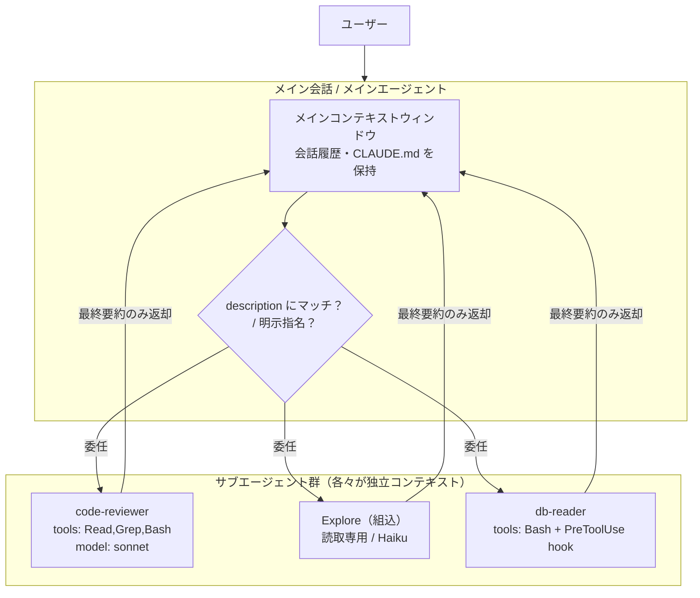
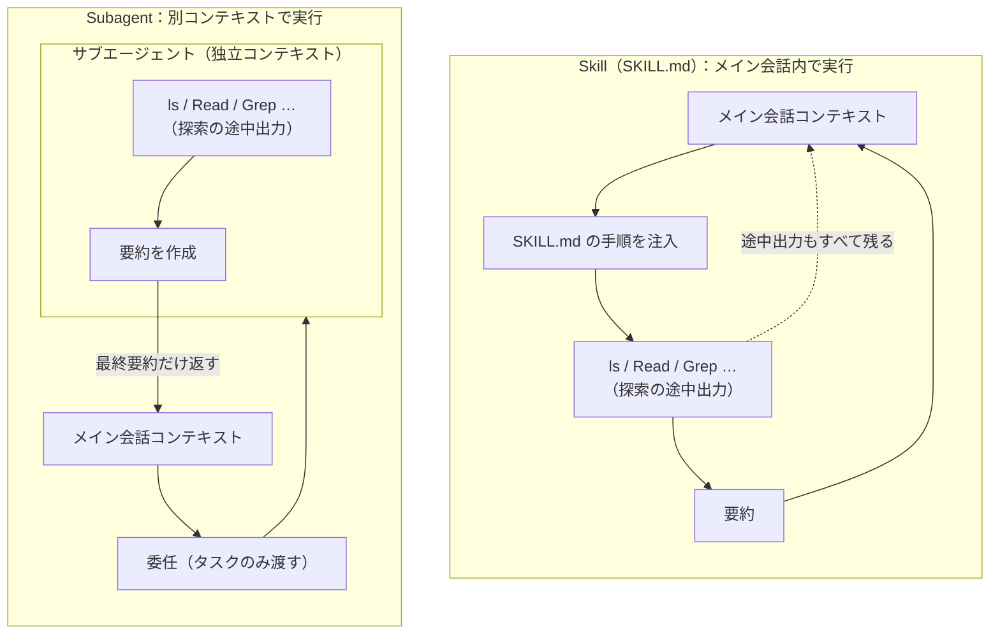

# Claude Code の Subagent（サブエージェント）機能を使用して脇道タスクを専門エージェントに委任する

Claude Code は、Anthropic 社が提供するターミナル上で動作する AI コーディングエージェントである。

この Claude Code には **Subagent（サブエージェント）** という仕組みがあり、メインの会話とは**別の独立したコンテキストウィンドウ**で動く専門特化型の AI アシスタントを定義できる。コードベース探索・テストやビルドの大量ログ・調査などの「脇道タスク」をサブエージェントに切り出すと、その作業はサブエージェント側のコンテキストで完結し、メイン会話には**最終的な要約だけ**が返る。これにより、メイン会話のコンテキストを汚さずに、ツール制限・モデル選択・並列実行・再利用といった制御が可能になる。

よく似た仕組みに [Agent Skills（`SKILL.md`）](https://github.com/Yagami360/ai-product-dev-tips/tree/master/dev_optimize/7) があるが、両者は「**どこで実行されるか**」が決定的に異なる。**Skill は「手順書」で、`description` がマッチすると指示がメイン会話に注入され Claude がその場で従う**ため、途中の探索結果もすべてメイン会話のコンテキストに残る（文脈を共有したまま定型手順を再利用したいとき向き）。一方で **Subagent は「別働の専門ワーカー」で、独立したコンテキストで作業し最終要約だけをメイン会話に返す**（大量の中間出力を伴う脇道タスクを、メイン会話を汚さずに・モデルやツールを個別最適化して処理したいとき向き）。両者は排他ではなく、サブエージェントの `skills` フィールドで Skill を注入して組み合わせることもできる。

ここでは、サブエージェントの機能の概要と、`/agents` コマンドでサブエージェントを作成して使う簡単なデモを紹介する。

> [!NOTE]
> 本 Tip は **2026-06-12 時点**の仕様（公式ドキュメント [Create custom subagents](https://code.claude.com/docs/en/sub-agents)）に基づく。`v2.1.63` で `Task` ツールは `Agent` に改名された（`Task(...)` はエイリアスとして存続）。frontmatter のフィールドやモデルエイリアスは今後変わり得る。

## Subagent でできること

サブエージェントは、メイン会話の `description` 照合（自動委任）または明示的な指名によって起動され、独立したコンテキストで作業し、最終結果だけをメイン会話に返す。



サブエージェントを使うと、次のことができる。

- **コンテキストの保護**: 探索結果・大量ログ・調査内容をサブエージェント側のコンテキストに留め、メイン会話を圧迫させない。
- **権限の制約**: サブエージェントが使えるツールを許可リスト／拒否リストで絞り、「読むだけ」の作業に書き込みツールを与えないようにできる。
- **設定の再利用**: ユーザースコープ（`~/.claude/agents/`）やプロジェクトスコープ（`.claude/agents/`）に定義を置き、複数プロジェクト・チーム全体で同じサブエージェントを共有・改善できる。
- **挙動の専門化**: 役割（レビュー・デバッグ・テスト作成・調査など）ごとに専用のシステムプロンプトを与え、各役割の精度を上げる。
- **コストの最適化**: 単純な読取・検索など安価なタスクを `model: haiku` のような高速・低コストモデルに振り分けられる。

### 関連機能との使い分け

Claude Code でタスクを分担・委任する手段は複数あり、「実行文脈」と「段取りを誰が持つか」で使い分ける。

| 機能 | 主用途 | 実行文脈 | 段取りを持つのは |
| :-- | :-- | :-- | :-- |
| **Subagent** | 脇道タスクの委任＋コンテキスト分離 | 独立コンテキスト | Claude（ターンごと） |
| **Skill** | 手順／ワークフローのコード化・自動読込 | メイン会話内に注入 | Claude（手順に従い） |
| **Hooks** | イベント駆動の検証・自動化 | メイン＋サブ | （イベント駆動） |
| **CLAUDE.md** | プロジェクト恒久ルール／メモリ | メイン＋一部サブ | （常時適用） |
| **Dynamic Workflows** | 数十〜数百エージェントの並列・大規模実行 | ランタイムが実行するスクリプト | スクリプト |

> サブエージェントは「1 ターンに数件」を Claude が起動するのに対し、より大規模な並列実行は [Dynamic Workflows（ultracode）](https://github.com/Yagami360/ai-product-dev-tips/tree/master/dev_optimize/11) が扱う。会話内で再利用したい手順は [Skill](https://github.com/Yagami360/ai-product-dev-tips/tree/master/dev_optimize/7)、複数セッションを並行させたい場合は agent teams（実験的）が向く。

特に **Skill（`SKILL.md`）との違い**は「**どこで実行されるか**」にある。Skill は手順書がメイン会話のコンテキストに**注入**され、Claude がその場で従うため、途中の探索結果やツール出力も**すべてメイン会話に残る**。一方サブエージェントは**独立したコンテキスト**で作業し、中間出力はサブ側に留めて**最終要約だけ**をメイン会話に返す。同じ「ディレクトリを要約する」指示でも、実行のされ方が次のように異なる。



- **Skill**: 途中出力（左図の `ls / Read / Grep …`）がメイン会話コンテキストに積み上がる。文脈を共有したまま定型手順を再利用したいとき向き。
- **Subagent**: 途中出力はサブ側コンテキストに留まり、メイン会話には要約だけが返る。大量の中間出力を伴う脇道タスクを、メイン会話を汚さずに処理したいとき向き（モデル・ツールも個別最適化できる）。

#### どちらを使うべきか（具体例）

**Skill が適したケース**（＝メイン会話の文脈を共有したまま、定型手順・規約を一貫して適用したい。出力は少量）

- **コミット／PR 作成の定型フロー**: リポジトリのコミットメッセージ規約を読み込み、差分を要約して `git commit` / `gh pr create` まで決まった手順で進める。直前の変更（会話の文脈）をそのまま使いたい。
- **フレームワーク固有の「新規○○追加」手順**: 例「新しい API エンドポイントを追加する」ときの命名規則・ファイル配置・テスト雛形・ルーティング登録を、毎回同じ段取りで行う。
- **リリースノート／変更サマリーの生成**: 会話中で行った変更を踏まえ、決まったテンプレート・文体で文章を生成する。
- **社内ドキュメント規約に沿った文章生成**: フォーマットや用語ルールを Claude に守らせたい、軽量で出力中心の作業。

> 共通点: 中間出力が少なく、**メイン会話の文脈を引き継ぐこと自体が重要**で、手順の一貫性を担保したい。

**Subagent が適したケース**（＝大量の中間出力を切り離したい／権限・モデルを本体と分けたい／並列化したい）

- **テスト実行して失敗だけ要約**: テストスイートの大量ログをメイン会話に入れず、「失敗したテストとエラーだけ」を要約として受け取る。
- **コードベース全体の探索・該当箇所特定**: 多数のファイルを grep / 読込して回る探索の中間結果を、メイン会話に残さず結論だけ得る（組込 `Explore` が典型）。
- **読み取り専用に限定したコードレビュー**: `tools: Read, Grep, Glob, Bash` のように書き込みツールを与えず、`model` も分けてレビュー専用に最適化する（本デモの `code-quality-reviewer`）。
- **独立した複数調査の並列実行**: 認証・DB・API モジュールを別々のサブエージェントで同時に調べ、結果を統合する。
- **権限を絞った危険操作**: `PreToolUse` hook で SQL の書き込み（INSERT/UPDATE/DELETE）を弾き、**read-only クエリだけ**を許可する DB 調査エージェント。

> 共通点: **中間出力が大量**、または**権限・モデルを本体と分離**したい、あるいは**並列化**したい。結論（要約）だけメイン会話に返ればよい。

迷ったら次を目安にする。**「会話の文脈を引き継ぐ必要があり、出力が少量」なら Skill**。**「中間出力が多い／権限やモデルを分けたい／並列で回したい」なら Subagent**。

### 組込サブエージェント

Claude Code には、Claude が状況に応じて自動的に使う組込（built-in）サブエージェントが用意されている。明示的に呼ばなくてよい。

| 名称 | モデル | ツール | 用途 |
| :-- | :-- | :-- | :-- |
| `Explore` | Haiku | 読取専用 | 高速・低コストなコードベース検索（CLAUDE.md / git status をスキップして軽量化） |
| `Plan` | 親会話を継承 | 読取専用 | Plan モードでのコンテキスト収集（1 回限り、再開不可）。`/plan` コマンド（や `Shift+Tab`）はプランモードに入る**モード切替の操作**であり、この `Plan` は**そのモード中に Claude が内部的に使う調査用サブエージェント**（直接は呼べない）で別物 |
| `general-purpose` | 親会話を継承 | 全ツール | 探索と変更の両方を伴う複雑な多段タスク |

> `Explore` と `Plan` は速度・コスト優先のため CLAUDE.md と git status を読み込まない。それ以外の組込・カスタムサブエージェントは両方を読み込む。

## サブエージェントの定義方法

サブエージェントは **Markdown ファイル + YAML frontmatter** で定義する。frontmatter がメタデータ・設定を、本文がそのまま**システムプロンプト**になる（Claude Code のフルシステムプロンプトは引き継がず、本文＋作業ディレクトリ等の最小環境情報のみ）。

最小例（`name` と `description` のみ必須）:

```markdown
---
name: code-reviewer
description: Reviews code for quality and best practices
tools: Read, Glob, Grep
model: sonnet
---

You are a code reviewer. When invoked, analyze the code and provide
specific, actionable feedback on quality, security, and best practices.
```

### 配置場所とスコープ（同名衝突時は優先度が高い方が勝つ）

| 配置場所 | スコープ | 優先度 | 主な用途 |
| :-- | :-- | :-- | :-- |
| Managed settings（組織管理） | 組織全体 | 1（最高） | セキュリティ／コンプラ要件のある定義 |
| `--agents` CLI フラグ（JSON） | 現セッションのみ | 2 | テスト・自動化スクリプト |
| `.claude/agents/` | 当該プロジェクト | 3 | チーム共有・**VCS 管理** |
| `~/.claude/agents/` | 全プロジェクト | 4 | 個人用の常用エージェント |
| プラグインの `agents/` | プラグイン有効範囲 | 5（最低） | 配布用 |

- `.claude/agents/` と `~/.claude/agents/` は**再帰的にスキャン**されるため、`review/` `research/` 等のサブフォルダで整理できる。ただし**識別子は `name` フィールドのみ**で決まり、ファイルパスは無関係。同一スコープ内で `name` が重複すると**警告なく一方が破棄**される。
- **ファイルを直接追加・編集した場合はセッション再起動が必要**（後述の `/agents` UI 経由なら即時反映）。

### frontmatter の主なフィールド（必須は `name` と `description` のみ）

| フィールド | 必須 | 説明 |
| :-- | :-- | :-- |
| `name` | ✅ | 英小文字＋ハイフンの一意 ID。ファイル名と一致不要 |
| `description` | ✅ | Claude がいつ委任すべきかの判断材料（詳細なほど自動委任精度が上がる） |
| `tools` | – | 使用許可ツール（許可リスト）。**省略すると全継承**。Skill 注入は `skills` を使う |
| `disallowedTools` | – | 拒否ツール（継承／指定から除外） |
| `model` | – | `sonnet` / `opus` / `haiku` / `fable` / フル ID（`claude-opus-4-8` 等）/ `inherit`。**既定は `inherit`**（メイン会話と同じモデル） |
| `permissionMode` | – | `default` / `acceptEdits` / `auto` / `dontAsk` / `bypassPermissions` / `plan` |
| `skills` | – | 起動時にコンテキストへ**全文注入**する Skill 群 |
| `mcpServers` | – | このサブエージェント専用の MCP サーバー |
| `hooks` | – | このサブエージェントスコープのライフサイクル Hook |
| `memory` | – | 永続メモリスコープ `user` / `project` / `local`（セッション横断学習） |
| `maxTurns` | – | 停止までの最大エージェントターン数 |
| `color` | – | タスク一覧／トランスクリプトの表示色 |

- **ツール継承の既定**: `tools` を省略すると、メイン会話の全ツール（MCP ツール含む）を継承する。`tools`（許可リスト）と `disallowedTools`（拒否リスト）を両方指定した場合は、**`disallowedTools` を先に適用**してから `tools` を解決する。
- **サブエージェントで使えないツール**（`tools` に書いても無効）: `Agent` / `AskUserQuestion` / `EnterPlanMode` / `ExitPlanMode`（`permissionMode: plan` のとき除く）/ `ScheduleWakeup` / `WaitForMcpServers`。UI・セッション状態に依存するため。
- **サブエージェントはサブエージェントを起動できない**（無限ネスト防止）。多段委任が必要なら、メイン会話側で順番に委任（チェーン）するか Skill を使う。
- **プラグイン由来のサブエージェント**では `hooks` / `mcpServers` / `permissionMode` は**無視**される。必要なら `.claude/agents/` 等にコピーする。

### 永続メモリ（`agent-memory` ディレクトリ）について

frontmatter に `memory` を指定すると、そのサブエージェントは**会話をまたいで知見を蓄積する永続メモリ**を持つ。`/agents` の作成ウィザードでメモリスコープを選んだ場合（本デモは `memory: project`）、ジェネレーターが frontmatter の `memory` と、システムプロンプト本文にメモリ運用ルールを自動で埋め込む。サブエージェントは、レビューで見つけたこのコードベース特有の規約や頻出アンチパターンなどを次の場所に書き溜め、次回以降の作業に活かす。

| スコープ | ディレクトリ | 用途 |
| :-- | :-- | :-- |
| `user` | `~/.claude/agent-memory/<name>/` | 全プロジェクト横断で覚えさせたいとき |
| `project` | `.claude/agent-memory/<name>/` | プロジェクト固有・VCS で共有したいとき（本デモ） |
| `local` | `.claude/agent-memory-local/<name>/` | プロジェクト固有だが VCS に含めたくないとき |

- メモリは**任意機能**で、作成時に **None** を選べば付かない（コードレビュー自体には不要）。
- `project` スコープでは、メモリ本体は `.claude/agent-memory/<name>/` 配下に `MEMORY.md`（索引）と個別メモリファイルとして保存され、git 管理すればチームで共有できる。本デモの `dev_optimize/12/.claude/agent-memory/code-quality-reviewer/` は、その置き場所を示すための空ディレクトリ（`.gitkeep` のみ）である。

## 使用方法

ここでは「`/agents` コマンドで作成 → 実際に呼び出す」流れを、コードレビュー用サブエージェントを例に紹介する。手書きで Markdown を置く方法も後述する。

### Step1: サブエージェントを作成する

#### `/agents` コマンドでサブエージェントを作成する場合（推奨）

対話 UI でサブエージェントを生成するのが最も手軽で、**作成後すぐに反映される**（セッション再起動不要）。

1. Claude Code 上で `/agents` を実行する。
    ```text
    /agents
    ```

1. **Library** タブで **Create new agent** を選び、保存先を選ぶ。
    - **Personal**（`~/.claude/agents/`）: 自分の全プロジェクトで使える。
    - **Project**（`.claude/agents/`）: このリポジトリ専用。VCS にコミットしてチーム共有できる。

    ```bash
    Agents  Running   Library 

    ❯ Create new agent

        Plugin agents
        feature-dev:code-architect · sonnet
        feature-dev:code-explorer · sonnet
        feature-dev:code-reviewer · sonnet
        pr-review-toolkit:code-reviewer · opus
        pr-review-toolkit:code-simplifier · opus
        pr-review-toolkit:comment-analyzer · inherit
        pr-review-toolkit:pr-test-analyzer · inherit
        pr-review-toolkit:silent-failure-hunter · inherit
        pr-review-toolkit:type-design-analyzer · inherit

        Built-in agents (always available)
        claude · inherit
        claude-code-guide · haiku
        Explore · haiku
        general-purpose · inherit
        Plan · inherit
        statusline-setup · sonnet
    ```

1. **Generate with Claude** を選び、作りたいサブエージェントを自然言語で説明する。Claude が `name`・`description`・システムプロンプトを生成してくれる。

    ```text
    最近変更されたファイルを調べて、可読性・パフォーマンス・ベストプラクティスの観点から改善点を提案するコードレビュー用エージェント。
    各指摘について理由を説明し、改善後のコード例も示すこと。
    ```

1. ツール・モデル・色・メモリを選ぶ。
    - **ツール**: 読み取り専用のレビュー用途なら **Read-only tools** だけを残す（全選択のままだとメイン会話の全ツールを継承する）。
    - **モデル**: コード解析にバランスのよい **Sonnet** などを選ぶ。
    - **メモリ**: 横断的に学習させたい場合は **User scope**、不要なら **None**。

    ```bash
    Create new agent
    Select tools


    ❯ [ Continue ]
    ────────────────────────────────────────
        ☒ All tools
        ☒ Read-only tools
        ☒ Edit tools
        ☒ Execution tools
        ☒ MCP tools
        ☒ Other tools
    ────────────────────────────────────────
        [ Show advanced options ]

    All tools selected

    Enter to toggle selection · ↑/↓ to navigate · Esc to go back
    ```
    ```bash
    Create new agent
    Select model

    Model determines the agent's reasoning capabilities and speed.

        1. Fable                Most capable for your hardest and longest-running tasks
    ❯ 2. Sonnet ✔             Efficient for routine tasks
        3. Opus                 Best for everyday, complex tasks
        4. Haiku                Fastest for quick answers
        5. Inherit from parent  Use the same model as the main conversation
    ```

    ```bash
    Create new agent
    Choose background color

    ❯ Automatic color
        Red
        Blue
        Green
        Yellow
        Purple
        Orange
        Pink
        Cyan


    Preview:  @code-quality-reviewer 
    ```

1. 設定サマリーを確認し、`s` または `Enter` で保存する（`e` で保存してエディタで編集）。生成されたファイルは `~/.claude/agents/code-quality-reviewer.md`（Project を選んだ場合は `.claude/agents/code-quality-reviewer.md`）に保存される。

なお、上記の手順で実際に `/agents` から生成したサブエージェント定義（および付随する Skill 版・永続メモリ用ディレクトリ）を、本 Tip のデモとして以下に同梱している。

- Agent 定義: [`.claude/agents/code-quality-reviewer.md`](.claude/agents/code-quality-reviewer.md)
- Skill 版（比較用）: [`.claude/skills/code-quality-reviewer/SKILL.md`](.claude/skills/code-quality-reviewer/SKILL.md)
- 永続メモリの置き場所: `.claude/agent-memory/code-quality-reviewer/`（`memory: project` の保存先。デモでは空ディレクトリ）

#### 手書きで定義する場合

`/agents` を使わず、Markdown ファイルを直接置いてもよい。例えばプロジェクト共有用に `.claude/agents/code-reviewer.md` を作成する。

- 手書きファイルは**セッション再起動後に読み込まれる**（`/agents` UI 経由なら即時反映）。
- `.claude/agents/` 配下を git 管理すれば、リポジトリを clone した全員が同じサブエージェントを使える。

### Step2: 作成したサブエージェントを呼び出す

サブエージェントの起動方法は「自動委任」と「明示呼び出し」の 2 通りある。

- **自動委任**: `description` がタスクにマッチすると Claude が自律的に委任する。`description` に "Use proactively after code changes" のような文言を入れると委任されやすくなる。
- **明示呼び出し**: 確実に呼びたい場合は、自然言語で名前を挙げるか、`@` で指名する。

1. 自然言語で名前を挙げて依頼する（最も簡単）。
    ```bash
    code-quality-reviewer エージェントで、最近の変更をレビューして
    ```

1. /agents コマンドで指名する
    ```bash
    /agents
    ```

    ```bash
    ❯ /agents                                                                                                                                                             

    ──────────────────────────────────────────────────────────────────────────────────────────────────────────────────────────────────────────────────────────────────────
    Agents  Running   Library 

        Create new agent
                                                    
        Project agents (/home/sakai/personal-repositories/ai-product-dev-tips/dev_optimize/12/.claude/agents)
    ❯ code-quality-reviewer · sonnet · project memory

        Plugin agents
        feature-dev:code-architect · sonnet
    ```
    ```bash
    code-quality-reviewer

    ❯ 1. Run agent
        2. View agent                                 
        3. Edit agent
        4. Delete agent
        5. Back

    ↑/↓ to navigate · Enter to select · Esc to go back
    ```

1. 確実に特定のサブエージェントを使いたい場合は `@` で指名する（入力欄で `@` を打つと候補が出る）。
    ```bash
    @"code-quality-reviewer (agent)" 認証まわりの変更を見て
    ```

1. Claude がサブエージェントに委任し、独立コンテキストでレビューを実行する。中間の探索や差分確認はサブエージェント側のコンテキストに留まり、メイン会話には**レビュー結果の要約だけ**が返る。

    ```bash
    ❯ @agent-code-quality-reviewer エージェントで、最近の変更をレビューして                                                                                               

    ● 最近の変更を code-quality-reviewer エージェントでレビューします。まず変更内容を把握してから起動します。

    ● Bash(cd /home/sakai/personal-repositories/ai-product-dev-tips && git status && echo "---UNTRACKED FILES IN dev_optimize/12---" && ls -la dev_optimize/12/
        2>/dev/null…)
    ⎿  On branch master
        Your branch is up to date with 'origin/master'.
        … +19 lines (ctrl+o to expand)
    ⎿  Shell cwd was reset to /home/sakai/personal-repositories/ai-product-dev-tips/dev_optimize/12

    ● 変更対象は dev_optimize/12/README.md（新規）とルート README.md の差分です。code-quality-reviewer エージェントを起動します。

    ● code-quality-reviewer(最近の変更をレビュー)
    ⎿  Done (10 tool uses · 43.6k tokens · 1m 28s)
    (ctrl+o to expand)

    ● code-quality-reviewer エージェントによるレビューが完了しました。結果をまとめます。

    レビュー結果サマリー

    対象は2ファイル（新規 dev_optimize/12/README.md と ルート README.md の差分）。全体品質は高評価ですが、以下の指摘がありました。

    🔴 重要：カテゴリ削除の意図確認

    ルート README の差分で 「プロンプトエンジニアリング / ハルシネーション対策」セクションがヘッダーごと消失し、CoVe Tip が「ローカル LLM」へ移動しています。
    - タイトルも「Ollama の Qwen モデル」に変更 → Tip 内容更新の反映自体は妥当
    - ただしセクション丸ごと削除が意図的か誤削除かの確認が必要

    🟡 推奨（dev_optimize/12/README.md）

    1. Skill との比較説明が3箇所で重複（冒頭・詳細セクション・図の後）→ 詳細は「関連機能との使い分け」に一本化
    2. Plan 行の表セルが長文すぎる → 補足は表下の NOTE に切り出し
    3. /agents ツール選択画面の模倣テキストが説明文と矛盾（全 ☒ なのに「Read-only だけ残す」）→ 初期状態である旨のキャプション追加 or 推奨設定後の状態を表示

    🟢 任意

    1. モデル ID claude-opus-4-8 の直書き → NOTE と整合させ抽象化／参照誘導
    2. ルート README の [In-progress] プレフィックスの有無を完成状態に合わせて確認

    ---
    最も対応判断が必要なのは🔴のカテゴリ削除です。確認させてください。

    ● Bash(cd /home/sakai/personal-repositories/ai-product-dev-tips && git diff README.md)
    ⎿  diff --git a/README.md b/README.md
        index cc06154..4e4bae9 100644
        --- a/README.md
        … +39 lines (ctrl+o to expand)
    ⎿  Shell cwd was reset to /home/sakai/personal-repositories/ai-product-dev-tips/dev_optimize/12

    ● 差分を確認しました。🔴 の懸念について補足します。

    🔴 カテゴリ削除の検証結果 → 整合性は取れています

    差分を見ると、これは誤削除ではなく意図的な再編成でした。

    - 「プロンプトエンジニアリング / ハルシネーション対策」セクションには CoVe（nlp_processing/57）1件しか入っていなかった
    - その CoVe をタイトル更新（「Ollama の Qwen モデル」）のうえ新設「ローカル LLM」へ移動 → 結果として空になった元セクションを削除
    - あわせて Qwen 推論（nlp_processing/30）も HuggingFace Transformers 配下から「ローカル LLM」へ集約

    つまり「CoVe + Qwen を新カテゴリ ローカル LLM に統合」という一貫した整理であり、セクション消失は副作用として妥当です。修正不要と判断できます。

    ただし1点だけ留意点があります（レビュアーの🟡相当）：

    - このルート README の差分には dev_optimize/12 の追加と、CoVe/Qwen のカテゴリ再編成という2つの独立した変更が混在しています。コミットを分ける場合は、dev_optimize/12 
    追加 と nlp_processing 整理: ローカル LLM カテゴリ新設 に分割すると履歴が追いやすくなります。

    ---
    対応が必要なのは新規 Tip 側の🟡指摘
    
    実質的に手を入れる価値があるのは dev_optimize/12/README.md の以下です：

    1. Skill 比較説明の重複（3箇所 → 1箇所に集約）
    2. Plan 行の長文セル → NOTE に切り出し
    3. /agents ツール選択画面の ☒ 表記が説明文と矛盾

    これらの修正を実施しましょうか？それとも今回はレビュー報告のみでよろしいですか？
    ```

- セッション全体をそのサブエージェントとして起動したい場合は、CLI フラグ `--agent <name>` を使う（システムプロンプトがそのサブエージェントのものに置き換わる）。
    ```sh
    claude --agent code-quality-reviewer
    ```

## 注意点

- **コンテキストはクリーンスタート**: サブエージェントはメイン会話の履歴を引き継がない。必要な前提は委任プロンプトに明示するか `skills` で注入する（CLAUDE.md は読まれる。ただし `Explore` / `Plan` はスキップ）。
- **トークンコスト**: 並列・多段にするほどトークンが膨らむ。安価なタスクは `model: haiku` に振り分ける、効果の薄い並列化は避ける、といった設計判断が要る。多数のサブエージェントがそれぞれ詳細な結果を返すと、メイン会話のコンテキストを圧迫する点にも注意。
- **レイテンシ**: 新規サブエージェントはコンテキスト初期化・システムプロンプト読込のオーバーヘッドがある。頻繁な往復や、複数フェーズで文脈を共有する作業はメイン会話で進める方がよい。
- **同名衝突の沈黙破棄**: 同一スコープで `name` が重複すると無警告で一方が捨てられる。命名規約を決めておく。

## 参考サイト

- Create custom subagents（公式ドキュメント）: https://code.claude.com/docs/en/sub-agents

- How Claude Code works（コンテキスト管理）: https://code.claude.com/docs/en/how-claude-code-works

- How we built our multi-agent research system（Anthropic Engineering・orchestrator-worker パターン）: https://www.anthropic.com/engineering/built-multi-agent-research-system

- VoltAgent/awesome-claude-code-subagents（コミュニティのサブエージェント集）: https://github.com/VoltAgent/awesome-claude-code-subagents

- Claude Code の Dynamic Workflows（ultracode）を使用して大規模タスクをマルチエージェントで並列実行する（本リポジトリの Tip）: https://github.com/Yagami360/ai-product-dev-tips/tree/master/dev_optimize/11

- Claude Code の plugin 機能を使用して開発作業を効率化する（本リポジトリの Tip）: https://github.com/Yagami360/ai-product-dev-tips/tree/master/dev_optimize/7
