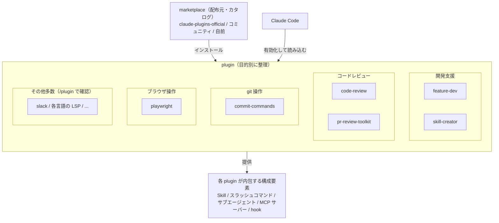

# Claude Code の plugin 機能を使用して開発作業を効率化する

Claude Code は、Anthropic 社が提供するターミナル上で動作する AI コーディングエージェントである。

この Claude Code には **plugin（プラグイン）** という拡張機能の仕組みがあり、スキル（Skill）・スラッシュコマンド・サブエージェント・フック（hook）・MCP サーバーなどをまとめてパッケージ化し、Claude Code の機能を拡張できる。
plugin は marketplace（マーケットプレイス）を介して配布され、`/plugin` コマンドからインストールする。
インストール後は、スラッシュコマンド（`/<plugin名>:<コマンド名>`）やスキルとして呼び出せるようになる。

ここでは、開発作業の効率化に役立つ代表的な plugin（`skill-creator`, `feature-dev`, `commit-commands`, `playwright`, `code-review`, `pr-review-toolkit`）の概要と使用方法を紹介する。

## plugin の全体像

plugin は marketplace を通じて多数公開されており、Anthropic 公式の `claude-plugins-official` だけでも多くの plugin が利用できる（例: 本 Tip で紹介する開発支援系のほか、`slack` 連携や各言語の LSP [Language Server Protocol] plugin など）。
利用可能な plugin の全一覧は、Claude Code 上で `/plugin` コマンドを実行すると確認できる。

ここで紹介するのはその一部（代表的な開発支援系の6つ）である。
plugin は marketplace（plugin の配布元・カタログ）からインストールして使い、1つの plugin は Skill・スラッシュコマンド・サブエージェント・MCP サーバー・hook などの構成要素をまとめたものになっている。
これらの関係と、紹介する6つを目的別に整理すると以下のようになる。



本 Tip では、上記のうち開発支援に役立つ代表的な6つ（`skill-creator`, `feature-dev`, `commit-commands`, `playwright`, `code-review`, `pr-review-toolkit`）の使用方法を紹介する。

## 導入方法

plugin は marketplace 単位で管理し、その中の plugin を個別にインストールして使用する。
Anthropic 公式の marketplace である `claude-plugins-official` は、Claude Code に標準で登録されており、追加登録なしで利用できる。

1. Claude Code を起動する
    ```sh
    claude
    ```

1. `/plugin` コマンドを実行して plugin 管理画面を開く<br>
    チャット上で `/plugin` を実行すると、marketplace の追加・plugin のインストール／アンインストールを GUI（TUI）から行える。

    ```text
    /plugin
    ```

1. plugin をインストールする<br>
    GUI から選択してインストールするか、次のコマンドで直接インストールする。
    `claude-plugins-official` の plugin は、marketplace 名を `@claude-plugins-official` で指定する。

    ```text
    /plugin install feature-dev@claude-plugins-official
    ```

    - 公式以外の marketplace（例: コミュニティ marketplace）を使う場合は、先に marketplace を追加する。
        ```text
        /plugin marketplace add anthropics/claude-plugins-community
        ```

1. plugin を反映する<br>
    インストール後、`/reload-plugins` で再起動なしに plugin を読み込める。

    ```text
    /reload-plugins
    ```

## 各 plugin の使用方法

### skill-creator

Claude Code の **スキル（Skill）** を新規作成・編集・改善するための plugin。
スキルとは、特定タスクの手順やドメイン知識を `SKILL.md` にまとめたもので、関連するタスクを依頼すると Claude が自動的にそのスキルを参照して作業する。

`skill-creator` は、スキルの雛形生成・既存スキルの最適化・eval によるスキル性能のベンチマーク・発火精度（トリガー）に直結する description の最適化などを、対話形式でガイドしてくれる。

- 使用方法<br>
    スキルを作りたい旨を依頼すると、スキルとして自動的に呼び出される。
    明示的に呼び出す場合は次のスラッシュコマンドを使う。

    ```text
    /skill-creator:skill-creator
    ```

    - 応答例（実際に起動した直後の応答）<br>
        スキルの意図をヒアリングし、雛形作成・テスト・改善のループを対話形式でガイドする。
        ```text
        スキルを作る、または既存のスキルを改善するお手伝いをします！
        まず、今どの段階にいるか教えてください。

        - これから新しいスキルを作りたい
            → どんなことをスキルにしたいか、ざっくり教えてください。
              そこから、何をするスキルか・どんなときに発動すべきか・出力の形を詰めます。
        - すでにスキルのドラフトがある
            → そのスキルのパスを教えてください。テストして評価・改善から始められます。
        - 既存スキルの description の発動精度を上げたい
            → 対象スキルを教えてください。発動テスト用クエリで最適化ループを回せます。
        ```

### feature-dev

新機能開発（feature development）をガイド付きで進めるための plugin。
いきなりコードを書き始めるのではなく、まず **既存コードベースの理解** と **アーキテクチャ設計** にフォーカスし、設計方針を固めてから実装に入る、というワークフローを提供する。
大規模な既存リポジトリへの機能追加で、設計の一貫性を保ちたいときに向いている。

- 使用方法<br>
    ```text
    /feature-dev:feature-dev
    ```

    - 応答例（実際に起動した直後の応答）<br>
        いきなり実装せず、まず作りたい機能をヒアリングし、その後コードベース調査・設計に進む。
        ```text
        新機能の開発を体系的に進めます。まず、作りたい機能について教えてください。
        1. 解決したい課題は何か（動機・ペインポイント）
        2. その機能は何をするか（期待する挙動。できれば具体例つき）
        3. 制約や要件（技術・ライブラリの希望、スコープ、後方互換性など）

        把握できたら TODO リストで進捗を管理しつつ、既存コードベースを調査し、
        既存パターンに沿った設計を固めてから実装に入ります。
        ```

### commit-commands

git のコミット・プッシュ・PR 作成といった定型作業を効率化するスラッシュコマンド群を提供する plugin。
主なコマンドは以下の通り。

- `/commit-commands:commit`<br>
    変更内容を解析し、適切なコミットメッセージで git commit を作成する。
    ```text
    /commit-commands:commit
    ```

    - 応答例（実際の挙動）<br>
        このコマンドは会話文をほとんど返さず、変更内容（`git status` / `git diff`）を解析して、
        生成したコミットメッセージで即座に `git commit` を実行する設計になっている。
        ```text
        （余計なテキストは出さず）解析した変更から、例えば

            Add dummy test file for commit skill verification

        のようなコミットメッセージで commit を作成する。
        ```

- `/commit-commands:commit-push-pr`<br>
    commit → push → PR 作成までを一括で行う。
    ```text
    /commit-commands:commit-push-pr
    ```

    - 応答例（イメージ）<br>
        ```text
        コミットを作成し、リモートへ push しました。
        PR を作成しました: https://github.com/<owner>/<repo>/pull/123
        ```

- `/commit-commands:clean_gone`<br>
    リモートで削除済みだがローカルに残っている `[gone]` ブランチ（および関連する worktree）をまとめて削除する。
    ```text
    /commit-commands:clean_gone
    ```

    - 応答例（イメージ）<br>
        ```text
        リモートで削除済みの [gone] ブランチを検出しました。
        - feature/login-form
        - fix/typo-readme
        上記 2 ブランチと関連 worktree を削除しました。
        ```

### playwright

ブラウザ自動操作ツール [Playwright](https://playwright.dev/) を **MCP サーバー** 経由で Claude Code から利用できるようにする plugin。
ページへのアクセス・クリック・フォーム入力・スクリーンショット取得・コンソールログ／ネットワークリクエストの取得などを、Claude が直接実行できるようになる。

スラッシュコマンドではなく、MCP のツール群として提供されるため、自然言語でブラウザ操作を依頼して使う。
実装した Web アプリの動作を Claude 自身に画面操作で検証させる、といった用途に向いている。

- 使用方法<br>
    インストール後、ブラウザ操作を伴う作業を依頼すると、Claude が Playwright の MCP ツールを使って操作する。
    （例:「localhost:3000 を開いてログインフォームに入力し、スクリーンショットを撮って」）

    - 補足（応答イメージ）<br>
        playwright はスラッシュコマンドを持たず、MCP サーバーとしてブラウザ操作ツール群を提供する。
        そのため「コマンド起動直後の応答」という形ではなく、ブラウザ操作を依頼すると Claude が `browser_navigate` / `browser_click` / `browser_take_screenshot` などの MCP ツールを呼び出して操作を実行する。
        （例:「localhost:3000 を開いてログインフォームに入力し、スクリーンショットを撮って」と依頼 → ページ遷移・入力・スクショ取得を順に実行）

### code-review

Pull Request（PR）やローカルの差分に対して **コードレビュー** を行う plugin。
変更差分に対するバグ・設計上の問題・改善点などをレビューしてくれるため、レビュー作業の一次チェックとして活用できる。

- 使用方法<br>
    ```text
    /code-review:code-review
    ```

    - 応答例（実際に起動した直後の応答）<br>
        このコマンドは GitHub の PR を対象にレビューする。
        起動直後はまず TODO リストを作り、レビュー対象 PR の特定から始める。
        ```text
        コードレビューのワークフローを TODO リストで管理し、対象 PR の特定から始めます。
        レビュー対象の PR が指定されていません。現在のリポジトリの PR を確認します。
        （対象 PR を特定後、適格性チェック → 複数エージェントでの並列レビューへ進む）
        ```

### pr-review-toolkit

複数の専用サブエージェントを組み合わせて、PR を **総合的（多角的）にレビュー** するための plugin。
観点ごとに分担したエージェント群が PR をレビューするため、単一観点の `code-review` よりも網羅的なレビューを行いたい場合に向いている。

- 使用方法<br>
    ```text
    /pr-review-toolkit:review-pr
    ```

    - 応答例（実際に起動した直後の応答）<br>
        まずレビュー範囲を確認（`git status` / 変更ファイル / 対象 PR の有無）し、対象が定まってから複数の専門エージェントでレビューする。
        ```text
        まずレビュー範囲を確認します（git status・変更ファイル・PR の有無）。
        対象 PR が指定されていません。レビュー対象を教えてください。
        - レビューしたい PR 番号
        - もしくは特定の観点（comments / tests / errors / types / code / simplify / all）
        指定後、該当 PR を取得し、観点ごとの専門エージェントで並列レビューします。
        ```

## 参考サイト

- Claude Code 公式ドキュメント: https://code.claude.com/docs/en/overview

- plugin の概要・作成方法（Create plugins）: https://code.claude.com/docs/en/plugins

- plugin の探索・インストール（Discover and install plugins）: https://code.claude.com/docs/en/discover-plugins

- plugin marketplace の作成・配布: https://code.claude.com/docs/en/plugin-marketplaces
