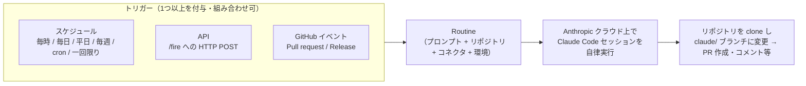

# Claude Code Routines を使用して開発作業を定期実行・自動化する

Claude Code の **Routines（ルーティン）** は、保存した Claude Code の設定（プロンプト・対象リポジトリ・コネクタ）を、スケジュールや各種イベントをトリガーに **Anthropic 管理のクラウド環境で自動実行**する機能である。
ローカルの端末を閉じていても動作し続けるため、定期的・反復的な開発作業（PR レビュー、Issue 整理、デプロイ後の検証など）を自動化できる。

大きなメリットは、**Claude Code の CLI セッションを起動・接続しておく必要がない**こと。
Claude の Web コンソール（[claude.ai/code/routines](https://claude.ai/code/routines)）やデスクトップアプリから設定するだけで、あとは Anthropic 側のクラウドが自動的にタスクを実行する。
ローカル PC や Claude Code 実行用のサーバーを起動していなくても、スケジュールやイベントに応じて勝手に走り続ける。

各 Routine には **スケジュール / API / GitHub イベント**の3種類のトリガーを1つ以上ひも付けられ、組み合わせることもできる。

> Routines は research preview（試験提供）であり、挙動・制限・API は変更される可能性がある。
> 利用には Pro / Max / Team / Enterprise プランと、[Claude Code on the web](https://code.claude.com/docs/en/claude-code-on-the-web) の有効化が必要。

## 全体像



## 作成方法

Routine は **Web / デスクトップアプリ / CLI** のいずれからでも作成でき、同じクラウドアカウントに保存されるため、どこで作っても他の画面にすぐ反映される。

### Web から作成する

[claude.ai/code/routines](https://claude.ai/code/routines) を開き、「New routine」から、名前・プロンプト・対象リポジトリ・環境・トリガー・コネクタを設定する。
プロンプトは自律実行されるため、「何をして何が成功か」を自己完結的に明示することが重要。


### デスクトップアプリから作成する

サイドバーの「Routines」→「New routine」→「Remote」を選ぶ。
「Local」を選ぶとクラウドではなくローカル端末で動く [Desktop scheduled tasks](https://code.claude.com/docs/en/desktop-scheduled-tasks) になる。

### CLI から作成する

任意のセッションで `/schedule` を実行すると、対話形式でスケジュール実行の Routine を作成できる。
説明を直接渡すこともできる。

```text
/schedule daily PR review at 9am
```
```text
/schedule tomorrow at 9am, summarize yesterday's merged PRs
```

CLI の `/schedule` で作れるのは**スケジュールトリガーのみ**。
API / GitHub トリガーの追加は Web 上で行う。

## トリガーの種類と設定

### スケジュールトリガー

毎時 / 毎日 / 平日 / 毎週などのプリセット頻度、または将来の特定時刻に一回だけ実行する。
時刻はローカルタイムゾーンで入力され自動変換される。

- カスタム間隔（例: 2時間ごと、毎月1日）は、プリセットを選んだ上で CLI の `/schedule update` で cron 式を設定する。
  **最小間隔は1時間**（それより短い式は拒否される）。
- 一回限りの実行は自然言語で指定でき、実行後は自動的に無効化される。
    ```text
    /schedule in 2 weeks, open a cleanup PR that removes the feature flag
    ```

### API トリガー

Routine 専用の HTTP エンドポイントに、Bearer トークン付きで POST するとセッションが起動する。
監視ツール・デプロイパイプライン・社内ツールなどから Claude Code を起動するのに使う。

- API トリガーの追加とトークン発行は **Web の Edit routine 画面**から行う（CLI では作成・失効できない）。
  トークンは発行時に一度だけ表示されるため、安全な場所に保管する。
- `/fire` エンドポイントに POST する。
  リクエストボディの任意の `text` フィールドに、アラート本文などの実行時コンテキストを渡せる（保存済みプロンプトと併せて渡される）。
    ```bash
    curl -X POST https://api.anthropic.com/v1/claude_code/routines/<routine_id>/fire \
      -H "Authorization: Bearer <token>" \
      -H "anthropic-beta: experimental-cc-routine-2026-04-01" \
      -H "anthropic-version: 2023-06-01" \
      -H "Content-Type: application/json" \
      -d '{"text": "Sentry alert SEN-4521 fired in prod. Stack trace attached."}'
    ```

    成功するとセッション ID と URL を含む JSON が返る。

### GitHub イベントトリガー

接続したリポジトリで対象イベントが発生すると、自動的にセッションが起動する（イベントごとに別セッション）。

- 設定は **Web UI のみ**で行い、対象リポジトリへの **Claude GitHub App のインストール**が必要。
- 対応イベントは **Pull request**（opened / closed / labeled / synchronized など）と **Release**（created / published など）。
- Pull request には Author / Title / Base branch / Labels / Is draft / Is merged などのフィルタを付けられる（全条件 AND）。

## 管理

- Web の Routine 詳細画面で、リポジトリ・コネクタ・プロンプト・スケジュール・トークン・GitHub トリガー・過去の実行履歴を確認できる。
- 「Run now」で次回スケジュールを待たず即時実行できる。
- 「Repeats」のトグルでスケジュールの一時停止／再開ができる。
- CLI でも管理できる。
    ```text
    /schedule list      # 一覧表示
    /schedule update    # 設定変更
    /schedule run       # 即時実行
    ```

> 実行履歴の緑ステータスは「セッションがインフラエラーなく起動・終了した」ことを示すだけで、プロンプトのタスクが成功したことは意味しない。
> 実際の結果は各 run のトランスクリプトを開いて確認する。

## 例: リポジトリのスキルを定期実行する

Routine の実行セッションは、対象リポジトリを clone した上で、Claude の Skills（`.claude/skills/<名前>/SKILL.md`）を利用できる。
これを使うと「特定のスキルを、毎日決まった時刻に自動実行する」といったことができる。

ここでは、この Tip に用意した最小構成のサンプルスキル [`daily-greeting`](.claude/skills/daily-greeting/SKILL.md)（短い挨拶メッセージを出力するだけの、動作確認用スキル）を、平日の毎朝9時に自動実行する手順を示す。

1. 実行したいスキルをリポジトリにコミットしておく<br>
    対象リポジトリの `.claude/skills/<名前>/SKILL.md` にスキルを置き、デフォルトブランチ（master 等）にコミット・push しておく。
    ```
    .claude/skills/daily-greeting/SKILL.md
    ```
    Routine は実行のたびにデフォルトブランチを clone するため、コミット済みのスキルを実行セッションから利用できる。

1. （CLI で作成する場合）`/schedule` で定期実行の Routine を作成する<br>
    ここでは CLI から作成する例を示す（Web / デスクトップアプリからでも作成できる。上の「作成方法」を参照）。
    Claude Code の任意のセッションで `/schedule` を実行し、対話に沿って設定する。
    説明を直接渡して作成することもできる。
    ```text
    /schedule every weekday at 9am, use the daily-greeting skill on this repo and output the greeting
    ```

    - 対象リポジトリ: スキルをコミットしたリポジトリを選ぶ
    - 頻度: 平日 9:00 など
    - プロンプト: 使うスキル名と「何をして何が成功か」を自己完結的に書く

    作成後は `/schedule list` で、登録された Routine を確認できる。
    ```text
    /schedule list
    ```
    出力例（登録された Routine の名前・スケジュール・状態・次回実行・リポジトリが表示される）:
    ```text
    - daily-greeting-test
        スケジュール: 平日 9:00 (UTC) / cron: 0 9 * * 1-5
        状態: 有効
        次回実行: 2026-06-04 09:00 (UTC)
        リポジトリ: github.com/Yagami360/ai-product-dev-tips
    ```

    [claude.ai/code/routines](https://claude.ai/code/routines) のコンソール UI でも、作成した Routine を確認できる。

    

1. 動作を確認する<br>
    [claude.ai/code/routines](https://claude.ai/code/routines) の Routine 詳細画面で「Run now」を押して即時実行し、スキルが意図どおり動くかをセッションのトランスクリプトで確認する。

    

1. 以降は自動実行される<br>
    設定した頻度（平日9時など）で Routine がスキルを自動実行する。
    一時停止したいときは詳細画面の「Repeats」トグルで止められる。

## ユースケース例

- **バックログ整理**: 平日夜に Issue トラッカーを巡回し、ラベル付け・担当割り当て・Slack への要約投稿を行う（スケジュール）。
- **アラートトリアージ**: 監視ツールが API エンドポイントを叩き、スタックトレースを解析して修正案の draft PR を作成する（API）。
- **独自基準のコードレビュー**: `pull_request.opened` でチーム独自のレビュー観点を適用し、インラインコメントを残す（GitHub）。
- **デプロイ検証**: CD パイプラインが本番デプロイ後にエンドポイントを叩き、スモークチェックして go / no-go を投稿する（API）。

## Claude Code CLI の `/loop` コマンドとの違い

Claude Code CLI には、開いているセッション内でプロンプトを一定間隔で繰り返す [`/loop`](https://code.claude.com/docs/en/scheduled-tasks) コマンドもあるが、Routines とは実行場所・前提・永続性が異なる。

| | `/loop`（CLI 内） | Routines |
|---|---|---|
| 実行場所 | ローカル端末の、開いている CLI セッション内 | Anthropic 管理のクラウド |
| 前提 | CLI セッションを起動・接続し続ける必要がある | 不要（端末を閉じていても動く）|
| 永続性 | セッションを閉じると止まる | 保存され、独立して動き続ける |
| トリガー | セッション内での一定間隔の繰り返し | スケジュール / API / GitHub イベント |
| 設定場所 | CLI | Web / デスクトップ / CLI（`/schedule`）|

短時間のポーリングやその場限りの繰り返しには `/loop`、端末から離れても継続させたい定期・自動実行には Routines が向いている。

## 注意点

- Routine は**自律実行**され、実行中の権限確認プロンプトはない。
  到達範囲は「選択したリポジトリ・環境のネットワーク設定／変数・含めたコネクタ」で決まるため、必要最小限にスコープする。
- 変更はデフォルトで `claude/` プレフィックスのブランチにのみ push される（既存ブランチへの push は明示設定が必要）。
- Routine は個人の claude.ai アカウントに属し、コミットやコネクタ操作は連携した自分の ID として行われる。
- サブスクリプション使用量に加えて、**1日あたりの実行回数の上限**がある（一回限り実行は日次上限の対象外）。
- CLI で `/schedule` が「Unknown command」になる場合、Console API キーや Bedrock / Vertex 認証を使っている、テレメトリ無効化系の環境変数が設定されている、CLI が古い（v2.1.81 未満）等が原因のことがある。
  その場合も Web からは作成・管理できる。

## 参考サイト

- Routines 公式ドキュメント（Automate work with routines）: https://code.claude.com/docs/en/routines

- Routine の管理画面: https://claude.ai/code/routines

- `/loop`・セッション内スケジュール: https://code.claude.com/docs/en/scheduled-tasks

- Desktop scheduled tasks（ローカル実行）: https://code.claude.com/docs/en/desktop-scheduled-tasks
