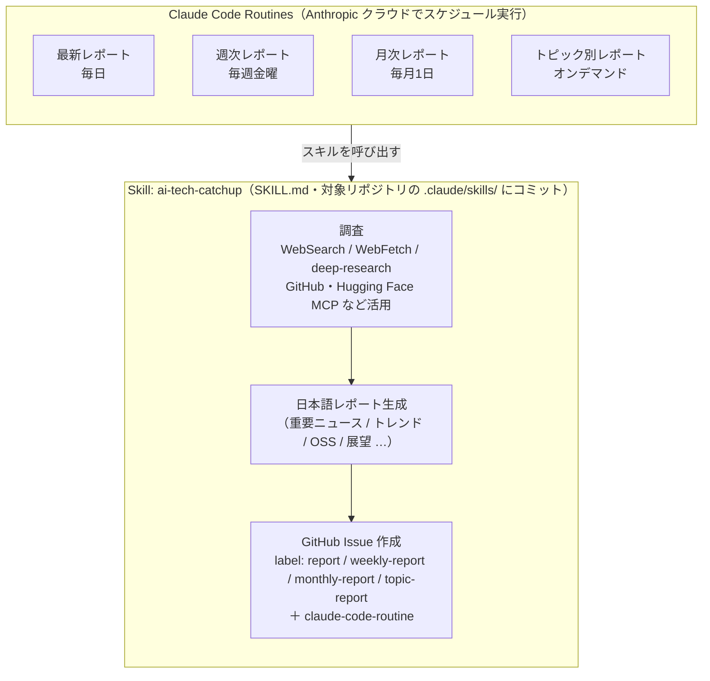

# Claude Code Routines + Skills で AI 技術トレンドの定期レポートを GitHub Issue に自動作成する

最新 / 週次 / 月次 / トピック別の AI 技術動向レポートを定期的に作成し、**GitHub Issue** に投稿する仕組みを、[Claude Code Routines](https://github.com/Yagami360/ai-product-dev-tips/tree/master/dev_optimize/8) ＋ [Skills](https://code.claude.com/docs/en/skills) で実現する方法を紹介する。
レポートには **Claude Code Routines 経由で作られたことを示すラベル（`claude-code-routine`）を付与**する。

この方式は、GitHub Actions ＋ Python（＋ Claude/Gemini API）で同様の仕組みを組む場合と比べて、Python コードや CI を保守する必要がなく、API キーを GitHub Secrets で管理する必要もない（claude.ai のサブスクリプションでクラウド実行される）。

## 全体像



## AI技術トレンドのレポート作成スキル（`ai-tech-catchup`）の作成

レポート作成用の `ai-tech-catchup` スキルを `/skill-creator` で作成し、対象リポジトリ直下の [`.claude/skills/ai-tech-catchup/SKILL.md`](../../.claude/skills/ai-tech-catchup/SKILL.md) に install する。

> 注: 本環境では `ai-tech-catchup` スキルは既に作成し、対象リポジトリ直下に install 済みのため、ここでの追加作業は不要。

`SKILL.md` は手書きしてもよいが、`skill-creator` plugin（[dev_optimize/7（plugin 機能の Tip）](https://github.com/Yagami360/ai-product-dev-tips/tree/master/dev_optimize/7) 参照）の `/skill-creator` を使うと、雛形作成・テスト・改善・description（発火条件）の最適化までガイドしてもらえる。

1. `/plugin` から `skill-creator` をインストールし、`/reload-plugins` で反映する。

1. `/skill-creator` を起動し、作りたいスキルを伝える。

1. ガイドに沿ってドラフト作成 → テスト → 改善を行う。

1. 完成したスキルを、対象リポジトリ直下の [`.claude/skills/ai-tech-catchup/SKILL.md`](../../.claude/skills/ai-tech-catchup/SKILL.md) にコミット・push（install）する。
    Routine は実行のたびにデフォルトブランチを clone するため、コミット済みのスキルを利用できる。

## 登録手順

レポート自動作成の仕組みをセットアップする手順（投稿先リポジトリは skill / Routine のプロンプトで指定し、`ai-tech-catchup` スキルはそのリポジトリ直下の `.claude/skills/` に install 済みであること（上記「スキルの作成」参照））。

1. 必要な MCP コネクタを接続する<br>
    Routine（クラウド実行）が使えるのは **claude.ai のコネクタ**であり、ローカルで `claude mcp add` した MCP サーバーは使えない。
    [claude.ai/customize/connectors](https://claude.ai/customize/connectors) で、調査に使うコネクタを接続する。
    - **Hugging Face**: モデル / データセット / Space / 論文の検索（調査に使用）。※ 本環境では接続済み。
    - **GitHub**: Issue 作成は実行セッション内の `gh issue create`、OSS 動向調査は WebSearch / WebFetch で行えるため、GitHub コネクタは必須ではない（本環境では未接続のままで動作する）。
    - **arXiv**: 現時点では claude.ai のコネクタが提供されていないため、ここでは接続できない。論文検索を MCP で強化したい場合は、コネクタではなくリポジトリ同梱の `.mcp.json`（＋環境セットアップ・ツール事前許可）で対応する（[後述の「（任意）arXiv MCP サーバーを Routine でも使う」](#任意arxiv-mcp-サーバーを-routine-でも使う)を参照）。なお必須ではなく、未対応でもスキルは `WebSearch` / `WebFetch` で arXiv を調べる。

    Routine 作成時に、含めるコネクタを選択する（不要なものは外して最小限にする）。
    > 補足: リポジトリにコミットした [`.mcp.json`](https://code.claude.com/docs/en/mcp) があれば、claude.ai コネクタに無い MCP サーバー（arXiv MCP など）も clone 経由で利用できる。

1. 種別ごとに Routine を登録する<br>
    1つの Routine は「1つの cron ＋ 1つのプロンプト」なので、**種別ごとに別の Routine を作る**（スキルは共有し、プロンプトの `mode` で切り替える）。
    `/schedule`（CLI）または [claude.ai/code/routines](https://claude.ai/code/routines)（Web）から登録する。時刻はローカルタイム（JST）で指定すれば、自動で UTC に変換される（cron は UTC で保存される）。
    プロンプトには「`ai-tech-catchup` スキルを使い、種別・投稿先リポジトリを指定して Issue を作成する」ことを自己完結的に書く。

    - 最新レポート（Routine 名 `ai-tech-catchup`、毎日 04:00 JST ＝ 前日 19:00 UTC、cron `0 19 * * *`）
        ```text
        /schedule every day at 04:00 JST, use the ai-tech-catchup skill (mode=latest) and create a GitHub Issue (labels: report, claude-code-routine) on <owner>/<repo>
        ```

    - 週次レポート（Routine 名 `ai-tech-catchup-weekly`、毎週金曜 04:00 JST ＝ 木曜 19:00 UTC、cron `0 19 * * 4`）
        ```text
        /schedule every Friday at 04:00 JST, use the ai-tech-catchup skill (mode=weekly) and create a weekly report Issue (labels: weekly-report, claude-code-routine)
        ```

    - 月次レポート（Routine 名 `ai-tech-catchup-monthly`、毎月1日 04:00 JST）
        ```text
        /schedule on the 1st of every month at 04:00 JST, use the ai-tech-catchup skill (mode=monthly) and create a monthly report Issue (labels: monthly-report, claude-code-routine)
        ```
        > 月次は「1日 04:00 JST ＝ 前月末日 19:00 UTC」になる。標準 cron では月末を直接表現できないため、Web / `/schedule` でローカル時刻（JST）を指定して登録するのが確実。

    - トピック別レポート（Routine 名 `ai-tech-catchup-topic`、オンデマンド。定期実行せず、必要なときに実行する）
        ```text
        /schedule in 1 hour, use the ai-tech-catchup skill (mode=topic, topic="AI Agent") and create a topic report Issue (labels: topic-report, claude-code-routine)
        ```

### （任意）arXiv MCP サーバーを Routine でも使う

スキルは arXiv 論文を `WebSearch` / `WebFetch` で調べるので必須ではないが、より精密な論文検索・全文取得をしたい場合は arXiv MCP サーバー（[blazickjp/arxiv-mcp-server](https://github.com/blazickjp/arxiv-mcp-server)）を Routine でも使える。
claude.ai のコネクタには無いため、リポジトリ同梱（`.mcp.json`）＋環境セットアップで対応する。

1. リポジトリ直下に `.mcp.json` を置いてコミットする<br>
    Routine は clone 時にこの定義を読み込む。
    ```json
    {
      "mcpServers": {
        "arxiv-mcp-server": { "type": "stdio", "command": "uvx", "args": ["arxiv-mcp-server"] }
      }
    }
    ```

1. Routine の環境セットアップスクリプトで `uv` ＋ パッケージを入れる<br>
    [claude.ai/code/routines](https://claude.ai/code/routines) で Routine の[環境](https://code.claude.com/docs/en/claude-code-on-the-web#the-cloud-environment)を編集し、**Setup script** に次を設定する（クラウド環境にはデフォルトで入っていないため）。
    ```sh
    curl -LsSf https://astral.sh/uv/install.sh | sh
    export PATH="$HOME/.local/bin:$PATH"
    uv tool install arxiv-mcp-server
    ```

1. ネットワーク許可を確認する<br>
    Default 環境（Trusted）で arXiv へのアクセスが弾かれる場合は、環境の **Allowed domains** に `arxiv.org` / `export.arxiv.org` を追加する。

1. 無人実行向けに MCP ツールを事前許可する<br>
    `.mcp.json` 由来の MCP は claude.ai コネクタではないため、何もしないと Routine の無人実行中に**ツール承認ダイアログ（「search papers (arxiv-mcp-server) を使用を許可しますか？」）で止まる**（claude.ai コネクタの Hugging Face は接続済みのため自動承認され、arXiv だけ引っかかる）。次のどちらかで事前許可しておく。
    - **リポジトリ同梱（推奨・恒久）**: リポジトリ直下の [`.claude/settings.json`](https://code.claude.com/docs/en/settings) に `permissions.allow` を追加してコミットする。Routine は毎回 clone するので、clone 時点で許可済みになり、Routine 設定に依らず効く。
        ```json
        {
          "permissions": { "allow": ["mcp__arxiv-mcp-server"] }
        }
        ```
        `mcp__<サーバー名>` で、その MCP の全ツール（`search_papers` / `download_paper` / `list_papers` / `read_paper`）をまとめて許可する。
    - **Routine 設定側**: Routine の `session_context.allowed_tools` に `mcp__arxiv-mcp-server` を加える（`/schedule` 作成時の `allowed_tools` には MCP ツールが入らないため、後から追記する）。
    > トークン不要・サードパーティ実行を許容できる arXiv MCP だからこそ committed 許可にできる。トークンが要る MCP（GitHub / Hugging Face）は `settings.json` に書かず claude.ai コネクタで管理する。

> ⚠️ 公開リポジトリの `.mcp.json` は、その repo を Claude Code で開いた利用者にも MCP の承認プロンプトが出る。トークン不要・サードパーティ実行を許容できる場合のみ同梱する。
> なお、GitHub / Hugging Face のように**トークンが要る MCP は `.mcp.json` に直書きせず**、claude.ai コネクタ（アカウント連携）にする。

## 利用手順

登録後の利用の流れ。

1. スケジュールに従って自動でレポートが作成される<br>
    最新＝毎日 / 週次＝毎週金 / 月次＝毎月1日 に Routine が実行され、対象リポジトリに GitHub Issue が `claude-code-routine` ラベル付きで自動作成される。

1. トピック別レポートは必要なときに実行する<br>
    `/schedule` のワンショット、または API トリガー（`text` フィールドにトピック名を渡す。[dev_optimize/8 の API トリガー](https://github.com/Yagami360/ai-product-dev-tips/tree/master/dev_optimize/8) を参照）でオンデマンド実行する。

1. すぐ確認したいときは「Run now」で即時実行する<br>
    [claude.ai/code/routines](https://claude.ai/code/routines) の Routine 詳細画面で「Run now」を押し、対象リポジトリに Issue が作成され、`claude-code-routine` ラベルが付いているかを確認する。

    <!-- TODO: 作成された Issue（claude-code-routine ラベル付き）の画面のスクショを貼り付け -->
    

1. 作成されたレポートを Issue で閲覧する<br>
    ラベル（`weekly-report` / `monthly-report` / `topic-report` / `claude-code-routine` など）でフィルタして、過去のレポートを一覧・閲覧できる。

## 参考サイト

- Claude Code Routines（公式ドキュメント）: https://code.claude.com/docs/en/routines

- Claude Code Skills（公式ドキュメント）: https://code.claude.com/docs/en/skills

- Claude Code Routines の基礎（本リポジトリの Tip）: https://github.com/Yagami360/ai-product-dev-tips/tree/master/dev_optimize/8
