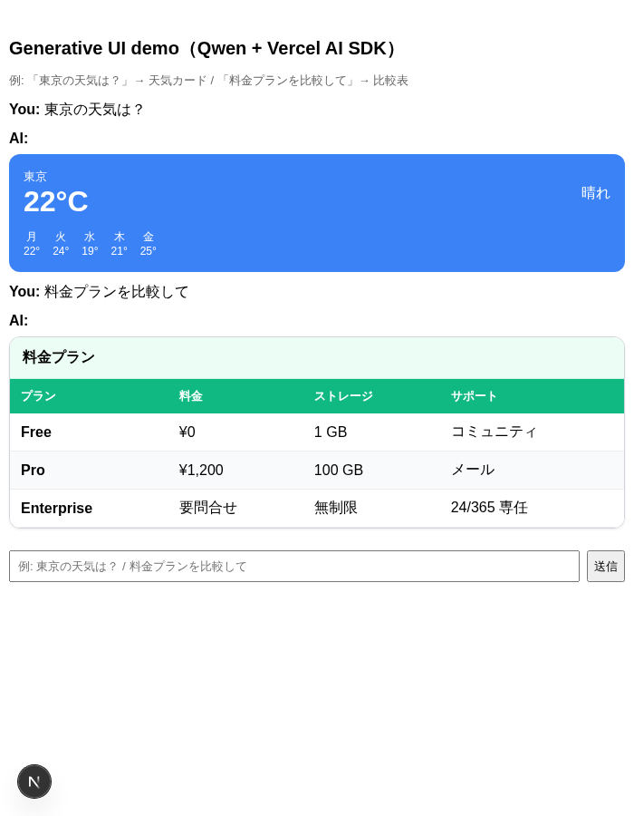
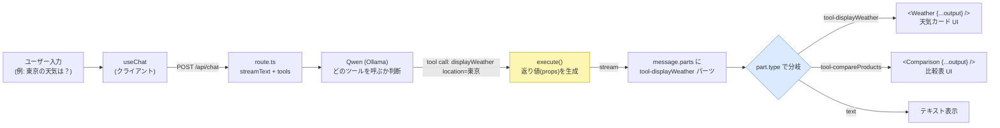
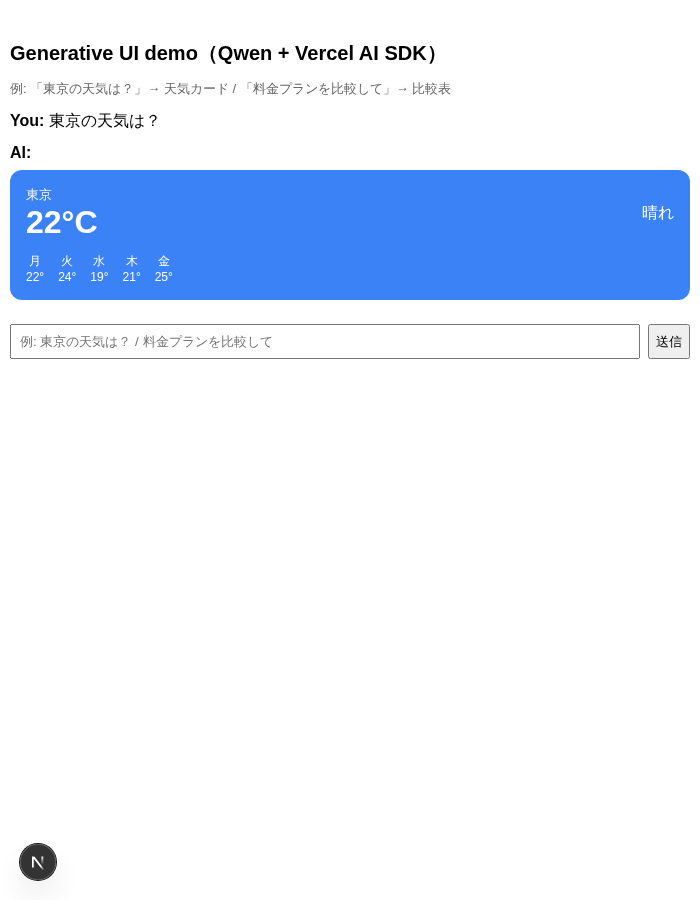

# 【Next.js】Vercel AI SDK の tool-calling 型 Generative UI を使用して Ollama の Qwen がユーザーメッセージに応じて UI コンポーネントを動的生成する



LLM アプリの UI は長らく「リクエスト → テキスト応答」の線形チャットに縛られてきたが、比較・選択・絞り込みのような情報密度の高いタスクではテキストを毎回読み下すのが非効率になる。これを「その場で生成される操作可能な UI（カード・表・フォーム・チャート）」で置き換えるのが **Generative UI（GenUI / LLM による UI 動的生成）** で、AI プロダクトの差別化が「モデル品質」から「インタラクション設計」へ移る局面の中核技術である。

GenUI の実現方式は複数あるが、**現在の事実上の主流は「tool-calling 型」**で、その開発者ツールキットのデファクトが **[Vercel AI SDK](https://ai-sdk.dev/)** である。LLM が**開発者の提供したツール（関数）を呼び、その返り値を事前定義の React コンポーネントへマッピングして描画する**方式で、自由生成型（HTML を丸ごと生成する方式）に比べてデザインシステム整合・レイテンシ・安全性が扱いやすく、PoC 適性が最も高い。

ここでは、この **tool-calling 型 Generative UI を Vercel AI SDK ＋ Next.js（App Router）で実装し、モデルに [Ollama](https://ollama.com/) の Qwen を使って GPU 不要・API キー不要でローカル実行できる最小の PoC** を動かす。本 Tip では UI を出すツールを 2 つ用意する — **`displayWeather`（→ `<Weather>` 天気カード）** と **`compareProducts`（→ `<Comparison>` 比較表）**。同じチャット欄に「東京の天気は？」と入れると **`displayWeather` が呼ばれて天気カード UI** が、「料金プランを比較して」と入れると **`compareProducts` が呼ばれて比較表 UI** が、Qwen のツール選択によって**クエリごとに出し分けられる**様子を実機で確認する。

> **ポイント**: tool-calling 型では、LLM は UI そのものを生成しない。LLM がやるのは **「どのツール（関数）を、どんな引数で呼ぶか」の判断**だけで、UI は**開発者が事前に用意した React コンポーネント**が担う。Vercel AI SDK は `streamText` の `tools` にツール（`inputSchema` ＋ `execute`）を登録するだけで、クライアントの `useChat` がツール呼び出しを `message.parts` の `tool-<ツール名>` パーツとして受け取れる。あとは `part.state === "output-available"` のときに `part.output`（ツールの返り値）を対応コンポーネントへ渡すだけ。**UI の品質・ブランド整合は事前定義部品で担保され、LLM は出し分けの判断に専念する**のが、自由生成型に対するこの方式の強み。

> **前提**: モデルにはローカルの Ollama + Qwen を使う（[nlp_processing/30](../../../nlp_processing/30) / [nlp_processing/57](../../../nlp_processing/57) と同じローカル LLM 路線）。Qwen の **ツール呼び出し（function calling）** が成立することが前提で、その評価は [nlp_processing/63](../../../nlp_processing/63)（DeepEval × BFCL）を参照。本 Tip はそのツール呼び出しを **UI 生成のトリガー**として使う応用にあたる。React の基礎は [front_end/web_app/18](../18)。

## Generative UI の実現方式と本 Tip の位置づけ

GenUI は「LLM にどこまで UI 生成を任せるか」で方式が分かれる。制約が強いほど予測可能・高速・デザイン整合しやすく、自由なほど表現力が高い代わりに整合が崩れやすい。本 Tip が扱うのは最も主流で実用的な **① tool-calling 型**。

| 方式 | 仕組み | 長所 | 代表 |
|---|---|---|---|
| **① tool-calling 型（本 Tip）** | ツール返り値を**事前定義コンポーネント**へマッピング | 予測可能・高速・デザイン整合しやすい。**現在の主流** | **Vercel AI SDK**, CopilotKit, assistant-ui |
| ② 宣言的スキーマ型 | UI を JSON/JSONL で記述し描画 | 部品を制約しつつ構造を動的に | A2UI（Google）, Open-JSON-UI（OpenAI） |
| ③ プロトコル型 | エージェント↔UI を標準化して仲介 | 既存エージェント基盤に載せやすい | AG-UI, MCP Apps / mcp-ui |
| ④ 自由生成型 | HTML/CSS/JS をその場でコード生成 | 表現力が高い | Google Dynamic View, Claude Generative UI |

> ④ の自由生成型は表現力が高い反面、生成に時間がかかる（Google の例で 1 分以上）・デザインシステムから逸脱しやすい・生成コード実行のセキュリティといった課題がある。**まず ① tool-calling 型を本線**に置き、必要に応じて ③ プロトコル型（MCP Apps 等）へ広げるのが手戻りの少ない構え。

## 全体の流れ（tool-calling 型の 1 ターン）



ポイントは、**サーバ（`route.ts`）はツールの返り値（構造化データ）を stream するだけ**で、**どの UI を描くかはクライアントが `part.type`（`tool-<ツール名>`）で分岐して決める**こと。LLM・サーバ・UI の責務がきれいに分離される。

## ディレクトリ構成

```text
front_end/web_app/52/
├── package.json
├── tsconfig.json
├── next.config.ts
├── app/
│   ├── layout.tsx
│   ├── page.tsx            # useChat + tool パーツを UI に出し分けるクライアント
│   └── api/chat/route.ts   # streamText に tools を登録し UI ストリームを返す
├── ai/
│   └── tools.ts            # ツール定義（inputSchema + execute）と共有型
└── components/
    ├── weather.tsx         # 天気カード UI（displayWeather の描画先）
    └── comparison.tsx      # 比較表 UI（compareProducts の描画先）
```

## 実装

### サーバ側: ツール定義とルート

ツールは「説明（`description`）・入力スキーマ（`inputSchema`）・実行関数（`execute`）」の 3 点で定義する。`description` は **LLM がいつこのツールを呼ぶべきか**の判断材料になるため具体的に書く。`execute` の返り値が、後でクライアントのコンポーネントへ渡る props になる。

[`ai/tools.ts`](ai/tools.ts) （抜粋）:

```ts
export const displayWeather = tool({
  description: "指定した地域の天気を「天気カード UI」で表示する。ユーザーが天気を尋ねたときに使う。",
  inputSchema: z.object({
    location: z.string().describe("天気を知りたい地域名（例: 東京）"),
  }),
  execute: async ({ location }) => {
    // 本来は天気 API を呼ぶ。ここではローカル PoC 用の固定ダミーデータを返す。
    return { location, temperature: 22, condition: "晴れ", weeklyForecast: [/* ... */] };
  },
});

export const tools = { displayWeather, compareProducts };
```

[`app/api/chat/route.ts`](app/api/chat/route.ts) （抜粋）:

```ts
// Ollama を OpenAI 互換エンドポイント（/v1）として叩く。Ollama は /v1 で tool calling に対応。
const ollama = createOpenAICompatible({ name: "ollama", baseURL: "http://localhost:11434/v1" });
const MODEL = process.env.OLLAMA_MODEL ?? "qwen3.5:4b";

const result = streamText({
  model: ollama(MODEL),
  system: "ユーザーの要求に最も合うツールを 1 つ呼び出してください。...",
  messages: await convertToModelMessages(messages),
  tools,
});

return createUIMessageStreamResponse({
  stream: toUIMessageStream({ stream: result.stream }),
});
```

- モデルは Vercel 公式の [`@ai-sdk/openai-compatible`](https://ai-sdk.dev/providers/openai-compatible-providers) で、Ollama の OpenAI 互換 API（`http://localhost:11434/v1`）に向けて指定する。Vercel AI SDK は provider 非依存なので、ここを `@ai-sdk/openai` / `@ai-sdk/anthropic` 等に差し替えるだけで同じツール定義のままクラウド LLM へ切り替えられる。
- ツールが効くかは**モデルの function calling 能力**に依存する。`qwen3.5:4b` は CPU でも動く軽量サイズだが、ツール選択が不安定なら `OLLAMA_MODEL=qwen3.5:9b` のように大きめへ上げると安定しやすい（後述のスクショは `qwen3.5:9b` で取得）。

### クライアント側: tool パーツを UI に出し分ける

`useChat` が返す `messages` の各メッセージは `parts` を持つ。テキストは `text` パーツ、ツール呼び出しは `tool-<ツール名>` パーツとして届くので、`part.type` で分岐して対応コンポーネントを描く。ツール実行が完了した状態は `part.state === "output-available"` で、`part.output` に `execute` の返り値が入る。

[`app/page.tsx`](app/page.tsx) （抜粋）:

```tsx
{message.parts.map((part, i) => {
  switch (part.type) {
    case "text":
      return <span key={i}>{part.text}</span>;
    case "tool-displayWeather":
      if (part.state === "output-available") return <Weather key={i} {...part.output} />;
      return <div key={i}>天気 UI を生成中...</div>;
    case "tool-compareProducts":
      if (part.state === "output-available") return <Comparison key={i} {...part.output} />;
      return <div key={i}>比較表 UI を生成中...</div>;
    default:
      return null;
  }
})}
```

- `ai/tools.ts` で `InferUITools` から導出した `ChatMessage` 型を `useChat<ChatMessage>()` に渡しているため、**`part.output` がツール返り値の型で型付け**され、`{...part.output}` をそのままコンポーネントへ流し込める。
- UI の見た目（カード・表）は完全に**事前定義コンポーネント**側の責務。LLM はどのツールを呼ぶかを選ぶだけで、ブランド・デザイン整合は壊れない。

## 動かす

1. Ollama を起動し、Qwen モデルを取得する

    ```sh
    # https://ollama.com/ からインストール後
    ollama pull qwen3.5:4b
    ```

    > Ollama を起動しておくと `http://localhost:11434` で待ち受け、`/v1` が OpenAI 互換エンドポイントになる。

1. 依存をインストールする（Node.js 20 以降を想定）

    ```sh
    cd front_end/web_app/52
    npm install
    ```

1. 開発サーバを起動する

    ```sh
    npm run dev
    ```

1. ブラウザで `http://localhost:3000` を開き、チャット欄で出し分けを確認する

    - 「東京の天気は？」→ Qwen が `displayWeather` を呼び、**天気カード UI** が描画される。
    - 「料金プランを比較して」→ Qwen が `compareProducts` を呼び、**比較表 UI** が描画される。

    同じ入力欄・同じ LLM でも、**クエリに応じてタスク特化の UI が動的に出し分けられる**のが Generative UI の要点。

実際に `qwen3.5:9b` で動かした画面（Playwright で取得）。「東京の天気は？」では `displayWeather` が呼ばれて天気カードが、続けて「料金プランを比較して」では `compareProducts` が呼ばれて比較表が、同じチャット欄に出し分けられている。




## 参考サイト

- Vercel AI SDK: [Generative User Interfaces](https://ai-sdk.dev/docs/ai-sdk-ui/generative-user-interfaces) / [Chatbot](https://ai-sdk.dev/docs/ai-sdk-ui/chatbot) / [Chatbot Tool Usage](https://ai-sdk.dev/docs/ai-sdk-ui/chatbot-tool-usage)
- プロバイダ: [`@ai-sdk/openai-compatible`（OpenAI Compatible Providers）](https://ai-sdk.dev/providers/openai-compatible-providers) / [Ollama OpenAI compatibility](https://github.com/ollama/ollama/blob/main/docs/openai.md)
- Ollama: [公式サイト](https://ollama.com/) / [Qwen3.5 モデル](https://ollama.com/library/qwen3.5)
- 論文: [Generative Interfaces for Language Models (arXiv:2508.19227)](https://arxiv.org/abs/2508.19227) / [Google「Generative UI」](https://generativeui.github.io/)
- 調査元（社内）: [【サーベイ】Generative UI（LLM による UI 動的生成）詳細調査](https://app.notion.com/p/abejainc/Generative-UI-LLM-UI-38e6fbf10b728135bd8ac338607d465d)

<!--
## TODO

調査元の Notion ページ「【サーベイ】Generative UI 詳細調査」に記載があるが、本 Tip（web_app/52）では未実施の手法・ツール一覧。
本 Tip がカバーしたのは「① tool-calling 型」を「Vercel AI SDK（UI / useChat）＋ Ollama Qwen」で動かす最小 PoC のみ。以下は今後の Tip 候補。

### 未実施の「実現方式」

| 方式 | 概要 | 代表ツール | 本 Tip との差分 |
|---|---|---|---|
| ② RSC ストリーミング型 | サーバで React Server Component を生成し stream | Vercel AI SDK RSC `streamUI` | experimental かつ開発一時停止。本 Tip は安定版の tool 型のみ |
| ③ UI 生成 API / 独自 DSL 型 | 自然言語から UI を直接生成（独自言語・制約 JSON） | Thesys C1（商用 API）, OpenUI Lang（旧 Crayon）, `vercel-labs/json-render` | 事前定義部品ではなく UI 自体を生成する点が異なる |
| ④ 宣言的 UI スキーマ型 | UI を JSON/JSONL で記述し描画（surfaceUpdate / dataModelUpdate / beginRendering） | A2UI（Google）, Open-JSON-UI（OpenAI） | 本 Tip はコンポーネント直結で、スキーマ層を持たない |
| ⑤ プロトコル型 | エージェント↔UI、ツール↔UI を標準化して仲介 | AG-UI（双方向接続）, MCP Apps（`ui://` + sandbox iframe）, `mcp-ui` | 既存 MCP 基盤に載せる拡張。本 Tip は単一アプリ内で完結 |
| ⑤' プロダクト型 | エンドユーザー製品がその場で UI をコード生成 | Google Gemini Dynamic View / Visual Layout, Claude Generative UI / Artifacts, v0, `tldraw/make-real` | 自由生成（HTML/CSS/JS）。レイテンシ・整合・セキュリティが課題 |

### 未実施の「ツール / SDK / プロダクト」

| 主体 / ツール | 種別 | 一言 |
|---|---|---|
| CopilotKit | OSS（AG-UI 作者） | Agent + GenUI フロントスタック。LangGraph / CrewAI / Mastra 連携 |
| assistant-ui | OSS | React の AI チャット UI。tool → コンポーネント紐付け |
| tambo | OSS | React 向け GenUI SDK |
| Thesys C1 / OpenUI | 商用 + OSS | 「GenUI を売りにする」商用 API。OpenUI Lang はトークン効率を主張 |
| `vercel-labs/json-render` | OSS | JSON 駆動の GenUI（ガードレール型・多 framework） |
| A2UI / Open-JSON-UI | spec | Google / OpenAI の宣言的 UI スキーマ |
| AG-UI / MCP Apps / mcp-ui | プロトコル | エージェント↔UI の標準化（MCP Apps は 2026-01 正式化） |
| Google Gemini Dynamic View | プロダクト | Gemini 3 でエージェント的に HTML/CSS/JS 生成 |
| Claude Generative UI / Artifacts | プロダクト | claude.ai で HTML/JS/React を sandbox 描画 |
| Microsoft AdaptiveCards | OSS | 宣言的カード UI スキーマ（GenUI の前身的） |
| shadcn/ui | OSS（部品） | v0 / 各 GenUI SDK が生成対象に使うコンポーネント群 |

### 関連メモ

- 本 Tip のモデル接続は `@ai-sdk/openai-compatible` 経由（Ollama の `/v1`）。コミュニティ製 `ollama-ai-provider-v2` は AI SDK v5/v6 対応で v7 非対応のため未採用。
- PoC を広げる場合の推奨順（Notion の業務接続より）: ① tool-calling 型（本 Tip）→ ⑤ プロトコル型（MCP Apps / mcp-ui）→ ③/⑤' 自由生成型（表現力検証用に限定）。
-->

