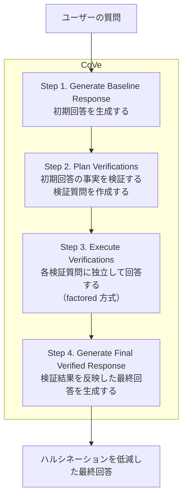

# CoVe [Chain-of-Verification] を使用して Ollama の Qwen モデルのハルシネーションを低減する

CoVe [Chain-of-Verification]（検証の連鎖）は、LLM 自身に「初期回答」→「検証質問の作成」→「検証質問への回答」→「検証結果を反映した最終回答」という多段のプロセスを踏ませることで、ハルシネーション（もっともらしいが誤った事実生成）を低減するプロンプト技法。Meta AI の論文「Chain-of-Verification Reduces Hallucination in Large Language Models」（[arXiv:2309.11495](https://arxiv.org/abs/2309.11495)、ACL 2024 Findings 採録）で提案された。

ここでは、CoVe の手法を解説した上で、**GPU 不要でローカル実行できる軽量 OSS モデル（Qwen3.5:2b）を [Ollama](https://ollama.com/) で動かす簡単なチャットアプリケーション**として CoVe を自前実装し、CoVe あり／なしでハルシネーション低減の効果を比較検証する。

> **ポイント**: CoVe は追加の学習を必要とせず、プロンプトチェーンだけで実装できる。一方で 1 回の回答に複数回の LLM 呼び出しを行うため、レイテンシが増える点に注意（後述）。CPU 推論ではこの影響が大きいので、軽量モデルを選ぶ。

## CoVe の手法

CoVe は以下の 4 ステップからなる。



1. **Generate Baseline Response（初期回答の生成）**

    まず通常通り、ユーザーの質問に対して LLM に初期回答を生成させる。この初期回答にはハルシネーション（誤った事実）が含まれている可能性がある。

1. **Plan Verifications（検証質問の計画）**

    初期回答に含まれる個々の事実をファクトチェックするための検証質問を、LLM 自身に作成させる。例えば初期回答に「X は1995年生まれ」とあれば、「X はいつ生まれたか？」という検証質問を作る。

1. **Execute Verifications（検証質問の実行）**

    作成した各検証質問に LLM が回答する。この回答が初期回答と矛盾していれば、そこに誤りがある可能性が高い。

1. **Generate Final Verified Response（最終回答の生成）**

    検証結果（検証質問への回答）を踏まえ、初期回答と矛盾する箇所を訂正した最終回答を生成する。

### Step 3 の 4 つの実行バリアント

論文では、Step 3（検証質問の実行）の方法として 4 つのバリアントが比較されている。重要なのは「**検証質問に回答する際に、初期回答を文脈に含めない**」ことであり、これにより初期回答のハルシネーションをそのままコピー（繰り返し）してしまうことを防ぐ。

| バリアント | 検証質問への回答方法 | 特徴 |
|------------|---------------------|------|
| **Joint** | 検証質問の「計画」と「回答」を 1 つのプロンプトでまとめて行う | 初期回答が文脈に残るため、誤りを繰り返しやすい（最も性能が低い） |
| **2-Step** | 「計画」と「回答」を別プロンプトに分ける | 回答時に初期回答を含めないため joint より改善 |
| **Factored** | さらに各検証質問を **1 問ずつ独立したプロンプト**で回答する | 初期回答だけでなく、検証質問同士の干渉も排除でき、安定して高性能 |
| **Factor+Revise** | factored に加え、初期回答と検証結果の矛盾を明示的にチェックする推論ステップを追加 | 最も高性能。明示的な整合性チェックでさらに事実性が向上 |

論文の実験では、**factored / 2-step は joint を一貫して上回る**。これは「検証質問が初期回答に注意を向けると、その誤りを繰り返してしまう」という仮説を裏付けている。本 Tip の実装では、シンプルかつ効果の高い **factored 方式**を採用する。

### 論文の主要な評価結果

論文では、以下のベンチマークで CoVe（ベースモデルは Llama 65B）の効果を検証している。

| ベンチマーク | タスク | 主な結果（few-shot ベースライン → CoVe） |
|--------------|--------|------------------------------------------|
| **Wikidata** | リスト形式の事実列挙（56 問） | 適合率（precision）が 0.17 → 0.36（2-step）と倍以上に向上。ハルシネーション（誤った列挙）は 2.95 → 0.68 へ大幅減 |
| **Wiki-Category list**（QUEST 由来） | カテゴリのリスト列挙（55 問） | リスト系タスクで適合率が大きく向上 |
| **MultiSpanQA**（closed-book） | 複数スパン抽出 QA（418 問） | 事実性が改善 |
| **longform biography**（人物伝記の長文生成） | FACTSCORE で評価 | FACTSCORE が 55.9 → 71.4（factor+revise）と **28% 向上**（factored は 63.7、joint は 60.8） |

特に長文生成では、CoVe を適用した Llama 65B が（検索拡張なしにもかかわらず）ChatGPT・PerplexityAI・InstructGPT を上回る FACTSCORE を達成した点が注目される。

## 実装

ここでは、上記の **factored 方式の CoVe** を、GPU 不要でローカル実行できる軽量 OSS モデル（Qwen3.5:2b）を使った簡単なチャットアプリケーションとして実装し、CoVe あり／なしの効果を比較する。

1. Ollama をインストールして起動する

    [Ollama 公式サイト](https://ollama.com/)からインストールする。

    > **Ollama とは**: ローカル環境で LLM（大規模言語モデル）を手軽に動かすためのオープンソースのランタイム。`llama.cpp` をバックエンドに、モデルを **GGUF 形式に量子化**して配布・実行するため、**GPU が無くても CPU だけで** LLM を動かせる（GPU があれば自動で利用する）。`ollama pull <モデル名>` でモデルを取得し、`ollama run <モデル名>` で対話、`ollama list` で取得済みモデル一覧を確認できる。Qwen・Llama・Gemma・Mistral など主要な OSS モデルが公式ライブラリ（[ollama.com/library](https://ollama.com/library)）で配布されている。

    インストール方法は OS により異なる。

    ```sh
    # macOS / Linux
    curl -fsSL https://ollama.com/install.sh | sh
    ```

    > Windows は[公式サイト](https://ollama.com/download)からインストーラを入手する。

    インストールすると Ollama サーバーがバックグラウンドで起動し、**OpenAI 互換 API も含む REST API** を `http://localhost:11434` で待ち受ける（本 Tip では Python ライブラリ `ollama` 経由でこのサーバーを呼び出す）。起動状態は次で確認できる。

    ```sh
    ollama --version
    ```

1. Qwen3 系の最新軽量モデル（Qwen3.5）を取得する

    ここでは Qwen3 系の最新世代 **Qwen3.5**（2026/02 リリース、Apache-2.0）の軽量版を使う。CoVe は 1 回答あたり複数回 LLM を呼び出すため、CPU では速度と検証品質のバランスから **`qwen3.5:2b`** を推奨する。

    ```sh
    ollama pull qwen3.5:2b
    ```

    | モデル | サイズ | 目安 |
    |--------|--------|------|
    | `qwen3.5:0.8b` | 約 1.0GB | 最速。検証回答の信頼性は限定的 |
    | `qwen3.5:2b` | 約 2.7GB | CPU で実用的な速度 × CoVe が機能する下限のバランス（推奨） |
    | `qwen3.5:4b` | 約 3.4GB | 検証品質は最良だが、CoVe の多段呼び出しで 1 回答に時間がかかる |

1. Ollama の Python ライブラリをインストールする

    ```sh
    pip3 install ollama
    ```

1. CoVe を実装した Python コードを作成する

    factored 方式の CoVe を 4 ステップの関数として実装する。各ステップは Ollama 経由でローカルの Qwen3.5 を呼び出す。

    [`run_cove.py`](run_cove.py)

    ```python
    import re
    import argparse

    import ollama


    def chat(model, system_prompt, user_prompt, temperature=0.0, num_predict=512):
        """Ollama のローカル LLM を呼び出して応答文を返す

        Qwen3.5 系は思考モード（thinking）がデフォルト ON で、CPU では膨大な思考生成で
        レイテンシが激増する。CoVe の各ステップは簡潔な事実回答が欲しいので think=False で無効化する。
        """
        resp = ollama.chat(
            model=model,
            think=False,
            messages=[
                {"role": "system", "content": system_prompt},
                {"role": "user", "content": user_prompt},
            ],
            options={"temperature": temperature, "num_predict": num_predict},
        )
        return resp["message"]["content"].strip()


    def step1_baseline_response(model, question):
        """Step 1. Generate Baseline Response（初期回答の生成）"""
        system = "あなたは事実に基づいて簡潔に回答するアシスタントです。"
        return chat(model, system, question)


    def step2_plan_verifications(model, question, baseline, max_questions=8):
        """Step 2. Plan Verifications（初期回答の事実確認用の検証質問を計画する）"""
        system = (
            "あなたは事実検証のエキスパートです。"
            "与えられた質問と回答に含まれる個々の事実を検証するための、"
            "短く独立した検証質問を作成してください。"
            "1 行に 1 つの質問のみを出力し、番号・記号・前置きは付けないこと。"
            "同じ質問を繰り返さないこと。"
        )
        user = (
            f"# 元の質問\n{question}\n\n"
            f"# 検証対象の回答\n{baseline}\n\n"
            "# 指示\n上記の回答に含まれる事実を検証するための質問を列挙してください。"
        )
        text = chat(model, system, user)
        # 行頭の箇条書き記号・番号（"1. " "1) " "- " "・" など）のみを除去する
        # （"1964年..." の年号を消さないよう、strip ではなく行頭パターンのみを対象にする）
        questions = [re.sub(r"^\s*(?:[-*・]|\d+[.)、])\s*", "", line).strip() for line in text.splitlines()]
        # 重複除去（順序保持）と件数上限。小さいモデルは同じ質問を大量に繰り返すことがあり、
        # それをそのまま factored で回答すると無駄な LLM 呼び出し（＝レイテンシ）が増えるため。
        unique = list(dict.fromkeys(q for q in questions if q))
        return unique[:max_questions]


    def step3_execute_verifications_factored(model, verification_questions):
        """Step 3. Execute Verifications（factored 方式: 各検証質問を独立したプロンプトで回答する）

        factored 方式では、各検証質問を「初期回答を含まない」独立したプロンプトで回答させる。
        これにより、初期回答に含まれる誤り（ハルシネーション）をそのままコピーすることを防ぐ。
        """
        system = "あなたは事実に基づいて簡潔に回答するアシスタントです。わからない場合は「不明」と答えてください。"
        qa_pairs = []
        for q in verification_questions:
            # 各質問は独立したプロンプト（初期回答を文脈に含めない）で回答させる
            answer = chat(model, system, q)
            qa_pairs.append((q, answer))
        return qa_pairs


    def step4_final_verified_response(model, question, baseline, qa_pairs):
        """Step 4. Generate Final Verified Response（検証結果を反映した最終回答の生成）"""
        system = (
            "あなたは事実検証の結果を踏まえて回答を修正するアシスタントです。"
            "検証結果と矛盾する箇所は訂正し、検証で確認できなかった内容は削除してください。"
        )
        verifications = "\n".join([f"- Q: {q}\n  A: {a}" for q, a in qa_pairs])
        user = (
            f"# 元の質問\n{question}\n\n"
            f"# 初期回答\n{baseline}\n\n"
            f"# 検証結果\n{verifications}\n\n"
            "# 指示\n検証結果を踏まえて、事実として正しい内容のみを含む最終回答を作成してください。"
        )
        return chat(model, system, user)


    def answer_with_cove(model, question, verbose=False):
        """CoVe（factored 方式）でハルシネーションを低減した回答を生成する"""
        baseline = step1_baseline_response(model, question)
        verification_questions = step2_plan_verifications(model, question, baseline)
        qa_pairs = step3_execute_verifications_factored(model, verification_questions)
        final = step4_final_verified_response(model, question, baseline, qa_pairs)
        return final
    ```

    ポイントは、以下の通り

    - **CoVe は 4 ステップの LLM 呼び出しを連鎖させるだけで実装できる**。追加の学習やツールは不要で、`step1`〜`step4` の関数を順に呼び出すだけ。

    - **factored 方式の肝は Step 3**。`step3_execute_verifications_factored()` では、各検証質問を初期回答を含まない独立したプロンプトで回答させている。初期回答を文脈に入れないことで、初期回答の誤りをそのままコピーすることを防ぐ。

    - **`think=False` で思考モードを無効化**。Qwen3.5 系は thinking がデフォルト ON で、CPU では思考生成だけで膨大なレイテンシ（数十分でタイムアウトすることも）になる。CoVe の各ステップは簡潔な事実回答が欲しいので無効化する。

    - **検証ステップは `temperature=0.0`** にして、回答のブレを抑えている。

1. チャットアプリケーションとして実行する

    `--prompt` を指定すると単発実行、未指定だと対話モードで起動する。`--mode` で CoVe あり（`cove`）／なし（`baseline`）を切り替え、`--verbose` で CoVe の中間ステップを確認できる。`--model` で Ollama のモデル名を指定できる（デフォルト `qwen3.5:2b`）。

    - CoVe ありで単発実行（中間ステップも表示）

        ```sh
        python3 run_cove.py --mode cove --verbose --prompt "ノーベル物理学賞を受賞した日本人を3人挙げて、それぞれの受賞年も教えて。簡潔に。"
        ```

    - CoVe なし（ベースライン）で単発実行

        ```sh
        python3 run_cove.py --mode baseline --prompt "ノーベル物理学賞を受賞した日本人を3人挙げて、それぞれの受賞年も教えて。簡潔に。"
        ```

    - 対話モード（簡易チャット）で起動

        ```sh
        python3 run_cove.py --mode cove
        ```

## 効果の検証

事実列挙のような「ハルシネーションが起きやすい質問」で、CoVe あり／なしを比較すると効果が分かりやすい。`--verbose` を付けると、CoVe が初期回答の誤りを検証質問で見つけ、最終回答で訂正する様子を確認できる。

以下は、実際に `qwen3.5:2b`（CPU）で同じプロンプトを CoVe なし（`baseline`）／あり（`cove`）で実行した A/B テスト結果（実出力）である。プロンプトは「ノーベル物理学賞を受賞した日本人を3人挙げて、それぞれの受賞年も教えて。簡潔に。」（正しくは湯川秀樹1949・朝永振一郎1965・江崎玲於奈1973 など）。

**CoVe なし（baseline）の出力:**

```text
$ python3 run_cove.py --model qwen3.5:2b --mode baseline --prompt "ノーベル物理学賞を受賞した日本人を3人挙げて、それぞれの受賞年も教えて。簡潔に。"

1964 年：池田俊夫（原子核物理学）
1978 年：大隅良典（粒子物理学）
2018 年：梶原隆司（原子核物理学）
```

→ 3 名・受賞年とも**すべて誤り（ハルシネーション）**。実在しない受賞者名や誤った年が生成されている。

**CoVe あり（cove, `--verbose`）の出力:**

```text
$ python3 run_cove.py --model qwen3.5:2b --mode cove --verbose --prompt "ノーベル物理学賞を受賞した日本人を3人挙げて、それぞれの受賞年も教えて。簡潔に。"

[Step 1] Baseline Response:
 1964 年：池田俊夫（原子核物理学）
 1978 年：大隅良典（粒子物理学）
 2018 年：梶原隆司（原子核物理学）
------------------------------------------------------------
[Step 2] Verification Questions:
  - 1964 年ノーベル物理学賞を受賞した日本人は誰か。
  - 2018 年ノーベル物理学賞を受賞した日本人は誰か。
  - 大隅良典が 1978 年にノーベル物理学賞を受賞した理由は何だったか。
------------------------------------------------------------
[Step 3] Verification Answers (factored):
  Q: 1964 年ノーベル物理学賞を受賞した日本人は誰か。
  A: 1964 年にノーベル物理学賞を受賞した日本人は**田中耕一**です。…
  Q: 2018 年ノーベル物理学賞を受賞した日本人は誰か。
  A: 2018 年ノーベル物理学賞を受賞した日本人は**田中耕一**氏です。…
  Q: 大隅良典が 1978 年にノーベル物理学賞を受賞した理由は何だったか。
  A: 大隅良典が 1978 年にノーベル物理学賞を受賞した理由は、「原子核の構造を解明した」…
------------------------------------------------------------
[Step 4] Final Verified Response:
 …検証結果に基づき、事実と矛盾する箇所を修正した回答を作成します。
 1. 1964 年：田中耕一（量子力学の基礎理論…）
 2. 1978 年：大隅良典（中性子と陽子の性質を研究し、原子核の構成を解明）
 3. 2018 年：梶原隆司（量子ドットを用いた光電変換効率の向上）
```

**A/B 結果のまとめ:**

| | CoVe なし（baseline） | CoVe あり（cove） |
|---|---|---|
| LLM 呼び出し回数 | 1 回 | 5 回（baseline 1 + plan 1 + 検証 3） |
| 出力 | 池田俊夫/大隅良典/梶原隆司（全て誤り） | 田中耕一/大隅良典/梶原隆司（**依然として全て誤り**） |
| ハルシネーション | あり | **訂正されず**（内容は変わったが正解にならない） |

この `qwen3.5:2b` での結果は、**CoVe が常に効くわけではない**ことを示す重要な例である。CoVe は Step 4 で「初期回答を検証結果に基づいて修正する」という*動作自体*は正しく行えている（例: 1964 年の受賞者を別人に差し替えている）。しかし **Step 3 の検証回答そのものが誤っている**（`田中耕一` が 1964 年に物理学賞を受賞、等はいずれも事実ではない）ため、誤りを正しい事実に訂正できていない。これは「CoVe は検証ステップがある程度正確に答えられる能力を前提とする」という本質的な制約（後述）の実例である。

検証の観点は以下の通り。

- **初期回答（baseline）に含まれる誤り**（誤った受賞年・実在しない人物など）が、最終回答（cove）で訂正・除去されているか。**ただし上記のように、検証ステップ自体が誤るとモデルが小さいほど訂正は効きにくい。**
- factored 方式では Step 3 の検証回答が初期回答に引きずられにくいため、誤りを発見しやすい（一方で、独立に回答させても元の知識が不足していれば別の誤りを生むこともある）。
- 4 ステップ＋検証質問数ぶんの LLM 呼び出しが発生するため、`baseline` に比べて応答が遅くなる（CPU では特に顕著）。

> **軽量モデルでの実測メモ**: 上記コードを `qwen3.5:2b`（CPU）で動かすと、CoVe の 4 ステップ自体は問題なく流れる。ただし `2b` のような小型モデルは、難しい closed-book な事実想起（例: ノーベル賞受賞者と受賞年）では **baseline だけでなく検証回答（Step 3）も誤りやすく**、CoVe をかけても誤りが訂正されないことがある（検証が間違った事実を「正しい」と追認してしまう）。
>
> 参考までに同じプロンプトを `qwen3.5:4b` でも試したが、baseline（小柴昌俊 1997・梶田隆章 2002・田中耕一 2011）も最終回答（小柴昌俊 1989・梶田隆章 2002・田中耕一 2008）も依然として誤りで、**4b でもこの難しい closed-book タスクでは訂正しきれなかった**（実際の物理学賞受賞は湯川秀樹 1949・朝永振一郎 1965・小柴昌俊 2002 など）。CoVe は「**検証ステップがある程度正確に答えられる能力**」を前提とする技法であり、ローカルの小型モデル単体では限界がある。論文の大きな効果（Llama 65B）に近づけるには、より大規模なモデルを使うか、検証ステップに検索（RAG）・外部ツールを組み合わせて検証回答の事実性を担保するのが現実的（後述）。

## CoVe をチャットアプリに組み込む際の注意点

- **レイテンシの増加**: CoVe は 1 回の回答に対して最低でも「初期回答・検証質問の計画・検証質問への回答（factored では質問数ぶん）・最終回答」と複数回の LLM 呼び出しを行う。検証質問が N 個あれば、factored 方式では `3 + N` 回程度の呼び出しになる。特に **CPU 推論ではこの影響が大きい**ので、リアルタイム性が重要なチャット用途では、適用する質問を「事実列挙・固有名詞・数値を含む回答」などに限定する、検証質問数に上限を設けるなどの工夫が要る。

- **モデルサイズと検証品質のトレードオフ**: 軽量モデルほど baseline がハルシネーションしやすく「CoVe あり／なしの差」は見えやすい。一方で **小さすぎるモデルは検証回答自体の信頼性が下がり**、CoVe の訂正効果が不安定になる（正しい初期回答を誤って「訂正」してしまうことも）。`qwen3.5:0.8b` まで落とすと効果が限定的になりやすいので、CPU なら `qwen3.5:2b` 前後が下限の目安。

- **思考モード（thinking）の扱い**: Qwen3.5 系は thinking がデフォルト ON で、CPU では思考生成だけでレイテンシが激増する。CoVe の各ステップは簡潔な事実回答が欲しいため、`think=False` で無効化している。

- **検証質問の質に依存する**: Step 2 で適切な検証質問を作れないと効果が出ない。曖昧な質問ではなく、個々の事実を 1 つずつ検証する短い質問を作らせることが重要。

- **factored 方式のトレードオフ**: factored は精度が高い反面、検証質問を 1 問ずつ別プロンプトで処理するため呼び出し回数が増える。レイテンシとのバランスで、2-step（検証質問をまとめて回答）と factored を使い分けるとよい。

- **CoVe 自体もハルシネーションし得る**: 検証回答も LLM が生成するため完璧ではない。重要な事実検証では、検証ステップに検索（RAG）や外部ツールを組み合わせると、より確実になる（コミュニティ実装の一部は検索ツールを併用している）。

## コミュニティ実装

Meta による公式の単一リポジトリは存在せず、論文をもとにしたコミュニティ実装が複数存在する。

- [`hwchase17/chain-of-verification`](https://github.com/hwchase17/chain-of-verification): LangChain 創業者 Harrison Chase による実装。CoVe の 4 ステップを LCEL [LangChain Expression Language] の `RunnablePassthrough.assign` で連結している。下記 `ritun16` の実装をベースに LCEL 化したもの。
- [`ritun16/chain-of-verification`](https://github.com/ritun16/chain-of-verification): LangChain + OpenAI をベースにした Python 実装。外部検索ツールを併用するなど、より多くのチェーンを追加している。
- [`langchain-chain-of-verification`](https://pypi.org/project/langchain-chain-of-verification/): pip でインストールできる CoVe 実装パッケージ。

> LangChain 公式の cookbook には CoVe 専用テンプレートは含まれていないが、上記の Harrison Chase 個人リポジトリが LCEL での事実上のリファレンス実装になっている。

## 参考サイト

- https://arxiv.org/abs/2309.11495 （原論文: Chain-of-Verification Reduces Hallucination in Large Language Models）
- https://aclanthology.org/2024.findings-acl.212.pdf （ACL 2024 Findings 採録版）
- https://learnprompting.org/docs/advanced/self_criticism/chain_of_verification
- https://github.com/hwchase17/chain-of-verification
- https://github.com/ritun16/chain-of-verification
- https://ollama.com/library/qwen3.5 （Ollama の Qwen3.5 モデル）
- https://huggingface.co/Qwen/Qwen3.5-4B （Qwen3.5）
