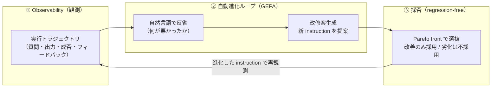

# DSPy の GEPA オプティマイザを使用して Ollama の Qwen のプロンプト（ハーネス）を自己進化させる（Self-Harness）

LLM エージェントの実タスク性能を決めるのは、モデルの重みよりも**ハーネス（モデルを取り巻くツール・プロンプト・ミドルウェア・メモリ・ワークフローなどの実行基盤）**だ、という認識が 2025–2026 にかけて定着した。そして 2026 年は、このハーネスを**人手のチューニングではなく LLM 自身に自動改修させる「Self-Harness（ハーネス自己進化）」**が一大トピックになっている。要点は、エージェントの**実行トラジェクトリ（観測ログ）を入力に、改修案を生成 → 評価で A/B → 改善のみ採用（regression-free; 改修で性能を劣化させないこと）**という閉ループを回し、モデル重みを触らずにランタイム側だけで達成率を上げることにある。

ここでは、この Self-Harness のうち**最も広く採用されている公式実装**である **[DSPy](https://dspy.ai/) の [GEPA](https://github.com/gepa-ai/gepa) オプティマイザ**を使い、**GPU 不要・API キー不要でローカル実行できる最小の PoC** を [Ollama](https://ollama.com/) + Qwen3.5 で動かす。汎用プロンプトから出発し、GEPA が**失敗トラジェクトリを自然言語で反省して instruction（プロンプト）を自己進化**させ、タスク達成率が自動で改善する様子を実機で確認する。

> **ポイント**: 進化対象の「ハーネス」は本来ツール・メモリ・ワークフロー等を含むが、**本デモでは簡単のため、ハーネス = LLM のプロンプト（DSPy の instruction）に限定**する。GEPA はプロンプト最適化（後述の系統④）の手法で、Self-Harness の核である「トラジェクトリ反省 → 評価 → 改善のみ採用（Pareto 選択）」をそのまま備える。評価が**正解ラベル付きの完全一致採点**なので、LLM-as-judge（LLM 自身に出力の良し悪しを採点させる手法）不要で regression を客観判定できる。

## ハーネスとは（システムプロンプトとの違い）

**ハーネスとは、確率的に振る舞う LLM（モデル）を包む「決定論的なソフトウェア層（制御プレーン）」**である。エンジン（モデル）に対する車体・ハンドル・ブレーキに喩えられ、同じモデルでもハーネスの良し悪しでタスク達成率が大きく変わる。構成要素の整理として **ETCLOVG の 7 層分類**（Execution / Tooling / Context / Lifecycle / Observability / Verification / Governance）がある（[Agent Harness Engineering: A Survey](https://picrew.github.io/LLM-Harness/)）。

重要なのは、**システムプロンプトはハーネスを構成する一要素にすぎない**という点。

| | システムプロンプト | ハーネス |
|---|---|---|
| 粒度 | **単一のモデル呼び出し**への指示文 | それを**包含**し、ループ・ツール実行・検証・メモリ・権限まで制御するソフト層 |
| 性質 | 宣言的（自然言語） | 手続き的・決定論的（コード／ポリシー） |
| 例 | 「あなたは○○のアシスタントです…」 | ReAct ループ、MCP クライアント、compaction、サンドボックス実行、judge |

用語も **Prompt Engineering（2022–24）→ Context Engineering（2025）→ Harness Engineering（2026）** と進化してきた。同一モデルでも scaffold（足場＝ハーネス構成）次第で SWE-bench 系のスコアが大きく変動する（[ReAct](https://arxiv.org/abs/2210.03629) / [Reflexion](https://arxiv.org/abs/2303.11366) / [CodeAct](https://arxiv.org/abs/2402.01030)）ため、**モデル本体に手を入れにくくても、ハーネス設計の工夫だけで性能・製品価値を引き上げられる**のが要点。本 Tip はこのハーネス（の一要素であるプロンプト）を LLM 自身に自動改修させる（Self-Harness）。

## Self-Harness（ハーネス自己進化）の閉ループ



Self-Harness 周辺の手法は、進化させる対象で大きく 4 系統に整理できる。本 Tip が使う **GEPA は系統④（プロンプト/手順最適化）**で、これは①ハーネス自己進化の改修オペレータとしても使われる中核手法。

| 系統 | 何を進化させるか | 代表手法 | 採用度 / 位置づけ |
|------|------------------|----------|-------------------|
| ① ハーネス自己進化 | ツール/ミドルウェア/メモリ/プロンプト一式 | AHE, RHO, HarnessX | 2026 上半期の最前線（公式実装は出たばかり） |
| ② 設計自動探索 | エージェント構成（scaffold・トポロジ） | ADAS, AgentBreeder | 研究寄り |
| ③ 自己改コード | エージェント自身のソースコード | Darwin Gödel Machine | 研究寄り・計算重い |
| **④ プロンプト/手順最適化** | プロンプト・指示・ワークフロー文言 | **GEPA**, DSPy, Reflexion | **OSS 成熟・実運用で最も広く採用** |

## なぜ DSPy + GEPA を選ぶか（採用度で選ぶ）

Self-Harness 系の手法は多いが、「**論文として広く採用され、かつ公式実装が成熟していてローカルで動く**」という基準で選ぶと **DSPy + GEPA** が最有力になる（被引用数・GitHub star・実装成熟度を判断材料にした。数値は 2026-06 時点）。

| 手法 | 公式実装 | GitHub star | 被引用 | 備考 |
|------|----------|-------------|--------|------|
| **DSPy** | [stanfordnlp/dspy](https://github.com/stanfordnlp/dspy) | **約 35.4k**（MIT） | — | プロンプト最適化のデファクト基盤。`dspy.GEPA` を第一級サポート |
| **GEPA** | [gepa-ai/gepa](https://github.com/gepa-ai/gepa) | **約 5.4k**（MIT） | 約 285 | ICLR 2026 Oral。RL より高サンプル効率 |
| Darwin Gödel Machine | [jennyzzt/dgm](https://github.com/jennyzzt/dgm) | 約 2.1k | 約 153 | 自己改コード。サンドボックス前提で重い |
| ADAS | [ShengranHu/ADAS](https://github.com/ShengranHu/ADAS) | 約 1.6k | 約 442 | エージェント設計探索 |
| AHE / RHO | [AHE](https://github.com/china-qijizhifeng/agentic-harness-engineering) / [RHO](https://github.com/wbopan/retro-harness) | 数百以下 | 時期尚早 | 系統①の本丸だが、コーディングエージェント＋ベンチ＋強モデル前提でローカル CPU 不可 |

→ **DSPy（基盤）+ GEPA（手法）** は star・成熟度ともに突出し、ローカル `qwen3.5`（Ollama）でも動く。AHE/RHO は系統①の本丸だが現状は重く、本 Tip の「ローカルで動かす最小 PoC」には GEPA が最適。

## DSPy / GEPA の概要

- **[DSPy](https://dspy.ai/)（Declarative Self-improving Python）**: Stanford NLP 発の OSS フレームワーク。LLM アプリを「プロンプト文字列の手書き」ではなく、**入出力の型を宣言する `Signature` と `Module`（`dspy.Predict` など）で宣言的に構築**し、**オプティマイザ（Teleprompter）が評価指標に向けてプロンプト/few-shot を自動最適化**する。モデル接続は LiteLLM 経由で、OpenAI・Anthropic・**ローカルの Ollama** などを同じ API で差し替えられる。

- **GEPA（Genetic-Pareto）**: DSPy のオプティマイザの一つ。RL のようにスカラ報酬だけで学習するのではなく、**実行トラジェクトリを自然言語で「反省（reflect）」して何が悪かったかを言語化**し、それを元に**新しいプロンプト候補を生成（提案）**する。さらに**Pareto front**（タスクごとの最良候補集合）を保ちながら進化させることで、貪欲更新が陥る局所最適を避ける。論文では強化学習（GRPO）を上回りつつ rollout 数が大幅に少ないと報告されている。

DSPy における Self-Harness は「**`Signature` の instruction（＝ハーネスのプロンプト要素）を GEPA が自己進化させる**」という形で実現できる。本 Tip はこれをローカル LLM で最小実装する。

## 実装

「ハーネス」= `dspy.Signature` の instruction（初期値 `"Answer the question."`）とし、GEPA でこれを自己進化させる。GPU 不要でローカル実行できる軽量モデル（Qwen3.5）を Ollama で動かす。

1. Ollama をインストールして起動する

    [Ollama 公式サイト](https://ollama.com/)からインストールする。Ollama はローカルで LLM を動かす OSS ランタイムで、CPU だけでも LLM を動かせる。

    ```sh
    # macOS / Linux
    curl -fsSL https://ollama.com/install.sh | sh
    ```

    > Windows は[公式サイト](https://ollama.com/download)からインストーラを入手する。

1. Qwen3.5 モデルを 2 つ取得する

    GEPA では「タスクを解く側（student）」と「改修案を出す反省 LM（reflection）」が必要で、**反省 LM には強いモデルを使うのが定石**（提案するプロンプトの質を左右するため）。本 Tip では student に軽量な `qwen3.5:2b`、reflection にやや大きい `qwen3.5:9b` を使う（いずれも CPU で動作）。

    ```sh
    ollama pull qwen3.5:2b
    ollama pull qwen3.5:9b
    ```

    > `--student-model` / `--reflection-model` で切り替え可能。1 モデルで済ませたい場合は両方 `qwen3.5:2b` でも動くが、反省 LM が小さいと改修案の質が落ちて改善しにくい（後述）。

1. DSPy をインストールする

    ```sh
    pip3 install -r requirements.txt   # dspy>=3.0.0（GEPA を同梱、LiteLLM 経由で Ollama に接続）
    ```

1. DSPy + GEPA のコードを作成する

    [`run_gepa.py`](run_gepa.py)

    主なポイントは以下の通り。

    - **「ハーネス」= `dspy.Signature` の instruction**。`QA` シグネチャの docstring `"Answer the question."` が初期ハーネスで、GEPA がこれを書き換える。`dspy.Predict(QA)` が被最適化のプログラム。

    - **評価ハーネスは正解ラベル付きの完全一致採点**（`normalize()` で NFKC 正規化＋英数字以外を除去）。`H₂O→h2o` のように表記揺れは吸収しつつ、**冗長な説明文は不正解**になる。正解ラベルがあるので LLM-as-judge 不要で客観的にスコア化できる。

    - **`metric()` がスコア＋自然言語フィードバックを返す**。これが GEPA 流の肝で、外したときに「期待は `Canberra` だが `The capital is Canberra.` が返った。余計な語を付けず正準形だけ返せ」というフィードバックを与え、GEPA はこれを反省して instruction を改善する。

    - **`dspy.GEPA(...).compile()` が自己進化の本体**。`reflection_lm` に強いモデルを指定し、`candidate_selection_strategy="pareto"` で**改善のみ採用（regression-free）**する。`max_metric_calls` が探索予算。

    ```python
    class QA(dspy.Signature):
        """Answer the question."""              # ← この instruction（ハーネス）を GEPA が進化させる
        question: str = dspy.InputField()
        answer: str = dspy.OutputField()

    def metric(gold, pred, trace=None, pred_name=None, pred_trace=None):
        ok = normalize(getattr(pred, "answer", "")) == normalize(gold.answer)
        feedback = "Correct." if ok else (
            f"Wrong. Expected exactly {gold.answer!r}; got {getattr(pred,'answer','')!r}. "
            f"Return ONLY the canonical answer, with no extra words, units, or sentences.")
        return dspy.Prediction(score=1.0 if ok else 0.0, feedback=feedback)

    program = dspy.Predict(QA)                    # 初期ハーネス
    gepa = dspy.GEPA(metric=metric, max_metric_calls=24, reflection_lm=reflection,
                     candidate_selection_strategy="pareto")   # 改善のみ採用（Pareto）
    optimized = gepa.compile(program, trainset=devset, valset=devset)  # 自己進化を実行
    ```

1. 実行する

    ```sh
    # ベースライン（初期 instruction のまま、進化なし）
    python3 run_gepa.py --mode baseline

    # GEPA で自己進化（反省 → 改修案 → Pareto で改善のみ採用）
    python3 run_gepa.py --mode gepa --max-metric-calls 24
    ```

## 効果の検証（実機 A/B）

student に `qwen3.5:2b`、reflection に `qwen3.5:9b`（いずれも CPU）を使い、8 問の短答 QA（完全一致採点）で実行した結果。

**ベースライン（初期 instruction `"Answer the question."`）:**

```text
$ python3 run_gepa.py --mode baseline
[baseline] score = 62.5%  (instruction = 'Answer the question.')
```

→ 8 問中 5 問正解（62.5%）。失敗は「How many planets ...」に `There are 8 planets in the Solar System.`、「capital of Australia」に `The capital of Australia is Canberra.` のように**冗長な文**を返して完全一致に落ちたもの。

**GEPA で自己進化（`--mode gepa`）:**

```text
$ python3 run_gepa.py --mode gepa --max-metric-calls 24
[baseline] score = 62.5%  (instruction = 'Answer the question.')
... (GEPA が反省→改修案→Pareto 選抜を繰り返す) ...
[gepa] score = 100.0%  (62.5% -> 100.0%)
============================================================
GEPA が進化させた最終 instruction（ハーネス）:

Role: You are a strict, concise factual retrieval engine. Your sole function is to
answer specific factual questions with maximum brevity and exactness.
...
Constraints & Formatting Rules:
1. Output Length: a single entity, number, formula, or short phrase.
2. Prohibited Content: Do NOT include introductory phrases ("The answer is...",
   "There are..."), explanatory sentences, lists, or units (a number suffices).
3. Normalization: subscripts represented as '2' in 'CO2'; for numeric answers, only the digit.
4. Factual Accuracy: ... default to the most traditional/standard definition ...
Knowledge Base Integration:
- Geography: traditional count of continents is 7 ...
- Astronomy: Jupiter is the largest planet ...
```

→ GEPA が失敗トラジェクトリを反省し、初期の `"Answer the question."` から「**正準形の答えだけを返す**」詳細な instruction（役割定義・禁止事項・ドメイン別の正準形・few-shot 例まで含む）を自分で書き上げた。A/B で **62.5% → 100%** に改善し、Pareto 選抜で改善のみ採用されている。

**A/B 結果のまとめ:**

| | ベースライン | GEPA 自己進化後 |
|---|---|---|
| instruction（ハーネス） | `"Answer the question."` | GEPA が生成した正準形抽出プロンプト |
| スコア（8 問・完全一致） | **62.5%（5/8）** | **100%（8/8）** |
| モデル重みの更新 | なし | **なし**（プロンプトのみ自己進化） |
| 改修の決め方 | — | 反省＋ Pareto 選抜で改善のみ採用（regression-free） |

ここで重要なのは、**モデルを一切変えずに、観測 → 反省 → 改善のみ採用の閉ループだけで達成率が 62.5% → 100% に上がった**点。これが「ハーネス工学はモデル切り替えより効く主レバー」という主張の、公式実装による最小実証になっている。

> **実測の補足**: GEPA の改修案の質は **reflection LM の能力に強く依存**する。反省 LM を `qwen3.5:2b` に落とすと提案が貧弱（`"Answer the question."` のまま）で改善しなかった一方、`qwen3.5:9b` にすると上記の通り大きく改善した。GEPA で「反省 LM は強いモデルを使う」のが定石なのはこのため。CPU では 9b の反省呼び出しが律速で、上記 1 回の最適化に数分かかる（`--max-metric-calls` で調整）。`temperature` により提案は確率的なので、進化後の instruction の文面は実行ごとに変わり得る。

## 注意点・課題

- **reflection LM の質が効果を左右する**: 上記の通り、反省 LM が弱いと改修案が貧弱で改善しない。本番では reflection に強いモデル（API モデル等）を使うとよい。

- **評価の正解ラベル不足**: 本デモは正解ラベル付きで簡略化したが、本番ログには正解が無いことが多い。その場合は LLM-as-judge（judge 自体の信頼性検証が要）や、RHO の自己検証/自己一貫性で代替する。評価ハーネスの設計が Self-Harness の前提になる。

- **計算コスト（評価が支配的）**: GEPA は候補を出すたびに評価を回すため評価コストが支配的。`max_metric_calls` や valset サイズで予算を管理する。

- **過学習/汎化**: 小さな評価セットに過適合した instruction は未知タスクに転移しない。GEPA の Pareto front は局所最適を避ける工夫だが、別データでの汎化検証は別途必要。

- **ハーネス = プロンプトは簡略化**: 本デモは進化対象をプロンプトに限定した。系統①の本丸（AHE/RHO）はツール・メモリ・ミドルウェアまで含めて進化させ、verifier やモデル設定を read-only に固定して安全性を担保する。自己進化は安全性を侵食しうるため、サンドボックス・人間オーバーサイト・安全性の最適化目的化が必須。

## 参考サイト

- https://dspy.ai/ （DSPy 公式ドキュメント）
- https://github.com/stanfordnlp/dspy （DSPy 実装）
- https://dspy.ai/api/optimizers/GEPA/overview/ （DSPy の GEPA オプティマイザ）
- https://arxiv.org/abs/2507.19457 （GEPA: Reflective Prompt Evolution Can Outperform Reinforcement Learning, ICLR 2026 Oral）
- https://github.com/gepa-ai/gepa （GEPA 実装）
- https://arxiv.org/abs/2604.25850 （Agentic Harness Engineering / AHE） / https://github.com/china-qijizhifeng/agentic-harness-engineering
- https://arxiv.org/abs/2606.05922 （Retrospective Harness Optimization / RHO） / https://github.com/wbopan/retro-harness
- https://arxiv.org/abs/2505.22954 （Darwin Gödel Machine） / https://github.com/jennyzzt/dgm
- https://picrew.github.io/LLM-Harness/ （Agent Harness Engineering: A Survey / ETCLOVG 7 層分類）
- https://arxiv.org/abs/2210.03629 （ReAct） / https://arxiv.org/abs/2303.11366 （Reflexion） / https://arxiv.org/abs/2402.01030 （CodeAct）
- https://ollama.com/library/qwen3.5 （Ollama の Qwen3.5 モデル）
