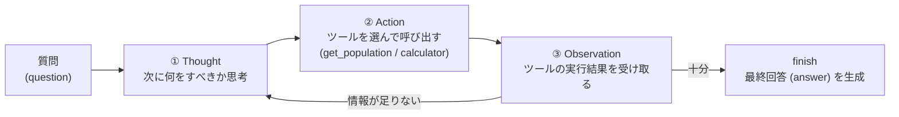

# DSPy の ReAct モジュールを使用して Ollama の Qwen でツールを使う AI エージェントを構築する

LLM 単体は「学習済みの知識を答える」ことしかできないが、**ツール（電卓・検索・API など）を呼び出しながら多段で推論する**ことで、最新情報の取得や正確な計算ができる「AI エージェント」になる。その代表的な制御方式が **ReAct（Reasoning + Acting）** で、**思考（Thought）→ ツール実行（Action）→ 観察（Observation）** のループを繰り返して答えにたどり着く。

ここでは、プロンプトを文字列で手書きするのではなく**入出力の型を宣言して LLM アプリを組む** [DSPy](https://dspy.ai/) の **[`dspy.ReAct`](https://dspy.ai/api/modules/ReAct/) モジュール**を使い、**GPU 不要・API キー不要でローカル実行できる最小の ReAct エージェント**を [Ollama](https://ollama.com/) + Qwen3.5 で構築する。通常の Python 関数をツールとして渡すだけで、エージェントが**どのツールをどの引数で呼ぶかを自分で判断し、複数のツールを連鎖**させて数値の答えを導く様子を実機で確認する。

> **ポイント**: `dspy.ReAct` は **docstring と型ヒントの付いた普通の Python 関数をそのままツールとして渡せる**（関数説明・引数スキーマを DSPy が自動生成して LLM に提示する）。プロンプトに「ツールの使い方」を人手で書き込む必要はない。なお ReAct はプロンプト最適化（[`dspy.GEPA`](../58) など）と組み合わせて性能を引き上げることもできるが、本 Tip では**エージェントを動かすところまで**に絞る。

> **前提**: DSPy 全体の概要（`Signature` / `Module` / `Optimizer` などの構成要素、主要モジュール一覧、3 段階アーキテクチャ、AI Agent のハーネスとの関連）は [nlp_processing/60](../60) にまとめている。本 Tip は DSPy のうち、ツール使用エージェントを作る `dspy.ReAct` に絞って扱う。

## DSPy でエージェントを作るとは

DSPy は LLM アプリを「プロンプト文字列の手書き」ではなく、**入出力を宣言する `Signature` と、それを処理する `Module`** で宣言的に組み立てる。エージェント（ツール使用）は `Module` の一種である `dspy.ReAct` で表現する。

| 概念 | 役割 | 本 Tip での例 |
|------|------|---------------|
| `Signature` | 入出力の型と役割（＝プロンプトの宣言） | `AgentTask`（`question` → `answer`） |
| `Tool` | エージェントが呼べる外部機能。**普通の関数を渡せる** | `get_population()`, `calculator()` |
| `Module` | LLM の呼び出し方を表す部品 | `dspy.ReAct`（ReAct ループを内蔵） |
| 戻り値 `Prediction` | 出力フィールド＋`trajectory`（思考・行動・観察の履歴） | `pred.answer`, `pred.trajectory` |

従来の「フレームワークにプロンプトテンプレートを書き込む」やり方（例: LangChain の手書きプロンプト）と違い、**ツールのスキーマ提示やループ制御は DSPy 側が受け持つ**ため、ユーザーは「型（Signature）」と「ツール（関数）」だけを書けばよい。

## ReAct ループの仕組み

ReAct は、LLM に**「考える（Thought）」「ツールを呼ぶ（Action）」「結果を見る（Observation）」**を 1 ステップとして繰り返させ、十分な情報が揃ったら内部の `finish` ツールで打ち切って最終回答を出す。



例えば「日本とドイツの人口の合計を 2 で割るといくつ？」という質問では、エージェントは次のように**複数ツールを連鎖**させる必要がある。

1. `get_population("日本")` を呼ぶ → 観察: `124000000`
1. `get_population("ドイツ")` を呼ぶ → 観察: `84000000`
1. `calculator("(124000000 + 84000000) / 2")` を呼ぶ → 観察: `104000000`
1. `finish` → 最終回答 `104000000`

このツール選択・引数決定・連鎖をすべて LLM 自身が `Signature` とツールスキーマだけから判断する点が ReAct エージェントの核心。

## 実装

「人口を引く」`get_population` と「四則演算する」`calculator` の 2 つのツールを持つ ReAct エージェントを作り、ツールの連鎖が必要な質問に答えさせる。GPU 不要でローカル実行できる軽量モデル（Qwen3.5）を Ollama で動かす。

1. Ollama をインストールして起動する

    [Ollama 公式サイト](https://ollama.com/)からインストールする。Ollama はローカルで LLM を動かす OSS ランタイムで、CPU だけでも LLM を動かせる。

    ```sh
    # macOS / Linux
    curl -fsSL https://ollama.com/install.sh | sh
    ```

    > Windows は[公式サイト](https://ollama.com/download)からインストーラを入手する。

1. Qwen3.5 モデルを取得する

    ReAct はツール呼び出し（function calling）を正しく行える程度のモデル能力が必要なため、極端に小さいモデルだとツール選択を誤りやすい。本 Tip では CPU でも動く `qwen3.5:4b` を使う（より軽い `qwen3.5:2b` でも動くが、ツール選択の正確さは落ちる）。

    ```sh
    ollama pull qwen3.5:4b
    ```

    > `--model` オプションでモデルを切り替えられる（例: `--model qwen3.5:2b`）。

1. DSPy をインストールする

    ```sh
    pip3 install -r requirements.txt   # dspy>=3.0.0（ReAct を同梱、LiteLLM 経由で Ollama に接続）
    ```

1. DSPy + ReAct のコードを作成する

    [`run_agent.py`](run_agent.py)

    主なポイントは以下の通り。

    - **ツールは docstring ＋ 型ヒント付きの普通の関数**。`get_population(country: str) -> int` のように書くだけで、DSPy が関数名・説明・引数スキーマを抽出して LLM に提示する。プロンプトに「このツールはこう使う」と手書きする必要はない。

    - **`dspy.ReAct(signature, tools=[...])` がエージェント本体**。`tools` には関数のリストをそのまま渡せる（`dspy.Tool(...)` で包む書き方も可）。ReAct は内部に `finish` ツールを自動追加し、`max_iters` 回まで Thought→Action→Observation を繰り返す。

    - **戻り値 `Prediction` に `trajectory` が入る**。`pred.answer` が最終回答、`pred.trajectory` に各ステップの思考（`thought_N`）・選んだツール（`tool_name_N`）・引数（`tool_args_N`）・観察結果（`observation_N`）が記録され、エージェントの推論過程を後から追える。

    - **`calculator` は `__builtins__` を空にして `eval`** する。任意コード実行を防ぐための最小限の安全策（本番ではより厳密なパーサを使うべき）。

    ```python
    def get_population(country: str) -> int:
        """指定された国の人口（人数）を返す。"""
        return _POPULATION.get(country.strip(), -1)

    def calculator(expression: str) -> float:
        """四則演算の式を評価して数値の結果を返す。"""
        return eval(expression, {"__builtins__": {}}, {})

    class AgentTask(dspy.Signature):
        """あなたは有能なエージェントです。利用可能なツールを使って、ユーザーの質問に具体的な数値で答えてください。"""
        question: str = dspy.InputField()
        answer: str = dspy.OutputField(desc="最終的な答え（具体的な数値）。")

    agent = dspy.ReAct(AgentTask, tools=[get_population, calculator], max_iters=6)
    pred = agent(question="日本とドイツの人口の合計を 2 で割るといくつ？")
    print(pred.answer)        # 最終回答
    print(pred.trajectory)    # Thought / Action / Observation の履歴
    ```

1. 実行する

    ```sh
    # デフォルトの質問（2 つの人口を取得して合計し 2 で割る ＝ ツール連鎖が必要）
    python3 run_agent.py

    # 質問やモデルを指定する
    python3 run_agent.py --model qwen3.5:4b \
        --question "中国の人口からインドの人口を引くといくつ？"
    ```

## 実行結果（実機）

`qwen3.5:4b`（CPU）で `python3 run_agent.py` を実行した結果。エージェントが `get_population` を 2 回・`calculator` を 1 回連鎖させて答えを導いている。`trajectory` のキー（`thought_N` / `tool_name_N` / `tool_args_N` / `observation_N`）と `finish` の観察（`Completed.`）は DSPy の出力形式。ツールの観察値（`124000000` など）はコード上の決定論的な戻り値で、`thought_N` の文面は LLM が生成するため実行ごとに変わる。

```text
$ python3 run_agent.py
============================================================
Q: 日本とドイツの人口の合計を 2 で割るといくつ？

thought_0: まず、日本とドイツの人口を取得する必要があります。その後、これらの人口の合計を2で割る計算を行います。最初に日本の人口を取得します。
tool_name_0: get_population
tool_args_0: {'country': '日本'}
observation_0: 124000000
thought_1: 日本の人口が取得できました。次にドイツの人口を取得する必要があります。
tool_name_1: get_population
tool_args_1: {'country': 'ドイツ'}
observation_1: 84000000
thought_2: 日本の人口が124,000,000人、ドイツの人口が84,000,000人であることを確認しました。次に、これらの合計を2で割る計算を行う必要があります。計算式は (124000000 + 84000000) / 2 です。
tool_name_2: calculator
tool_args_2: {'expression': '(124000000 + 84000000) / 2'}
observation_2: 104000000.0
thought_3: 計算結果が104,000,000.0であることを確認しました。これで質問に答えるための必要な情報が揃いました。
tool_name_3: finish
tool_args_3: {}
observation_3: Completed.
============================================================
A: 104000000
```

→ LLM 単体では正確に答えにくい計算を、**エージェントが自分でツールを選び・引数を組み立て・複数回連鎖**させて正答する。`Signature` とツール関数を宣言しただけで、ツールの使い方やループ制御はすべて `dspy.ReAct` が担っている点がポイント。

> **補足**: ツール呼び出しの正確さはモデル能力に依存する。`qwen3.5:2b` のような小さいモデルはツール名や引数の組み立てを誤って連鎖が途中で破綻しやすいため、ツール使用には `qwen3.5:4b` 以上を推奨する。`temperature=0.0` でも思考文（`thought_N`）の文面は実行ごとに変わり得る。CPU 実行では 1 回の応答に数十秒〜数分かかるため、`max_iters` を絞ると速い。

## 注意点・課題

- **モデル能力とツール呼び出しの信頼性**: ReAct はツール名・引数を LLM に正しく生成させる必要があり、小さいモデルほど失敗しやすい。失敗時は `max_iters` 内で再試行されるが、無限ループや誤連鎖を避けるため上限設定とツール側の入力検証が要る。

- **ツールの安全性**: `calculator` のように外部入力を実行するツールは任意コード実行のリスクがある。本 Tip は `__builtins__` を空にした最小対策だが、本番ではサンドボックスや厳密なパーサ、権限制御が必要。

- **観測（Observation）の品質**: ツールが曖昧な結果（本 Tip では未知の国に `-1` を返す）を返すと、エージェントがそれを誤解して進むことがある。ツールは LLM が解釈しやすい明確な値・エラーメッセージを返すよう設計する。

- **コスト・レイテンシ**: ReAct は 1 質問で複数回 LLM を呼ぶため、単発の `dspy.Predict` よりコストとレイテンシが大きい。`max_iters` やモデルサイズで予算を管理する。

- **さらなる性能向上**: エージェントの `Signature`（instruction）やツール選択の指示は、[`dspy.GEPA`](../58) などのオプティマイザで自動最適化できる。本 Tip はエージェント構築に絞ったが、評価セットを用意すれば「ツール連鎖の成功率」を指標に自己改善させられる。

## 参考サイト

- https://dspy.ai/ （DSPy 公式ドキュメント）
- https://dspy.ai/api/modules/ReAct/ （DSPy の ReAct モジュール API）
- https://dspy.ai/tutorials/customer_service_agent/ （DSPy で ReAct エージェントを構築するチュートリアル）
- https://github.com/stanfordnlp/dspy （DSPy 実装）
- https://arxiv.org/abs/2210.03629 （ReAct: Synergizing Reasoning and Acting in Language Models）
- https://ollama.com/library/qwen3.5 （Ollama の Qwen3.5 モデル）
