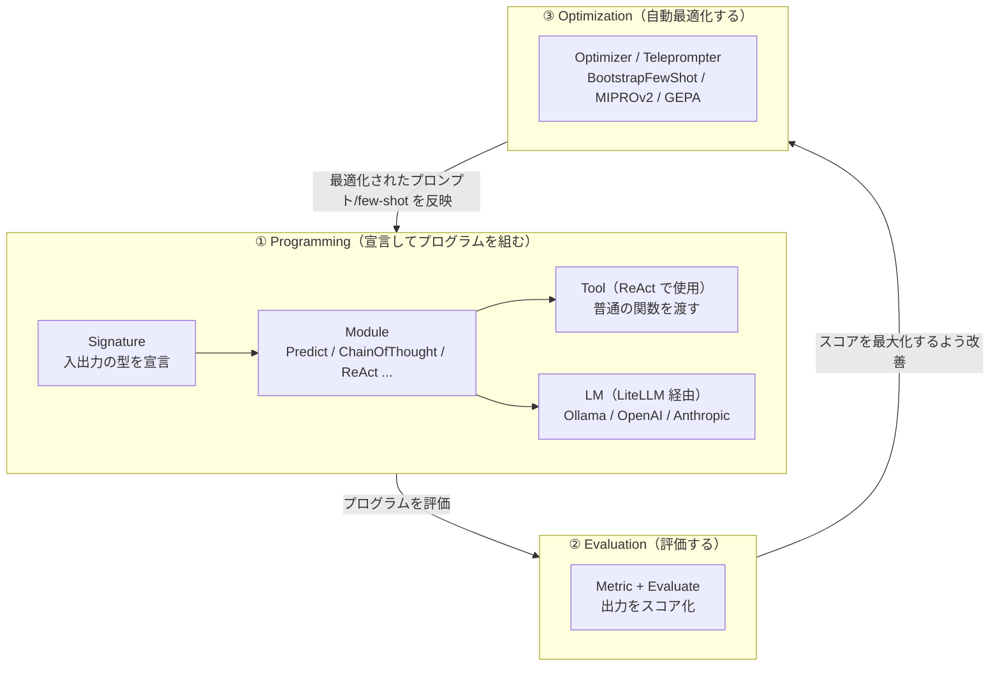
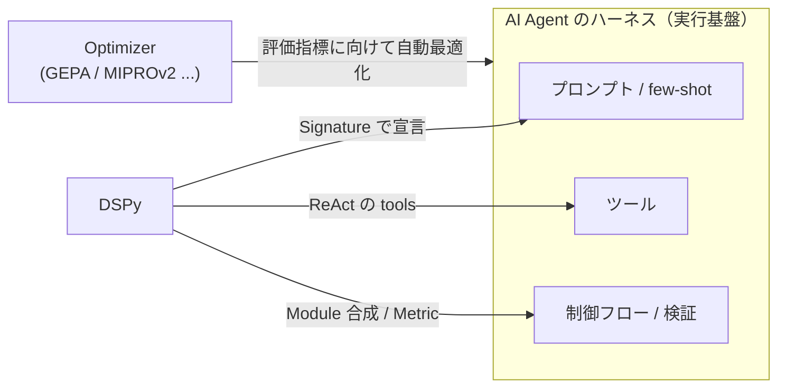

# DSPy [Declarative Self-improving Python] の概要

**[DSPy](https://dspy.ai/)（Declarative Self-improving Python）** は Stanford NLP 発の OSS フレームワークで、LLM アプリを「**プロンプト文字列の手書き**」ではなく「**入出力の型（`Signature`）を宣言し、それを `Module` で処理する Python プログラム**」として組み立てる。プロンプトは DSPy が `Signature` から自動生成し、さらに**オプティマイザが評価指標に向けてプロンプトや few-shot を自動最適化**する。これにより「プロンプトの手チューニング」から「**プログラムの宣言＋自動最適化**」へと開発スタイルが変わる。

ここでは DSPy 全体の構成要素・主要モジュール・オプティマイザと、その 3 段階アーキテクチャ、そして **AI Agent における「ハーネス」との関連性**を整理する。具体的な利用例は、`dspy.ReAct` でツール使用エージェントを作る [nlp_processing/59](../59)、`dspy.GEPA` でプロンプトを自己進化させる [nlp_processing/58](../58) を参照。

> **ポイント**: DSPy の発想は「**プロンプトを書く**」のではなく「**何を入出力するか（型）を宣言し、その実現方法（プロンプト・few-shot）は最適化器に任せる**」こと。PyTorch で「順伝播の構造を宣言し、重みは最適化器が学習する」のに似た役割分担を、LLM のプロンプトに対して行う。

## なぜ DSPy か（手書きプロンプトの課題）

| | 手書きプロンプト | DSPy |
|---|---|---|
| 記述 | 自然言語の長い指示文を人手で調整 | 入出力の型（`Signature`）を宣言 |
| モデル差し替え | プロンプトを書き直すことが多い | `LM` を差し替えるだけ（LiteLLM 経由） |
| 改善方法 | 人手で試行錯誤（再現性が低い） | 評価指標に対して**オプティマイザが自動最適化** |
| 部品化 | プロンプト断片のコピペになりがち | `Module` として合成・入れ子にできる |

## 主要な構成要素

| 構成要素 | 役割 | 代表例 |
|----------|------|--------|
| **`LM`** | 基盤 LLM への接続層。LiteLLM 経由で OpenAI / Anthropic / ローカル Ollama などを同一 API で差し替え | `dspy.LM("ollama_chat/qwen3.5:4b")` |
| **`Signature`** | タスクの入出力を型で宣言（＝プロンプトの宣言的定義） | `question -> answer` |
| **`Module`** | `Signature` の実行戦略を表す部品。組み合わせて複雑な処理を構築 | `Predict`, `ChainOfThought`, `ReAct` ほか（下表） |
| **`Adapter`** | `Signature` を実際のプロンプト/出力パースへ変換する層 | `ChatAdapter`, `JSONAdapter` |
| **`Metric` / `Evaluate`** | 出力の良し悪しを採点する関数と評価ハーネス | 完全一致採点, LLM-as-judge |
| **`Optimizer`（Teleprompter）** | 評価指標に向けてプロンプト/few-shot を自動最適化 | `BootstrapFewShot`, `MIPROv2`, `GEPA`（下表） |

## 主な組み込み Module

`Module` は「LLM をどう呼ぶか」の戦略で、`Module` 同士は合成・入れ子にできる。

| Module | 役割 |
|--------|------|
| **`dspy.Predict`** | `Signature` をそのまま 1 回 LLM 呼び出しで実行する最小単位 |
| **`dspy.ChainOfThought`** | 出力前に推論ステップ（reasoning）を挟み、思考の連鎖で精度を上げる |
| **`dspy.ProgramOfThought`** | 答えを直接出すのではなくコードを生成・実行して結果を得る |
| **`dspy.ReAct`** | ツールを呼びながら推論（Thought→Action→Observation）を反復する**エージェント**（[nlp_processing/59](../59)） |
| **`dspy.Refine` / `dspy.BestOfN`** | 複数回試行して最良の出力を選ぶ／自己改善する |

## 主なオプティマイザ（Teleprompter）

オプティマイザは、評価指標（`Metric`）のスコアが上がるように**プロンプトの instruction や few-shot 例を自動で探索・改善**する。

| オプティマイザ | 最適化の方法 |
|----------------|--------------|
| **`BootstrapFewShot`** | 成功したトラジェクトリから few-shot 例（デモ）を自動抽出して挿入 |
| **`MIPROv2`** | instruction（指示文）と few-shot を Bayesian 最適化で同時探索 |
| **`GEPA`** | 失敗を自然言語で反省し instruction を進化させる（[nlp_processing/58](../58) で解説） |

## DSPy のワークフロー（3 段階のアーキテクチャ）

DSPy は **① Programming（宣言）→ ② Evaluation（評価）→ ③ Optimization（自動最適化）** の 3 段階で開発する。①でプログラムを組み、②で評価指標を定義し、③でオプティマイザが①のプロンプトを評価指標に向けて自動改善する、という閉ループになっている。



## DSPy と AI Agent の「ハーネス」の関連性

AI Agent の実タスク性能を決めるのは、モデルの重みよりも**ハーネス（モデルを取り巻くツール・プロンプト・ミドルウェア・メモリ・ワークフローなどの実行基盤）**だ、という認識が広まっている（[nlp_processing/58](../58) 参照）。DSPy はこのハーネスのうち、特に**プロンプト（instruction）と few-shot、そしてツール接続・制御フロー**を、コードとして宣言し自動最適化する位置づけにある。

| ハーネスの構成要素 | DSPy での対応 |
|---|---|
| プロンプト（instruction） | `Signature` の宣言 ＋ オプティマイザ（`GEPA` 等）による自動進化 |
| few-shot 例 | `BootstrapFewShot` / `MIPROv2` が成功例から自動抽出・最適化 |
| ツール（Tooling） | `dspy.ReAct` の `tools`（普通の関数を渡す） |
| 制御フロー（ループ・検証） | `Module` の合成、`ReAct` の Thought→Action→Observation ループ |
| 評価・検証（Verification） | `Metric` / `Evaluate`（LLM-as-judge も書ける） |

つまり DSPy は、**ハーネスを「手で書いて固定する」のではなく「宣言して評価指標に向けて自己改善させる」**ためのフレームワークと言える。エージェントのハーネスを LLM 自身に自動改修させる **Self-Harness**（[nlp_processing/58](../58)）の実装基盤として、`GEPA` などのオプティマイザが第一級でサポートされているのはこのためである。



## 最小コード例

`Signature` を宣言して `Module` で実行する、最小の DSPy プログラム。`dspy.Predict` を `dspy.ChainOfThought` に差し替えるだけで「思考の連鎖」に切り替わる点が、宣言的フレームワークの利点を示している。

```python
import dspy

# LM を設定（ローカル Ollama の例。OpenAI/Anthropic も同じ API で差し替え可能）
dspy.configure(lm=dspy.LM("ollama_chat/qwen3.5:4b", api_base="http://localhost:11434", api_key=""))

# ① Programming: 入出力の型（Signature）を宣言し、Module で実行
qa = dspy.Predict("question -> answer")          # 最小単位
pred = qa(question="What is the capital of Australia?")
print(pred.answer)

# Module を差し替えるだけで戦略が変わる（思考の連鎖を挟む）
cot = dspy.ChainOfThought("question -> answer")
print(cot(question="If a train travels 60km in 1.5h, what is its speed?").answer)
```

## 参考サイト

- https://dspy.ai/ （DSPy 公式ドキュメント）
- https://dspy.ai/learn/programming/signatures/ （Signature）
- https://dspy.ai/learn/programming/modules/ （Module 一覧）
- https://dspy.ai/learn/optimization/optimizers/ （Optimizer / Teleprompter 一覧）
- https://github.com/stanfordnlp/dspy （DSPy 実装）
- https://arxiv.org/abs/2310.03714 （DSPy: Compiling Declarative Language Model Calls into Self-Improving Pipelines）
