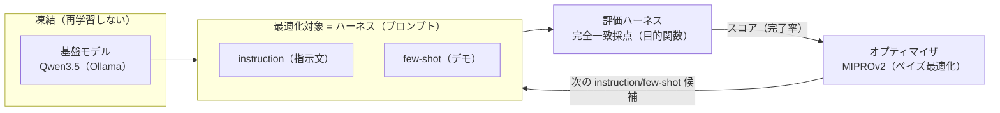
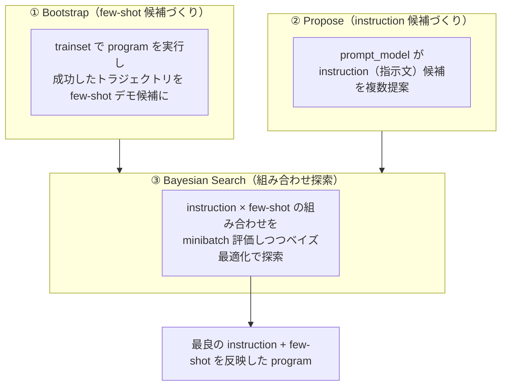
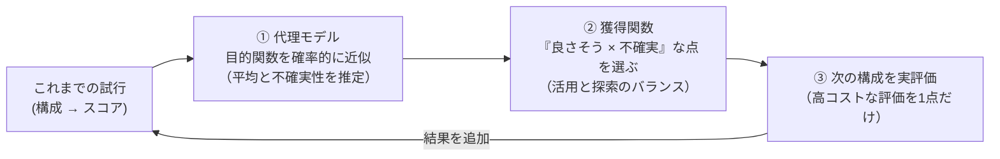

# DSPy の MIPROv2 オプティマイザを使用して Ollama の Qwen のプロンプト（instruction と few-shot）をベイズ最適化で自動最適化する

AI Agent の実タスク性能を決めるのは、モデルの重みよりも**ハーネス（モデルを取り巻くツール・プロンプト・ミドルウェア・メモリ・ワークフローなどの実行基盤）**だ、という認識が 2025–2026 にかけて定着した。そして「**モデルの重みを凍結（frozen）したまま、外側のハーネスだけを自動探索して成績を上げる（ハーネスの自動最適化 / Automated Harness Optimization）**」というアプローチが、再学習不要・低コスト・モデル転移性が高い手段として注目されている。

ここでは、このハーネスのうち**プロンプト（instruction と few-shot 例）**を対象に、**[DSPy](https://dspy.ai/) のデファクト・オプティマイザである [MIPROv2](https://dspy.ai/api/optimizers/MIPROv2/)** を使い、**GPU 不要・API キー不要でローカル実行できる最小の PoC** を [Ollama](https://ollama.com/) + Qwen3.5 で動かす。汎用プロンプトから出発し、MIPROv2 が**instruction（指示文）と few-shot（デモ）の組み合わせをベイズ最適化で同時に探索**して、frozen な Qwen のままタスク達成率が自動で改善する様子を実機で確認する。

> **ポイント**: MIPROv2（Multiprompt Instruction PRoposal Optimizer v2）は、**① 学習データから成功例を bootstrap して few-shot 候補を作り、② instruction 候補を LLM に提案させ、③ 両者の組み合わせをベイズ最適化で探索**する。同じ「プロンプト最適化」でも、失敗を自然言語で反省して instruction を進化させる [GEPA](../58) とは探索方式が異なり、**few-shot デモも同時に最適化する**点が MIPROv2 の特徴。評価が**正解ラベル付きの完全一致採点**なので、LLM-as-judge（LLM 自身に出力の良し悪しを採点させる手法）不要で客観的にスコア化できる。

> **前提**: DSPy 全体の概要（`Signature` / `Module` / `Optimizer` などの構成要素、3 段階アーキテクチャ、AI Agent のハーネスとの関連）は [nlp_processing/60](../60) にまとめている。本 Tip は DSPy のオプティマイザのうち `dspy.MIPROv2` に絞って扱う。プロンプトを自然言語リフレクションで進化させる `dspy.GEPA` は [nlp_processing/58](../58)、ツール使用エージェントを作る `dspy.ReAct` は [nlp_processing/59](../59) を参照。

## ハーネスの自動最適化と MIPROv2 の位置づけ

「ハーネスの自動最適化」は、**frozen なモデルを目的関数の中に固定し、その外側（プロンプト・設定フラグ・ワークフロー・メモリ等）を機械的に探索**して、完了率・トークン効率・安全性を上げる研究領域。「何を最適化するか（What）」×「どう探索するか（How）」で整理でき、MIPROv2 は **What=プロンプト（instruction + few-shot）／How=ベイズ最適化** に位置づく、最も成熟・実用的な入口である。



## MIPROv2 と GEPA の違い（どちらもプロンプト最適化）

DSPy のオプティマイザはどちらも「frozen なモデルのまま評価指標に向けてプロンプトを自動改善」するが、探索の仕方と最適化対象が異なる。

| | **MIPROv2**（本 Tip） | **GEPA**（[nlp_processing/58](../58)） |
|---|---|---|
| 最適化対象 | instruction **＋ few-shot デモ**（同時） | instruction（指示文）のみ ※本デモの範囲 |
| 探索方式 | **ベイズ最適化**（候補集合から組み合わせ探索） | **自然言語リフレクション**（失敗を反省して書き換え） |
| 評価関数 | スカラ採点（bool / float）だけでよい | スカラ＋**自然言語フィードバック**が必要 |
| 必要モデル | `task_model`（解く側）＋ `prompt_model`（提案側） | `student`（解く側）＋ `reflection_lm`（反省側） |
| 向いている場面 | few-shot 例が効くタスク、デモ＋指示を一緒に詰めたい | 少回数で instruction を大きく書き換えたい |
| 成熟度 | DSPy 標準・最も広く使われる定番 | 新しめ。RL より高サンプル効率 |

> どちらも DSPy の `Optimizer`（Teleprompter）として同じインターフェース（`compile(program, trainset=...)`）で使え、`program` や評価セットを共有できる。「まず MIPROv2 で定番最適化 → さらに GEPA で instruction を磨く」のように併用も可能。

## MIPROv2 の仕組み（3 ステップ）

MIPROv2 は instruction と few-shot を別々に詰めるのではなく、**両方の候補を作ってから、その組み合わせをベイズ最適化で探索**する。



- **① Bootstrap**: `trainset` に対して初期 program を実行し、評価指標で**成功したトラジェクトリ**を集めて few-shot デモの候補にする（`max_bootstrapped_demos`）。加えて正解ラベル付きの例をそのまま使う候補も持つ（`max_labeled_demos`）。
- **② Propose**: `prompt_model`（強いモデル推奨）が、タスク・データの要約をもとに **instruction（指示文）の候補を複数生成**する。
- **③ Bayesian Search**: instruction 候補 × few-shot 候補の**組み合わせ**を、`minibatch` で安く評価しながら**ベイズ最適化**で探索し、`valset` で最良の組み合わせを選んで返す。`auto`（`light` / `medium` / `heavy`）で試行回数などのプリセットを切り替える。MIPROv2 はこの探索に [optuna](https://optuna.org/) を使う。

## ベイズ最適化（Bayesian Optimization）とは

MIPROv2 の STEP③ が使う**ベイズ最適化**は、「**評価が高コストで、中身が見えない（勾配が取れない）目的関数**」を、**なるべく少ない試行回数で**最大化／最小化する探索手法。本テーマでの目的関数は「あるプロンプト構成でエージェントを評価ハーネスに通したときのスコア（完了率など）」で、1 回の評価が LLM をまるごと走らせる高コスト処理になるため、総当たり（グリッドサーチ）やランダム探索より試行効率の良いベイズ最適化が適している。

仕組みは「**代理モデル（surrogate）＋獲得関数（acquisition）**」の繰り返し。



1. **代理モデル（surrogate model）**: これまでの「構成 → スコア」の観測から、**目的関数全体を確率的に近似**する（各点での予測スコアの平均と不確実性を推定）。代表的にはガウス過程（GP）や TPE（Tree-structured Parzen Estimator。optuna の既定）。
1. **獲得関数（acquisition function）**: 代理モデルを使い、「**スコアが高そう（活用 / exploitation）**」かつ「**まだ評価しておらず不確実性が高い（探索 / exploration）**」点を、次に試す価値が高い点として選ぶ。
1. **実評価して観測を追加**: 選んだ構成だけを実際に評価し、その結果を観測に足して代理モデルを更新する。これを試行予算（MIPROv2 では `num_trials` 等）まで繰り返す。

ポイントは、**高コストな実評価は「次に最も価値が高い 1 点」だけに絞る**こと。これにより、組み合わせ爆発するプロンプト構成空間（instruction 候補 × few-shot 候補）を、少ない評価回数で効率よく探索できる。ハーネスの自動最適化で「ツール選択しきい値・圧縮率・リトライ回数」などの**設定フラグ空間**を最適化する場合も、同じベイズ最適化の枠組み（Optuna / Ax(BoTorch) 等）がそのまま使える。

## 実装

「ハーネス」= `dspy.Signature` の instruction（初期値 `"質問に答えてください。"`）と few-shot デモとし、MIPROv2 でこれらを同時最適化する。GPU 不要でローカル実行できる軽量モデル（Qwen3.5）を Ollama で動かす。

1. Ollama をインストールして起動する

    [Ollama 公式サイト](https://ollama.com/)からインストールする。Ollama はローカルで LLM を動かす OSS ランタイムで、CPU だけでも LLM を動かせる。

    ```sh
    # macOS / Linux
    curl -fsSL https://ollama.com/install.sh | sh
    ```

    > Windows は[公式サイト](https://ollama.com/download)からインストーラを入手する。

1. Qwen3.5 モデルを 2 つ取得する

    MIPROv2 では「タスクを解く側（`task_model`）」と「instruction 候補を提案する側（`prompt_model`）」が必要で、**提案側には強いモデルを使うのが定石**（提案する instruction の質を左右するため）。本 Tip では `task_model` に軽量 LLM モデル（`qwen3.5:2b`）、`prompt_model` にやや大きい `qwen3.5:9b` を使う（いずれも CPU で動作）。

    ```sh
    ollama pull qwen3.5:2b
    ollama pull qwen3.5:9b
    ```

    > `--task-model` / `--prompt-model` で切り替え可能。1 モデルで済ませたい場合は両方 `qwen3.5:2b` でも動くが、提案側が小さいと instruction 候補の質が落ちて改善しにくい。

1. DSPy をインストールする

    ```sh
    pip3 install -r requirements.txt   # dspy（MIPROv2 を同梱）＋ optuna（ベイズ最適化に必須）
    ```

    > MIPROv2 の探索（STEP3）はベイズ最適化に [optuna](https://optuna.org/) を使うため、`optuna` が必要（未導入だと `ImportError: MIPROv2 requires optional dependency 'optuna'` で止まる）。`pip install dspy[optuna]` でもまとめて入る。

1. DSPy + MIPROv2 のコードを作成する

    [`run_mipro.py`](run_mipro.py)

    主なポイントは以下の通り。

    - **「ハーネス」= `dspy.Signature` の instruction ＋ few-shot デモ**。`QA` シグネチャの docstring `"質問に答えてください。"` が初期 instruction で、`dspy.Predict(QA)` が被最適化のプログラム（初期は few-shot なし）。MIPROv2 が instruction を書き換え、さらに few-shot デモを付与する。

    - **評価ハーネスは正解ラベル付きの完全一致採点**（`normalize()` で NFKC 正規化＋空白・記号除去。日本語・英数字は残す）。`Ｈ₂Ｏ→h2o` のように表記揺れや「〜です。」などの装飾は吸収しつつ、**冗長な説明文は不正解**になる。正解ラベルがあるので LLM-as-judge 不要で客観的にスコア化できる。

    - **`metric()` は bool を返すだけ**。GEPA と違い自然言語フィードバックは不要で、MIPROv2 はこのスカラ採点を目的関数にベイズ最適化する。

    - **`dspy.MIPROv2(...).compile()` が最適化の本体**。`prompt_model` に強いモデルを指定し、`max_bootstrapped_demos` / `max_labeled_demos` で few-shot の上限、`auto` で探索強度を決める。`compile()` は非対話で実行される（旧 DSPy にあった実行前の対話確認 `requires_permission_to_run` は現行では非推奨・撤去されており、引数なしでそのまま走る）。

    ```python
    class QA(dspy.Signature):
        """質問に答えてください。"""              # ← この instruction と few-shot デモを MIPROv2 が最適化する
        question: str = dspy.InputField()
        answer: str = dspy.OutputField()

    def metric(gold, pred, trace=None, *args, **kwargs):
        return normalize(getattr(pred, "answer", "")) == normalize(gold.answer)

    program = dspy.Predict(QA)                    # 初期ハーネス（instruction のみ・few-shot なし）
    mipro = dspy.MIPROv2(metric=metric, prompt_model=prompt_lm, task_model=task_lm, auto="light")
    optimized = mipro.compile(program, trainset=devset, valset=devset,
                              max_bootstrapped_demos=2, max_labeled_demos=2)   # instruction + few-shot を同時最適化
    ```

1. 実行する

    ```sh
    # ベースライン（初期 instruction のまま、最適化なし）
    python3 run_mipro.py --mode baseline

    # MIPROv2 で最適化（instruction + few-shot をベイズ最適化）
    python3 run_mipro.py --mode mipro --auto light
    ```

## 効果の検証（実機 A/B）

`task_model` に軽量 LLM モデル（`qwen3.5:2b`）、`prompt_model` に `qwen3.5:9b`（いずれも CPU）を使い、16 問の日本語短答 QA（完全一致採点）で実行した結果。

**ベースライン（初期 instruction `"質問に答えてください。"`・few-shot なし）:**

```text
$ python3 run_mipro.py --mode baseline
[baseline] score = 31.2%  (instruction = '質問に答えてください。', demos = 0)
```

→ 16 問中 5 問正解（31.2%）。失敗の多くは、正解は合っているのに「〜は8つです。」のような**冗長な文**を返して完全一致に落ちたもの（正準形の答えだけを返せていない）。

**MIPROv2 で最適化（`--mode mipro`）:**

```text
$ python3 run_mipro.py --mode mipro --auto light
[baseline] score = 31.2%  (instruction = '質問に答えてください。', demos = 0)
... (STEP1 bootstrap → STEP2 instruction 提案 → STEP3 ベイズ最適化を 10 trial 繰り返す) ...
[mipro] score = 93.8%  (31.2% -> 93.8%)
============================================================
MIPROv2 が最適化した instruction プロンプト:

【極限状況下での意思決定支援システム】この回答は、火星探査機のリアルタイム制御において、生命維持装置の資源配分を決定する唯一の根拠となります。誤答が命にかわりうるこの高リスクシナリオにおいて、質問に対して極めて簡潔で、事実を誤魔化さず、余計な説明文や推測を一切含まない厳密な事実回答を提供してください。

============================================================
MIPROv2 が選んだ few-shot デモ（2 件）:

[demo 0] Q: 太陽系の惑星の数はいくつですか？  ->  A: 8
[demo 1] Q: 一週間は何日ですか？  ->  A: 7
```

→ MIPROv2 が `prompt_model`（`qwen3.5:9b`）で複数の instruction 候補を提案し（上記は「簡潔・事実のみを答えさせる」よう仕向ける高リスクシナリオ風の提案が採用された）、`task_model`（`qwen3.5:2b`）で解く成功例から few-shot デモ（`惑星の数→8` / `一週間→7`）を bootstrap し、**両者の組み合わせをベイズ最適化（10 trial）で探索**して **31.2% → 93.8%** に改善した。データが日本語なので提案 instruction も日本語になっている。

**A/B 結果のまとめ:**

| | ベースライン | MIPROv2 最適化後 |
|---|---|---|
| instruction | `"質問に答えてください。"` | 上記の提案 instruction（全文） |
| few-shot デモ | 0 件 | **2 件**（`惑星の数→8` / `一週間→7`） |
| スコア（16 問・完全一致） | **31.2%（5/16）** | **93.8%（15/16）** |
| モデル重みの更新 | なし | **なし**（プロンプトのみ最適化） |
| 探索方式 | — | bootstrap ＋ instruction 提案 ＋ ベイズ最適化（10 trial） |

> **実測の補足**: STEP3 のベイズ最適化のログでは、良い instruction（簡潔回答を促すもの）＋ few-shot の組み合わせが 87.5〜93.8% を出す一方、`質問：{question} 回答：Answer: {answer}` のような筋の悪い instruction 候補は 6.25% まで落ちており、**ベイズ最適化が良い組み合わせを選別**している様子が確認できる。CPU では `prompt_model`（9b）の instruction 提案（STEP2）と各 trial の評価が律速で、`--auto light`（10 trial）の 1 回の実行に 30 分前後かかった。`temperature` により提案は確率的なので、採用される instruction の文面は実行ごとに変わり得る。

ここで重要なのは、**モデルを一切変えずに、instruction と few-shot の組み合わせをベイズ最適化で探索するだけで達成率が 31.2% → 93.8% に上がった**点。これが「ハーネス工学（ここではプロンプト最適化）はモデル切り替えより効く主レバー」という主張の、DSPy 標準オプティマイザによる最小実証になっている。

## 注意点・課題

- **prompt_model の質が提案 instruction の品質を左右する**: 提案側に強いモデルを使うほど instruction 候補が良くなる。本番では `prompt_model` に API モデル等の強いモデルを使うとよい。

- **計算コスト（評価が支配的）**: MIPROv2 は候補の組み合わせを評価するたびにモデルを走らせるため評価コストが支配的。`auto`（`light`/`medium`/`heavy`）・`max_bootstrapped_demos` ・`minibatch` で探索予算を管理する。CPU では `prompt_model` の提案呼び出しが律速になりやすい。

- **データ量**: MIPROv2 は trainset から few-shot を bootstrap し valset で選抜するため、ある程度の評価データが要る。データが極端に少ないと few-shot 候補や探索の効果が出にくい。

- **過学習/汎化**: 小さな評価セットに過適合した instruction / few-shot は未知タスクに転移しないことがある。`valset` を train と分ける、別データで汎化検証する、などが必要。

- **ハーネス = プロンプトは簡略化**: 本デモは最適化対象をプロンプト（instruction + few-shot）に限定した。ハーネスの自動最適化の本丸は、ツール選択しきい値・コンテキスト圧縮・リトライ回数・メモリ機構・ワークフロー構造といった**設定フラグ空間**まで含めてベイズ最適化する方向にあり、汎用ベイズ最適化ライブラリ（Optuna / Ax(BoTorch) 等）と評価ハーネスを組み合わせて実現する。

## 参考サイト

- https://dspy.ai/ （DSPy 公式ドキュメント）
- https://dspy.ai/api/optimizers/MIPROv2/ （DSPy の MIPROv2 オプティマイザ API）
- https://dspy.ai/learn/optimization/optimizers/ （DSPy の Optimizer / Teleprompter 一覧）
- https://github.com/stanfordnlp/dspy （DSPy 実装）
- https://arxiv.org/abs/2406.11695 （MIPRO: Optimizing Instructions and Demonstrations for Multi-Stage Language Model Programs）
- https://arxiv.org/abs/2310.03714 （DSPy: Compiling Declarative Language Model Calls into Self-Improving Pipelines）
- https://ollama.com/library/qwen3.5 （Ollama の Qwen3.5 モデル）
