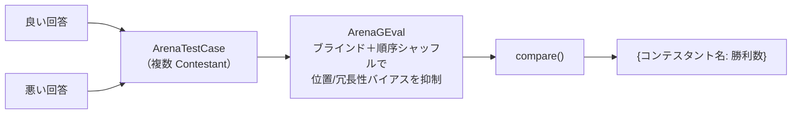

# DeepEval を使用して Ollama の Qwen を LLM-as-judge（MT-Bench 方式）にし、LLM の出力品質を自動採点する

MMLU・GSM8K のような「単一呼び出し・正解一致」型の知識ベンチはフロンティアモデルでほぼ飽和し、LLM / AI Agent の価値は「**実タスクの達成率**」や「**出力（要約・対話・コード説明など自由形式の文章）の質**」で測るしかなくなった。ところがこうした自由形式の出力は表記が一意に定まらないため、完全一致や正規表現では採点できない。そこで **LLM 自身に rubric（採点基準）を与えて出力の良し悪しを採点させる「LLM-as-judge」** が、評価ハーネス（評価のための決定論的ソフトウェア層）の中心的な採点方式として定着した。

ここでは、LLM-as-judge を定着させた起点である **[MT-Bench（arXiv:2306.05685）](https://arxiv.org/abs/2306.05685)** の方式を、LLM 評価のデファクト・ライブラリ **[DeepEval](https://deepeval.com/)** を使って、**GPU 不要・API キー不要でローカル実行できる最小の PoC** として [Ollama](https://ollama.com/) + Qwen3.5 で動かす。① DeepEval の **`GEval`（rubric ベースの単一採点）** と ② **`ArenaGEval`（2 回答のペア比較）** の 2 モードを実装し、judge が良い回答に高スコア・悪い回答に低スコアを付けられるかを実機で確認する。手書きの judge（プロンプト整形・JSON パース・バイアス対策の自前実装）と違い、**rubric の言語化だけに集中でき、バイアス対策はライブラリ側が内蔵する**のが専用ライブラリを使う利点。

> **ポイント**: LLM-as-judge は「LLM 自身に出力の良し悪しを採点させる」手法。DeepEval はこれを 2 つのメトリクスで提供する。**(a) `GEval`** ＝ chain-of-thought で生成した評価ステップに沿って 1 つの回答を `0.0〜1.0` で採点（single-answer grading）。**(b) `ArenaGEval`** ＝ 複数回答を突き合わせて勝者を選ぶ（pairwise comparison）。人手評価より圧倒的に安く・速く・スケールするのが利点で、MT-Bench は GPT-4 judge が人間評価と 80% 超で一致（人間同士の一致率と同等）すると報告した。一方で **位置バイアス・冗長性バイアス・自己選好バイアス**といった既知の偏りがあり、対策が要る（`ArenaGEval` はこれを内部で抑制する）。

> **前提**: 直前の [nlp_processing/61](../61) では**正解ラベル付きの完全一致採点**でプロンプトを最適化したため LLM-as-judge は不要だった。しかし要約・対話・説明文のような**自由形式の出力**は完全一致できないため、本 Tip ではそれを LLM-as-judge で採点する。DSPy 系の関連 Tip は概要が [nlp_processing/60](../60)、`ReAct` エージェントが [nlp_processing/59](../59)、`GEPA` / `MIPROv2` によるプロンプト最適化が [nlp_processing/58](../58) / [nlp_processing/61](../61)。プロンプト最適化の「評価関数」を完全一致から LLM-as-judge（`GEval` 等）に差し替えれば、自由形式タスクの自動最適化にもつながる。

## 評価ハーネスにおける LLM-as-judge の位置づけ

エージェント / LLM の評価ハーネスは「**何を測るか（評価対象軸）**」×「**どう採点するか（採点方式）**」×「**どう回すか（実行ハーネス）**」の 3 軸で整理できる。LLM-as-judge はこのうち**採点方式**の中核で、ルール検証（完全一致・unit test・スキーマ）では取りこぼす「正しいが表現の異なる回答」を柔軟に拾える。DeepEval はこの採点層を提供する評価フレームワークの一つ。

```mermaid
flowchart LR
  subgraph TASK["タスク層（ゴールデンタスク集）"]
    Q["質問 + 参照解答<br/>+ 候補回答"]
  end
  subgraph JUDGE["採点層（本 Tip = DeepEval）"]
    RULE["ルール検証<br/>完全一致 / unit test"]
    LLMJ["<b>LLM-as-judge</b><br/>GEval（単一採点） / ArenaGEval（ペア比較）"]
  end
  subgraph OUT["集計層"]
    S["スコア表 / 回帰検出"]
  end
  Q --> RULE
  Q --> LLMJ
  RULE --> S
  LLMJ --> S
  style LLMJ fill:#fdf6b2,stroke:#b59f00
```



- **ルール検証**: 決定的・安価・再現性が高いが、表現の揺れに弱く「正しいが完全一致しない」回答を取りこぼす。[nlp_processing/61](../61) の完全一致採点がこれにあたる。
- **LLM-as-judge（DeepEval）**: 自由形式の出力を rubric で柔軟に採点できる。安く速くスケールする反面、judge 自身のバイアスと人間相関の担保が課題（後述）。

## LLM-as-judge の 2 つの採点モード（DeepEval のメトリクス対応）

MT-Bench は LLM-as-judge の代表的な使い方として「単一採点」と「ペア比較」を示した。DeepEval はそれぞれを `GEval` / `ArenaGEval` として提供する。

| | **単一採点（`GEval`）** | **ペア比較（`ArenaGEval`）** |
|---|---|---|
| やること | 1 つの回答を rubric で **0.0〜1.0** に採点 | 複数回答の**どれが良いか**を選ぶ（勝者を決定） |
| 入力（test case） | `LLMTestCase`（input / actual_output / expected_output） | `ArenaTestCase`（複数 `Contestant`） |
| 出力 | `metric.score`（0-1）＋ `metric.reason` | `compare()` が `{コンテスタント名: 勝利数}` を返す |
| 向く場面 | 絶対評価・回帰検出・しきい値ゲート | モデル / プロンプト同士の相対比較・A/B |
| バイアス対策 | criteria の明文化（参照解答で reference-guided） | **ブラインド＋提示順シャッフルを内蔵**（後述） |

> `GEval` は与えた `criteria`（採点基準）から chain-of-thought で評価ステップを自動生成し、それに沿って採点する。参照解答（`expected_output`）を渡す方式は **reference-guided grading** と呼ばれ、judge 自身が間違えやすいタスクで採点精度が上がる。

## judge のバイアスと対策

LLM-as-judge は便利だが、MT-Bench は judge LLM に次の既知バイアスがあると報告している。これを知らずに使うと誤った結論になる。

- **位置バイアス（position bias）**: ペア比較で、**先に提示された回答（または特定の位置）を優遇**してしまう。中身が同じでも提示順で勝敗が変わることがある。
- **冗長性バイアス（verbosity bias）**: 長く詳細に見える回答を、内容が優れていなくても高く評価しがち。
- **自己選好バイアス（self-enhancement bias）**: judge 自身（同系統のモデル）が生成した回答を好む傾向。
- **推論・計算の弱さ**: judge 自身が数学・論理を間違えると採点も誤る（→ 参照解答を渡す reference-guided で緩和）。

DeepEval の **`ArenaGEval` は、このうち位置・冗長性バイアスへの対策を内部に持つ**。公式ドキュメントによれば、ArenaGEval は **「ブラインド（どの回答がどのコンテスタントか隠す）＋提示順のランダム化（randomized position）」による n-pairwise の判定**を行うため、judge が位置や長さで贔屓しにくい。MT-Bench では提示順を入れ替えて 2 回判定し一致時のみ採用する対策を手書きするが、DeepEval ではこれを**メトリクス側が肩代わり**する。



## 実装

ゴールデンタスク（質問＋参照解答）と、品質の異なる 2 つの候補回答（`good` = 正しい / `bad` = 誤り・曖昧）を用意し、Ollama 上の Qwen3.5 を DeepEval の judge にして採点する。いずれも自由形式の日本語文章で、完全一致では採点できないため LLM-as-judge が要る題材になっている。

1. Ollama をインストールして起動する

    [Ollama 公式サイト](https://ollama.com/)からインストールする。Ollama はローカルで LLM を動かす OSS ランタイムで、CPU だけでも LLM を動かせる。

    ```sh
    # macOS / Linux
    curl -fsSL https://ollama.com/install.sh | sh
    ```

    > Windows は[公式サイト](https://ollama.com/download)からインストーラを入手する。

1. judge 用の Qwen3.5 モデルを取得する

    judge（採点者）には**ある程度大きいモデルを使うのが定石**（採点の人間一致率がモデルの賢さに依存するため）。本 Tip では `qwen3.5:4b` を既定にする（CPU で動作）。より厳密に採点したい場合は `--judge-model qwen3.5:9b` などに上げる。

    ```sh
    ollama pull qwen3.5:4b
    ```

    > 2b では採点の安定性が落ちやすい（良し悪しの判定や DeepEval が要求する構造化出力の整形を誤りやすい）ため、judge には 4b 以上を推奨する。

1. DeepEval をインストールする

    ```sh
    pip3 install -r requirements.txt   # deepeval（LLM 評価フレームワーク。GEval / ArenaGEval / OllamaModel を同梱）
    ```

1. LLM-as-judge のコードを作成する

    [`run_judge.py`](run_judge.py)

    主なポイントは以下の通り。

    - **judge は `OllamaModel` でローカル LLM を指定する**。`OllamaModel(model="qwen3.5:4b", base_url="http://localhost:11434", temperature=0)` を各メトリクスの `model` に渡すだけで、API キー不要・ローカル CPU で judge が動く。`temperature=0` で採点を決定的にする。

    - **単一採点は `GEval`**。`criteria`（採点基準）を日本語で言語化し、`evaluation_params` に評価対象（`INPUT` / `ACTUAL_OUTPUT` / `EXPECTED_OUTPUT`）を渡す。`metric.measure(test_case)` 後に `metric.score`（0.0〜1.0）と `metric.reason` を読む。手書きと違い JSON パースや採点プロンプトの整形は不要。

    - **ペア比較は `ArenaGEval` ＋ `compare()`**。各問を `ArenaTestCase`（`Contestant` = 良い回答 / 悪い回答）にし、`compare(test_cases=[...], metric=metric)` が `{コンテスタント名: 勝利数}` を返す。`ArenaGEval` はブラインド＋提示順シャッフルで位置/冗長性バイアスを内部抑制するので、**順序入れ替えを手書きする必要がない**。

    ```python
    judge = OllamaModel(model="qwen3.5:4b", base_url="http://localhost:11434", temperature=0)

    # 単一採点（GEval）
    metric = GEval(
        name="正確性",
        criteria="AI の回答が参照解答に照らして正確・有用で簡潔かを評価する。内容の正しさを最重視する。",
        evaluation_params=[SingleTurnParams.INPUT, SingleTurnParams.ACTUAL_OUTPUT, SingleTurnParams.EXPECTED_OUTPUT],
        model=judge,
    )
    metric.measure(LLMTestCase(input=q, actual_output=ans, expected_output=ref))
    print(metric.score, metric.reason)

    # ペア比較（ArenaGEval）。compare() は {名前: 勝利数} を返す
    arena = ArenaTestCase(contestants=[
        Contestant(name="良い回答", test_case=LLMTestCase(input=q, actual_output=good)),
        Contestant(name="悪い回答", test_case=LLMTestCase(input=q, actual_output=bad)),
    ])
    wins = compare(test_cases=[arena], metric=ArenaGEval(name="回答品質", criteria="...", evaluation_params=[...], model=judge))
    ```

1. 実行する

    ```sh
    # 単一採点（GEval, 0.0-1.0）: 良い回答 / 悪い回答を採点して平均を比較
    python3 run_judge.py --mode single

    # ペア比較（ArenaGEval）: 良い回答が勝てるか
    python3 run_judge.py --mode pairwise

    # judge を大きいモデルに変える
    python3 run_judge.py --mode single --judge-model qwen3.5:9b
    ```

## 効果の検証（実機）

judge に `qwen3.5:4b`（CPU）を使い、4 問の自由形式 QA（各問に正しい回答 `good` と誤り・曖昧な回答 `bad`）で実行した結果。

<!-- TODO: 実機の数値・出力を反映（GEval の平均スコア、ArenaGEval の勝利数、judge の理由文の例） -->

**単一採点（`--mode single`）:**

```text
$ python3 run_judge.py --mode single
=== 単一採点（DeepEval GEval, 0.0-1.0）  judge = qwen3.5:4b ===

Q: 光合成とは何か、簡潔に説明してください。
  [良い回答] score=X.XX  理由: <!-- TODO: judge の理由 -->
  [悪い回答] score=X.XX  理由: <!-- TODO: judge の理由 -->
...
============================================================
平均スコア: 良い回答 = X.XX,  悪い回答 = X.XX
→ judge が良い回答に高スコア・悪い回答に低スコアを付けられていれば採点が機能している
```

**ペア比較（`--mode pairwise`）:**

```text
$ python3 run_judge.py --mode pairwise
=== ペア比較（DeepEval ArenaGEval, 位置/冗長性バイアスは内部で抑制）  judge = qwen3.5:4b ===
...
============================================================
勝利数: {'良い回答': X, '悪い回答': X}
→ 全 4 問中、良い回答が X 勝できていれば judge が機能している
```

ここで重要なのは、**完全一致では採点できない自由形式の出力でも、LLM-as-judge なら良し悪しを定量化できる**点、そして **DeepEval を使うことで rubric の言語化に集中でき、位置/冗長性バイアス対策はメトリクス側に任せられる**点。これが「評価ハーネスの採点層を、ルール検証だけでなく LLM-as-judge で補強する」という主張の最小実証になっている。

## 注意点・課題

- **judge の質がすべての上限**: 採点の人間一致率は judge モデルの賢さに依存する。本番では judge に強いモデル（API モデル等。DeepEval は `model=` を差し替えるだけ）を使い、可能なら少数の人手ラベルで judge と人間の一致率を測ってから運用する。

- **ローカルモデルは構造化出力に失敗することがある**: `GEval` / `ArenaGEval` は judge に構造化（JSON）出力を要求する。小さいローカルモデルだとスキーマに沿った出力に失敗してパースエラーになることがある。judge には 4b 以上を使う、`temperature=0` にする、失敗時はリトライする、などで安定させる。

- **思考モードと速度**: `OllamaModel` 経由では Qwen3.5 の思考（thinking）生成を直接無効化しづらく、CPU では採点 1 回あたりの推論が重くなりやすい。データ数 × 候補数だけ judge 呼び出しが走るため、まずは少数のゴールデンタスクで回す。

- **スコアの絶対値は校正が必要**: `GEval` のスコアは judge や criteria 次第でずれる。絶対値を信用しすぎず、**同一 judge・同一 criteria での相対比較や回帰検出**に使うのが安全。

- **本デモは最小構成**: 実運用の評価ハーネスでは、これに加えてツール選択正答率・ステップ効率・コスト/レイテンシといった軌跡（trajectory）指標や、公開ベンチ（SWE-bench / BFCL / τ-bench 等）の取り込み、回帰ゲートのダッシュボード化が組み合わさる。DeepEval は `GEval` 以外にも多数のメトリクスを持ち、`Inspect AI` / `RAGAS` などの評価フレームワークも土台に使える。

## 参考サイト

- https://arxiv.org/abs/2306.05685 （Judging LLM-as-a-Judge with MT-Bench and Chatbot Arena）
- https://deepeval.com/ （DeepEval 公式ドキュメント）
- https://deepeval.com/docs/metrics-llm-evals （DeepEval の GEval メトリクス）
- https://deepeval.com/docs/metrics-arena-g-eval （DeepEval の Arena G-Eval メトリクス: ペア比較）
- https://deepeval.com/integrations/models/ollama （DeepEval を Ollama のローカルモデルで使う）
- https://github.com/confident-ai/deepeval （DeepEval 実装）
- https://ollama.com/library/qwen3.5 （Ollama の Qwen3.5 モデル）
