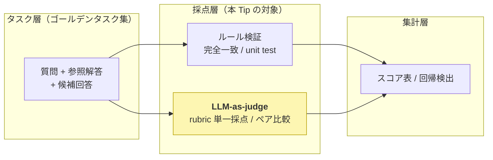
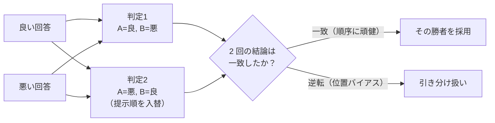

# LLM-as-judge（MT-Bench 方式）を Ollama の Qwen でローカル実行し、LLM の出力品質を自動採点する

MMLU・GSM8K のような「単一呼び出し・正解一致」型の知識ベンチはフロンティアモデルでほぼ飽和し、LLM / AI Agent の価値は「**実タスクの達成率**」や「**出力（要約・対話・コード説明など自由形式の文章）の質**」で測るしかなくなった。ところがこうした自由形式の出力は表記が一意に定まらないため、完全一致や正規表現では採点できない。そこで **LLM 自身に rubric（採点基準）を与えて出力の良し悪しを採点させる「LLM-as-judge」** が、評価ハーネス（評価のための決定論的ソフトウェア層）の中心的な採点方式として定着した。

ここでは、LLM-as-judge を定着させた起点である **[MT-Bench（arXiv:2306.05685）](https://arxiv.org/abs/2306.05685)** の方式を、**GPU 不要・API キー不要でローカル実行できる最小の PoC** として [Ollama](https://ollama.com/) + Qwen3.5 で動かす。① **rubric ベースの単一採点（1〜10 点）** と ② **2 回答のペア比較** の 2 モードを実装し、さらに MT-Bench が指摘する **位置バイアス（提示順で勝敗が変わる）への対策**まで含めて、judge が良い回答に高得点・悪い回答に低得点を付けられるかを実機で確認する。

> **ポイント**: LLM-as-judge は「LLM 自身に出力の良し悪しを採点させる」手法。主に **(a) 単一採点（single-answer grading）**＝ 1 つの回答を rubric で 1〜10 点に採点、**(b) ペア比較（pairwise comparison）**＝ 2 つの回答のどちらが良いかを判定、の 2 モードがある。人手評価より圧倒的に安く・速く・スケールするのが利点で、MT-Bench は GPT-4 judge が人間評価と 80% 超で一致（人間同士の一致率と同等）すると報告した。一方で **位置バイアス・冗長性バイアス・自己選好バイアス**といった既知の偏りがあり、対策が要る。

> **前提**: 直前の [nlp_processing/61](../61) では**正解ラベル付きの完全一致採点**でプロンプトを最適化したため LLM-as-judge は不要だった。しかし要約・対話・説明文のような**自由形式の出力**は完全一致できないため、本 Tip ではそれを LLM-as-judge で採点する。DSPy 系の関連 Tip は概要が [nlp_processing/60](../60)、`ReAct` エージェントが [nlp_processing/59](../59)、`GEPA` / `MIPROv2` によるプロンプト最適化が [nlp_processing/58](../58) / [nlp_processing/61](../61)。プロンプト最適化の「評価関数」を完全一致から LLM-as-judge に差し替えれば、自由形式タスクの自動最適化にもつながる。

## 評価ハーネスにおける LLM-as-judge の位置づけ

エージェント / LLM の評価ハーネスは「**何を測るか（評価対象軸）**」×「**どう採点するか（採点方式）**」×「**どう回すか（実行ハーネス）**」の 3 軸で整理できる。LLM-as-judge はこのうち**採点方式**の中核で、ルール検証（完全一致・unit test・スキーマ）では取りこぼす「正しいが表現の異なる回答」を柔軟に拾える。



- **ルール検証**: 決定的・安価・再現性が高いが、表現の揺れに弱く「正しいが完全一致しない」回答を取りこぼす。[nlp_processing/61](../61) の完全一致採点がこれにあたる。
- **LLM-as-judge**: 自由形式の出力を rubric で柔軟に採点できる。安く速くスケールする反面、judge 自身のバイアスと人間相関の担保が課題（後述）。

## LLM-as-judge の 2 つの採点モード

MT-Bench は LLM-as-judge の代表的な使い方として次の 2 つを示した。本 Tip では両方を実装する。

| | **単一採点（single-answer grading）** | **ペア比較（pairwise comparison）** |
|---|---|---|
| やること | 1 つの回答を rubric で **1〜10 点**に採点 | 2 つの回答の**どちらが良いか**を判定（A / B / 引き分け） |
| 出力 | スカラのスコア（＋理由） | 勝敗（＋理由） |
| 向く場面 | 絶対評価・回帰検出・しきい値ゲート | モデル / Strategy 同士の相対比較・ランキング |
| 弱点 | スコアの絶対値が揺れやすい（校正が必要） | **位置バイアス**（提示順で勝敗が変わる）が出やすい |
| 本 Tip の実装 | `--mode single`（良い回答 / 悪い回答を採点して平均を比較） | `--mode pairwise`（位置バイアス対策つき） |

> 参照解答（ゴールデン）を judge に渡す方式を **reference-guided grading** と呼ぶ。特に算数・推論など judge 自身が間違えやすいタスクで、参照解答を与えると採点精度が上がる。本 Tip は両モードとも参照解答を渡している。

## judge のバイアスと対策

LLM-as-judge は便利だが、MT-Bench は judge LLM に次の既知バイアスがあると報告している。これを知らずに使うと誤った結論になる。

- **位置バイアス（position bias）**: ペア比較で、**先に提示された回答（または特定の位置）を優遇**してしまう。中身が同じでも提示順で勝敗が変わることがある。
- **冗長性バイアス（verbosity bias）**: 長く詳細に見える回答を、内容が優れていなくても高く評価しがち。
- **自己選好バイアス（self-enhancement bias）**: judge 自身（同系統のモデル）が生成した回答を好む傾向。
- **推論・計算の弱さ**: judge 自身が数学・論理を間違えると採点も誤る（→ 参照解答を渡す reference-guided で緩和）。

本 Tip のペア比較では、MT-Bench と同じ **位置バイアスへの対策**を実装する。**回答 A / B の提示順を入れ替えて 2 回判定し、両方で同じ回答が勝ったときだけ「勝ち」と採用**、順序を変えると勝者が入れ替わる場合は**順序依存（位置バイアス）とみなして引き分け扱い**にする。



## 実装

ゴールデンタスク（質問＋参照解答）と、品質の異なる 2 つの候補回答（`good` = 正しい / `bad` = 誤り・曖昧）を用意し、Ollama 上の Qwen3.5 を judge にして採点する。いずれも自由形式の日本語文章で、完全一致では採点できないため LLM-as-judge が要る題材になっている。

1. Ollama をインストールして起動する

    [Ollama 公式サイト](https://ollama.com/)からインストールする。Ollama はローカルで LLM を動かす OSS ランタイムで、CPU だけでも LLM を動かせる。

    ```sh
    # macOS / Linux
    curl -fsSL https://ollama.com/install.sh | sh
    ```

    > Windows は[公式サイト](https://ollama.com/download)からインストーラを入手する。

1. judge 用の Qwen3.5 モデルを取得する

    judge（採点者）には**ある程度大きいモデルを使うのが定石**（採点の人間一致率がモデルの賢さに依存するため）。本 Tip では `qwen3.5:4b` を既定にする（CPU で動作）。より厳密に採点したい場合は `--judge-model qwen3.5:9b` などに上げる。

    ```sh
    ollama pull qwen3.5:4b
    ```

    > 2b では採点の安定性が落ちやすい（良し悪しの判定や JSON 整形を誤りやすい）ため、judge には 4b 以上を推奨する。

1. ライブラリをインストールする

    ```sh
    pip3 install -r requirements.txt   # ollama（Ollama の Python クライアント）
    ```

1. LLM-as-judge のコードを作成する

    [`run_judge.py`](run_judge.py)

    主なポイントは以下の通り。

    - **judge プロンプトに rubric（採点観点）と参照解答を明示する**。`SINGLE_TEMPLATE` は「正確性・有用性・簡潔さ」で 1〜10 点を付けさせ、`PAIRWISE_TEMPLATE`（ペア比較）は「提示順や長さに惑わされないこと」を明記する。採点軸を言語化することが LLM-as-judge の品質を左右する。

    - **出力を JSON に強制してパースする**。`ollama.chat(..., format="json")` で JSON 出力を強制し、`{"score": ...}` / `{"winner": ...}` を機械的に取り出す。`temperature=0.0` で採点を決定的にし、`think=False` で Qwen3.5 の思考生成を無効化（CPU 高速化）する。

    - **位置バイアス対策（MT-Bench 方式）**は `judge_pairwise_debiased()` に実装。`good`/`bad` の提示順を入れ替えて 2 回判定し、結論が一致したときだけ採用、逆転したら位置バイアスとみなして tie 扱いにする。

    ```python
    def judge_pairwise_debiased(model, item):
        # 順序1: A=good, B=bad
        pick1 = {"A": "good", "B": "bad", "TIE": "tie"}[judge_pairwise(model, item, item["good"], item["bad"])]
        # 順序2: A=bad, B=good（提示順を入れ替え）
        pick2 = {"A": "bad", "B": "good", "TIE": "tie"}[judge_pairwise(model, item, item["bad"], item["good"])]
        consistent = pick1 == pick2
        return (pick1 if consistent else "tie"), consistent, pick1, pick2
    ```

1. 実行する

    ```sh
    # 単一採点（rubric, 1-10）: 良い回答 / 悪い回答を採点して平均を比較
    python3 run_judge.py --mode single

    # ペア比較（位置バイアス対策つき）: 良い回答が順序によらず勝てるか
    python3 run_judge.py --mode pairwise

    # judge を大きいモデルに変える
    python3 run_judge.py --mode single --judge-model qwen3.5:9b
    ```

## 効果の検証（実機）

judge に `qwen3.5:4b`（CPU）を使い、4 問の自由形式 QA（各問に正しい回答 `good` と誤り・曖昧な回答 `bad`）で実行した結果。

<!-- TODO: 実機の数値・出力を反映（単一採点の平均スコア、ペア比較の正答数・位置バイアス検出数、judge の理由文の例） -->

**単一採点（`--mode single`）:**

```text
$ python3 run_judge.py --mode single
=== 単一採点（rubric, 1-10）  judge = qwen3.5:4b ===

Q: 光合成とは何か、簡潔に説明してください。
  [良い回答] score=XX  理由: <!-- TODO: judge の理由 -->
  [悪い回答] score=XX  理由: <!-- TODO: judge の理由 -->
...
============================================================
平均スコア: 良い回答 = X.X / 10,  悪い回答 = X.X / 10
→ judge が良い回答に高得点・悪い回答に低得点を付けられていれば採点が機能している
```

**ペア比較（`--mode pairwise`）:**

```text
$ python3 run_judge.py --mode pairwise
=== ペア比較（位置バイアス対策つき）  judge = qwen3.5:4b ===

Q: 光合成とは何か、簡潔に説明してください。
  順序1(A=良,B=悪)→good / 順序2(A=悪,B=良)→good  [順序で一致]  最終: good
...
============================================================
良い回答を正しく勝たせた割合: X/4
順序で結論が逆転した（位置バイアスを検出した）件数: X/4
```

ここで重要なのは、**完全一致では採点できない自由形式の出力でも、LLM-as-judge なら良し悪しを定量化できる**点、そして **提示順を入れ替えるだけで位置バイアスを検出・抑制できる**点。これが「評価ハーネスの採点層を、ルール検証だけでなく LLM-as-judge で補強する」という主張の最小実証になっている。

## 注意点・課題

- **judge の質がすべての上限**: 採点の人間一致率は judge モデルの賢さに依存する。本番では judge に強いモデル（API モデル等）を使い、可能なら少数の人手ラベルで judge と人間の一致率を測ってから運用する。

- **バイアスは完全には消えない**: 位置バイアスは順序入替で緩和できるが、冗長性バイアス・自己選好バイアスは別途対策が要る（rubric の明文化、回答長の正規化、judge と被験モデルを別系統にする等）。judge 自体を別の judge で検証する手法（JudgeBench など）もある。

- **スコアの絶対値は校正が必要**: 単一採点の点数は judge やプロンプト次第でずれる。絶対値を信用しすぎず、**同一 judge・同一プロンプトでの相対比較や回帰検出**に使うのが安全。

- **コスト**: judge も LLM 呼び出しなので、評価データ数 × 候補数 × （ペア比較は順序 2 回）だけ推論が走る。大規模化する際は安価な小規模ゴールデンタスクに絞り、回帰検出に用途を限定するのが現実的。

- **本デモは最小構成**: 実運用の評価ハーネスでは、これに加えてツール選択正答率・ステップ効率・コスト/レイテンシといった軌跡（trajectory）指標や、公開ベンチ（SWE-bench / BFCL / τ-bench 等）の取り込み、回帰ゲートのダッシュボード化が組み合わさる。`Inspect AI` / `DeepEval` / `RAGAS` などの評価フレームワークが土台として使える。

## 参考サイト

- https://arxiv.org/abs/2306.05685 （Judging LLM-as-a-Judge with MT-Bench and Chatbot Arena）
- https://github.com/lm-sys/FastChat/tree/main/fastchat/llm_judge （MT-Bench の LLM-as-judge 実装）
- https://ollama.com/ （Ollama 公式サイト）
- https://github.com/ollama/ollama-python （Ollama の Python クライアント）
- https://ollama.com/library/qwen3.5 （Ollama の Qwen3.5 モデル）
- https://github.com/UKGovernmentBEIS/inspect_ai （Inspect AI: 汎用評価フレームワーク）
- https://github.com/confident-ai/deepeval （DeepEval: LLM 評価フレームワーク）
