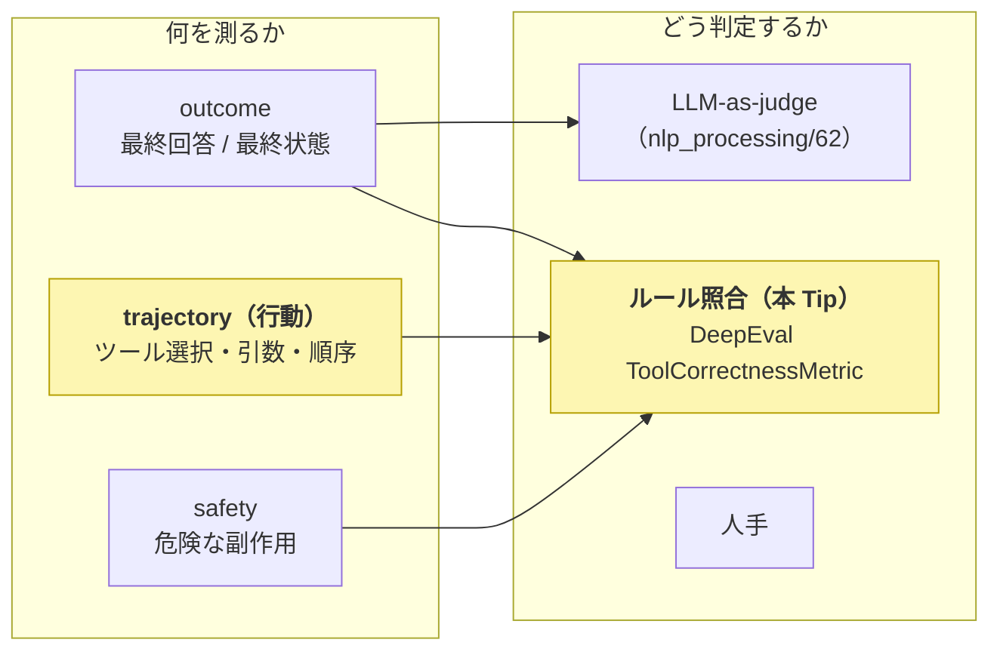
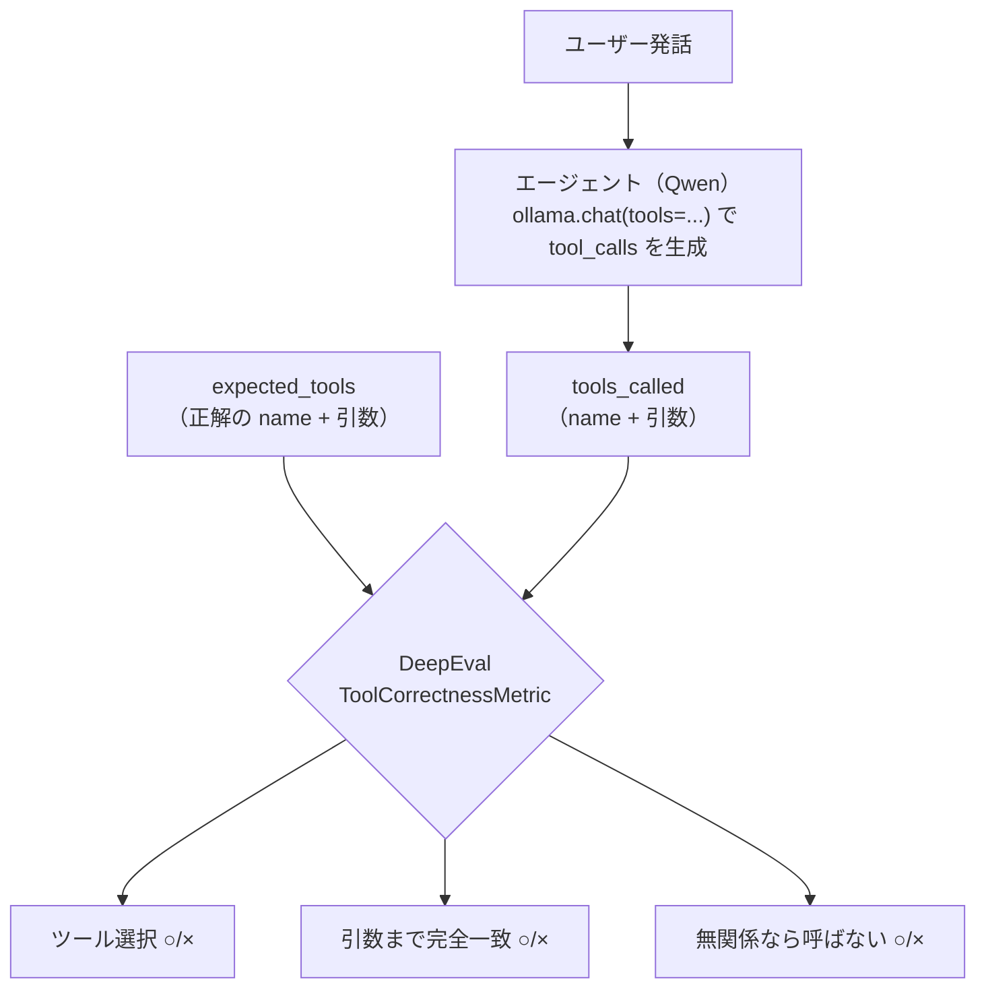

# DeepEval を使用して Ollama の Qwen のツール呼び出し（function calling）の正確性を BFCL 方式（AST 照合）で評価する

LLM 単体の評価は「入力 → 出力テキスト」の良し悪しで済む。しかし AI Agent はツールを呼び、API/shell を実行し、複数ステップで環境を変えるため、評価対象が「文字列」から「**環境に対する行動（action）**」へ拡張される。Agent 評価では「**正しいツールを・正しい引数で・正しい順序で呼んだか**」という action の正しさを測る必要があり、その最も軽量・自動化しやすい入口が **ツール呼び出し（function calling）の正確性評価** である。

ここでは、この関数呼び出し評価のデファクト標準である **[BFCL（Berkeley Function-Calling Leaderboard）](https://gorilla.cs.berkeley.edu/leaderboard.html)** の **AST（抽象構文木）照合**方式を、LLM 評価ライブラリ **[DeepEval](https://deepeval.com/) の `ToolCorrectnessMetric`** を使って、**GPU 不要・API キー不要でローカル実行できる最小の PoC** として [Ollama](https://ollama.com/) + Qwen3.5 で動かす。エージェント（Qwen）が出力した **`tools_called`（ツール名＋引数）を、正解の `expected_tools` と照合**して、ツール選択正答率・引数まで含めた完全一致正答率・無関係検出（呼ぶべきでない時に呼ばないか）を測る。

> **ポイント**: `ToolCorrectnessMetric` は **expected_tools（正解）と tools_called（実際の呼び出し）を決定論的に突き合わせる**評価メトリクスで、LLM-as-judge と違い judge LLM を使わない（バイアスが無く再現性が高い）。**ツール名のみ**の照合（既定）と、`evaluation_params=[ToolCallParams.INPUT_PARAMETERS]` ＋ `should_exact_match` で**引数まで含めた完全一致**の照合を切り替えられる。`should_consider_ordering` で順序まで見ることもできる。加えて **irrelevance（無関係）検出**＝ツールが不要な発話で誤ってツールを呼ばないか（正解・実際ともにツール呼び出し無し）も評価できる。

> **前提**: 直前の [nlp_processing/62](../62) は**自由形式テキストの出力品質**を LLM-as-judge（DeepEval `GEval`）で採点する「採点層」の Tip だった。本 Tip はその対になる **action（ツール呼び出し）評価**を、同じ DeepEval で judge を使わず**正解との決定論的な照合**で行う。両者は「テキスト品質 × 行動の正しさ」で相補的。DSPy 系の関連 Tip は [nlp_processing/58](../58)〜[nlp_processing/61](../61)、概要は [nlp_processing/60](../60)。`ReAct` でツール使用エージェントを作る [nlp_processing/59](../59) で作ったようなエージェントの「ツール選択の正しさ」を、本 Tip の評価で定量化できる。

## AI Agent 評価における action 評価の位置づけ

Agent の評価設計は「**何を測るか（評価対象）**」×「**どう判定するか**」で整理できる。最終回答（outcome）だけでは「たまたま正答でも途中で誤った API を叩いた」ケースを見逃すため、**行動軌跡（trajectory）＝どのツールをどう呼んだか**の評価が要る。本 Tip が扱う**ツール呼び出し精度**は、その trajectory 評価のうち最も軽量・客観的な軸。



代表的な「action 評価の型」と、本 Tip の位置づけ:

| 評価の型 | やり方 | 長所 | 短所 | 代表 |
|---|---|---|---|---|
| 状態ベース outcome | 終了時の環境状態を正解状態と差分比較 | action の実効果を直接測れる | 正解状態のアノテーションが重い | τ-bench, WebArena |
| 実行ベース outcome | action 結果を実行しテスト/判定器を通す | 「本当に動くか」を保証 | サンドボックス構築が重い・flaky | SWE-bench, BFCL(executable) |
| **関数呼び出し精度（本 Tip）** | **期待コールと AST 照合 / 実行可能性検証** | **軽量・大規模・自動化容易** | 単発寄り、文脈依存の正しさは測りにくい | **BFCL(Gorilla), ToolEval** |
| trajectory 過程評価 | ツール選択・引数・順序・進捗を逐次採点 | 失敗箇所の診断、部分点 | 採点ルール設計が難しい | AgentBoard, TRAJECT-Bench |
| 安全性評価 | 危険シナリオで unsafe action 率を測る | 不可逆 action のリスク定量化 | シナリオ網羅が困難 | Agent-SafetyBench |

## BFCL の AST 照合（実行せずに正しさを測る）

BFCL の評価には **AST 照合**（実行せず構文的に突き合わせる）と **executable 評価**（実際に関数を実行して結果を検証）の 2 系統がある。本 Tip は軽量な **AST 照合**を、DeepEval の `ToolCorrectnessMetric` で実装する。判定は次の 3 点を見る。

1. **ツール選択（function name）**: 予測したツール名が正解と一致するか（`ToolCorrectnessMetric` の既定の照合）。
1. **引数（arguments）**: 必須引数が揃い、各値が正解と一致するか（`evaluation_params=[ToolCallParams.INPUT_PARAMETERS]` ＋ `should_exact_match=True`）。
1. **無関係検出（irrelevance）**: ツールが不要な発話に対して、誤ってツールを呼んでいないか（`expected_tools` も `tools_called` も空なら正解）。



## 実装

エージェントが使えるツール（`get_weather` / `set_timer` / `send_email` / `search_flights`）を function-calling スキーマで定義し、各ユーザー発話に対する**正解のツール呼び出し**を用意する。Qwen3.5 が出した `tool_calls` を DeepEval の `ToolCorrectnessMetric` で正解と照合して正答率を測る。

1. Ollama をインストールして起動する

    [Ollama 公式サイト](https://ollama.com/)からインストールする。Ollama はローカルで LLM を動かす OSS ランタイムで、CPU だけでも LLM を動かせる。

    ```sh
    # macOS / Linux
    curl -fsSL https://ollama.com/install.sh | sh
    ```

1. ツール呼び出しに対応した Qwen3.5 モデルを取得する

    ツール呼び出し（function calling）には**ツール対応モデル**が必要。Qwen3.5 は対応している。引数抽出の安定性のため `qwen3.5:4b` を既定にする（CPU で動作）。

    ```sh
    ollama pull qwen3.5:4b
    ```

    > 2b ではツール選択や引数抽出を誤りやすいため、4b 以上を推奨する（[nlp_processing/59](../59) の ReAct でも同様）。

1. ライブラリをインストールする

    ```sh
    pip3 install -r requirements.txt   # deepeval（ToolCorrectnessMetric）+ ollama（Python クライアント）
    ```

1. ツール呼び出し評価のコードを作成する

    [`run_toolcall_eval.py`](run_toolcall_eval.py)

    主なポイントは以下の通り。

    - **`ollama.chat(..., tools=TOOLS)` でツールを渡す**と、対応モデルは `message.tool_calls` に「呼ぶべきツール名と引数」を返す。これを DeepEval の `ToolCall(name=..., input_parameters=...)` に変換して `tools_called` にする。`think=False`（CPU 高速化）・`temperature=0`（決定的）。

    - **照合は `ToolCorrectnessMetric`（決定論的）**。`LLMTestCase(tools_called=..., expected_tools=...)` を作り、`measure()` 後に `metric.score`（一致度 0.0〜1.0）を読む。**ツール名のみ**の照合と、**引数まで完全一致**（`evaluation_params=[ToolCallParams.INPUT_PARAMETERS]` ＋ `should_exact_match=True`）の 2 つを用意して、ツール選択と引数抽出を切り分ける。

    - **judge LLM を使わない**。`ToolCorrectnessMetric` のスコア計算は決定論的なので、`include_reason=False` にし `model` にローカルモデルを渡すだけで、採点に LLM を呼ばない（`model` は reason 生成時のみ使われる。OpenAI キー要求を避けるためにローカルモデルを渡す）。

    - **無関係（irrelevance）ケース**（`expected_tools=[]`）では、モデルが**ツールを呼ばない**（`tools_called=[]`）と score=1.0 になる。ツール不要の発話で無駄にツールを呼ぶ挙動を検出できる。

    ```python
    name_metric = ToolCorrectnessMetric(model=judge, include_reason=False)             # ツール名のみ
    args_metric = ToolCorrectnessMetric(model=judge, include_reason=False,             # 引数まで完全一致
        evaluation_params=[ToolCallParams.INPUT_PARAMETERS], should_exact_match=True)

    called = predict_tool_calls(model, query)             # ollama の tool_calls -> [ToolCall(...)]
    expected = [ToolCall(name="get_weather", input_parameters={"city": "東京"})]
    tc = LLMTestCase(input=query, actual_output="(tool call)", tools_called=called, expected_tools=expected)
    name_metric.measure(tc); args_metric.measure(tc)
    print(name_metric.score, args_metric.score)            # 1.0=一致 / 0.0=不一致
    ```

1. 実行する

    ```sh
    python3 run_toolcall_eval.py

    # 評価対象モデルを変える
    python3 run_toolcall_eval.py --model qwen3.5:9b
    ```

## 効果の検証（実機）

`qwen3.5:4b`（CPU）を評価対象に、7 ケース（関連 6 ＋ 無関係 1）で実行した結果。

```text
$ python3 run_toolcall_eval.py
=== ツール呼び出し精度評価（DeepEval ToolCorrectnessMetric / BFCL 方式 AST 照合）  model = qwen3.5:4b ===

Q: 東京の天気を教えて
  正解: get_weather{'city': '東京'}
  予測: ["get_weather{'city': '東京'}"]
  ツール選択: ○  / 引数まで完全一致: ○

Q: 300 秒のタイマーをセットして
  正解: set_timer{'seconds': 300}
  予測: ["set_timer{'seconds': 300}"]
  ツール選択: ○  / 引数まで完全一致: ○

Q: tanaka@example.com に件名「会議の件」でメールを送って
  正解: send_email{'to': 'tanaka@example.com', 'subject': '会議の件'}
  予測: ["send_email{'to': 'tanaka@example.com', 'subject': '会議の件'}"]
  ツール選択: ○  / 引数まで完全一致: ○

Q: 羽田から札幌へ、2026-07-01 の便を探して
  正解: search_flights{'origin': '羽田', 'destination': '札幌', 'date': '2026-07-01'}
  予測: ["search_flights{'origin': '羽田', 'destination': '札幌', 'date': '2026-07-01'}"]
  ツール選択: ○  / 引数まで完全一致: ○

Q: ありがとう、助かったよ
  [無関係] OK（呼ばない）

============================================================
ツール選択正答率: 6/6  (100%)
完全一致正答率（name+引数）: 6/6  (100%)
無関係検出（呼ばない）正答率: 1/1
→ ツール選択・引数抽出・無関係検出のどこで失敗するかが、action 評価の診断になる
```

`qwen3.5:4b` はこの単発タスク集ではツール選択・引数抽出・無関係検出をすべて正しく行えた（6/6・6/6・1/1）。重要なのは、**LLM-as-judge を使わずに、正解との決定論的な照合だけでツール呼び出しの正しさを定量化できる**点。`ToolCorrectnessMetric` は「ツール名は合うが引数を外す」「無関係な発話で無駄にツールを呼ぶ」ケースを score=0 として**失敗を切り分けられる**（例えば正解 `{'city':'東京'}` に対し `{'city':'大阪'}` を返すと、ツール選択○・引数完全一致×）。これが「最終回答だけでは見えない行動の正しさ」を測る最小実証になっている。

> 実行時間の目安（CPU・`qwen3.5:4b`）: 7 ケースで約 3〜4 分。ツール呼び出しの生成（`ollama.chat`）が大半で、`ToolCorrectnessMetric` の照合自体は決定論的で一瞬。

## 注意点・課題

- **単発・短軌跡に限定**: 本 Tip は「1 発話 → 1 ツール呼び出し」の単発評価（BFCL の simple/multiple 相当）。実運用では**複数ツールの並列呼び出し（parallel）・複数ステップ（multi-turn）・順序/依存の正しさ**まで評価する必要がある（`should_consider_ordering` や BFCL V4・TRAJECT-Bench が扱う領域）。

- **AST 照合は「正しいが別経路」を弾きうる**: 正解と違う引数表現でも実質正しいケース（例: 「羽田」と「HND」）を不一致と判定する。`should_exact_match` を緩める・許容値を設計する、あるいは executable 評価（実際に実行して結果を見る）との併用が要る。

- **モデルのツール対応に依存**: ツール呼び出しはモデルが function calling に対応している必要がある。非対応・小型モデルは引数を JSON に整形できず失敗しやすい。

- **action の実効果・安全性は別軸**: 「正しいツールを正しい引数で呼べた」ことと「実行して環境が正しい状態になった」「危険な副作用を出さなかった」は別問題。状態ベース評価（τ-bench 流）や安全性評価（Agent-SafetyBench 流の unsafe action 率）を独立軸として併用する必要がある。

## 参考サイト

- https://gorilla.cs.berkeley.edu/leaderboard.html （Berkeley Function-Calling Leaderboard / BFCL）
- https://github.com/ShishirPatil/gorilla （Gorilla / BFCL 実装）
- https://arxiv.org/abs/2305.15334 （Gorilla: Large Language Model Connected with Massive APIs）
- https://deepeval.com/docs/metrics-tool-correctness （DeepEval の Tool Correctness メトリクス）
- https://ollama.com/blog/tool-support （Ollama のツール呼び出し対応）
- https://github.com/ollama/ollama-python （Ollama の Python クライアント）
- https://ollama.com/library/qwen3.5 （Ollama の Qwen3.5 モデル）
