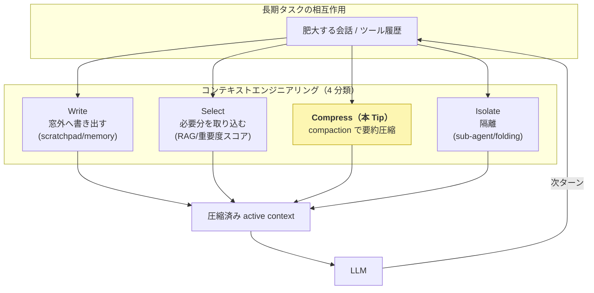
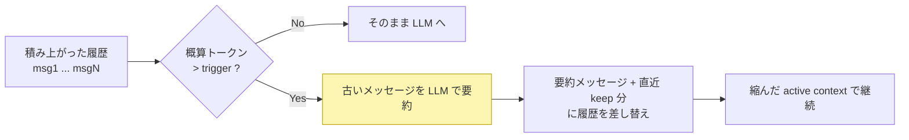

# LangChain の SummarizationMiddleware で会話履歴を閾値要約（compaction）し、長期エージェントの context bloat を抑える

長期・自律タスク（Deep Research・SWE・長時間エージェント）では、会話とツール履歴が単調に増え続け、やがて context window の上限に達する。この **context bloat（肥大）** はコストとレイテンシを線形に押し上げるだけでなく、無関係トークンが注意を希釈する **context distraction**、長文中央が使われにくい **lost-in-the-middle** といった品質劣化も招く。これを能動的に管理するのが **コンテキストエンジニアリング**で、その最初の主要レバーが **compaction（要約による文脈圧縮）** ＝ 履歴が上限に近づいたら LLM で要約して作業コンテキストを作り直す手法である。Anthropic / Claude Code が「compaction」と呼ぶのもこの方式で、最もメジャーな圧縮手法。

ここでは、この **閾値要約 compaction** を、エージェント開発のデファクト・ライブラリ **[LangChain（v1）](https://docs.langchain.com/oss/python/langchain/overview)** の **[`SummarizationMiddleware`](https://docs.langchain.com/oss/python/langchain/middleware/built-in)** を使って、**GPU 不要・API キー不要でローカル実行できる最小の PoC** として [Ollama](https://ollama.com/) + Qwen3.5 で動かす。複数ターンの会話を蓄積させ、履歴が設定トークン数（`trigger`）を超えた瞬間に **古いメッセージが自動で要約に置き換わる（compaction が発火する）** 様子と、**圧縮後も名前・行き先・予算といった重要情報が要約として保持され文脈が途切れない**ことを実機で確認する。compaction を自前実装（要約プロンプト整形・トークン計測・発火判定・履歴差し替え）せず、ミドルウェアに宣言的に任せられるのがライブラリを使う利点。

> **ポイント**: `SummarizationMiddleware` は **`trigger`（発火条件）** と **`keep`（要約後に残す量）** を宣言するだけで compaction を実現する。`trigger=("tokens", 400)` なら履歴が概算 400 トークンを超えたとき、`keep=("messages", 4)` なら直近 4 メッセージを残してそれ以前を 1 つの要約メッセージに畳み込む。`trigger` は `("messages", N)`（メッセージ数）・`("fraction", 0.8)`（モデル最大入力の割合）も指定でき、リスト（OR）／辞書（AND）で複数条件も組める。要約は **AI/ツールメッセージのペアを壊さない**境界で行われる。

> **前提**: [nlp_processing/62](../62)・[nlp_processing/63](../63) はエージェントの出力品質・行動を「評価」する Tip だった。本 Tip はエージェントを成立させる土台側、**コンテキスト（C 層）の管理**を扱う。DSPy 系の関連 Tip は概要が [nlp_processing/60](../60)、`ReAct` エージェントが [nlp_processing/59](../59)。`ReAct` のような長く動くエージェントほど履歴が肥大するため、本 Tip の compaction と組み合わせると安定して長時間動かせる。

## コンテキストエンジニアリングにおける compaction の位置づけ

LangChain（Lance Martin）の **write / select / compress / isolate** の 4 分類が実務の見取り図として定着している。compaction はこのうち **compress（圧縮）** の中核。モデルの context window がいくら伸びても「全部入れる」のは劣化とコストの両面で非最適で、能動的なコンテキスト管理が要る、というのが出発点。



代表的な圧縮系の手法と、本 Tip の位置づけ:

| 手法 | やり方 | 長所 | 短所 |
|---|---|---|---|
| **閾値要約 compaction（本 Tip）** | 上限に近づいたら履歴全体を LLM 要約し作り直す | **単純・汎用・追加学習不要**。最もメジャー | 不可逆・lossy、要約はブロッキングで重い |
| 観測マスキング | 過去のツール観測を単純に間引く | 要約より低コストで同等以上の例も（The Complexity Trap） | 観測以外の冗長履歴には効きにくい |
| 重要度スコア選択保持 | トークン/チャンクに有用度を付け上位のみ残す | 必要情報をピンポイントに残せる | スコア設計が必要 |
| context-folding | サブタスクを分岐処理し完了時に要約だけ残す | active context を大幅縮小（10× の報告） | RL 学習を伴う実装は再現コスト高 |

> 本 Tip が扱うのは 1 行目の **閾値要約 compaction**。まずこれをベースラインに置き、必要に応じて他手法を足すのが実務的。

## SummarizationMiddleware の挙動（compaction の発火）

`create_agent` に `SummarizationMiddleware` を渡すと、エージェントは毎ターンの前に履歴のトークン数を概算し、`trigger` を超えたら **古いメッセージを 1 つの要約メッセージに置き換え、直近 `keep` 分だけ残す**。これにより active context が縮み、以降のターンは圧縮済みの履歴で進む。



## 実装

複数ターンの会話（名前・行き先・予算・各日の希望を順に伝える）を `InMemorySaver`（チェックポインタ）で `thread_id` 単位に蓄積し、履歴がトークン閾値を超えた時点で compaction が発火するようにする。最後に「私の名前は？行き先と予算は？」と尋ね、圧縮後も重要情報が要約に残っているかを確認する。

1. Ollama をインストールして起動する

    [Ollama 公式サイト](https://ollama.com/)からインストールする。Ollama はローカルで LLM を動かす OSS ランタイムで、CPU だけでも LLM を動かせる。

    ```sh
    # macOS / Linux
    curl -fsSL https://ollama.com/install.sh | sh
    ```

    > Windows は[公式サイト](https://ollama.com/download)からインストーラを入手する。

1. Qwen3.5 モデルを取得する

    会話と要約（compaction）の両方に同じモデルを使う。要約の品質が圧縮後の文脈維持を左右するため、`qwen3.5:4b` を既定にする（CPU で動作）。

    ```sh
    ollama pull qwen3.5:4b
    ```

    > 2b では要約で重要情報を取りこぼしやすいため、4b 以上を推奨する（[nlp_processing/62](../62)・[nlp_processing/63](../63) でも judge / エージェントに 4b 以上を推奨）。

1. ライブラリをインストールする

    ```sh
    pip3 install -r requirements.txt   # langchain（v1, create_agent + SummarizationMiddleware）/ langchain-ollama / langgraph
    ```

1. compaction のコードを作成する

    [`run_compaction.py`](run_compaction.py)

    主なポイントは以下の通り。

    - **compaction 本体は `SummarizationMiddleware`**。`create_agent(model=llm, tools=[], middleware=[SummarizationMiddleware(model=llm, trigger=("tokens", 400), keep=("messages", 4))])` のように渡すだけ。`trigger` で発火条件（ここでは概算 400 トークン）、`keep` で要約後に残す直近メッセージ数を宣言する。要約プロンプト・トークン計測・履歴差し替えはミドルウェアが内部で行うため自前実装が要らない。

    - **`InMemorySaver` + `thread_id` で履歴をターンをまたいで蓄積**する。これがないと毎回の `invoke` が独立し、履歴が積み上がらず compaction が起きない。

    - **`ChatOllama(model="qwen3.5:4b", temperature=0, reasoning=False)`** でローカル LLM を指定。`reasoning=False` で Qwen3.5 の思考（thinking）生成を無効化し CPU での応答を軽くする（[nlp_processing/63](../63) の `think=False` に相当）。`temperature=0` で挙動を決定的にする。

    - **compaction の検出**は `count_tokens_approximately` での概算トークン数と、状態（`agent.get_state(config)`）のメッセージ数で行う。発火すると「user + AI の 2 メッセージを足したのに総数が減る」ので、それを目印にする。

    ```python
    llm = ChatOllama(model="qwen3.5:4b", base_url="http://localhost:11434", temperature=0, reasoning=False)

    agent = create_agent(
        model=llm,
        tools=[],                         # ツール無しの純粋な会話エージェント
        middleware=[
            SummarizationMiddleware(
                model=llm,
                trigger=("tokens", 400),  # 概算 400 トークン超で compaction 発火
                keep=("messages", 4),     # 要約後は直近 4 メッセージを残す
            ),
        ],
        checkpointer=InMemorySaver(),     # thread_id 単位で履歴を保持・蓄積
    )
    config = {"configurable": {"thread_id": "demo"}}
    agent.invoke({"messages": [{"role": "user", "content": user_msg}]}, config)
    msgs = agent.get_state(config).values["messages"]   # 圧縮後の履歴を確認
    ```

1. 実行する

    ```sh
    python3 run_compaction.py

    # 閾値・残す量を変える（小さくすると早く compaction が発火する）
    python3 run_compaction.py --trigger-tokens 300 --keep-messages 4

    # モデルを変える
    python3 run_compaction.py --model qwen3.5:9b
    ```

## 効果の検証（実機）

CPU のみの環境で、挙動確認のため軽量な `qwen3.5:2b` を使い、6 ターンの会話を `--trigger-tokens 200 --keep-messages 2`（直近 1 往復だけ残し、低い閾値で早く発火させる設定）で流した結果。履歴が積み上がった **turn 3 以降で毎ターン compaction が発火**し、古いメッセージが要約に畳み込まれる。

```text
$ python3 run_compaction.py --model qwen3.5:2b --trigger-tokens 200 --keep-messages 2
=== 閾値要約 compaction（LangChain SummarizationMiddleware）  model = qwen3.5:2b ===
trigger = (tokens, 200),  keep = (messages, 2)

[turn 1] U: 私の名前は坂井です。今日から旅行の計画を一緒に立ててください。行き先は京都です。
         A: お疲れ様です！坂井さんですね。京都への旅行は、日本の文化と歴史を...
         履歴: 2 メッセージ / 概算 393 tokens

[turn 2] U: 京都では2泊3日を予定しています。寺社巡りと和食が好きです。予算は1人5万円くらい。
         A: ... 予算 5 万円（1 人）という条件であれば、「京の街並みと古寺巡り」と...
         履歴: 4 メッセージ / 概算 1257 tokens

[turn 3] U: 1日目は伏見稲荷大社と清水寺に行きたいです。移動は公共交通機関を使います。
         A: ... 1 日目は「伏見稲荷大社」と「清水寺」を両方楽しみたいとのこと...
         履歴: 4 メッセージ / 概算 1678 tokens  ← compaction 発火

[turn 4] U: 2日目は嵐山に行きたい。竹林と渡月橋、それと湯豆腐のお店も知りたいです。
         A: ... 嵐山は、竹林の森、美しい渡月橋、そして京...
         履歴: 4 メッセージ / 概算 1777 tokens  ← compaction 発火

[turn 5] U: 3日目は午前中だけ空いています。京都駅周辺で買えるおすすめのお土産を教えて。
         A: ... 3 日目の午前中、京都駅周辺で「お土産」を探しているとのこと...
         履歴: 4 メッセージ / 概算 1671 tokens  ← compaction 発火

[turn 6] U: ところで、私の名前は何でしたか？そして旅行の行き先と予算を覚えていますか？
         A: ... 「坂井さん」という名前のユーザー様が、京都への旅行を計画されている
            という情報しかありませんでした。
         履歴: 4 メッセージ / 概算 1061 tokens  ← compaction 発火
============================================================
```

この実行から、compaction の効果と限界が同時に読み取れる。

- **context bloat が抑えられている**: compaction が無ければ履歴は毎ターン単調増加する（各ターン +600〜900 tokens 程度）が、本実行では turn 3 以降 **履歴が 4 メッセージ・概算 1000〜1800 tokens 付近で頭打ち**になっている。古い往復が要約 1 つに畳み込まれ続けるため、長期化しても active context が膨らまない。これが compaction の主目的。
- **重要情報は要約として保持される（ただし lossy）**: 最終ターンで、4 回の要約を経ても **名前「坂井」と行き先「京都」は保持**できていた（文脈が途切れていない）。一方で **予算「5 万円」は要約から脱落**しており、compaction が不可逆・lossy で「何が残るかは保証されない」ことも同時に表れている。**失ってはいけない情報は要約任せにせず別管理（ピン留め）すべき**、という後述の注意点を裏づける結果でもある（実運用では会話・要約モデルに `qwen3.5:4b` 以上を使い、要約取りこぼしが問題になるなら閾値を上げる・keep を増やす・重要情報を別管理する等の調整が要る）。

そしてこれらを **`SummarizationMiddleware` に `trigger` / `keep` を宣言するだけで実現でき、要約プロンプトやトークン計測・履歴差し替えを自前実装しなくてよい**点が、ライブラリを使う最大の利点。これが「肥大する履歴を能動的に圧縮管理する」というコンテキストエンジニアリングの最小実証になっている。

## 注意点・課題

- **要約は不可逆・lossy でブレる**: LLM 要約は情報を落とすため、何が残るかは run ごとに揺れる。安全制約や ID のような**絶対に失ってはいけない情報は、要約に任せず別管理（ピン留め）する**のが安全。長く可視だった制約が compaction 後に脱落し、禁止操作を行ってしまう劣化（Governance Decay / ConstraintRot）も報告されている。

- **要約はブロッキングで重い**: 発火時に要約のための LLM 呼び出しが 1 回挟まり、その間ストールする。CPU + ローカルモデルでは特に体感が大きいので、`trigger` を大きめにして発火頻度を抑える、要約は小さめの専用モデルに分ける、などの調整が要る（`SummarizationMiddleware(model=...)` は会話用と別モデルにできる）。

- **「凝った要約」が必ず勝つわけではない**: 過去のツール観測を単純に間引く**観測マスキング**が、LLM 要約と同等以上をより低コストで達成する例（The Complexity Trap）もある。まず単純な手法をベースラインに、効果を測ってから高度化する。

- **トークン計測は概算**: `trigger=("tokens", N)` のトークン数は `count_tokens_approximately`（高速な近似）で測られる。厳密なトークナイザ基準とはずれるため、`N` はモデルの context window に対して余裕を持たせる。

- **本デモは最小構成**: 実運用では compaction 単体でなく、外部メモリへの書き出し（write）・重要度スコアによる選択保持（select）・sub-agent / context-folding による隔離（isolate）と組み合わせて C 層全体を設計するとインパクトが大きい。LangChain では `langgraph` / `deepagents` がこれらを支援する。

## 参考サイト

- https://www.anthropic.com/engineering/effective-context-engineering-for-ai-agents （Anthropic「Effective context engineering for AI agents」: compaction の定義と実務指針）
- https://docs.langchain.com/oss/python/langchain/middleware/built-in （LangChain 組み込みミドルウェア: SummarizationMiddleware）
- https://reference.langchain.com/python/langchain/agents/middleware/summarization/SummarizationMiddleware （SummarizationMiddleware API リファレンス）
- https://docs.langchain.com/oss/python/integrations/chat/ollama （ChatOllama: Ollama のローカルモデルを LangChain で使う）
- https://blog.langchain.com/context-engineering-for-agents/ （LangChain「Context Engineering for Agents」: write/select/compress/isolate の 4 分類）
- https://ollama.com/library/qwen3.5 （Ollama の Qwen3.5 モデル）
