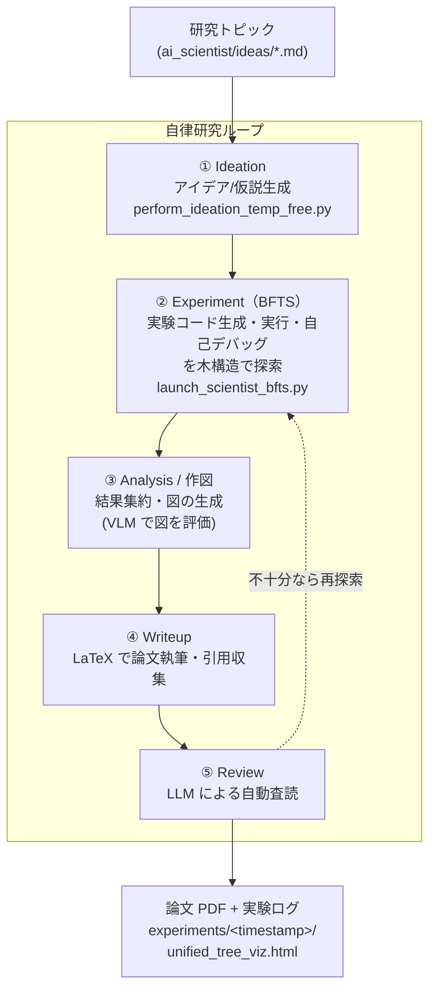

# Sakana AI の The AI Scientist-v2 を使用して、AI 研究開発のアイデア生成 → 実験（Agentic Tree Search）→ 論文執筆までを自律実行する

**自律研究 AI Agent（AI Scientist）** は、LLM エージェントに「アイデア生成 → 実験設計・コード生成・実行 → 結果分析 → 論文執筆 → 自動査読」という**研究プロセス全体**を自律実行させる枠組み。2024 年の Sakana AI「The AI Scientist」を起点に急拡大し、その後継 **[The AI Scientist-v2](https://github.com/SakanaAI/AI-Scientist-v2)**（arXiv:2504.08066）は、人手のテンプレートに依存せず **Agentic Tree Search（BFTS: Best-First Tree Search）** で実験を探索する汎用性を持ち、**全自動生成した論文が ICLR ワークショップの査読を（人間の平均採択閾値を超えて）初めて通過**した。

> **位置づけ（v2 は「最新・最高性能」ではなく「業界標準・ローカル実行できるデファクト」）**: v2 を対象に選んだのは*最も引用・star が多く、OSS で再現でき、ローカル Qwen 実行まで確認できる*から。**2026 年時点ではより新しい/高性能を主張するシステムも複数ある**：論文執筆型では **Kosmos**（FutureHouse, 2025-11、structured world model）や **EvoScientist**（「7 SOTA 超え」を主張）、アルゴリズム発見型では **AlphaEvolve**（Google, 2025、56 年ぶりの行列乗算アルゴリズム改善で性能は突出）。ただしこれらは**クローズド（AlphaEvolve は非公開）・クラウド/大規模 API 前提・OSS 未成熟**などで、「手元で無料・合法に動かして試す」という本 Tip の狙いには不向き。最高性能を追うなら AlphaEvolve 系（OSS 再現は [OpenEvolve](https://github.com/codelion/openevolve)）や Kosmos を、**まず自律研究の一連の流れを手元で体感する**なら本 Tip の v2 を、という使い分けになる。

## AI Scientist-v2 の全体像（自律研究ループ）

AI Scientist-v2 は、研究トピック（`.md`）を入力に、以下のループを自律実行して最終的に**論文 PDF**を生成する。実験フェーズでは **Agentic Tree Search（BFTS）** により「実装 → 実行 → デバッグ → 改善」のノードを木構造で探索する。



各工程のモデルは個別に指定できる（実験コード生成は `bfts_config.yaml` の `agent.code.model`、それ以外は CLI の `--model_*` 引数）。本 Tip では**すべてを同じモデルに揃える**前提で説明する。

## 対応モデルと指定方法（プレフィックス方式）

AI Scientist-v2 のモデル指定は**プレフィックス方式**で、**モデル文字列の先頭で呼び出し先バックエンドが切り替わる**（実装は [`ai_scientist/llm.py`](https://github.com/SakanaAI/AI-Scientist-v2/blob/main/ai_scientist/llm.py) の `create_client`）。例えば `ollama/qwen3:32b` と書けば `base_url="http://localhost:11434/v1"` の OpenAI 互換クライアントでローカル Ollama を叩き、`gemini-...` なら Google の OpenAI 互換エンドポイントを叩く。**手順中でモデル文字列を差し替えるだけでバックエンドが変わる**のがこの Tip の肝。

| プロバイダ | 環境変数 | モデル文字列の例 | 備考 |
|---|---|---|---|
| Claude（Anthropic 直） | `ANTHROPIC_API_KEY` | `claude-3-5-sonnet-20241022` | 従量課金・高品質。マルチモーダルで VLM も兼用可 |
| Claude Opus（Bedrock / Vertex） | `AWS_*` / GCP 認証 | `bedrock/anthropic.claude-3-opus-20240229-v1:0` | 従量課金。`pip install anthropic[bedrock]` が必要 |
| Gemini | `GEMINI_API_KEY` | `gemini-2.5-pro` / `gemini-3.1-pro-preview`（Gemini 3 系） | 従量課金（**無料枠あり**）。マルチモーダル。**LLM はクラウドなので GPU VRAM を節約できる** |
| OpenAI | `OPENAI_API_KEY` | `gpt-4o-2024-11-20` / `o1-preview-2024-09-12` | 従量課金 |
| ローカル LLM（Ollama / Qwen） | `OLLAMA_API_KEY`（ダミー可） | `ollama/qwen3:32b`（VLM は `ollama/qwen2.5vl:32b`） | **無料・API 不要**。ただし GPU VRAM が要る |

> **未登録タグは弾かれる**: `AVAILABLE_LLMS`（`llm.py` 内のハードコード一覧）に無いモデル文字列は argparse に弾かれる。**登録済みのタグをそのまま使う**のが安全で、別タグ（例: 最新 Opus `claude-opus-4-*`、最新 Gemini、`ollama/qwen3:1.7b` など）を使うには **`AVAILABLE_LLMS` へ 1 行追記**が必要（軽微なコード改変）。

> **VLM（図の視覚評価）工程に注意**: AI Scientist-v2 は生成した図を**視覚評価**する工程（`vlm_feedback`）を持つ。**Claude / Gemini はマルチモーダル**なのでテキスト工程と同じモデルで兼ねられるが、**ローカルの `qwen3`（テキスト専用）だけでは図の評価が機能しない**ため、そこには視覚対応の `ollama/qwen2.5vl:32b` を割り当てる。

## 実行手順

> **⚠️ サンドボックス必須**: AI Scientist-v2 は **LLM が生成したコードをそのまま実行する**。公式 README も *"There are various risks ... dangerous packages, uncontrolled web access, and the possibility of spawning unintended processes. Ensure that you run this within a controlled sandbox environment (e.g., a Docker container)."* と明記している。**必ず Docker 等の隔離環境・ネットワーク制限下で実行する**こと。

> **同梱ファイル**: 本 Tip ディレクトリに、コピーして使える [`my_research_topic.md`](my_research_topic.md)（研究トピック例）・[`bfts_config_qwen.yaml`](bfts_config_qwen.yaml)（ローカル Qwen 版の BFTS 設定例）・[`run_ai_scientist_qwen.sh`](run_ai_scientist_qwen.sh)（ローカル Qwen で手順 3〜5 を一括実行するラッパー）を用意している。Claude / Gemini で動かす場合は、これらのモデル文字列を下記の場合分けに従って差し替える。

1. 使うモデルを決める（**Claude の場合 / Gemini の場合 / ローカル LLM（Qwen など）の場合**）

    以下から 1 つ選び、API キー等を用意する。以降の手順では、テキスト工程用モデルを `TEXT_MODEL`、図の視覚評価（VLM）工程用モデルを `VLM_MODEL` として扱う（シェル変数にしておくと後続コマンドで使い回せる）。

    - **Claude の場合** — 従量課金・高品質

        ```sh
        export ANTHROPIC_API_KEY=...                    # anthropic SDK が参照
        export TEXT_MODEL=claude-3-5-sonnet-20241022
        export VLM_MODEL=claude-3-5-sonnet-20241022     # Claude はマルチモーダルなので VLM も兼用
        ```

        > **Opus を使う場合**: `AVAILABLE_LLMS` には **Bedrock / Vertex 経由の Opus のみ**登録されている（`bedrock/anthropic.claude-3-opus-20240229-v1:0` / `vertex_ai/claude-3-opus@20240229`）。Bedrock 経由なら `AWS_ACCESS_KEY_ID` / `AWS_SECRET_ACCESS_KEY` / `AWS_REGION_NAME` と `pip install anthropic[bedrock]` が必要。最新世代の Opus 名（`claude-opus-4-*` 等）は未登録なので `AVAILABLE_LLMS` への追記が必要。**コスト目安**（公式記載）: 実験フェーズ（Claude 3.5 Sonnet）$15〜20 ＋ writeup 約 $5 で 1 論文あたり概ね $15〜25。Opus はさらに割高。

    - **Gemini の場合** — 従量課金（無料枠あり）／LLM はクラウドなので GPU VRAM を節約できる

        ```sh
        export GEMINI_API_KEY=...                        # Google AI Studio で発行
        export TEXT_MODEL=gemini-2.5-pro                 # または gemini-3.1-pro-preview（Gemini 3 系）
        export VLM_MODEL=gemini-2.5-pro                  # Gemini もマルチモーダルなので VLM も兼用
        ```

        > **メリットと注意**: LLM が Google 側で動くため、**GPU は実験フェーズ（ML 学習）にのみ必要**になり、ローカル Qwen のような LLM 用 VRAM（20GB 級）が要らない。無料枠は軽い試行なら低コストだが、フル 1 サイクルの数百〜数千回呼び出しではレート制限で強く絞られるため本格運用は実質従量課金。**⚠️ `AVAILABLE_LLMS` に登録済みの Gemini 名（`gemini-2.0-flash` / `gemini-2.5-pro-preview-03-25`）は Google 側で既に提供終了（404）**なので、**現行 ID（`gemini-2.5-pro` / `gemini-2.5-flash` / `gemini-3.1-pro-preview` / `gemini-flash-latest` 等）を `AVAILABLE_LLMS` に 1 行追記して使う**（実機で 4 モデルの応答を確認済み。後述）。`gemini-3-pro-preview`（3.0 系 preview）も提供終了で、Gemini 3 系は後継の `gemini-3.1-pro-preview` を使う。

    - **ローカル LLM（Qwen など）の場合** — 無料・API 不要。ただし GPU VRAM が要る

        [Ollama](https://ollama.com/) を入れてモデルを pull し、ダミーの API キーを設定する。

        ```sh
        # macOS / Linux（Windows は https://ollama.com/download からインストーラを入手）
        curl -fsSL https://ollama.com/install.sh | sh

        ollama pull qwen3:32b        # 軽く試すなら qwen3:8b
        ollama pull qwen2.5vl:32b    # 図の視覚評価（VLM）用

        export OLLAMA_API_KEY=ollama            # llm.py が参照（ダミー値で可）
        export TEXT_MODEL=ollama/qwen3:32b
        export VLM_MODEL=ollama/qwen2.5vl:32b
        ```

        > **品質の注意**: v2 は本来 Claude / Gemini / OpenAI o1 等のフロンティアモデル前提のため、**ローカル Qwen（特に小型）だと完走率・品質が下がりやすい**。無料でパイプラインの挙動を体感する用途向けで、品質重視なら Claude / Gemini を選ぶ。

        > **VRAM 目安（4bit 量子化・概算）**: `qwen3:8b`≈6GB / `qwen3:32b`≈20〜24GB / `qwen2.5vl:32b`≈20GB+。**実験フェーズも GPU で ML 学習を回す**ため LLM と競合する。目安として、24GB 1 枚（RTX 3090/4090）で `qwen3:8b` + 小さめ実験の smoke test、`qwen3:32b` で品質を狙うなら 48GB 以上（A6000 等）が快適。`num_workers` を下げると並列実験の GPU 負荷を減らせる。`qwen3:235b`/`qwen3-coder:480b` はローカル非現実的。

1. AI Scientist-v2 をセットアップする

    ```sh
    git clone https://github.com/SakanaAI/AI-Scientist-v2.git
    cd AI-Scientist-v2

    conda create -n ai_scientist python=3.11
    conda activate ai_scientist

    # PyTorch（CUDA）
    conda install pytorch torchvision torchaudio pytorch-cuda=12.4 -c pytorch -c nvidia
    # 外部依存: PDF 処理（poppler）と LaTeX チェッカ（chktex）。論文 PDF 生成には別途 LaTeX（pdflatex）も必要
    conda install anaconda::poppler
    conda install conda-forge::chktex

    pip install -r requirements.txt
    ```

    > ローカル Qwen だけで回すなら `OPENAI_API_KEY` などの外部 API キーは不要。文献の新規性チェック精度を上げたい場合のみ、任意で Semantic Scholar の `S2_API_KEY` を設定する。

1. 研究トピックを用意して、アイデア生成（Ideation）を実行する

    `ai_scientist/ideas/` に研究トピックの Markdown（`# Title:` / `## Keywords` / `## TL;DR` / `## Abstract` の形式）を置き、`--model` に手順 1 で決めた `TEXT_MODEL` を渡す。出力は同名の `.json`（アイデア）。同梱の [`my_research_topic.md`](my_research_topic.md)（小規模・低コストな ML 実験を狙った例）をコピーして使える。**実際にこの入力で `gemini-2.5-pro` が生成したアイデアの出力例**を [`my_research_topic.json`](my_research_topic.json) として同梱している（継続学習の破滅的忘却を損失曲率で抑える新手法 CPR の提案。全文は後述の[動作確認](#動作確認実機検証)節も参照）。

    ```sh
    cp /path/to/tip/my_research_topic.md ai_scientist/ideas/my_research_topic.md
    python ai_scientist/perform_ideation_temp_free.py \
      --workshop-file "ai_scientist/ideas/my_research_topic.md" \
      --model "$TEXT_MODEL" \
      --max-num-generations 20 \
      --num-reflections 5
    ```

1. `bfts_config.yaml` の各工程モデルを、選んだモデルに書き換える

    実験フェーズのモデルは設定ファイル `bfts_config.yaml` で指定する（`launch_scientist_bfts.py` は**このパスを固定で読む**ため `--config` 引数は無い。書き換えて上書きする）。YAML はシェル変数を展開できないので、手順 1 で選んだバックエンドに応じて、以下のいずれかに**直接書き換える**（`vlm_feedback` だけは VLM 対応モデル）。

    - **Claude の場合**

        ```yaml
        agent:
          code:
            model: claude-3-5-sonnet-20241022
          feedback:
            model: claude-3-5-sonnet-20241022
          vlm_feedback:
            model: claude-3-5-sonnet-20241022   # Claude はマルチモーダルなので VLM も同じでよい
        report:
          model: claude-3-5-sonnet-20241022
        ```

    - **Gemini の場合**

        ```yaml
        agent:
          code:
            model: gemini-2.5-pro           # または gemini-3.1-pro-preview（Gemini 3 系）
          feedback:
            model: gemini-2.5-pro
          vlm_feedback:
            model: gemini-2.5-pro           # Gemini もマルチモーダルなので VLM も同じでよい
        report:
          model: gemini-2.5-pro
        ```

    - **ローカル LLM（Qwen など）の場合**

        ```yaml
        agent:
          code:
            model: ollama/qwen3:32b
          feedback:
            model: ollama/qwen3:32b
          vlm_feedback:
            model: ollama/qwen2.5vl:32b     # テキスト専用 qwen3 では図評価不可 → 視覚対応モデルにする
        report:
          model: ollama/qwen3:32b
        ```

        差し替え済みの [`bfts_config_qwen.yaml`](bfts_config_qwen.yaml) を `cp bfts_config_qwen.yaml bfts_config.yaml` で置き換えてもよい。

    > `num_workers` / `steps` / `num_seeds` / `max_debug_depth` / `debug_prob` / `num_drafts` などの探索パラメータも同じ `bfts_config.yaml` で調整する。

1. 実験（Agentic Tree Search）＋ 論文執筆を実行する

    アイデア JSON を渡し、`--model_*` 系をすべて `TEXT_MODEL` にして起動する。BFTS が実験を木構造で探索し、最後に論文 PDF まで生成する。**`--model_writeup_small` の既定は GPT-4o なので、これも指定しないと OpenAI を呼んでしまう**点に注意。

    ```sh
    python launch_scientist_bfts.py \
      --load_ideas "ai_scientist/ideas/my_research_topic.json" \
      --load_code \
      --add_dataset_ref \
      --model_writeup "$TEXT_MODEL" \
      --model_writeup_small "$TEXT_MODEL" \
      --model_citation "$TEXT_MODEL" \
      --model_review "$TEXT_MODEL" \
      --model_agg_plots "$TEXT_MODEL" \
      --num_cite_rounds 20
    ```

    実行結果は `experiments/<timestamp>/` に出力され、探索木の可視化 `unified_tree_viz.html` と最終論文 PDF が得られる。

## 動作確認（実機検証）

本 Tip の**中核メカニズム（AI Scientist-v2 が `ollama/qwen3:*` をローカル Ollama にルーティングして応答すること）**は、実機で検証済み（GPU なし・CPU のみの環境）。リポジトリを clone し、`ai_scientist.llm` の実関数を直接呼んで確認した。

```python
# AI-Scientist-v2 を clone し、OLLAMA_API_KEY=ollama を設定した状態で実行
from ai_scientist.llm import create_client, get_response_from_llm
client, model = create_client("ollama/qwen3:8b")
# -> "Using Ollama with model ollama/qwen3:8b."
#    client は openai.OpenAI, base_url = http://localhost:11434/v1/
text, _ = get_response_from_llm(
    prompt="Reply with exactly one word: WIRING_OK.",
    client=client, model=model, system_message="You are a terse assistant.", temperature=0.0,
)
# -> text == "WIRING_OK"（ローカル Qwen が AI Scientist-v2 本体の LLM レイヤ経由で応答）
```

- 確認できたこと: `create_client("ollama/...")` が `base_url=http://localhost:11434/v1` の OpenAI 互換クライアントを返し、`get_response_from_llm` がローカル Qwen から正しく応答を得る（＝ 手順の記述どおりモデル文字列だけでバックエンドが切り替わる）。`AVAILABLE_LLMS` に `ollama/qwen3:8b|32b|235b`・`ollama/qwen2.5vl:8b|32b`、および `gemini-2.5-pro-preview-03-25` 等・`claude-3-5-sonnet-...` 等が登録されていることも `main` の実物で確認。
- **Gemini でも実機検証（LLM レイヤ経由・現行モデル）**: 実 API キーで `create_client` + `get_response_from_llm` を通し、**`gemini-2.5-flash` / `gemini-2.5-pro` / `gemini-3.1-pro-preview`（Gemini 3 系）/ `gemini-flash-latest` の 4 モデルが正しく応答**することを確認（`gemini` を含む文字列は Google の OpenAI 互換エンドポイントに到達）。一方、**`AVAILABLE_LLMS` 登録済みの `gemini-2.0-flash` と `gemini-3-pro-preview` は Google 側で提供終了（404）**だった。さらに ideation を `gemini-2.5-pro` で回すと、**Gemini は高品質なアイデア（継続学習の忘却を損失曲率で抑える新手法など）を実際に生成した**が、**AI Scientist-v2 側のパーサ（GPT/Claude の出力形式前提）が Gemini の出力フォーマット（`ACTION:` の重複や JSON マーカーのズレ）を解析できず `Failed to parse` → `Stored 0 ideas`** になった。これは「本ツールが GPT/Claude の出力癖に合わせて作られている」ことの表れで、**Gemini/ローカルモデルでは finalize 部分でパーサ調整が要る場合がある**（LLM の応答自体は正常）。
- **ideation（手順 3）も CPU で実行できることを確認**（ただし品質は小型モデル依存）: CPU のみで `perform_ideation_temp_free.py --model ollama/qwen3:1.7b --max-num-generations 1 --num-reflections 1` を実行したところ、**Qwen は CPU 上でアイデア提案（"Risk Factors and Limitations" 等を含む構造化テキスト）を約 3 分で生成**した。一方で **`qwen3:1.7b` の出力が期待の JSON フォーマットに合わず `extract_json_between_markers` のパースに失敗 → `Stored 0 ideas`** となった。これは「**小型/ローカル Qwen だと完走率・品質が下がる**」という上の警告そのものの実例で、実運用ではより大きなモデル（`qwen3:32b` 等）や Claude / Gemini が要る。なお `ollama/qwen3:1.7b` は `AVAILABLE_LLMS` 未登録のため一度 argparse に弾かれ、**`AVAILABLE_LLMS` に 1 行追記**して通した（「一覧に無いタグは 1 行追記が必要」も実証）。
- **CPU での「フル完走」は非現実的**: `ideation → experiment(BFTS) → writeup` の**全工程を完走して論文 PDF まで出す**には GPU 環境が実質必須（Gemini/Claude のようにクラウド LLM を使う場合でも、experiment フェーズの ML 学習で GPU が要る）。理由は、(1) experiment フェーズが**実際に ML 学習コードを生成・実行**し、`num_workers × steps × 各 stage 12〜20 iters` で**数百〜数千回の LLM 呼び出し＋ ML 学習**を回すため、CPU の Qwen 速度では現実的な時間で終わらない（`qwen3:8b` では ideation 1 回すら長時間かかった）、(2) 大型 Qwen（32b 等）の CPU 推論も遅い、ため。**CPU は「配線・各工程が動くかの smoke test」までは可能**だが、**フル完走・品質評価には GPU が必要**。まず `qwen3:8b`〜`32b`（または Gemini/Claude）+ 小さめの探索設定で「一通り流れるか」を確認し、そこから品質を上げるのが現実的。

参考として、上記で **`gemini-2.5-pro` が実際に生成した研究提案の全文**を以下に示す（ツールのパーサには弾かれたが、内容自体はこのとおり生成されていた）。継続学習の破滅的忘却を、パラメータ拘束（EWC）でも現タスクの平坦化（SAM）でもなく「**過去タスクの損失曲率（ヘッシアンのトレース）の増加を罰する**」という新規メカニズムで抑える提案で、関連研究・実験計画・リスクまで具体的に詰められている。

<details>
<summary>Gemini（gemini-2.5-pro）が生成した研究提案「Don't Sharpen Your Past: Shaping the Loss Landscape to Mitigate Catastrophic Forgetting」（クリックで展開）</summary>

```json
{
  "Name": "landscape_shaping_for_continual_learning",
  "Title": "Don't Sharpen Your Past: Shaping the Loss Landscape to Mitigate Catastrophic Forgetting",
  "Short Hypothesis": "Catastrophic forgetting in continual learning is caused not just by parameter drift, but by the learning of new tasks increasing the sharpness (curvature) of the loss minima for old tasks. We hypothesize that by explicitly regularizing the model to maintain low curvature for previous tasks while learning a new one, we can preserve the accessibility of old solutions and significantly reduce forgetting. This is a novel mechanism-based approach, distinct from penalizing parameter changes (like EWC) or seeking flat minima for the current task (like SAM), as it directly targets the distortion of the old tasks' loss landscapes.",
  "Related Work": "Current approaches to continual learning (CL) primarily fall into three categories: rehearsal-based methods that store old data, architectural methods that assign different parameters to different tasks, and regularization-based methods. Our work belongs to the latter. The most related regularization methods are Elastic Weight Consolidation (EWC) and Sharpness-Aware Minimization (SAM). EWC approximates the loss curvature with the Fisher Information Matrix to penalize changes to 'important' weights for old tasks. However, it focuses on preventing parameter drift rather than preserving the landscape's shape. SAM and its variants seek flat minima to improve generalization, and have been applied to CL by finding solutions that are flat for the current task. Our proposal is fundamentally different: we do not regularize based on the current task's loss. Instead, while learning task T_k, we introduce a regularization term that explicitly penalizes an increase in the curvature (e.g., the trace of the Hessian) of the loss function for *previous* tasks T_1, ..., T_{k-1}. This directly addresses the hypothesis that learning new tasks 'sharpens' the minima of old ones, making them harder to find again.",
  "Abstract": "Catastrophic forgetting remains a central challenge in continual learning, where a model's performance on previously learned tasks degrades severely upon learning new ones. While existing methods often focus on restricting parameter updates or rehearsing old data, we investigate a more fundamental cause: the distortion of the loss landscape. We hypothesize that learning a new task warps the landscape by increasing the sharpness of the minima associated with previous tasks, effectively 'hiding' old solutions from the optimizer. To counteract this, we propose a novel and computationally efficient regularizer, Curvature-Preserving Regularization (CPR). During training on a new task, CPR penalizes any increase in the trace of the Hessian of the loss for a small, representative subset of data from past tasks. This encourages the model to find solutions for the new task that lie in regions where the landscape for old tasks remains flat. Unlike Sharpness-Aware Minimization (SAM), CPR targets the curvature of old tasks, not the current one. Unlike Elastic Weight Consolidation (EWC), it preserves the geometry of the solution space rather than freezing specific weights. We demonstrate through experiments on standard continual learning benchmarks like Split-MNIST and Split-CIFAR10 that this simple and direct approach to landscape shaping significantly mitigates forgetting and offers a new perspective on the stability-plasticity dilemma.",
  "Experiments": [
    {
      "name": "Validation on Split-MNIST",
      "description": "The primary experiment to validate the core hypothesis in a controlled setting. We will train a simple MLP on Split-MNIST, a standard CL benchmark where each task is to classify a pair of digits (0/1, 2/3, etc.).",
      "algorithmic_change": "When training on task T_k (for k>1), the loss function will be L_k(w) + lambda * Tr(Hessian(L_{k-1}(w))), where L_k is the cross-entropy loss for the current task and the Hessian is computed with respect to a small, fixed buffer of data from the previous task. The trace of the Hessian will be estimated efficiently using Hutchinson's method, which requires only a few Hessian-vector products.",
      "baselines": "Plain SGD (lower bound), Elastic Weight Consolidation (EWC), and Sharpness-Aware Minimization (SAM) applied to the current task's loss.",
      "metrics": "Average accuracy across all tasks after training is complete. We will also plot the accuracy on each previous task after each new task is learned to visualize the rate of forgetting."
    },
    {
      "name": "Generalization to Split-CIFAR10",
      "description": "To test if the findings generalize to more complex image data, we will repeat the experiment using a small CNN (e.g., a shallow ResNet) on the Split-CIFAR10 benchmark, where the 10 classes are split into 5 binary classification tasks.",
      "algorithmic_change": "Same as the Split-MNIST experiment: add the curvature-preserving regularizer to the standard training loss.",
      "baselines": "EWC, SAM.",
      "metrics": "Average accuracy across all tasks and forgetting rate."
    },
    {
      "name": "Analysis of the Loss Landscape",
      "description": "To directly verify that our method preserves flatter minima, we will visualize the loss landscape. After training on the final task, we will take the final model weights (w_final) and the weights saved after learning the first task (w_task1). We will then plot the loss for Task 1 along the linear interpolation between these two points: L_1(alpha*w_final + (1-alpha)*w_task1).",
      "algorithmic_change": "No algorithmic change, this is a post-hoc analysis.",
      "baselines": "We will generate these plots for our method and for the baselines.",
      "metrics": "Visual inspection of the plots. We expect the loss basin around w_task1 to be wider and less sharp for our method compared to baselines, indicating the minimum is better preserved."
    }
  ],
  "Risk Factors and Limitations": [
    {
      "risk": "Computational Cost: Although Hutchinson's method is efficient, computing Hessian-vector products still adds overhead to each training step. This might slow down training significantly.",
      "mitigation": "The regularization term can be applied intermittently (e.g., every few steps) instead of every step. We can also use a very small number of vectors for the stochastic trace estimation."
    },
    {
      "risk": "Hyperparameter Sensitivity: The method introduces a new hyperparameter, lambda, which balances the current task's loss with the curvature regularization. The method's performance might be highly sensitive to the choice of lambda.",
      "mitigation": "We will perform a sensitivity analysis on a small validation set to understand the impact of lambda."
    },
    {
      "risk": "Need for a Data Buffer: The proposed regularizer requires access to a small amount of data from previous tasks to compute the old loss and its curvature. This places it in the 'rehearsal-based' category, albeit with a very small buffer used in a novel way.",
      "mitigation": "This is an inherent limitation. We will be transparent about it and compare against other rehearsal-based methods that use a buffer of the same size for fairness. The novelty lies in *how* the buffer is used (for landscape shaping) rather than *that* it is used."
    }
  ]
}
```

</details>

## 注意点・課題

- **⚠️ Claude Code（Max プラン）のサブスク枠での実行は ToS 違反**: 「API 従量課金を避けたいなら、Claude Code の Max プラン枠を `meridian` 等のプロキシで API エンドポイント化し、AI Scientist から使えばよいのでは」という発想は**技術的には可能だが、利用規約違反**。Anthropic は **2026 年 2 月に「Free/Pro/Max の OAuth トークンを Claude Code / Claude.ai 以外のツール（Claude Agent SDK を含む）で使うのは Consumer 規約違反」と明文化**し、第三者ツールからのサブスク接続のブロックと違反アカウントの BAN を実運用している。AI Scientist は明白に「Claude Code 以外の自動ツール」なので、**Max 枠での常用は BAN リスクが現実的**。**サブスク枠を Claude Code 以外のパイプラインで使わないこと**。フロンティアモデルを使いたい場合は、上記の**正規の従量課金 API**（Anthropic / Bedrock / Vertex / Gemini / OpenAI）を使う。
- **サンドボックス必須（再掲）**: LLM 生成コードを実行するため、危険パッケージ・無制限 Web アクセス・意図しないプロセス生成のリスクがある。Docker 等の隔離環境＋ネットワーク制限下で動かす。
- **GPU・実行コストが重い**: 実験フェーズの ML 学習で GPU を使う（ローカル LLM の場合はさらに Qwen 推論用の VRAM も要る）。1 サイクルに数時間かかることもあり、他の軽量 Ollama Tip とは実行コストの桁が違う。
- **ローカル Qwen の品質限界**: 新規性の弱さや幻覚を含む実験結果、約半数の実験が失敗するといった課題は元論文の評価でも指摘されており、ローカルの小〜中規模モデルではさらに顕著になりうる。生成物は**そのまま鵜呑みにせず人間が検証**する前提で使う。
- **生成物の開示義務**: AI Scientist で生成した論文・成果物には、**AI を使用した旨を明示的に開示**することが求められる（元リポジトリのガイドライン）。

## 参考サイト

- https://github.com/SakanaAI/AI-Scientist-v2 （The AI Scientist-v2 リポジトリ）
- https://github.com/SakanaAI/AI-Scientist-v2/blob/main/ai_scientist/llm.py （対応モデル一覧 `AVAILABLE_LLMS` とプロバイダ振り分けの実装）
- https://github.com/SakanaAI/AI-Scientist-v2/blob/main/bfts_config.yaml （BFTS と各工程モデルの設定ファイル）
- https://huggingface.co/papers/2504.08066 （論文: The AI Scientist-v2, arXiv:2504.08066）
- https://github.com/SakanaAI/AI-Scientist （初代 The AI Scientist リポジトリ, arXiv:2408.06292）
- https://ollama.com/library/qwen3 （Ollama の Qwen3 モデル）
- https://ai.google.dev/gemini-api/docs/openai （Gemini の OpenAI 互換エンドポイント）
- https://www.theregister.com/2026/02/20/anthropic_clarifies_ban_third_party_claude_access/ （Anthropic による第三者ツールでのサブスク利用禁止の明文化）
