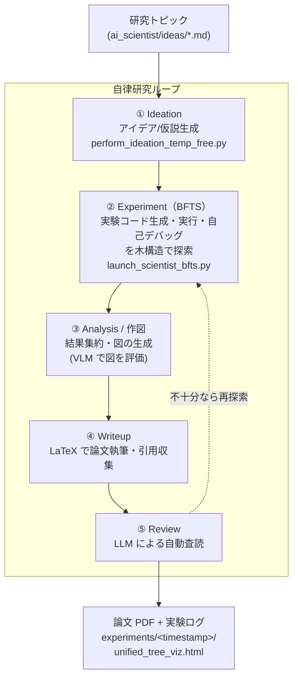

# Sakana AI の The AI Scientist-v2 を使用して、AI 研究開発のアイデア生成 → 実験（Agentic Tree Search）→ 論文執筆までを自律実行する

**自律研究 AI Agent（AI Scientist）** は、LLM エージェントに「アイデア生成 → 実験設計・コード生成・実行 → 結果分析 → 論文執筆 → 自動査読」という**研究プロセス全体**を自律実行させる枠組み。2024 年の Sakana AI「The AI Scientist」を起点に急拡大し、その後継 **[The AI Scientist-v2](https://github.com/SakanaAI/AI-Scientist-v2)**（arXiv:2504.08066）は、人手のテンプレートに依存せず **Agentic Tree Search（BFTS: Best-First Tree Search）** で実験を探索する汎用性を持ち、**全自動生成した論文が ICLR ワークショップの査読を（人間の平均採択閾値を超えて）初めて通過**した、この分野の事実上のデファクトになっている。

ここでは、この **AI Scientist-v2** を、**外部 API（OpenAI / Claude）を一切使わず、ローカルの [Ollama](https://ollama.com/) + Qwen だけで動かし、アイデア生成から実験・論文執筆までを API コスト $0 で回す**手順を示す。AI Scientist-v2 は公式 README には明記されていないが、**コード（[`ai_scientist/llm.py`](https://github.com/SakanaAI/AI-Scientist-v2/blob/main/ai_scientist/llm.py)）の対応モデル一覧 `AVAILABLE_LLMS` に `ollama/qwen3:*` 系が最初から登録済み**で、モデル名を `ollama/...` にするだけで OpenAI 互換エンドポイント（`http://localhost:11434/v1`）経由でローカル Qwen を呼ぶよう実装されている。これを使えば、従量課金なしで「完全自律研究エージェントを動かしてみる」ことができる。

> **位置づけ（v2 は「最新・最高性能」ではなく「業界標準・ローカル実行できるデファクト」）**: v2 を対象に選んだのは*最も引用・star が多く、OSS で再現でき、ローカル Qwen 実行まで確認できる*から。**2026 年時点ではより新しい/高性能を主張するシステムも複数ある**：論文執筆型では **Kosmos**（FutureHouse, 2025-11、structured world model）や **EvoScientist**（「7 SOTA 超え」を主張）、アルゴリズム発見型では **AlphaEvolve**（Google, 2025、56 年ぶりの行列乗算アルゴリズム改善で性能は突出）。ただしこれらは**クローズド（AlphaEvolve は非公開）・クラウド/大規模 API 前提・OSS 未成熟**などで、「ローカル Qwen で無料・合法に動かして試す」という本 Tip の狙いには不向き。最高性能を追うなら AlphaEvolve 系（OSS 再現は [OpenEvolve](https://github.com/codelion/openevolve)）や Kosmos を、**まず自律研究の一連の流れを手元で体感する**なら本 Tip の v2 を、という使い分けになる。

> **⚠️ モデルについての補足（重要）**: 本 Tip では **API 利用コストを $0 に抑えるためにローカル Qwen を使う**が、**AI Scientist-v2 は本来 Claude 3.5 Sonnet / OpenAI o1 などのフロンティアモデルを前提に設計**されている。コード自己デバッグ・査読・論文執筆といった重い工程では、**ローカル Qwen だと完走率・生成物の品質（実験の妥当性、論文としての完成度）が下がる可能性が高い**。**本気で品質を出したい場合は Claude（Opus / Sonnet 等）や OpenAI o1 系の最高モデルを使うのが望ましい**が、それらは従量課金（後述、1 論文あたり $15〜25＋Opus はさらに割高）になる。今回はあくまで「無料・合法にパイプラインを一通り動かして挙動を体感する」ことを目的に Qwen を採用している、という位置づけ。

## AI Scientist-v2 の全体像（自律研究ループ）

AI Scientist-v2 は、研究トピック（`.md`）を入力に、以下のループを自律実行して最終的に**論文 PDF**を生成する。実験フェーズでは **Agentic Tree Search（BFTS）** により「実装 → 実行 → デバッグ → 改善」のノードを木構造で探索する。



各工程のモデルは個別に指定できる（実験コード生成は `bfts_config.yaml` の `agent.code.model`、それ以外は CLI の `--model_*` 引数）。本 Tip では**すべてを `ollama/qwen3:*` に揃える**。

## ローカル Qwen で動く仕組み（`AVAILABLE_LLMS`）

`ai_scientist/llm.py` の対応モデル一覧には、以下の Qwen 系が**最初から登録されている**（2026-07 時点、`main` ブランチで確認）。この一覧に無いモデル文字列は弾かれるため、**登録済みのタグをそのまま使う**のが安全（別タグを使いたい場合は `AVAILABLE_LLMS` への 1 行追記が必要）。

| モデル文字列 | 用途の目安 |
|---|---|
| `ollama/qwen3:8b` | 軽量。まず動かす確認用（品質は限定的） |
| `ollama/qwen3:32b` | テキスト工程（コード生成・執筆・査読）の主力候補 |
| `ollama/qwen3:235b` | 高品質だがローカル実行は大規模環境が前提 |
| `ollama/qwen3-coder:70b` / `:480b` | コード生成特化（480b はローカル非現実的サイズ） |
| `ollama/qwen2.5vl:8b` / `:32b` | **VLM（図の視覚フィードバック）用**。図を評価する `vlm_feedback` に必要 |

> **VLM が別枠な点に注意**: AI Scientist-v2 は生成した図を**視覚評価**する工程（`vlm_feedback`）を持つ。テキスト専用の `qwen3` だけでは図の評価が機能しないため、そこには視覚対応の `ollama/qwen2.5vl:32b` を割り当てる。

## 実行手順

> **⚠️ サンドボックス必須**: AI Scientist-v2 は **LLM が生成したコードをそのまま実行する**。公式 README も *"There are various risks ... dangerous packages, uncontrolled web access, and the possibility of spawning unintended processes. Ensure that you run this within a controlled sandbox environment (e.g., a Docker container)."* と明記している。**必ず Docker 等の隔離環境・ネットワーク制限下で実行する**こと。

> **モデル指定の仕組み（プレフィックス方式）**: 以下の各手順で使う**モデル文字列の先頭で呼び出し先バックエンドが切り替わる**。`ollama/qwen3:32b` のように書くと `llm.py`（実物は [`create_client`](https://github.com/SakanaAI/AI-Scientist-v2/blob/main/ai_scientist/llm.py) 関数）が `base_url="http://localhost:11434/v1"` の OpenAI 互換クライアントを生成してローカル Ollama を叩く（API キーは `OLLAMA_API_KEY`、ダミー値で可）。同じ仕組みで `claude-3-5-sonnet-...`（Anthropic 直）・`bedrock/anthropic.claude-...`（AWS Bedrock）・`gpt-4o-...`（OpenAI）にも切り替わる。**手順中でモデル文字列を差し替えるだけでバックエンドが変わる**のがこの Tip の肝。

> **同梱ファイル**: 本 Tip ディレクトリに、コピーして使える [`my_research_topic.md`](my_research_topic.md)（研究トピック例）・[`bfts_config_qwen.yaml`](bfts_config_qwen.yaml)（Qwen 版の BFTS 設定）・[`run_ai_scientist_qwen.sh`](run_ai_scientist_qwen.sh)（手順 3〜5 を一括実行するラッパー）を用意している。以下は個別手順の説明だが、3 ファイルを clone した `AI-Scientist-v2/` 直下にコピーすれば `sh run_ai_scientist_qwen.sh` でまとめて実行できる。

1. Ollama をインストールして Qwen を取得する

    ローカルで LLM を動かす OSS ランタイム [Ollama](https://ollama.com/) を入れ、テキスト工程用と VLM 工程用のモデルを pull する。

    ```sh
    # macOS / Linux（Windows は https://ollama.com/download からインストーラを入手）
    curl -fsSL https://ollama.com/install.sh | sh

    # テキスト工程（コード生成・執筆・査読）用
    ollama pull qwen3:32b        # まず軽く試すなら qwen3:8b
    # 図の視覚フィードバック（VLM）用
    ollama pull qwen2.5vl:32b

    # llm.py が参照する API キー（ダミー値で可）
    export OLLAMA_API_KEY=ollama
    ```

    > `qwen3:32b`（4bit 量子化）で概ね 20GB 前後の VRAM が目安（正確な値は環境依存）。VRAM が足りなければ `qwen3:8b` / `qwen2.5vl:8b` に落とす。実験自体も GPU 上で ML 学習を回すため、**この Tip は GPU 環境が実質必須**（他の Ollama 系 Tip のように CPU だけでは完結しない）。

1. AI Scientist-v2 をセットアップする

    ```sh
    git clone https://github.com/SakanaAI/AI-Scientist-v2.git
    cd AI-Scientist-v2

    conda create -n ai_scientist python=3.11
    conda activate ai_scientist

    # PyTorch（CUDA）
    conda install pytorch torchvision torchaudio pytorch-cuda=12.4 -c pytorch -c nvidia
    # 外部依存: PDF 処理（poppler）と LaTeX チェッカ（chktex）。論文 PDF 生成には別途 LaTeX（pdflatex）も必要
    conda install anaconda::poppler
    conda install conda-forge::chktex

    pip install -r requirements.txt
    ```

    > ローカル Qwen だけで回すなら `OPENAI_API_KEY` などの外部 API キーは不要。文献の新規性チェック精度を上げたい場合のみ、任意で Semantic Scholar の `S2_API_KEY` を設定する。

1. 研究トピックを用意して、アイデア生成（Ideation）を Qwen で実行する

    `ai_scientist/ideas/` に研究トピックの Markdown（`# Title:` / `## Keywords` / `## TL;DR` / `## Abstract` の形式）を置き、`--model` を Qwen に指定して実行する。出力は同名の `.json`（アイデア）。同梱の [`my_research_topic.md`](my_research_topic.md)（小規模・低コストな ML 実験を狙った例）をコピーして使える。

    ```sh
    cp /path/to/tip/my_research_topic.md ai_scientist/ideas/my_research_topic.md
    python ai_scientist/perform_ideation_temp_free.py \
      --workshop-file "ai_scientist/ideas/my_research_topic.md" \
      --model ollama/qwen3:32b \
      --max-num-generations 20 \
      --num-reflections 5
    ```

1. `bfts_config.yaml` の各工程モデルを Qwen に書き換える

    実験フェーズのモデルは設定ファイル `bfts_config.yaml` で指定する（`launch_scientist_bfts.py` は**このパスを固定で読む**ため `--config` 引数は無い。書き換えて上書きする）。既定は Claude / GPT 系なので、以下のように **`ollama/...` へ差し替える**（`vlm_feedback` だけは視覚対応モデルにする）。同梱の [`bfts_config_qwen.yaml`](bfts_config_qwen.yaml) が差し替え済みなので、`cp bfts_config_qwen.yaml bfts_config.yaml` で置き換えてもよい。

    ```yaml
    # bfts_config.yaml（抜粋）
    agent:
      code:
        model: ollama/qwen3:32b          # 実験コード生成の中核
      feedback:
        model: ollama/qwen3:32b          # フィードバック/評価
      vlm_feedback:
        model: ollama/qwen2.5vl:32b      # 図の視覚評価（VLM）
    report:
      model: ollama/qwen3:32b            # レポート生成
    # num_workers / steps / num_seeds / max_debug_depth / debug_prob / num_drafts などの探索パラメータもここで調整
    ```

1. 実験（Agentic Tree Search）＋ 論文執筆を Qwen で実行する

    アイデア JSON を渡し、`--model_*` 系をすべて Qwen にして起動する。BFTS が実験を木構造で探索し、最後に論文 PDF まで生成する。**`--model_writeup_small` の既定は GPT-4o なので、これも指定しないと OpenAI を呼んでしまう**点に注意（完全ローカルにするなら Qwen を明示する）。

    ```sh
    python launch_scientist_bfts.py \
      --load_ideas "ai_scientist/ideas/my_research_topic.json" \
      --load_code \
      --add_dataset_ref \
      --model_writeup ollama/qwen3:32b \
      --model_writeup_small ollama/qwen3:32b \
      --model_citation ollama/qwen3:32b \
      --model_review ollama/qwen3:32b \
      --model_agg_plots ollama/qwen3:32b \
      --num_cite_rounds 20
    ```

    実行結果は `experiments/<timestamp>/` に出力され、探索木の可視化 `unified_tree_viz.html` と最終論文 PDF が得られる。

## 動作確認（実機検証）

本 Tip の**中核メカニズム（AI Scientist-v2 が `ollama/qwen3:*` をローカル Ollama にルーティングして応答すること）**は、実機で検証済み（GPU なし・CPU のみの環境）。リポジトリを clone し、`ai_scientist.llm` の実関数を直接呼んで確認した。

```python
# AI-Scientist-v2 を clone し、OLLAMA_API_KEY=ollama を設定した状態で実行
from ai_scientist.llm import create_client, get_response_from_llm
client, model = create_client("ollama/qwen3:8b")
# -> "Using Ollama with model ollama/qwen3:8b."
#    client は openai.OpenAI, base_url = http://localhost:11434/v1/
text, _ = get_response_from_llm(
    prompt="Reply with exactly one word: WIRING_OK.",
    client=client, model=model, system_message="You are a terse assistant.", temperature=0.0,
)
# -> text == "WIRING_OK"（ローカル Qwen が AI Scientist-v2 本体の LLM レイヤ経由で応答）
```

- 確認できたこと: `create_client("ollama/...")` が `base_url=http://localhost:11434/v1` の OpenAI 互換クライアントを返し、`get_response_from_llm` がローカル Qwen から正しく応答を得る（＝ README・手順の記述どおりモデル文字列だけでバックエンドが切り替わる）。`AVAILABLE_LLMS` に `ollama/qwen3:8b|32b|235b`・`ollama/qwen2.5vl:8b|32b` 等が登録されていることも `main` の実物で確認。
- **ideation（手順 3）も CPU で実行できることを確認**（ただし品質は小型モデル依存）: CPU のみで `perform_ideation_temp_free.py --model ollama/qwen3:1.7b --max-num-generations 1 --num-reflections 1` を実行したところ、**Qwen は CPU 上でアイデア提案（"Risk Factors and Limitations" 等を含む構造化テキスト）を約 3 分で生成**した。一方で **`qwen3:1.7b` の出力が期待の JSON フォーマットに合わず `extract_json_between_markers` のパースに失敗 → `Stored 0 ideas`** となった。これは「**小型/ローカル Qwen だと完走率・品質が下がる**」という上の警告そのものの実例で、実運用ではより大きなモデル（`qwen3:32b` 等）が要る。なお `ollama/qwen3:1.7b` は `AVAILABLE_LLMS` 未登録のため一度 argparse に弾かれ、**`AVAILABLE_LLMS` に 1 行追記**して通した（「一覧に無いタグは 1 行追記が必要」も実証）。
- **CPU での「フル完走」は非現実的**: `ideation → experiment(BFTS) → writeup` の**全工程を完走して論文 PDF まで出す**には GPU 環境が実質必須。理由は、(1) experiment フェーズが**実際に ML 学習コードを生成・実行**し、`num_workers × steps × 各 stage 12〜20 iters` で**数百〜数千回の LLM 呼び出し＋ ML 学習**を回すため、CPU の Qwen 速度では現実的な時間で終わらない（`qwen3:8b` では ideation 1 回すら長時間かかった）、(2) 大型 Qwen（32b 等）の CPU 推論も遅い、ため。**CPU は「配線・各工程が動くかの smoke test」までは可能**だが、**フル完走・品質評価には GPU が必要**。Qwen のサイズ・量子化や `bfts_config.yaml` の探索深さ（`max_debug_depth` 等）次第では途中失敗もありうるので、まず `qwen3:8b`〜`32b` + 小さめの探索設定で「一通り流れるか」を確認し、そこから品質を上げるのが現実的。

## 高品質に回したい場合（Claude / OpenAI の正規 API）

前述の通り、AI Scientist-v2 本来の品質を出すにはフロンティアモデルが望ましい。その場合は**モデル文字列を差し替えるだけ**でよい（従量課金は発生する）。

- **Claude（Anthropic 直）**: `claude-3-5-sonnet-20241022` 等。環境変数 `ANTHROPIC_API_KEY` を設定（anthropic SDK が参照）。
- **Claude Opus**: `AVAILABLE_LLMS` には **Bedrock / Vertex 経由の Opus のみ**登録されている（`bedrock/anthropic.claude-3-opus-20240229-v1:0` / `vertex_ai/claude-3-opus@20240229`）。Bedrock 経由なら `AWS_ACCESS_KEY_ID` / `AWS_SECRET_ACCESS_KEY` / `AWS_REGION_NAME` と `pip install anthropic[bedrock]` が必要。最新世代の Opus 名（`claude-opus-4-*` 等）は未登録なので、使うには `AVAILABLE_LLMS` への追記が必要。
- **コスト目安（公式記載）**: 実験フェーズ（Claude 3.5 Sonnet）$15〜20 ＋ writeup 約 $5 で、**1 論文あたり概ね $15〜25**。Opus を使うとさらに割高になる。

## 注意点・課題

- **⚠️ Claude Code（Max プラン）のサブスク枠での実行は ToS 違反**: 「API 従量課金を避けたいなら、Claude Code の Max プラン枠を `meridian` 等のプロキシで API エンドポイント化し、AI Scientist から使えばよいのでは」という発想は**技術的には可能だが、利用規約違反**。Anthropic は **2026 年 2 月に「Free/Pro/Max の OAuth トークンを Claude Code / Claude.ai 以外のツール（Claude Agent SDK を含む）で使うのは Consumer 規約違反」と明文化**し、第三者ツールからのサブスク接続のブロックと違反アカウントの BAN を実運用している。AI Scientist は明白に「Claude Code 以外の自動ツール」なので、**Max 枠での常用は BAN リスクが現実的**。**サブスク枠を Claude Code 以外のパイプラインで使わないこと**。フロンティアモデルを使いたい場合は、上記の**正規の従量課金 API**（Anthropic / Bedrock / Vertex / OpenAI）を使う。
- **サンドボックス必須（再掲）**: LLM 生成コードを実行するため、危険パッケージ・無制限 Web アクセス・意図しないプロセス生成のリスクがある。Docker 等の隔離環境＋ネットワーク制限下で動かす。
- **GPU・実行コストが重い**: Qwen（特に 32b 以上）のローカル推論と、実験フェーズの ML 学習の両方で GPU を使う。1 サイクルに数時間かかることもあり、他の軽量 Ollama Tip とは実行コストの桁が違う。
- **ローカル Qwen の品質限界**: 新規性の弱さや幻覚を含む実験結果、約半数の実験が失敗するといった課題は元論文の評価でも指摘されており、ローカルの小〜中規模モデルではさらに顕著になりうる。生成物は**そのまま鵜呑みにせず人間が検証**する前提で使う。
- **生成物の開示義務**: AI Scientist で生成した論文・成果物には、**AI を使用した旨を明示的に開示**することが求められる（元リポジトリのガイドライン）。

## 参考サイト

- https://github.com/SakanaAI/AI-Scientist-v2 （The AI Scientist-v2 リポジトリ）
- https://github.com/SakanaAI/AI-Scientist-v2/blob/main/ai_scientist/llm.py （対応モデル一覧 `AVAILABLE_LLMS` とプロバイダ振り分けの実装）
- https://github.com/SakanaAI/AI-Scientist-v2/blob/main/bfts_config.yaml （BFTS と各工程モデルの設定ファイル）
- https://huggingface.co/papers/2504.08066 （論文: The AI Scientist-v2, arXiv:2504.08066）
- https://github.com/SakanaAI/AI-Scientist （初代 The AI Scientist リポジトリ, arXiv:2408.06292）
- https://ollama.com/library/qwen3 （Ollama の Qwen3 モデル）
- https://www.theregister.com/2026/02/20/anthropic_clarifies_ban_third_party_claude_access/ （Anthropic による第三者ツールでのサブスク利用禁止の明文化）
