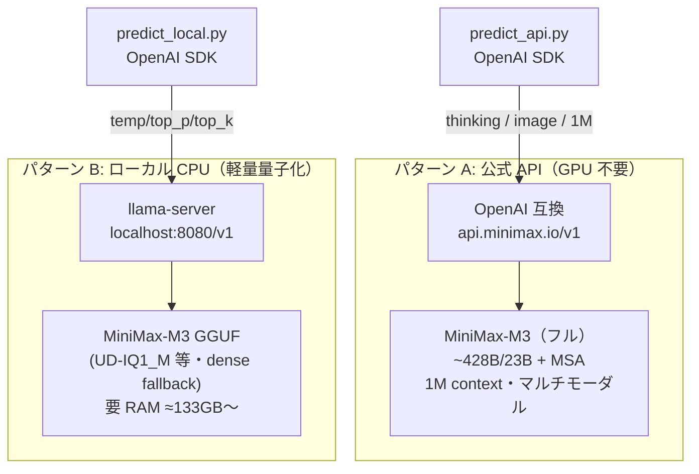

# MiniMax-M3（MiniMax Sparse Attention 搭載の 1M コンテキスト・マルチモーダル MoE）での推論を行なう

**[MiniMax-M3](https://huggingface.co/MiniMaxAI/MiniMax-M3)** は、**フロンティア級コーディング + 100万トークンコンテキスト + ネイティブ・マルチモーダル（テキスト/画像/動画）** を単一のオープンウェイトモデルで両立した MoE（**~428B 総 / ~23B active**、2026/6 公開）。その心臓部が **MiniMax Sparse Attention (MSA)**（arXiv:2606.13392）で、各 query が「軽量な Index Branch が選んだ Top-k=16 の KV ブロック（各 128 トークン、計 2,048 トークン）」だけに厳密な attention を行い、系列長に対する二次コストを回避する。これにより **1M コンテキストでも per-token 計算を平準化**でき、長文脈エージェント・リポジトリ規模のコード推論のコストを大きく下げる。

この Tip では、この M3 を動かす手順を **2 パターン**で示す。

- **パターン A: MiniMax 公式クラウド API 経由（OpenAI 互換）** — **ローカル GPU 不要**。最短で 1M コンテキスト・reasoning モード切替・マルチモーダルまで試せる。まず挙動を掴むならこれが最も現実的。→ [`predict_api.py`](predict_api.py)
- **パターン B: ローカルで軽量量子化版（GGUF）を CPU で動かす** — GPU 無しでオープンウェイトを手元実行。ただし **428B のため最小の 1-bit 量子化でも約 133GB の RAM が要る**。llama.cpp（MSA 未対応で dense fallback）で「まず動かす」検証用。→ [`predict_local.py`](predict_local.py) + [`run_llama_cpp_cpu.sh`](run_llama_cpp_cpu.sh)

> **なぜ MSA か（背景）**: エージェント的ワークフロー・永続メモリ・リポジトリ規模のコードは数十万〜数百万トークンを同時に attend する必要があるが、素の softmax attention は系列長 N に対して二次コストでデプロイ規模では持続不可能。MSA は「**softmax の表現力を保ったままスパース化**する」系統（cf. DeepSeek DSA, MoBA）で、前世代 MiniMax-01/M1 の「linear attention へ置換する Lightning Attention」路線からの**路線変更**にあたる。各 query は 1M 文脈でも固定 2,048 トークンだけを参照するため、per-token attention コストが O(N) → O(k·B_k) に落ちる。**MSA の効率化は公式 API / vLLM（GPU）で効く**が、後述の llama.cpp（CPU）版は MSA 未対応で dense attention にフォールバックする点に注意。

## 全体像（2 パターン）



どちらも OpenAI SDK で叩き、**`base_url` の差し替えだけ**で接続先が変わる（A=`api.minimax.io/v1` / B=`localhost:8080/v1`）。reasoning の指定方法だけが両者で異なる（後述）。

---

## パターン A: MiniMax 公式 API 経由で動かす（GPU 不要）

M3 は **OpenAI 互換 API** と **Anthropic 互換 API** の両方を提供する。ここでは OpenAI SDK で最短実装する。

| 項目 | 値 |
|---|---|
| OpenAI 互換 base URL | `https://api.minimax.io/v1` |
| Anthropic 互換 base URL | `https://api.minimax.io/anthropic` |
| モデル ID | `MiniMax-M3` |
| コンテキスト長 | 最大 1,000,000 トークン |
| 入力モダリティ | テキスト / 画像（JPEG, PNG, GIF, WEBP）/ 動画（MP4, AVI, MOV, MKV） |
| reasoning 切替 | `thinking` = `adaptive` / `disabled` / `enabled` |
| 料金（記事作成時点） | 入力 \$0.60 / 出力 \$2.40（per 1M トークン） |

> **料金・提供状況は変動する**: 上記は 2026-07 時点の値。最新の料金・レート制限は[公式ドキュメント](https://platform.minimax.io/docs/api-reference/api-overview)で確認する。

### reasoning（thinking）モードの切替（公式 API）

M3 は reasoning を出すかを `thinking` パラメータで 3 モード切り替えられる。OpenAI SDK には標準引数が無いため **`extra_body` で渡す**（値は文字列ではなく `{"type": "..."}` の**オブジェクト**）。

| モード | 指定 | 挙動 |
|---|---|---|
| adaptive | `{"type": "adaptive"}` | M3 が必要と判断したときだけ思考する（既定的な使い方） |
| disabled | `{"type": "disabled"}` | 思考せず即答。レイテンシ最小・スループット最大 |
| enabled | `{"type": "enabled"}` | 常に思考する |

> **reasoning の返り方**: `extra_body` に `"reasoning_split": True` を足すと、思考内容が `reasoning_content` として本文と分離して返る。省略時は思考内容が本文に `<think>...</think>` タグ付きで混ざる（本 Tip の `predict_api.py` は分離せず本文をそのまま表示する）。

### 手順（パターン A）

1. MiniMax の API キーを取得する

    [MiniMax 開発者プラットフォーム](https://platform.minimax.io/)にサインアップし、**[API Keys > Create new secret key](https://platform.minimax.io/user-center/basic-information/interface-key)** でシークレットキーを発行する。従量課金（pay-as-you-go）と定額（Token Plan）のどちらかを選ぶ。

    ```sh
    export MINIMAX_API_KEY=...   # predict_api.py が参照する（OPENAI_API_KEY でも可）
    ```

    <!-- TODO: API Keys 発行画面（platform.minimax.io/user-center/basic-information/interface-key）のスクショを貼るとわかりやすい。ログイン後画面のため自動取得不可 → GitHub コメントに画像を D&D して user-attachments URL を差し込む -->

1. 依存をインストールする

    ```sh
    pip install -r requirements.txt   # openai（OpenAI SDK。base_url を差し替えて MiniMax を叩く）
    ```

1. テキストで動かす（reasoning=adaptive）

    ```sh
    python predict_api.py --prompt "MiniMax Sparse Attention の Top-k ブロック選択を初学者向けに説明して。"
    ```

    実装のポイント（[`predict_api.py`](predict_api.py)）:

    - **`base_url="https://api.minimax.io/v1"` にした `OpenAI` クライアント**で `model="MiniMax-M3"` を叩くだけ。OpenAI SDK の書き方がそのまま使える。
    - **`thinking` は `extra_body={"thinking": {"type": ...}}` で渡す**（`--thinking adaptive|disabled|enabled`）。SDK 標準引数に無いパラメータを通すための OpenAI SDK 標準の作法。
    - **画像入力**は `content` を配列にし `image_url`（data URI）を混ぜる（`--image path`）。M3 はネイティブ・マルチモーダルなのでテキストと同じ呼び出しで画像を扱える。

    ```python
    client = OpenAI(api_key=api_key, base_url="https://api.minimax.io/v1")
    resp = client.chat.completions.create(
        model="MiniMax-M3",
        messages=[{"role": "user", "content": prompt}],
        extra_body={"thinking": {"type": "adaptive"}},
    )
    print(resp.choices[0].message.content)
    ```

1. reasoning を切り替える / ストリーミングする

    ```sh
    # 思考せず即答（レイテンシ最小）
    python predict_api.py --thinking disabled --prompt "1+1 は？"

    # 常に思考させる
    python predict_api.py --thinking enabled --prompt "3 人の容疑者から矛盾なく犯人を 1 人に絞って。"

    # ストリーミング出力
    python predict_api.py --stream --prompt "MSA と DeepSeek DSA の設計上の違いを表で。"
    ```

1. 画像を渡してマルチモーダルで動かす（任意）

    ```sh
    python predict_api.py --image ./sample.png --prompt "この画像を説明して。"
    ```

    JPEG / PNG / GIF / WEBP に対応（`predict_api.py` はローカル画像を base64 の data URI に変換して送る）。

---

## パターン B: ローカルで軽量量子化版（GGUF）を CPU で動かす

GPU 無しでオープンウェイト版を手元で動かすパターン。**MiniMax-M3 の GGUF は 2026/7 時点で llama.cpp 本体に未マージ**のため、対応 PR ブランチをビルドして使う。**MSA は llama.cpp 未対応で dense attention にフォールバック**するため、長文脈の効率化は効かない（＝「まず CPU で動かす」検証用）。

> **⚠️ 巨大メモリが要る**: M3 は 428B の MoE のため、**最小の 1-bit 量子化（UD-IQ1_M ≈ 128GB）でも動作に約 133GB の RAM が要る**（下表）。ノート PC 級では動かない。潤沢な RAM を積んだサーバー/ワークステーションが前提。MoE で active は ~23B なので、メモリに載りさえすれば CPU でもトークン生成自体は進む（速度は要検証）。

| GGUF 量子化タグ | ビット | ファイルサイズ | 目安 RAM |
|---|---|---|---|
| `UD-IQ1_M` | 1-bit | ≈128 GB | ≈133 GB |
| `UD-IQ3_XXS` | 3-bit | ≈159 GB | ≈165 GB＋ |
| `UD-IQ4_XS` | 4-bit | ≈208 GB | ≈214 GB＋ |
| `UD-Q4_K_XL` | 4-bit | ≈265 GB | ≈271 GB＋ |

> サイズは [`unsloth/MiniMax-M3-GGUF`](https://huggingface.co/unsloth/MiniMax-M3-GGUF)（Unsloth Dynamic 2.0 GGUF）の値（記事作成時点）。RAM 目安はファイルサイズ＋実行時オーバーヘッドの概算。

### 手順（パターン B）

1. 依存をインストールする（クライアント側）

    ```sh
    pip install -r requirements.txt   # openai（llama-server の OpenAI 互換エンドポイントを叩く）
    ```

1. llama.cpp（MiniMax-M3 対応ブランチ）を CPU 向けにビルドし、OpenAI 互換サーバーを起動する

    同梱の [`run_llama_cpp_cpu.sh`](run_llama_cpp_cpu.sh) が、対応 PR ブランチの clone → CPU ビルド（`-DGGML_CUDA=OFF`）→ `llama-server` 起動までを行う。初回は GGUF を自動ダウンロードする（数十〜数百 GB）。

    ```sh
    sh run_llama_cpp_cpu.sh
    # 量子化タグやポートは環境変数で変更可:
    # QUANT=unsloth/MiniMax-M3-GGUF:UD-IQ3_XXS PORT=8080 CTX=8192 sh run_llama_cpp_cpu.sh
    ```

    スクリプトの中身（要点）は次の通り。手動で実行する場合の参考にもなる。

    ```sh
    # MiniMax-M3 対応 PR ブランチをビルド（CPU 版）
    git clone https://github.com/ggml-org/llama.cpp
    cd llama.cpp
    git fetch origin pull/24523/head:minimax-m3
    git checkout minimax-m3
    cmake -B build -DGGML_CUDA=OFF
    cmake --build build --config Release -j --target llama-cli llama-server

    # OpenAI 互換サーバーを起動（-hf で GGUF を自動取得。Unsloth 推奨サンプリング）
    ./build/bin/llama-server -hf unsloth/MiniMax-M3-GGUF:UD-IQ1_M \
      --host 0.0.0.0 --port 8080 --ctx-size 8192 \
      --temp 1.0 --top-p 0.95 --top-k 40
    ```

    > CLI で単発推論するだけなら `llama-server` の代わりに `./build/bin/llama-cli -hf unsloth/MiniMax-M3-GGUF:UD-IQ1_M --temp 1.0 --top-p 0.95 --top-k 40` でもよい。本 Tip は `predict_local.py` から叩くため `llama-server`（OpenAI 互換）を起動する。

1. 起動したローカルサーバーに対して推論する

    別ターミナルで [`predict_local.py`](predict_local.py) を実行する。`base_url` が `http://localhost:8080/v1` を指すだけで、あとは OpenAI SDK の使い方は API 版と同じ。

    ```sh
    python predict_local.py --prompt "MiniMax Sparse Attention の Top-k ブロック選択を初学者向けに説明して。"

    # ストリーミング出力
    python predict_local.py --stream --prompt "再帰関数を初学者向けに説明して。"
    ```

    実装のポイント（[`predict_local.py`](predict_local.py)）:

    - **`base_url="http://localhost:8080/v1"` / `api_key="EMPTY"`（llama-server は既定で認証不要）**で叩く。`model` 文字列は llama-server 側で無視され、起動時にロードした GGUF が使われる。
    - **サンプリングは Unsloth 推奨の `temp=1.0 / top_p=0.95 / top_k=40`**。`top_k` は OpenAI SDK 標準引数に無いため `extra_body={"top_k": 40}` で渡す。
    - **reasoning の切替は公式 API 版とは仕組みが異なる**（llama.cpp の GGUF 版）ため、このローカル版では `thinking` を送らずモデル既定の思考挙動にしている。

    ```python
    client = OpenAI(api_key="EMPTY", base_url="http://localhost:8080/v1")
    resp = client.chat.completions.create(
        model="minimax-m3",
        messages=[{"role": "user", "content": prompt}],
        temperature=1.0, top_p=0.95, extra_body={"top_k": 40},
    )
    print(resp.choices[0].message.content)
    ```

> **もっと軽く試したいなら**: 428B の M3 は CPU でも重い。純粋に「ローカル LLM を CPU で動かす配線」を軽く試したいだけなら、本リポジトリの [nlp_processing/57](../57) 等の Ollama + Qwen 系 Tip（数 GB 級）の方が手軽。M3 の GGUF は「大容量 RAM のマシンでオープンウェイト M3 を手元実行する」用途向け。

### 動作確認（実機検証）

パターン B の**クライアント配線（`predict_local.py` が OpenAI 互換のローカルサーバーに接続し、`api_key="EMPTY"` / サンプリング（`temperature` / `top_p`）／`top_k` を `extra_body` で渡して応答をパースする）**を、CPU のみの環境で実機検証した。

> **⚠️ 実 M3 GGUF そのものは本検証環境では動かせない**: MiniMax-M3 GGUF は最小の `UD-IQ1_M` でも **約 133GB の RAM** が要る（本検証機は 29GB）。そこで「`predict_local.py` が OpenAI 互換ローカルサーバーと正しく喋れるか」の**配線検証**として、同じ OpenAI 互換エンドポイントを話す [Ollama](https://ollama.com/)（`http://localhost:11434/v1`）＋小型 Qwen をスタンドインに用いた。`predict_local.py` のコード経路（`base_url` 差し替え・`EMPTY` キー・`extra_body` の `top_k`・stream/非 stream のパース）は llama-server と同一なので、この配線は llama-server 相手でもそのまま成り立つ。

```sh
# 非ストリーミング（top_k を extra_body で送る配線の確認）
$ python predict_local.py --base-url http://localhost:11434/v1 --model qwen3:1.7b \
    --max-tokens 400 --prompt "再帰関数とは何か、1文で簡潔に。 /no_think"
再帰関数は、自身を呼び出すことで問題を小さな部分問題に分解し、ベースケースまで進化させる関数。

# ストリーミング（--stream, delta のパース確認）
$ python predict_local.py --stream --base-url http://localhost:11434/v1 --model qwen3:1.7b \
    --max-tokens 400 --prompt "HTTP の GET と POST の違いを1文で。 /no_think"
GET将参数附加在URL中，POST将数据放在请求体中。
```

- 確認できたこと: `OpenAI(api_key="EMPTY", base_url=".../v1")` でローカルサーバーに接続し、**`extra_body={"top_k": 40}` がエラーなく受理**され、**非ストリーミング／ストリーミングの両方で応答本文が正しく取得・パース**できた（＝ 手順どおり `base_url` を llama-server に向ければそのまま動く配線であることを実証）。
- 補足: スタンドインに使った Qwen3 系は reasoning（thinking）モデルのため、トークン枠が小さいと思考だけで枠を使い切り `content` が空になる（`reasoning` フィールドに出る）。上記は `/no_think` ＋十分な `--max-tokens` で最終応答本文を得ている。実際の M3 GGUF ではこの挙動は異なる。
- 未検証（本環境の制約）: **実 M3 GGUF のロード〜生成**（要 133GB RAM）と **llama.cpp の minimax-m3 ブランチの実ビルド**は未実施。これらは大容量 RAM のマシンで別途確認が必要。

---

## 参考: GPU で本格自ホストする場合の要件（vLLM / SGLang）

CPU の GGUF 版は dense fallback で MSA の旨味が出ない。**MSA を効かせて本格運用するなら GPU で vLLM / SGLang を使う**。以下は vLLM で自ホストする場合の GPU 要件の**概算**（context 長・KV キャッシュで変動）。

| 精度 | 重みの概算サイズ | 目安の GPU 構成 | 備考 |
|---|---|---|---|
| BF16（フル） | ~460 GB | 4×H200 (141GB) または 6×H100 (80GB) | 1M フル context には 4×H200 / 8×H100 級（KV キャッシュ分の上乗せ） |
| FP8 / MXFP8 | ~230 GB | 2×H200 または 4×H100 | 2×H200 で概ね 256K〜300K context 程度が快適 |
| NVFP4 / MXFP4（4bit） | ~115〜120 GB | 1×H200 または 2×H100 | AWQ-int4 も同等。単体 GPU に載せやすい最小構成 |
| GGUF（CPU / llama.cpp） | 128〜265 GB | CPU + 大容量 RAM（≈133GB〜）でも可（低速・MSA 非対応） | パターン B。GPU 無しで動かせるが実用速度は要検証 |

> **数値は概算**: 実際の必要 VRAM は context 長（KV キャッシュ）・並列数・実装で変わる。正確な要件は [vLLM Recipes（MiniMax-M3）](https://recipes.vllm.ai/MiniMaxAI/MiniMax-M3) や[公式のローカルデプロイガイド](https://platform.minimax.io/docs/guides/local-deploy)で確認する。

vLLM での起動コマンド例（MSA を効かせるため `--block-size 128` が必須。量子化版は対象を上記量子化リポジトリに差し替える）:

```sh
# vLLM（NVIDIA・8 GPU テンソル並列の例）
vllm serve MiniMaxAI/MiniMax-M3 \
  --tensor-parallel-size 8 \
  --block-size 128 \
  --tool-call-parser minimax_m3 \
  --reasoning-parser minimax_m3 \
  --enable-auto-tool-choice

# SGLang
python3 -m sglang.launch_server --model-path MiniMaxAI/MiniMax-M3 --host 0.0.0.0 --port 30000
```

> **vLLM 自ホスト時の reasoning 切替**: 公式 API の `thinking` とは異なり、リクエスト毎に `extra_body={"chat_template_kwargs": {"thinking_mode": "enabled"}}`（`enabled` / `disabled` / `adaptive`）で渡す。`predict_local.py` の `base_url` を vLLM サーバーに向け、`chat_template_kwargs` を足せば流用できる。

**量子化モデルは Hugging Face に多数存在する**（記事作成時点で 40 種類以上）。主なもの:

| 量子化 | リポジトリ | 用途 |
|---|---|---|
| NVFP4（4bit, NVIDIA） | [`nvidia/MiniMax-M3-NVFP4`](https://huggingface.co/nvidia/MiniMax-M3-NVFP4) | NVIDIA GPU 向け 4bit |
| MXFP8（8bit, 公式） | [`MiniMaxAI/MiniMax-M3-MXFP8`](https://huggingface.co/MiniMaxAI/MiniMax-M3-MXFP8) | 公式 8bit |
| MXFP4（AMD Instinct） | [`amd/MiniMax-M3-MXFP4`](https://huggingface.co/amd/MiniMax-M3-MXFP4) | AMD MI 系向け |
| AWQ-int4（vLLM） | [`spectator2026/MiniMax-M3-AWQ-int4`](https://huggingface.co/spectator2026/MiniMax-M3-AWQ-int4) | vLLM で int4 |
| GGUF（CPU / llama.cpp） | [`unsloth/MiniMax-M3-GGUF`](https://huggingface.co/unsloth/MiniMax-M3-GGUF) | パターン B（llama.cpp / LM Studio） |
| MLX（Apple Silicon） | [`pipenetwork/MiniMax-M3-MLX-8bit`](https://huggingface.co/pipenetwork/MiniMax-M3-MLX-8bit) | Mac（MLX） |

> **MSA カーネルのハード要件**: MSA の効率を最大化する公式カーネル（[github.com/MiniMax-AI/MSA](https://github.com/MiniMax-AI/MSA), MIT）は **NVIDIA SM100（Blackwell 世代）専用・CuTe-DSL/CUTLASS 前提**。SM100 以外の GPU でも動作はするが、MSA カーネルの旨味（prefill/decode の大幅高速化）を最大限得るには Blackwell が要る。自ホスト時のハード要件が高い一因。

## 注意点・課題

- **ライセンスは「完全な自由利用」ではない**: M3 本体は **MiniMax Community License（独自）**。非商用は自由だが、商用は「年商 \$20M 以下は通知／\$20M 超は事前書面許可／UI に "Built with MiniMax M3" 表示」等の条件がある。軍事利用・違法/差別コンテンツ生成は禁止。商用利用の可否は**法務確認が必要**（MSA カーネル単体は MIT）。cf. DeepSeek/Qwen 系は MIT・Apache で商用障壁が低い。
- **CPU（GGUF）版は MSA が効かない**: llama.cpp は MSA 未対応で dense attention にフォールバックするため、長文脈での効率化は得られない。長文脈を活かすなら公式 API か GPU の vLLM を使う。
- **ベンチの独立性に注意**: M3 のベンチは一部ベンダー自報告と独立集計で乖離がある（例: SWE-bench Verified は自報告 85.0% vs 独立集計 80.5%）。一方 SWE-bench Pro 59.0%（オープンウェイト首位級）は複数ソースで一致。**自報告値は割り引いて読む**。
- **1M コンテキストのコスト（API）**: MSA で per-token 計算は平準化されるが、**入力トークン課金は入力量に比例**する。1M 近い入力は当然高コスト・高レイテンシになる。長文脈を活かす場合もまず必要十分な文脈量で試す。
- **API 仕様・量子化状況は変わりうる**: M3 は 2026/6 公開の新モデルで、API パラメータ・料金・llama.cpp の対応状況（本体マージ）は更新されうる。最新は各公式ドキュメントで確認する。

## 参考サイト

- https://huggingface.co/MiniMaxAI/MiniMax-M3 （MiniMax-M3 モデルカード / ~428B・~23B active・thinking モード）
- https://arxiv.org/abs/2606.13392 （論文: MiniMax Sparse Attention）
- https://github.com/MiniMax-AI/MiniMax-M3 （M3 リポジトリ・利用ガイド）
- https://github.com/MiniMax-AI/MSA （MSA 推論カーネル, MIT / NVIDIA SM100 向け）
- https://platform.minimax.io/docs/api-reference/api-overview （MiniMax API 概要・エンドポイント）
- https://platform.minimax.io/docs/api-reference/text-openai-api （OpenAI 互換 API・thinking パラメータ）
- https://platform.minimax.io/user-center/basic-information/interface-key （API キー発行）
- https://unsloth.ai/docs/models/minimax-m3 （Unsloth: MiniMax-M3 GGUF をローカル/CPU で動かす手順・量子化サイズ）
- https://huggingface.co/unsloth/MiniMax-M3-GGUF （GGUF 量子化モデル）
- https://recipes.vllm.ai/MiniMaxAI/MiniMax-M3 （vLLM での自ホスト構成・GPU 要件・reasoning-parser）
- https://platform.minimax.io/docs/guides/local-deploy （公式ローカルデプロイガイド）
