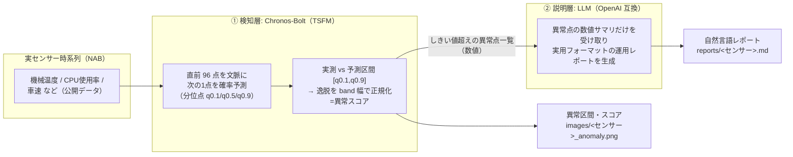

# 時系列基盤モデル（Chronos）＋ LLM の 2 段構成で、センサーデータの異常検知から自然言語レポート化までを行う

センサー時系列の異常検知に LLM を絡める 3 系統のうち、研究・産業界で**最もメジャーな系統 (c) TSFM + LLM の 2 段構成**を実際に動かす。数値時系列の扱いに弱い LLM の代わりに、**時系列基盤モデル（TSFM: Time Series Foundation Model）である [Chronos](https://github.com/amazon-science/chronos-forecasting)** が異常スコアリングを担い、**LLM は説明・レポート生成に専念**する、という役割分担が要点。「異常の検知」だけでなく「何が起きているかの自然言語説明・根本原因の仮説・推奨対応」までを、**実際の公開センサーデータ（[NAB](https://github.com/numenta/NAB)）**で一気通貫に動かせる最小コードで示す。CPU で動作（LLM は API 経由）。

> **⚠️ 系統 (c) の位置づけ**: **検知は数値に強い TSFM、説明は言語に強い LLM**という役割分担により、系統 (a)(b) が苦手とする「検知と説明の両立」を素直に実現できる。同型の 2 段構成は Datadog（Toto + Bits AI SRE）が **IT オブザーバビリティ領域**で商用稼働している実績もある。一方で、**TSFM は本来「予測」モデルで異常検知はその転用**であり、しきい値やコンテキスト長の調整が要る、物理センサーへの適用は研究段階、という留意点がある。
>
> **TSFM（時系列基盤モデル）とは**: 大量かつ多様なドメインの時系列で事前学習され、**追加学習なし（ゼロショット）で未知の時系列にも予測・異常検知を適用できる**、時系列版の基盤モデル。代表格が Amazon の Chronos（[論文](https://arxiv.org/abs/2403.07815) 被引用 850・TMLR）で、本 Tip では推論が高速な蒸留版 **Chronos-Bolt**（`amazon/chronos-bolt-base`, Apache-2.0）を使う。Chronos の事前学習コーパスには energy・weather・traffic・sensor など多様なドメインが含まれ、産業センサーの異常検知への適用例（ChronosAD, [arXiv:2606.01300](https://arxiv.org/abs/2606.01300)）もある。

## 📑 目次

- [アーキテクチャ](#-アーキテクチャ)
- [使用方法](#-使用方法)
- [実行結果](#-実行結果)
    - [① 検知（TSFM: Chronos-Bolt）](#-検知tsfm-chronos-bolt)
    - [② 検知結果から自然言語レポートを生成](#-検知結果から自然言語レポートを生成)
    - [③ 温度以外のセンサーでの動作](#-温度以外のセンサーでの動作同一パイプライン)
    - [④ レポート品質の評価（LLM-as-judge）](#-レポート品質の評価llm-as-judge)
    - [⑤ 3 系統の公正な精度比較（全 6 センサー）](#-3-系統の公正な精度比較全-6-センサー)
- [開発者向け情報](#-開発者向け情報)
- [参考サイト](#-参考サイト)

## 🏗️ アーキテクチャ

| 系統 | 仕組み | 代表手法 | 位置づけ |
|------|--------|---------|---------|
| (a) 数値直接入力（[69](https://github.com/Yagami360/ai-product-dev-tips/tree/master/nlp_processing/69)） | 数値系列をテキスト化して LLM に投入 | SigLLM / LLMAD / LLMTime | 最軽量だが LLM 単体は数値時系列に弱く、ICL/CoT の足場が無いと精度が出ない |
| (b) 画像化 → VLM（[70](https://github.com/Yagami360/ai-product-dev-tips/tree/master/nlp_processing/70)） | 折れ線グラフ画像を VLM に見せて検知＋説明 | TAMA / AnomLLM / ChatTS | 説明は自然に出るが季節性異常に弱い・画像化設計に敏感 |
| **(c) TSFM + LLM 2 段**（★本 Tip） | **TSFM で異常スコア → LLM が解釈・レポート化** | Chronos/TimesFM/TSPulse + LLM（商用: Datadog Toto + Bits AI SRE） | **検知は数値に強い TSFM、説明は言語に強い LLM と役割分担。商用実証あり** |

センサー時系列の異常検知に LLM を絡める 3 系統の中で、本 Tip が実装するのは系統 (c) の 2 段構成。



推論経路は次の 5 ステップ。

1. NAB のセンサー時系列（実データ）を読み込み、CPU 実行を軽くするため間引く（`--downsample`, 既定 6 = 5 分値を 30 分値に）。
2. 各時刻について、**直前 `W` 点だけを文脈として次の 1 点を Chronos で確率予測**し、分位点 `q0.1 / q0.5 / q0.9` を得る（`--context-length`, 既定 96。これを 1 点ずつずらしながら全体に適用する＝スライディング窓）。
3. 実測値が予測区間 `[q0.1, q0.9]` から逸脱した分を区間幅で正規化して**異常スコア**とし、**しきい値**（`--threshold`, 既定 1.5）超えを異常点とする。
4. 異常点だけの**数値サマリ**をシステムプロンプト（[`prompts.yaml`](prompts.yaml)）とともに LLM に渡し、運用向けの自然言語レポートを `reports/<センサー>.md` に生成する。
5. 検知結果と **NAB の既知異常区間ラベル**を重ねて可視化し、`images/<センサー>_anomaly.png` に保存する。

- **検知層と説明層の分離が要点**: **検知は追加学習なしの Chronos に任せ、LLM は「数値を当てる」のではなく「検知済みの異常を人間向けに言語化する」**ことに専念させる。**LLM に入力するのは「異常点の数値サマリ」だけ**で、生の時系列やプロット画像は渡さない（系統 (a) が数値系列そのものを、(b) がグラフ画像を渡すのと対照的）。TSFM が抽出した「事実」だけを言語化させることで、**幻覚を抑えつつトークンも小さく**できる。
- **異常スコアの式（予測残差ベース）**: 予測区間の外側に出た分を区間幅（band）で正規化する。`x_t > q0.9` なら `score = (x_t - q0.9) / (q0.9 - q0.1)`、`x_t < q0.1` なら `score = (q0.1 - x_t) / (q0.9 - q0.1)`、区間内なら `score = 0`。この「予測と実測の差（residual＝残差）を異常スコアにする」方式は、TSAD で標準的な手法カテゴリ **forecasting-based（予測ベース）anomaly detection** に該当する（サーベイでは forecasting / reconstruction / representation / hybrid に分類され、その筆頭。古典の ARIMA/Prophet から深層の LSTM/Transformer まで共通）。全対象点の文脈をミニバッチに分けて `predict_quantiles()` を呼ぶため、長い系列でも CPU でメモリを抑えて動く。
- **LLM に渡す数値サマリの中身**（`build_anomaly_summary`）: `系列長 / しきい値 / 検知された異常点数` と、逸脱スコア上位（既定 15 点）の各行（**時刻・実測値・期待中央値・期待区間 [q0.1,q0.9]・逸脱スコア**）。
- **レポートは実用フォーマットを強制**: 運用（オンコール/SRE）でそのまま一次対応に使えるよう、システムプロンプト（[`prompts.yaml`](prompts.yaml)）で **重要度・優先度でトリアージ**（サマリに重要度、アクションに P1/P2/P3）、**事実と推測の峻別**（検知した数値は事実、原因・対応は「仮説」と明記し確度を付す＝幻覚の抑制）、**アクション志向**（何を確認・切り分け・エスカレーションするか）／**限界の明示**（数値要約のみに基づく推定である旨）を指示している。出力構成は `## サマリ` → `## 検知イベント（重要度順）` → `## 根本原因の仮説（確度付き）` → `## 推奨アクション（優先度順）` → `## 補足・限界`。
- **説明層 LLM の選び方**: レポート品質はモデル性能に強く依存する（調査でも GPT-4 → GPT-3.5/Llama で F1 半減）。レポート生成は「数値エビデンスに忠実な構造化日本語生成」タスクなので、**フロンティアモデル（Google Gemini 3.x、Anthropic Claude、OpenAI GPT-4o 級）が最も高精度**。既定は **Gemini 3.5 Flash**（高品質・高速・低コスト）。ローカル小型モデル（Ollama + Qwen 等）は GPU/APIキー不要で手軽だが品質は劣り幻覚も出やすい（デモ・オンプレ完結向け）。
- **プロンプトは YAML で外部管理**: **コードから分離して外部ファイルに持つのは広く推奨される実践**で、YAML はその有力な選択肢（バージョン管理・レビューがしやすい、非エンジニアも編集できる、複数の名前付きプロンプトを構造管理できる）。ただし YAML が唯一解ではなく、`.md`/Jinja テンプレート、プロンプト管理サービス、DSPy の Signature 等も使われる。**「直書きせず外部化しバージョン管理する」ことが本質**。

> **⚠️ reasoning 系モデルの注意**: Gemini 3.x や Qwen3 等は「思考」でトークンを消費する。`--max-tokens` を小さく固定するとレポートが途中で切れるため、**既定では `--max-tokens` を送らず**プロバイダ側の上限まで生成させる。加えて `--reasoning-effort low` で思考量を抑えると本文が切れにくい（対応 API のみ）。

## 🚀 使用方法

パッケージ管理は [uv](https://docs.astral.sh/uv/)、実行は `make` で行う。

1. 依存を uv で仮想環境に同期する

    ```sh
    make install
    ```

1. API キーを設定する（`.env` は git 管理外）

    ```sh
    cp .env.sample .env    # .env に OPENAI_API_KEY=... を記入
    ```

    既定は Google Gemini（`gemini-3.5-flash`）。API キーは https://aistudio.google.com/apikey で取得できる。`BASE_URL` / `LLM_MODEL` を変えれば OpenAI 互換の任意プロバイダ（ローカル Ollama 含む）を使える。

1. 実センサーデータ（NAB）を取得する

    ```sh
    make download-nab-dataset                  # 全 6 センサー＋正解ラベルを datasets/nab へ
    make download-nab-dataset DOWNLOAD_KEY=cpu # 単体で取得
    ```

    `create_report.py` は初回実行時に自動ダウンロードするのでこの手順は必須ではないが、事前にまとめて取得しておきたいとき（オフライン実行の準備など）に使う。

1. 検知 → レポート生成を実行する

    ```sh
    make run                       # 既定=機械温度センサー
    make run NAB_KEY=cpu           # 別センサー（サーバ CPU 使用率）
    make run NAB_KEY=traffic-speed
    ```

    入力には、実世界のセンサー異常検知ベンチマーク **[NAB](https://github.com/numenta/NAB)** の公開データ（`timestamp,value` 形式・既知の異常区間ラベル付き）を使う。`NAB_KEY` で対象センサーを選ぶ（3 系統で共通）。

    | `NAB_KEY` | センサー | 内容 | データ数（生データ） | 入力波形例（<span style="color:#ff7f0e">■</span> 帯＝既知異常区間） |
    |---|---|---|---|---|
    | `machine-temp`（既定） | 産業機械の温度 | 実機の温度センサー。既知の故障あり | 22,695 |  |
    | `ambient-temp` | 室温 | 室温センサー。故障イベントあり | 7,267 |  |
    | `cpu` | サーバ CPU 使用率 | AWS EC2 の CPU 使用率メトリクス | 4,032 |  |
    | `traffic-speed` | 道路の車速 | 交通センサーの速度（渋滞・異常で急落） | 1,127 |  |
    | `traffic-occupancy` | 道路の占有率 | 交通センサーの占有率 | 2,380 |  |
    | `network` | サーバ受信ネットワーク量 | EC2 の network-in メトリクス | 4,730 |  |

    検知結果の図を `images/<センサー>_anomaly.png` に、自然言語レポートを `reports/<センサー>.md` に出力する。`--input <csv>`（ヘッダなし・数値のみの 1 変量 CSV）で、自前のセンサーデータも使える。

1. 生成レポートを LLM-as-judge で品質評価する（任意）

    ```sh
    make evaluate NAB_KEY=machine-temp
    ```

    別の LLM を審査員に、忠実性・有用性・可読性・フォーマット準拠を 1〜5 で採点する（[`evaluate_report.py`](evaluate_report.py)）。

## 📊 実行結果

### ① 検知（TSFM: Chronos-Bolt）

NAB の産業機械温度センサー（実データ, 既定の `--downsample 6` で 30 分間隔に間引き 3,783 点, 既知異常区間 4 個）に対し、予測区間からの逸脱を異常として検知する。青線=センサー値、淡い青帯=Chronos の予測区間 `[q0.1, q0.9]`、**オレンジ帯=NAB の既知異常区間（正解ラベル）**、赤点=検知された異常点。故障時（2 月上旬）の大きな逸脱やレベル変化の遷移点が検知され、複数が正解ラベル区間と重なっている。


### ② 検知結果から自然言語レポートを生成

検知結果を LLM に渡すと、`reports/machine-temp.md` に次のような運用レポートが生成される（**Gemini 3.5 Flash** の実出力の抜粋）。

```text
## サマリ
- 重要度: 高（最大逸脱スコア 9.36 を含む、スコア 3.0 以上の深刻な逸脱が複数発生しているため）
- 検知件数と対象時間帯: 2013-12-09 から 2014-02-09 の期間で計 14 件の異常点を検知。

## 検知イベント（重要度順）
1. 2014-02-09 12:15:00 / 実測=74.70 / 期待区間=[28.31, 32.79] / 逸脱スコア=9.36 / 種別: 急激な温度上昇
2. 2014-02-03 12:15:00 / 実測=82.77 / 期待区間=[36.27, 44.19] / 逸脱スコア=4.87 / 種別: 急激な温度上昇
   …（全 14 件）

## 根本原因の仮説（確度付き）
- [確度: 中] 冷却システムの機能不全または一時的な過負荷による異常発熱
  - 根拠: 2014-02-09 / 02-03 で期待中央値（30〜40）を 40℃以上上回る高温を記録しているため。
- [確度: 低] センサー自体の故障またはキャリブレーション不良

## 推奨アクション（優先度順）
- [P1] 物理的な温度・冷却状態の確認（最大スコア時刻前後の冷却系統の現地確認）
- [P2] 稼働ログ・エラー履歴の調査（スコア 3.0 超の時間帯）
- [P3] センサーの健全性確認

## 補足・限界
本レポートは数値要約のみに基づく推定です。実機ログ・現場確認と併せて判断してください。
```

### ③ 温度以外のセンサーでの動作（同一パイプライン）

`make run NAB_KEY=...` を変えるだけで、温度以外のセンサーでも動く（各センサーの plot と `reports/<センサー>.md` を生成）。

**しきい値はセンサーごとに既定値を持たせている**（[`Makefile`](Makefile) の `THRESHOLD_<センサー>`）。異常スコアは予測区間幅で正規化しているが、それでも**スコアの出方はセンサーで桁違い**（実測のスコア最大値は ambient-temp が 1.22、network が 660）。一律 1.5 だと ambient-temp / traffic-occupancy は**検知 0 件**になるため、下表の値を既定にしている。

| センサー | 既定しきい値 | 検知数 | 検知の例（実測） | 図 / レポート |
|---|---|---|---|---|
| 産業機械の温度（`machine-temp`） | 1.5 | 14 | 実測=74.70 / 期待中央=30.55 / スコア=9.36 | [図](images/machine-temp_anomaly.png) / [report](reports/machine-temp.md) |
| 室温（`ambient-temp`） | **0.8** | 8 | 実測=69.52 / 期待中央=63.90 / スコア=1.22 | [図](images/ambient-temp_anomaly.png) / [report](reports/ambient-temp.md) |
| サーバ CPU 使用率（`cpu`） | **0.5** | 4 | 実測=68.09 / 期待中央=40.64 / スコア=2.40 | [図](images/cpu_anomaly.png) / [report](reports/cpu.md) |
| 道路の車速（`traffic-speed`） | 1.5 | 5 | 実測=33.00 / 期待中央=65.67 / スコア=2.87 | [図](images/traffic-speed_anomaly.png) / [report](reports/traffic-speed.md) |
| 道路の占有率（`traffic-occupancy`） | **0.6** | 5 | 実測=19.17 / 期待中央=2.48 / スコア=1.15 | [図](images/traffic-occupancy_anomaly.png) / [report](reports/traffic-occupancy.md) |
| サーバ受信ネットワーク量（`network`） | 1.5 | 46 | 実測=2,928,310 / 期待中央=199.70 / スコア=**660.37** | [図](images/network_anomaly.png) / [report](reports/network.md) |

 

**しきい値が要調整であることは本方式の実務上の弱点**。`network` のようにスコアが 660 に達するセンサーと、`ambient-temp` のように 1.22 止まりのセンサーが混在するため、**一律のしきい値では運用できない**。

### ④ レポート品質の評価（LLM-as-judge）

`make evaluate` は、生成レポートを **LLM-as-judge**（別の LLM を審査員に）で採点する（[`evaluate_report.py`](evaluate_report.py)）。

採点ロジックは次のとおり。**審査員には「検知結果（数値の事実）」と「その数値から生成されたレポート」の両方を渡し、前者を根拠に後者を採点させる**（レポート単体を読ませるのではなく、事実と突き合わせられるようにするのが要点）。

1. `reports/<センサー>.md` から、**検知結果（数値サマリ）**と**自然言語レポート**の 2 つを切り出す（`parse_report_file`）。
2. 審査員プロンプト（[`prompts.yaml`](prompts.yaml) の `judge_system` / `judge_user_template`）でこの 2 つを渡し、**4 観点を各 1〜5 の整数**で採点させる。ブレを抑えるため `temperature=0.0` で呼ぶ。
3. 出力は **JSON のみ**を強制（`{"faithfulness":…, "usefulness":…, "readability":…, "format_compliance":…, "overall":…, "comment":…}`）し、コードフェンスを除去して `json.loads` でパースする。

| 観点 | 何を見るか |
|---|---|
| **忠実性**（`faithfulness`, 最重要） | 記述が検知結果の数値と整合し、**与えられていない数値や事実を捏造していないか**。原因を断定せず「仮説」として扱えているか |
| **有用性**（`usefulness`） | オンコール担当がそのまま一次対応に使えるか（重要度付け・原因仮説の妥当性・アクションの具体性と優先度） |
| **可読性**（`readability`） | 構造が明快で簡潔に読めるか |
| **フォーマット準拠**（`format_compliance`） | サマリ / 検知イベント / 根本原因の仮説 / 推奨アクション / 補足・限界 の構成に従えているか |

Gemini 3.5 Flash を審査員にした結果:

| センサー | 忠実性 | 有用性 | 可読性 | 準拠 | 総合 |
|---|---|---|---|---|---|
| machine-temp | 5 | 5 | 5 | 5 | **5.0** |
| ambient-temp | 5 | 5 | 5 | 5 | **5.0** |
| cpu | 5 | 5 | 5 | 5 | **5.0** |
| traffic-speed | 5 | 5 | 5 | 5 | **5.0** |
| traffic-occupancy | 5 | 5 | 5 | 5 | **5.0** |
| network | 5 | 5 | 5 | 5 | **5.0** |
| **平均** | **5.0** | **5.0** | **5.0** | **5.0** | **5.00** |

**全 6 センサーで満点**（`temperature=0.0`）。同じ審査基準・同じ LLM（`gemini-3.5-flash`）で、系統 (a)（[69](https://github.com/Yagami360/ai-product-dev-tips/tree/master/nlp_processing/69)）は平均 4.63、系統 (b)（[70](https://github.com/Yagami360/ai-product-dev-tips/tree/master/nlp_processing/70)）は 4.08（忠実性は平均 2.5）だったのと対照的。

- **差を生むのは「LLM に渡す事実の粒度」**。本 Tip は `build_anomaly_summary` で**実測値・期待中央値・期待区間 [q0.1,q0.9]・逸脱スコア**を渡す。LLM は「何が異常か」を判断する必要がなく、**検証可能な事実を言語化するだけ**でよいため、捏造の余地が無い。
- 対して (a)(b) は「時刻: 値=X」しか渡さない。その値が高いのか低いのか、期待からどれだけ外れたのかが分からないため、LLM が文脈を補完してしまう。実際 (b) では「元の事実である『水準の急激な低下』とは逆に『高めの中位値が継続している』と解釈」といった**方向を反転させる誤り**が出た。
- 注意: この評価も LLM による自動採点なので絶対視はできない。厳密には LLMAD 式の人手評価（有用性 5 段階・可読性）との併用が望ましい。

### ⑤ 3 系統の公正な精度比較（全 6 センサー）

**全 6 センサー**で、同一正解（NAB ラベル）・同一指標（NAB 公式スコア）・同一 LLM（3 系統とも `gemini-3.5-flash`。本 Tip の検知層のみ Chronos-Bolt）・同一 `temperature=0.0` で比較した。センサーごとにデータ数が数百になる `--downsample`（24 / 12 / 6 / 2 / 2 / 6）を用い、3 系統は同一設定で回している。

> **表の「データ数」は検知層への入力数**であり、LLM が見る量とは異なる。**(a) は全点をテキストで LLM に渡す**（machine-temp なら 946 行）。**(b) は全点を描画した PNG 画像 1 枚**を VLM に渡す（数値は渡さない）。**(c) は全点を Chronos にのみ渡し、LLM には逸脱スコア上位 15 点の数値サマリだけ**を渡す。この違いが後述のレポート忠実性の差に直結する。
>
> **なぜ間引く（`--downsample`）のか — 要否は系統で正反対だった（実測）**
>
> | 系統 | 間引き | 根拠（F1 の実測） |
> |---|---|---|
> | **(a) 数値直接入力** | **必須** | トークン長の制約。生データ 22,695 点をテキスト化すると約 68 万トークンに達する |
> | **(b) 画像→VLM** | **不要**（無い方が良い） | 間引きなしで F1 平均 **0.588 → 0.680**。cpu は **F1=1.00**（検出率 1.00・適合率 1.00・誤検知 0）に。VLM は生解像度のグラフでも読める |
> | **(c) TSFM Chronos** | **必要**（有った方が良い） | 間引きなしにすると検出率は上がるが**適合率が壊れる**（traffic-occupancy の適合率 0.028、誤検知イベント 35 件）。点が増えるほど「たまたま予測を外した点」も増えるため |
>
> 比較表は**全系統・全センサーで間引きあり**に統一している（(a) が間引き必須である以上、条件を揃えないと公平な比較にならない）。つまり**この表は (b) にとって不利な条件**での測定である点に注意。
>
> なお **(c) の ambient-temp は間引きなしなら検知できる**（検出率 0.00 → 0.50）。間引きが Chronos の得意な細かい構造を潰しており、比較表の 0.000 はこの条件固有の結果。

各セルは **異常区間の検出率 / 適合率 / F1 / 誤検知率** の 4 指標。**LLM/VLM は `temperature=0.0` でも決定的にならない**ため **(a)(b) は N=10 回実行の平均**、(c) の検知層 Chronos は決定的（10 回とも完全同一）のため N=1（🏆 = その行の最良 F1）。

| 指標 | 何を測るか | 良い方向 |
|---|---|---|
| **異常区間の検出率** | 正解の異常区間のうち、区間内に 1 点以上を検知できた区間の割合（＝見逃さなかったか） | 高いほど良い |
| **適合率** | 検知した区間のうち、本当に異常だった割合（＝空振りしないか） | 高いほど良い |
| **F1** | 上 2 つの調和平均。**主指標** | 高いほど良い |
| **誤検知率** | 正常点のうち誤って異常と判定した割合（＝正常データ 100 点あたり何点誤報するか） | 低いほど良い |

> **⚠️ 指標の選び方で結論が変わる（この Tip での実体験）**: 当初は NAB データの公式採点方式である **NAB 公式スコア**を使い「(a) 圧勝・(b) は無検出以下」と結論していたが、これは誤りだった。**NAB スコアはストリーミング検出器向け**で「検出の早さ」を評価する設計なのに対し、本 Tip の 3 系統は**系列全体を一度に見るバッチ処理**であり前提が合わない。さらに**誤検知を点数で数える**ため、「この辺り」と幅で答える (b) が構造的に不利になっていた（(b) の誤検知は machine-temp で 25.4 点だが、**イベント数ではわずか 4.6 件**——1 件の誤検知区間が広いだけ）。区間単位の指標に変えたら (a)(b) はほぼ互角になった。**指標がタスクの性質に合っているかを必ず確認すること。**
>
> **正解率（accuracy）は使えない**: 異常点は全体の約 10% しかないため、**「何も検知しない」検出器が正解率 90%** を取ってしまう（実測）。同じ理由で **PA-F1 も採用していない**（point-adjust は一様乱数が SOTA を上回ることが示され過大評価が実証済み）。

| センサー（データ数） | 数値直接入力（[69](https://github.com/Yagami360/ai-product-dev-tips/tree/master/nlp_processing/69)）<br>スコア（N=10平均） | 画像→VLM（[70](https://github.com/Yagami360/ai-product-dev-tips/tree/master/nlp_processing/70)）<br>スコア（N=10平均） | TSFM Chronos（本 Tip）<br>決定的（N=1 で十分） |
|---|---|---|---|
| machine-temp (946) | 検出率=0.50 / 適合率=0.83<br>**F1=0.619** 🏆<br><sub>誤検知率=0.06%</sub> | 検出率=0.80 / 適合率=0.40<br>**F1=0.529**<br><sub>誤検知率=2.98%</sub> | 検出率=0.50 / 適合率=0.29<br>**F1=0.364**<br><sub>誤検知率=0.59%</sub> |
| ambient-temp (606) | 検出率=1.00 / 適合率=1.00<br>**F1=1.000** 🏆<br><sub>誤検知率=0.00%</sub> | 検出率=1.00 / 適合率=1.00<br>**F1=1.000** 🏆<br><sub>誤検知率=0.00%</sub> | 検出率=0.00 / 適合率=0.00<br>**F1=0.000**<br><sub>誤検知率=0.00%</sub> |
| cpu (672) | 検出率=0.50 / 適合率=1.00<br>**F1=0.667** 🏆<br><sub>誤検知率=0.00%</sub> | 検出率=0.50 / 適合率=0.75<br>**F1=0.584**<br><sub>誤検知率=13.72%</sub> | 検出率=0.50 / 適合率=0.33<br>**F1=0.400**<br><sub>誤検知率=0.60%</sub> |
| traffic-speed (564) | 検出率=0.75 / 適合率=0.54<br>**F1=0.627** 🏆<br><sub>誤検知率=0.51%</sub> | 検出率=0.75 / 適合率=0.39<br>**F1=0.513**<br><sub>誤検知率=7.42%</sub> | 検出率=0.50 / 適合率=0.67<br>**F1=0.571**<br><sub>誤検知率=0.20%</sub> |
| traffic-occupancy (1190) | 検出率=1.00 / 適合率=0.25<br>**F1=0.400**<br><sub>誤検知率=0.28%</sub> | 検出率=1.00 / 適合率=0.33<br>**F1=0.500** 🏆<br><sub>誤検知率=2.71%</sub> | 検出率=1.00 / 適合率=0.04<br>**F1=0.080**<br><sub>誤検知率=2.33%</sub> |
| network (789) | 検出率=1.00 / 適合率=0.26<br>**F1=0.400** 🏆<br><sub>誤検知率=1.15%</sub> | 検出率=0.50 / 適合率=0.33<br>**F1=0.400** 🏆<br><sub>誤検知率=11.43%</sub> | 検出率=1.00 / 適合率=0.06<br>**F1=0.114**<br><sub>誤検知率=4.65%</sub> |
| **全体平均** | **F1=0.619** 🏆<br><sub>誤検知率=0.33%</sub> | **F1=0.588**<br><sub>誤検知率=6.38%</sub> | **F1=0.255**<br><sub>誤検知率=1.40%</sub> |

> **考察（この結果の読み方 — 重要）**
>
> **検知の性格が系統ごとにはっきり分かれた**（F1 は (a) 0.619 / (b) 0.588 とほぼ互角、(c) は 0.255）。
>
> | 系統 | 性格 | 根拠 |
> |---|---|---|
> | **(a) 数値直接入力** | **慎重**。誤検知が極端に少ない | 誤検知率 **0.33%**、適合率 0.65。検知は疎（2〜15 点）で、外さない代わりに見逃す（machine-temp 検出率 0.50） |
> | **(b) 画像→VLM** | **積極的**。見つける力が高い | machine-temp の検出率 **0.80**（(a) は 0.50）。ただし誤検知率 **6.38%**（(a) の 19 倍）、cpu では 13.7% |
> | **(c) TSFM Chronos** | **適合率が壊滅的** | traffic-occupancy の適合率 **0.04**、network **0.06**。異常は見つける（検出率 1.00）が大量の誤検知に埋もれる |
>
> - **「(b) は誤検知が多い」の中身に注意**: 誤検知点は (a) の 19 倍だが、**誤検知イベント数で見ると差は小さい**（machine-temp で 4.6 件 対 0.5 件）。**(b) の誤検知は「件数が多い」のではなく「1 件が広い」**。人手で確認する運用なら 4.6 件は十分扱える。
> - **(c) の検知精度は 3 系統で最下位**。ambient-temp は間引き後の系列で予測区間を超えられず**検知 0 件（F1 0.000）**。**「TSFM だから検知精度が高い」とは言えない**。学術的にも mTSBench の「どの検出器も全データで優位に立てない」と整合する。
>
> **⚠️ 再現性が系統で決定的に違う（N=10 で判明）**
>
> | 系統 | 10 回の挙動 |
> |---|---|
> | (a) 数値直接入力 | **ほぼ安定**。ambient-temp / traffic-occupancy は 10 回とも完全同一 |
> | (b) 画像→VLM | **二峰性で極端に不安定**。cpu は 2 つの答えを 5:5 で行き来する |
> | (c) TSFM | **完全に決定的**。10 回とも同一値 |
>
> **(b) はランダムに揺れるのではなく 2 つの解釈を行き来する**ため、**2 回連続で同じ値が出ることも多く、少数回では「安定している」と誤認しやすい**（この Tip の執筆時も 2 回同値を見て「再現する」と誤判断し、3 回目で気づいた）。**運用では「昨日と同じデータなら同じアラートが出る」ことが前提**なので、この不安定さは (b) の弱点。
>
> - **レポート品質は (c) が完勝**: LLM-as-judge で **(c) が全 6 センサー満点（5.00、忠実性すべて 5）**、(a) 4.63、(b) 4.08（忠実性 2.5）。**同一モデル・同一プロンプト・同一 temperature での差**なので、違いは **LLM に渡す事実の粒度**だけに起因する。(c) だけが期待区間・逸脱スコアという**検証可能な事実**を渡すため幻覚が起きない。

→ **結論: 「検知が得意な系統」と「説明が得意な系統」は一致しない。** 検知では **(a) が最も実務的**（誤検知率 0.33%）で、**(b) は見つける力が高い**代わりに誤検知と不安定さを抱える。**(c) は検知では最下位だが、幻覚のないレポートを書けた唯一の系統**。したがって実務では「**(a) か (b) で検知し、(c) 方式で語らせる**」——つまり**検知層と説明層を分け、説明層には検証可能な数値（期待区間・逸脱スコア）だけを渡す**——という構成が最も理にかなう。(c) の 2 段構成という**設計思想**は正しく、改善すべきは**検知層の中身**（TSPulse 等の異常検知特化 TSFM への差し替え、しきい値の自動調整）。

## 🛠️ 開発者向け情報

### 📁 ディレクトリ構成

```
nlp_processing/67/
├── pyproject.toml / Makefile / .env.sample   # uv + make の実行環境 / API キーのひな形
├── .flake8                    # lint 設定（flake8。black と競合する規則は無効化）
├── create_report.py           # NAB 読み込み → Chronos で検知 → 評価 → 数値サマリ → LLM でレポート生成
├── evaluate_report.py         # 生成レポートを LLM-as-judge で品質評価
├── download_dataset.py        # NAB データを datasets/nab へ取得
├── prompts.yaml               # プロンプト定義（生成用 system/user_template・評価用 judge_*）
├── images/                    # README 掲載図（コミット対象）
├── reports/                   # 生成された自然言語レポート
└── datasets/nab/ ※git 管理外  # NAB の CSV・正解ラベル（make download-nab-dataset で取得）
```

検知は Amazon 公式ライブラリ [`chronos-forecasting`](https://github.com/amazon-science/chronos-forecasting) の `BaseChronosPipeline` / `predict_quantiles` をそのまま使う（自前の予測実装は持たない）。

### 🧰 利用可能コマンド（`make <target>`）

| コマンド | 説明 |
|---|---|
| `make install` | 依存(+dev ツール)を uv で仮想環境に同期 |
| `make download-nab-dataset` | NAB の実センサーデータ・正解ラベルを `datasets/nab` へ取得（既定は全 6 センサー） |
| `make run` | 検知 → レポート生成（`NAB_KEY=cpu` で別センサー） |
| `make evaluate` | 生成レポートを LLM-as-judge で品質評価 |
| `make lint` / `make format` | flake8・mypy で静的チェック / black・isort で自動整形 |
| `make format-check` | 整形済みか確認（CI 用・変更しない） |
| `make clean` | ダウンロードしたデータ（`datasets/`）を削除 |

主な変数（`make run VAR=値` または `.env` で上書き）: `NAB_KEY`（既定 `machine-temp`）/ `BASE_URL` / `LLM_MODEL`（`gemini-3.5-flash`）/ `REASONING_EFFORT`（`low`）。スクリプト側の主な引数: `--downsample`（既定 6）/ `--context-length`（96）/ `--threshold`（1.5）/ `--device`（`cpu`）/ `--model-id`（`amazon/chronos-bolt-base`）。

## ⚠️ 注意点・課題

- **説明層 LLM の性能でレポート品質が決まる**: 実用レポートはフロンティアモデル（Gemini 3.x / Claude / GPT-4o 級）を推奨。小型ローカルモデルは手軽だが幻覚が出やすい。reasoning 系は `--reasoning-effort low` や `--max-tokens` 未指定で本文の途中切れを避ける。
- **TSFM は本来「予測」用**: Chronos は forecasting モデルで、異常検知はその予測残差を使う転用。周期性の強いセンサー系列では有効だが、高周波の生振動波形や複雑な多変量異常には、異常検知を公式サポートする TSFM（IBM `granite-timeseries-tspulse` 等）や専用手法の方が向く場合がある。
- **しきい値が要調整なのが実務上の弱点**: 異常スコアを予測区間幅で正規化してもなお、**スコアの出方はセンサーで桁違い**（実測の最大値は ambient-temp 1.22 / network 660）。一律 1.5 では ambient-temp・traffic-occupancy が検知 0 件になるため、[`Makefile`](Makefile) でセンサー別に既定値を持たせている。**新しいセンサーごとに調整が要る**。
- **検知精度は 3 系統中で最下位**: 実測（上記 ⑤）で F1 平均 0.255 と、数値直接入力（0.619）・画像→VLM（0.588）に大きく劣る。**適合率が壊滅的**（traffic-occupancy 0.04、network 0.06）で、異常は見つけるが大量の誤検知に埋もれる。本方式の価値は検知精度ではなく、**検証可能な事実を LLM に渡して幻覚を封じる**点にある（レポート品質は全 6 センサー満点）。
- **評価指標の罠**: 時系列異常検知は point-adjust F1 による過大評価が問題視されており、本 Tip でも実測で再現した（[70](https://github.com/Yagami360/ai-product-dev-tips/tree/master/nlp_processing/70) の traffic-occupancy は PA-F1 0.891 に対し NAB スコア -40.6）。**NAB 公式スコアも当初試したが不適だった**——ストリーミング検出器向けで「検出の早さ」を評価する設計であり、系列全体を一度に見る本構成とは前提が合わない。VUS-PR / PATE 等の閾値フリー指標は**連続スコアを要求する**ため、検知結果が離散的な系統 (a)(b) には適用できず 3 系統の比較に使えない。そのため**区間単位の Precision / Recall / F1 と誤検知率**を採用している。
- **API キーの管理**: API キーは `.env`（git 管理外）や環境変数で渡し、コードやリポジトリに直書きしない。
- **手法の位置づけ（学術・OSS への準拠）**: アーキテクチャ（系統 (c)）は NAACL 2025 Findings のサーベイ（[arXiv:2409.01980](https://arxiv.org/abs/2409.01980)）の分類に沿う。同型の 2 段構成は Datadog（Toto + Bits AI SRE）が IT オブザーバビリティ領域で商用稼働（ただし対象は物理センサーではなく IT メトリクス）で、物理センサーへの適用は研究段階。検知モデル・API は公式実装（Chronos は査読付き, TMLR [arXiv:2403.07815](https://arxiv.org/abs/2403.07815)）に準拠し、データも実ベンチマーク（NAB）。ただし**本 Tip の band 正規化スコアは特定論文の再現ではなく分かりやすさ優先の実装**である点に注意。

<!--
=====================================================================
## この Tip で実施しなかった手法・モデル・論文（調査ドキュメント記載分）
=====================================================================

本 Tip は「TSFM + LLM 2 段構成（系統 c）」を Chronos-Bolt + 実センサーデータ（NAB）+ LLM の最小構成で
実装したもの。調査ドキュメント（時系列センサーデータ × LLM の異常検知・自然言語レポート化）に
記載があるが、本 Tip では未実施の手法・モデル・論文・データセット・評価を一覧化する（今後の拡張候補）。

### 手法（3 系統のうち未実装のもの）
| 系統 | 内容 | 代表手法・論文 | 本 Tip |
|------|------|---------------|--------|
| (a) 数値直接入力 | 数値系列をテキスト化して LLM にゼロショット投入 | SigLLM(arXiv:2405.14755) / LLMAD(arXiv:2405.15370) / LLMTime(arXiv:2310.07820) | ✗ 未実装（→ nlp_processing/69 で実装） |
| (b) 画像化 → VLM | 折れ線グラフ画像を VLM に見せ検知＋根拠説明 | TAMA(arXiv:2411.02465) / AnomLLM(ICLR, arXiv:2410.05440) / VisualTimeAnomaly(WWW 2026, arXiv:2502.17812) / AnomSeer(arXiv:2602.08868) | ✗ 未実装（→ nlp_processing/70 で実装） |
| (c) TSFM + LLM 2 段 | TSFM で異常スコア → LLM が解釈・説明 | Chronos + LLM（商用: Datadog Toto + Bits AI SRE） | ✓ 本 Tip で実装 |

### 検知層モデル（TSFM）— 本 Tip は amazon/chronos-bolt-base のみ
| モデル | 提供元 | 備考 | 本 Tip |
|--------|--------|------|--------|
| amazon/chronos-bolt-base | Amazon | Apache-2.0、Chronos(TMLR, arXiv:2403.07815) | ✓ 実装 |
| google/timesfm-2.0-500m | Google | Apache-2.0、TimesFM(ICML, arXiv:2310.10688)、実装 26.8k★ | ✗ 未使用 |
| Salesforce/moirai-2.0-R | Salesforce | Moirai(ICML, arXiv:2402.02592)。CC-BY-NC-4.0 商用不可 | ✗ 未使用 |
| Maple728/TimeMoE-200M | THU 系 | Time-MoE(ICLR, arXiv:2409.16040) | ✗ 未使用 |
| ibm-granite/granite-timeseries-tspulse-r1 | IBM | Apache-2.0、異常検知タスクを公式サポート | ✗ 未使用 |
| Datadog Toto | Datadog | Apache-2.0、観測性特化、Watchdog を駆動 | ✗ 未使用 |
| STAR / TimeRadar | - | TSFM の異常検知適合を埋める adapter/特化(arXiv:2510.16014 / 2602.19068) | ✗ 未使用 |

### 説明層 LLM — 本 Tip は OpenAI 互換で任意（既定 Gemini / ローカル Qwen 可）
| 選択肢 | 備考 | 本 Tip |
|--------|------|--------|
| フロンティア LLM（Gemini 3.x / Claude / GPT-4o） | レポート品質は高い | △ Gemini で実行例あり |
| ローカル SLM（Ollama + Qwen 系） | GPU/APIキー不要、オンプレ完結。品質は劣る | △ 対応（デモ向け） |
| ChatTS-14B（時系列を直接入力できる MLLM） | Apache-2.0、Qwen2.5-14B ベース、VLDB(arXiv:2412.03104) | ✗ 未使用 |

### データセット — 本 Tip は NAB のみ
| データ | 備考 | 本 Tip |
|--------|------|--------|
| NAB（機械温度/CPU/交通/network 等） | 実世界の異常検知ベンチマーク。既知異常ラベル付き | ✓ 使用 |
| TSB-AD 収録 40 データセット | SMD/SMAP/MSL/SWaT 等の産業系（多変量含む） | ✗ 未使用 |
| MAISON-LLF | 高齢者 6 モダリティ、Zenodo、Nature Sci. Data 2025 | ✗ 未使用 |

### 評価・ベンチマーク
| 項目 | 内容 | 本 Tip |
|------|------|--------|
| レポート品質評価 | LLM-as-judge（本 Tip で実装）/ LLMAD 式の人手評価（有用性 4.06/5・可読性） | △ LLM-as-judge のみ実装（人手評価は未実施） |
| 検知精度ベンチマーク | TSB-AD(NeurIPS 2024 D&B) / mTSBench(arXiv:2506.21550) | ✗ 未実施 |
| 閾値フリー指標 | VUS-PR / PATE（PA-F1 の水増し回避） | ✗ 未実施 |
| 多変量 TSAD | 本 Tip は 1 変量のみ | ✗ 未実施 |
| 3 系統の同一データ比較 | (a)/(b)/(c) を同一データで比較 | ✓ 実施（nlp_processing/69・70 と共通ハーネスで比較。上記の比較表） |
-->

## 🔗 参考サイト

- https://github.com/amazon-science/chronos-forecasting （Chronos / Chronos-Bolt 公式実装, Apache-2.0）
- https://huggingface.co/amazon/chronos-bolt-base （`amazon/chronos-bolt-base` モデルカード）
- https://arxiv.org/abs/2403.07815 （論文: Chronos: Learning the Language of Time Series, TMLR）
- https://github.com/numenta/NAB （Numenta Anomaly Benchmark: 実世界のセンサー異常検知データ）
- https://arxiv.org/abs/2405.12096 （PATE: 近接を考慮した TSAD 評価指標。PA-F1 の過大評価を指摘）
- https://arxiv.org/abs/2607.11969 （PA 後継指標の独立検証: 11 指標中 5 個がゲーム可能。PR 系と PA%K のみ頑健）
- https://arxiv.org/abs/2409.01980 （サーベイ: Large Language Models for Time Series Anomaly Detection, NAACL 2025 Findings）
- https://www.datadoghq.com/blog/bits-ai-sre-deeper-reasoning/ （商用実証: Datadog Bits AI SRE）
- https://ai.google.dev/gemini-api/docs/openai （Gemini の OpenAI 互換エンドポイント）
- https://docs.astral.sh/uv/ （uv: Python パッケージ管理）
- https://ollama.com/ （説明層で使えるローカル LLM ランタイム）
