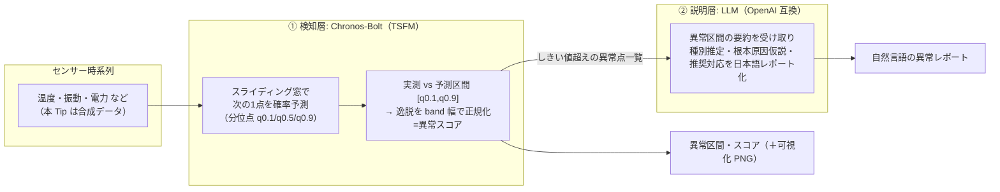
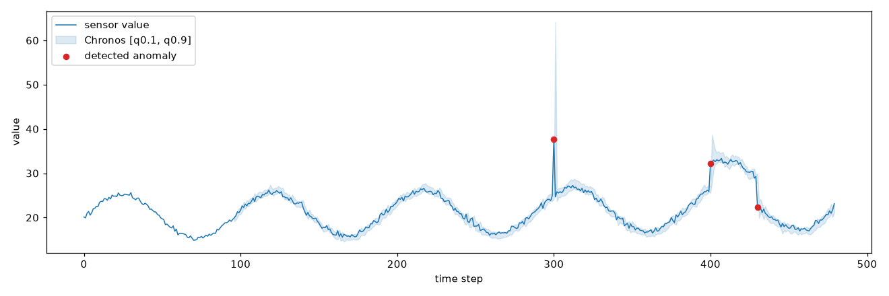

# 時系列基盤モデル（Chronos）＋ LLM の 2 段構成で、センサーデータの異常検知から自然言語レポート化までを行う

IoT センサー等の時系列データに対し、従来の「異常の検知」だけでなく「何が起きているかの自然言語説明・根本原因の仮説・推奨対応」まで一気通貫で行う構成を、実際に動かせる最小コードで示す。

この Tip で実装するのは、研究・産業界で **最もメジャーな「TSFM + LLM の 2 段構成」**（下記系統 (c)）である。数値時系列の扱いに弱い LLM の代わりに、**時系列基盤モデル（TSFM: Time Series Foundation Model）である [Chronos](https://github.com/amazon-science/chronos-forecasting)** が異常スコアリングを担い、**LLM は説明・レポート生成に専念**する、という役割分担が要点。この構成は **Datadog が商用製品（自社 TSFM「Toto」＋ LLM エージェント「Bits AI SRE」）として既に稼働**させている実証済みのアーキテクチャでもある。

> **TSFM（時系列基盤モデル）とは**: 大量かつ多様なドメインの時系列で事前学習され、**追加学習なし（ゼロショット）で未知の時系列にも予測・異常検知を適用できる**、時系列版の基盤モデル。LLM が「言語の基盤モデル」なのに対し、TSFM は「時系列の基盤モデル」にあたる。代表格が Amazon の Chronos（[論文](https://arxiv.org/abs/2403.07815) 被引用 850・TMLR）で、本 Tip では推論が高速な蒸留版 **Chronos-Bolt**（`amazon/chronos-bolt-base`, Apache-2.0）を使う。

## 異常検知 × LLM の 3 系統（本 Tip が実装するのはどれか）

時系列異常検知に LLM を絡める研究は、大きく 3 系統に整理できる。本 Tip は精度・実装コスト・商用実証のバランスが最も良い **系統 (c)** を実装する。

| 系統 | 仕組み | 代表手法 | 位置づけ |
|------|--------|---------|---------|
| (a) 数値直接入力 | 数値系列をテキスト化して LLM に投入 | SigLLM / LLMAD / LLMTime | 最軽量だが LLM 単体は数値時系列に弱く、ICL/CoT の足場が無いと精度が出ない |
| (b) 画像化 → VLM | 折れ線グラフ画像を VLM に見せて検知＋説明 | TAMA / AnomLLM / ChatTS | 説明は自然に出るが季節性異常に弱い・画像化設計に敏感 |
| **(c) TSFM + LLM 2 段**（★本 Tip） | **TSFM で異常スコア → LLM が解釈・レポート化** | Chronos/TimesFM/TSPulse + LLM（商用: Datadog Toto + Bits AI SRE） | **検知は数値に強い TSFM、説明は言語に強い LLM と役割分担。商用実証あり** |

## 全体像（本 Tip が実装する 2 段構成）



検知層と説明層を分離しているのがポイント。**検知は追加学習なしの Chronos に任せ、LLM は「数値を当てる」のではなく「検知済みの異常を人間向けに言語化する」**ことに専念させる。

## 検知のしくみ（予測残差ベースの異常スコア）

Chronos は本来「予測（forecasting）」モデルなので、次の手順で異常検知に転用する（予測残差ベースの教師なし異常検知）。

1. スライディング窓で、各時刻 `t` について直前 `W` 点（既定 96）を文脈に **次の 1 点を確率予測**し、分位点 `q0.1 / q0.5 / q0.9` を得る。
2. 実測値 `x_t` が予測区間 `[q0.1, q0.9]` の外に出た分を、区間幅（band）で正規化して **異常スコア**とする（区間内なら 0）。
    - `x_t > q0.9` なら `score = (x_t - q0.9) / (q0.9 - q0.1)`
    - `x_t < q0.1` なら `score = (q0.1 - x_t) / (q0.9 - q0.1)`
3. スコアが **しきい値（既定 1.0 = band 幅の 1 倍以上外れた点）**を超えた点を異常とする。

全対象点の文脈をバッチ化して `predict_quantiles()` を 1 回で呼ぶため、CPU でも高速に動く。

## 手法の位置づけ（学術・OSS への準拠）

本 Tip の構成が、論文・公式ライブラリ・商用製品のどれに準拠しているかを明確にしておく。

- **アーキテクチャ（系統 (c) TSFM + LLM 2 段構成）は準拠**: 「TSFM で検知 → LLM で説明」という役割分担は、LLM 時系列異常検知のサーベイ（NAACL 2025 Findings, [arXiv:2409.01980](https://arxiv.org/abs/2409.01980)）の分類に沿い、**商用製品 Datadog（TSFM「Toto」＋ LLM エージェント「Bits AI SRE」）と同型**。研究・産業の両面で確立した構成。
- **検知モデル・API は公式実装に準拠**: Amazon の**公式ライブラリ [`chronos-forecasting`](https://github.com/amazon-science/chronos-forecasting)（Apache-2.0, 5.6k★）**の `BaseChronosPipeline` / `predict_quantiles` をそのまま使用。Chronos 自体は査読付き（TMLR, [arXiv:2403.07815](https://arxiv.org/abs/2403.07815)、被引用 850）。
- **異常検知への転用（予測残差ベース）は標準的だが、スコア式は本 Tip の簡易実装**: 「予測分布からの逸脱で異常を測る」考え方は、予測型 TSFM を異常検知に使う際の一般的（教科書的）アプローチで、ベンチマーク [TSB-AD](https://github.com/TheDatumOrg/TSB-AD)（NeurIPS 2024 D&B）でも基盤モデル系はこの枠組みで評価される。ただし本 Tip の具体的なスコア（予測区間からの逸脱を band 幅で正規化）は、**特定論文のアルゴリズムをそのまま再現したものではなく、分かりやすさ優先の標準的な区間ベース検知**である。厳密な評価には TSB-AD の VUS-PR や PATE 等の指標が推奨される（下記 TODO 参照）。
- **説明層 LLM は特定手法に非依存**: レポート生成は素朴なプロンプトで、LLMAD の Anomaly CoT のような論文手法は用いていない（あくまで 2 段構成の配線デモ）。

> まとめると、**「アーキテクチャと検知ライブラリは確立した手法・公式実装に準拠」**、**「異常スコアの式とレポートのプロンプトは教材向けの簡易実装」**という位置づけ。プロダクション利用時は、異常検知を公式サポートする TSFM（IBM `granite-timeseries-tspulse` 等）や論文実装（SigLLM 等）、閾値フリー指標での評価を検討する。

## 追加した Python コードの主なポイント

- 処理スクリプト: [`detect_and_report.py`](detect_and_report.py)
    - **検知層** `detect_anomalies_chronos()`: `BaseChronosPipeline.from_pretrained("amazon/chronos-bolt-base")` をロードし、`predict_quantiles(context_batch, prediction_length=1, quantile_levels=[0.1,0.5,0.9])` で各点の予測区間を取得 → 逸脱スコアを算出。CPU では `torch_dtype=float32`、GPU では `bfloat16` を使う。
    - **説明層** `generate_report_llm()`: OpenAI SDK（`base_url` 差し替え）で任意の OpenAI 互換 LLM を叩く。既定は**ローカルの [Ollama](https://ollama.com/)（`http://localhost:11434/v1`）**で GPU も API キーも不要。`--base-url` を差し替えれば vLLM / OpenAI / その他クラウド LLM でもそのまま動く。
    - **合成データ** `make_synthetic_series()`: 日次周期（周期 96）＋ノイズのベース系列に、**スパイク（点異常, index=300）**と**レベルシフト（区間異常, index=400〜429）**を注入。`--input <csv>` で自前の 1 変量 CSV も使える。
    - `--no-llm` で検知のみ、`--plot images/anomaly.png` で可視化 PNG を保存。

## 使用方法

1. 依存をインストールする（CPU で動く。GPU があれば `--device cuda`）

    ```sh
    pip install -r requirements.txt   # chronos-forecasting / torch / openai / matplotlib
    ```

1. 説明層の LLM を用意する（既定はローカル Ollama）

    ```sh
    # 別ターミナルで Ollama を起動し、小型モデルを pull しておく
    ollama serve
    ollama pull qwen3:4b   # 自分が pull 済みのモデル名に合わせる（--llm-model で指定）
    ```

    > **説明層のモデルは差し替え可能**。既定はローカル Qwen（GPU/APIキー不要でまず動かす用）だが、**レポート品質を上げるならフロンティアモデルの利用を推奨**する。OpenAI 互換エンドポイントなら `--base-url` と `OPENAI_API_KEY` の差し替えだけでよい。
    >
    > | 用途 | 例 |
    > |---|---|
    > | ローカル・オンプレ完結（既定） | Ollama + Qwen（`--base-url http://localhost:11434/v1`） |
    > | 高品質・手軽 | OpenAI GPT-4o 等（`--base-url https://api.openai.com/v1 --llm-model gpt-4o` + `OPENAI_API_KEY`） |
    > | Claude を使う | Anthropic の OpenAI 互換エンドポイント（`--base-url https://api.anthropic.com/v1/ --llm-model claude-opus-4-8` + `OPENAI_API_KEY=<Anthropic APIキー>`）。ネイティブに使うなら公式 [`anthropic`](https://pypi.org/project/anthropic/) SDK が推奨 |
    >
    > 調査ドキュメントでも、モデル依存で精度が大きく変わること（GPT-4 → GPT-3.5/Llama で F1 半減）と、**ローカル SLM 構成の精度・コスト劣化の実測が検証の見せ場**であることが指摘されている。用途に応じて選ぶ。

1. 検知 → レポート生成をまとめて実行する

    ```sh
    sh run_cpu.sh
    # もしくは直接:
    python detect_and_report.py --device cpu --llm-model qwen3:4b --plot images/anomaly.png
    ```

1. LLM を使わず、検知だけ試す場合

    ```sh
    python detect_and_report.py --device cpu --no-llm --plot images/anomaly.png
    ```

## 実行結果

### ① 検知層（Chronos-Bolt）の出力

合成データ（正解: スパイク@300 / レベルシフト@400–429）に対し、注入した異常を正しく検知できる。

```
===== 検知結果（Chronos-Bolt）=====
系列長: 480 点 / 検知しきい値(スコア): 1.0 / 検知された異常点数: 3
各異常点（index, 実測値, 期待中央値, 期待区間[q0.1,q0.9], 逸脱スコア）:
- index=300: 実測=37.73, 期待中央=24.91, 期待区間=[24.15, 25.88], スコア=6.86
- index=400: 実測=32.26, 期待中央=26.28, 期待区間=[25.61, 27.04], スコア=3.63
- index=430: 実測=22.39, 期待中央=28.92, 期待区間=[27.98, 29.94], スコア=2.86
```

- スパイク（index=300）は大きなスコアで一発検知。
- レベルシフト（index=400〜429）は、**立ち上がり（400）と立ち下がり（430）の遷移点が検知**される。区間の内側は文脈がシフト後に適応するため低スコアになる（予測残差ベース検知の一般的な挙動）。

可視化（`images/anomaly.png`）: 青線=センサー値、淡い帯=Chronos の予測区間 `[q0.1, q0.9]`、赤点=検知された異常点。



### ② 説明層（LLM）の出力（自然言語レポート）

検知された異常点の要約を LLM に渡すと、以下のような運用者向けレポートが生成される（下記はローカル Ollama + Qwen で生成した実出力の抜粋）。

```text
### 1. 異常の要約
- 異常点数: 3点
- 発生範囲: 系列長480点中、index 300、400、430で異常が検出（スコア1.0以上）

### 2. 異常の種別推定と判断根拠
- index 300: スパイク（実測値37.73は期待中央値24.91から大幅上昇）
  - 根拠: 逸脱スコア6.86（高スコア）と実測値の突然の変動。
- index 400: レベルシフト（実測値32.26は期待中央値26.28から上昇）
  - 根拠: 逸脱スコア3.63（中程度）と実測値の継続的変化。
- index 430: レベルシフト（実測値22.39は期待中央値28.92から下落）
  - 根拠: 逸脱スコア2.86（中程度）と実測値の継続的変化。

### 3. 想定される根本原因の仮説
- index 300: （仮説）センサーの誤報 / 瞬間的な外乱（例：過熱・過電）
- index 400: （仮説）環境要因や運転条件の変化によるベースラインの移動
- index 430: （仮説）プロセスの変動（例：メンテナンス・機械の状態変化）
  … （以下、推奨対応アクションが続く）
```

> 検知エンジンが渡すのは数値の要約だけなので、LLM は「数値を当てる」のではなく「検知済みの異常を種別分けし、原因仮説と対応まで日本語で言語化する」役割に徹している。上記は小型ローカルモデル（Qwen3 1.7B/4B 級）の出力例で、より高性能な LLM ほどレポートの妥当性は上がる。

## 注意点・課題

- **LLM 単体の数値時系列理解は弱い**: 生の数値系列を LLM に直接投げる系統 (a) は、専用 DL 手法に精度で劣後しやすい（SigLLM は約 30% 劣後と自己報告）。本 Tip の 2 段構成は、この弱点を TSFM（Chronos）に検知を任せることで回避している。
- **TSFM は本来「予測」用**: Chronos は forecasting モデルであり、異常検知はその予測残差を使う転用。周期性の強いデータでは有効だが、複雑な多変量異常や微細な異常には、異常検知を公式サポートする TSFM（IBM `granite-timeseries-tspulse` 等）や専用手法の方が向く場合がある。
- **評価指標の罠**: 時系列異常検知は point-adjust F1 による過大評価が長年問題視されている。定量評価する際は VUS-PR / PATE など閾値フリー指標を併記するのが現在の作法。本 Tip はしくみのデモに留め、ベンチマーク評価は行っていない（下記 TODO 参照）。
- **モデル依存**: 説明層 LLM の性能でレポート品質は大きく変わる。小型ローカルモデルは手軽だが、レポートの妥当性（幻覚の有無）は用途に応じて検証が必要。
- **しきい値・窓幅は要調整**: `--threshold` / `--context-length` はデータの周期・ノイズ特性に依存する。実データではこれらのチューニングが精度を左右する。

<!--
=====================================================================
## この Tip で実施しなかった手法・モデル・論文（調査ドキュメント記載分）
=====================================================================

本 Tip は「TSFM + LLM 2 段構成（系統 c）」を Chronos-Bolt + ローカル LLM の最小構成で
実装したもの。調査ドキュメント（時系列センサーデータ × LLM の異常検知・自然言語レポート化）に
記載があるが、本 Tip では未実施の手法・モデル・論文・データセット・評価を一覧化する（今後の拡張候補）。

### 手法（3 系統のうち未実装のもの）
| 系統 | 内容 | 代表手法・論文 | 本 Tip |
|------|------|---------------|--------|
| (a) 数値直接入力 | 数値系列をテキスト化して LLM にゼロショット投入 | SigLLM(arXiv:2405.14755) / LLMAD(arXiv:2405.15370) / LLMTime(arXiv:2310.07820) | ✗ 未実装 |
| (b) 画像化 → VLM | 折れ線グラフ画像を VLM に見せ検知＋根拠説明 | TAMA(arXiv:2411.02465) / AnomLLM(ICLR, arXiv:2410.05440) / VisualTimeAnomaly(WWW 2026, arXiv:2502.17812) / AnomSeer(arXiv:2602.08868) | ✗ 未実装 |
| (c) TSFM + LLM 2 段 | TSFM で異常スコア → LLM が解釈・説明 | Chronos + LLM（商用: Datadog Toto + Bits AI SRE） | ✓ 本 Tip で実装 |

### 検知層モデル（TSFM）— 本 Tip は amazon/chronos-bolt-base のみ
| モデル | 提供元 | 備考 | 本 Tip |
|--------|--------|------|--------|
| amazon/chronos-bolt-base | Amazon | Apache-2.0、Chronos(TMLR, arXiv:2403.07815) | ✓ 実装 |
| google/timesfm-2.0-500m | Google | Apache-2.0、TimesFM(ICML, arXiv:2310.10688)、実装 26.8k★ | ✗ 未使用 |
| Salesforce/moirai-2.0-R | Salesforce | Moirai(ICML, arXiv:2402.02592)。**CC-BY-NC-4.0 商用不可** | ✗ 未使用 |
| Maple728/TimeMoE-200M | THU 系 | Time-MoE(ICLR, arXiv:2409.16040) | ✗ 未使用 |
| ibm-granite/granite-timeseries-tspulse-r1 | IBM | Apache-2.0、**異常検知タスクを公式サポート** | ✗ 未使用 |
| Datadog Toto | Datadog | Apache-2.0、観測性特化、Watchdog を駆動 | ✗ 未使用 |
| STAR / TimeRadar | - | TSFM の異常検知適合を埋める adapter/特化(arXiv:2510.16014 / 2602.19068) | ✗ 未使用 |

### 説明層 — 本 Tip はローカル LLM（Ollama + Qwen 系）を既定にした汎用 OpenAI 互換
| 選択肢 | 備考 | 本 Tip |
|--------|------|--------|
| ローカル SLM（Ollama + Qwen 系） | GPU/APIキー不要、オンプレ完結。精度・コスト劣化の実測が調査の見せ場 | △ 既定（実機検証済み） |
| フロンティア LLM（Claude / GPT-4o 等） | レポート品質は高い。base_url 差し替えで利用可 | △ 手順のみ（既定では未使用） |
| ChatTS-14B（時系列を直接入力できる MLLM） | Apache-2.0、Qwen2.5-14B ベース、VLDB(arXiv:2412.03104) | ✗ 未使用 |

### データセット — 本 Tip は合成データのみ
| データ | 備考 | 本 Tip |
|--------|------|--------|
| 合成データ（本 Tip 内で生成） | スパイク＋レベルシフトを注入 | ✓ 使用 |
| TSB-AD 収録 40 データセット | SMD/SMAP/MSL/SWaT 等の産業系 | ✗ 未使用 |
| MAISON-LLF | 高齢者 6 モダリティ、Zenodo、Nature Sci. Data 2025 | ✗ 未使用 |
| ChatTS-Training-Dataset | 属性ベース合成時系列 + QA | ✗ 未使用 |

### 評価・ベンチマーク — 本 Tip は定量評価なし（しくみのデモに限定）
| 項目 | 内容 | 本 Tip |
|------|------|--------|
| ベンチマーク | TSB-AD(NeurIPS 2024 D&B) / mTSBench(arXiv:2506.21550) での定量比較 | ✗ 未実施 |
| 閾値フリー指標 | VUS-PR / PATE（PA-F1 の水増し回避） | ✗ 未実施 |
| 多変量 TSAD | 本 Tip は 1 変量のみ | ✗ 未実施 |
| レポート品質評価 | LLM-as-judge(DeepEval) / LLMAD 式の人手評価（有用性 4.06/5・可読性） | ✗ 未実施 |
| 3 系統の同一データ比較 | (a)/(b)/(c) を同一データで比較 | ✗ 未実施 |
-->

## 参考サイト

- https://github.com/amazon-science/chronos-forecasting （Chronos / Chronos-Bolt 公式実装, Apache-2.0）
- https://huggingface.co/amazon/chronos-bolt-base （`amazon/chronos-bolt-base` モデルカード）
- https://arxiv.org/abs/2403.07815 （論文: Chronos: Learning the Language of Time Series, TMLR）
- https://arxiv.org/abs/2409.01980 （サーベイ: Large Language Models for Time Series Anomaly Detection, NAACL 2025 Findings）
- https://www.datadoghq.com/blog/bits-ai-sre-deeper-reasoning/ （商用実証: Datadog Bits AI SRE の根本原因調査）
- https://github.com/DataDog/toto （Datadog の観測性特化 TSFM「Toto」, Apache-2.0）
- https://github.com/TheDatumOrg/TSB-AD （時系列異常検知ベンチマーク TSB-AD, NeurIPS 2024 D&B）
- https://ollama.com/ （説明層で使うローカル LLM ランタイム）
