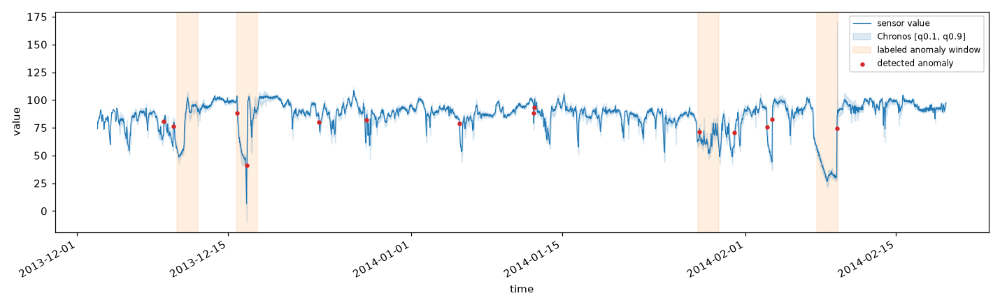
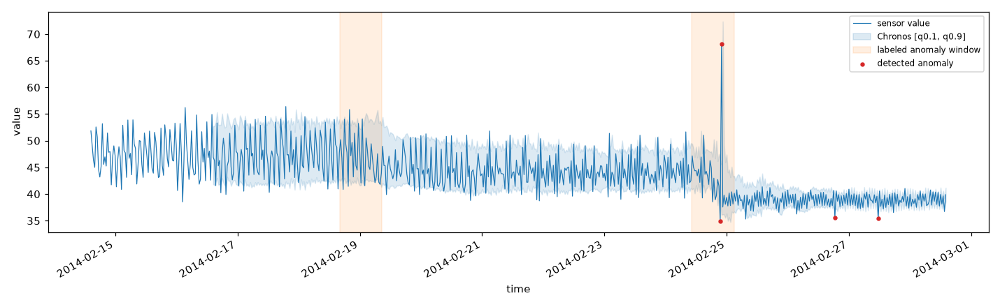
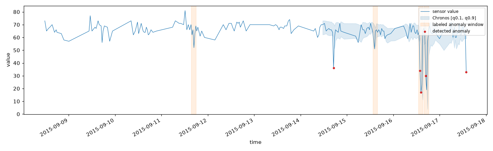

# 時系列基盤モデル（Chronos）＋ LLM の 2 段構成で、センサーデータの異常検知から自然言語レポート化までを行う

IoT/産業用センサーの時系列データに対し、従来の「異常の検知」だけでなく「何が起きているかの自然言語説明・根本原因の仮説・推奨対応」まで一気通貫で行う構成を、**実際の公開センサーデータ**で動かせる最小コードで示す。

この Tip で実装するのは、研究・産業界で **最もメジャーな「TSFM + LLM の 2 段構成」**（下記系統 (c)）である。数値時系列の扱いに弱い LLM の代わりに、**時系列基盤モデル（TSFM: Time Series Foundation Model）である [Chronos](https://github.com/amazon-science/chronos-forecasting)** が異常スコアリングを担い、**LLM は説明・レポート生成に専念**する、という役割分担が要点。

> **TSFM（時系列基盤モデル）とは**: 大量かつ多様なドメインの時系列で事前学習され、**追加学習なし（ゼロショット）で未知の時系列にも予測・異常検知を適用できる**、時系列版の基盤モデル。代表格が Amazon の Chronos（[論文](https://arxiv.org/abs/2403.07815) 被引用 850・TMLR）で、本 Tip では推論が高速な蒸留版 **Chronos-Bolt**（`amazon/chronos-bolt-base`, Apache-2.0）を使う。Chronos の事前学習コーパスには energy・weather・traffic・sensor など多様なドメインが含まれ、産業センサーの異常検知への適用例（ChronosAD, [arXiv:2606.01300](https://arxiv.org/abs/2606.01300)）もある。

## 異常検知 × LLM の 3 系統（本 Tip が実装するのはどれか）

| 系統 | 仕組み | 代表手法 | 位置づけ |
|------|--------|---------|---------|
| (a) 数値直接入力 | 数値系列をテキスト化して LLM に投入 | SigLLM / LLMAD / LLMTime | 最軽量だが LLM 単体は数値時系列に弱く、ICL/CoT の足場が無いと精度が出ない |
| (b) 画像化 → VLM | 折れ線グラフ画像を VLM に見せて検知＋説明 | TAMA / AnomLLM / ChatTS | 説明は自然に出るが季節性異常に弱い・画像化設計に敏感 |
| **(c) TSFM + LLM 2 段**（★本 Tip） | **TSFM で異常スコア → LLM が解釈・レポート化** | Chronos/TimesFM/TSPulse + LLM（商用: Datadog Toto + Bits AI SRE） | **検知は数値に強い TSFM、説明は言語に強い LLM と役割分担。商用実証あり** |

## 全体像（本 Tip が実装する 2 段構成）


検知層と説明層を分離しているのがポイント。**検知は追加学習なしの Chronos に任せ、LLM は「数値を当てる」のではなく「検知済みの異常を人間向けに言語化する」**ことに専念させる。

## セットアップ（uv + Makefile）

パッケージ管理は [uv](https://docs.astral.sh/uv/)、実行は `make` で行う。API キーは `.env`（git 管理外）に置く。

```sh
# 1. 依存を仮想環境に同期（pyproject.toml / uv.lock を使用）
make install

# 2. API キーを設定（.env は git 管理外）
cp .env.sample .env
#   .env を編集して OPENAI_API_KEY に説明層 LLM のキーを設定する
#   既定は Google Gemini（https://aistudio.google.com/apikey でキー取得）

# 3. 検知 → レポート生成（初回は NAB データを自動ダウンロード）
make run                    # 既定は機械温度センサー
make run NAB_KEY=cpu        # 別センサー（サーバ CPU 使用率）
make run NAB_KEY=traffic-speed

# 4. 生成レポートを LLM-as-judge で品質評価
make evaluate NAB_KEY=machine-temp
```

| ファイル | 役割 |
|---|---|
| [`create_report.py`](create_report.py) | 検知（Chronos）→ 説明層 LLM でレポート生成 → `reports/` と `images/` に保存 |
| [`evaluate_report.py`](evaluate_report.py) | 生成レポートを LLM-as-judge で品質評価 |
| [`prompts.yaml`](prompts.yaml) | レポート生成・評価のプロンプト定義（コードから分離して管理） |
| [`pyproject.toml`](pyproject.toml) / [`Makefile`](Makefile) / `.env.sample` | uv 依存定義 / タスク / キーのひな形 |

## 使用する実データ（NAB: Numenta Anomaly Benchmark）

入力には、実世界のセンサー異常検知ベンチマーク **[NAB](https://github.com/numenta/NAB)** の公開データ（`timestamp,value` 形式・既知の異常区間ラベル付き）を使う。スクリプトが初回実行時に自動ダウンロードする。`--nab-key`（`make run NAB_KEY=...`）で温度以外のセンサーにも切り替えられる。

| `--nab-key` | センサー | 内容 |
|---|---|---|
| `machine-temp`（既定） | 産業機械の温度 | 実機の温度センサー。既知の故障あり |
| `ambient-temp` | 室温 | 室温センサー。故障イベントあり |
| `cpu` | サーバ CPU 使用率 | AWS EC2 の CPU 使用率メトリクス |
| `traffic-speed` | 道路の車速 | 交通センサーの速度（渋滞・異常で急落） |
| `traffic-occupancy` | 道路の占有率 | 交通センサーの占有率 |
| `network` | サーバ受信ネットワーク量 | EC2 の network-in メトリクス |

`--input <csv>`（ヘッダなし・数値のみの 1 変量 CSV）で、自前のセンサーデータも使える。

## 検知のしくみ（予測残差ベースの異常スコア）

この「予測して、予測と実測の差（residual＝残差）を異常スコアにする」方式は、時系列異常検知（TSAD）で標準的な手法カテゴリ **forecasting-based（予測ベース）anomaly detection** に該当する（サーベイでは forecasting / reconstruction / representation / hybrid に分類され、その筆頭。古典の ARIMA/Prophet から深層の LSTM/Transformer まで共通）。Chronos は本来「予測（forecasting）」モデルなので、次の手順で異常検知に転用する。

1. スライディング窓で、各時刻 `t` について直前 `W` 点（既定 96）を文脈に **次の 1 点を確率予測**し、分位点 `q0.1 / q0.5 / q0.9` を得る。
2. 実測値 `x_t` が予測区間 `[q0.1, q0.9]` の外に出た分を、区間幅（band）で正規化して **異常スコア**とする（区間内なら 0）。
    - `x_t > q0.9` なら `score = (x_t - q0.9) / (q0.9 - q0.1)`
    - `x_t < q0.1` なら `score = (q0.1 - x_t) / (q0.9 - q0.1)`
3. スコアが **しきい値（`--threshold`, 既定 1.5）**を超えた点を異常とする。
4. 全対象点の文脈をミニバッチに分けて `predict_quantiles()` を呼ぶため、長い系列でも CPU でメモリを抑えて動く。

## レポート生成の設計（説明層）

### LLM に入力するのは「異常点の数値サマリ」だけ

LLM には**生の時系列やプロット画像は渡さない**。渡すのは、検知層が出した異常点だけの数値サマリ（`build_anomaly_summary`）である。

- `系列長 / しきい値 / 検知された異常点数`
- 逸脱スコア上位（既定 15 点）の各行: **時刻・実測値・期待中央値・期待区間 [q0.1,q0.9]・逸脱スコア**

数値予測が苦手な LLM に生系列を渡さず、TSFM が抽出した「事実（異常点）」だけを言語化させることで、**幻覚を抑えつつトークンも小さく**できる。

### 実用的なレポートフォーマット

運用（オンコール/SRE）でそのまま一次対応に使えるよう、システムプロンプト（[`prompts.yaml`](prompts.yaml)）で次の形を強制している。

- **重要度・優先度でトリアージ**（サマリに重要度、アクションに P1/P2/P3）
- **事実と推測の峻別**（検知した数値は事実、原因・対応は「仮説」と明記し確度を付す）→ 幻覚の抑制
- **アクション志向**（何を確認・切り分け・エスカレーションするか）／**限界の明示**（数値要約のみに基づく推定である旨）

出力構成: `## サマリ` → `## 検知イベント（重要度順）` → `## 根本原因の仮説（確度付き）` → `## 推奨アクション（優先度順）` → `## 補足・限界`。

### プロンプトを YAML で外部管理するのはベストプラクティスか

**プロンプトをコードから分離して外部ファイルに持つのは広く推奨される実践**で、YAML はその有力な選択肢（バージョン管理・レビューがしやすい、非エンジニアも編集できる、複数の名前付きプロンプトを構造管理できる）。本 Tip も `prompts.yaml` に `system` / `user_template`（生成用）と `judge_system` / `judge_user_template`（評価用）を置いている。ただし YAML が唯一解ではなく、`.md`/Jinja テンプレート、プロンプト管理サービス、DSPy の Signature 等も使われる。**「直書きせず外部化しバージョン管理する」ことが本質**。

### どのモデルが最も精度が高いか

レポート品質はモデル性能に強く依存する（調査でも GPT-4 → GPT-3.5/Llama で F1 半減）。レポート生成は「数値エビデンスに忠実な構造化日本語生成」タスクなので、**フロンティアモデル（Google Gemini 3.x、Anthropic Claude、OpenAI GPT-4o 級）が最も高精度**。本 Tip の実行例・既定は **Gemini 3.5 Flash**（`gemini-3.5-flash`、高品質・高速・低コスト）。ローカル小型モデル（Ollama + Qwen 等）は GPU/APIキー不要で手軽だが品質は劣り幻覚も出やすい（デモ・オンプレ完結向け）。

> **reasoning 系モデルの注意**: Gemini 3.x や Qwen3 等は「思考」でトークンを消費する。`--max-tokens` を小さく固定するとレポートが途中で切れるため、**既定では `--max-tokens` を送らず**プロバイダ側の上限まで生成させる。加えて `--reasoning-effort low` で思考量を抑えると本文が切れにくい（対応 API のみ）。

## 実行結果

### ① 検知層（Chronos-Bolt）の出力（機械温度センサー）

NAB の産業機械温度センサー（実データ, 30 分間隔に間引き 3,783 点, 既知異常区間 4 個）に対し、予測区間からの逸脱を異常として検知する。青線=センサー値、淡い青帯=Chronos の予測区間 `[q0.1, q0.9]`、**オレンジ帯=NAB の既知異常区間（正解ラベル）**、赤点=検知された異常点。故障時（2 月上旬）の大きな逸脱やレベル変化の遷移点が検知され、複数が正解ラベル区間と重なっている。



### ② 説明層（LLM）の出力（実用フォーマットの運用レポート）

検知結果を LLM に渡すと、`reports/machine-temp.md` に次のような運用レポートが生成される（**Gemini 3.5 Flash** の実出力の抜粋）。

```text
## サマリ
- 重要度: 高（最大逸脱スコア 9.36 を含む、スコア 3.0 以上の深刻な逸脱が複数発生しているため）
- 検知件数と対象時間帯: 2013-12-09 から 2014-02-09 の期間で計 14 件の異常点を検知。

## 検知イベント（重要度順）
1. 2014-02-09 12:15:00 / 実測=74.70 / 期待区間=[28.31, 32.79] / 逸脱スコア=9.36 / 種別: 急激な温度上昇
2. 2014-02-03 12:15:00 / 実測=82.77 / 期待区間=[36.27, 44.19] / 逸脱スコア=4.87 / 種別: 急激な温度上昇
   …（全 14 件）

## 根本原因の仮説（確度付き）
- [確度: 中] 冷却システムの機能不全または一時的な過負荷による異常発熱
  - 根拠: 2014-02-09 / 02-03 で期待中央値（30〜40）を 40℃以上上回る高温を記録しているため。
- [確度: 低] センサー自体の故障またはキャリブレーション不良

## 推奨アクション（優先度順）
- [P1] 物理的な温度・冷却状態の確認（最大スコア時刻前後の冷却系統の現地確認）
- [P2] 稼働ログ・エラー履歴の調査（スコア 3.0 超の時間帯）
- [P3] センサーの健全性確認

## 補足・限界
本レポートは数値要約のみに基づく推定です。実機ログ・現場確認と併せて判断してください。
```

### ③ 温度以外のセンサーでの動作（同一パイプライン）

`make run NAB_KEY=...` を変えるだけで、温度以外のセンサーでも動く（各センサーの plot と `reports/<センサー>.md` を生成）。

| センサー | 検知の例 | 図 / レポート |
|---|---|---|
| サーバ CPU 使用率（`cpu`） | 使用率の突発スパイク（実測 68% / 期待中央 ≈38% / スコア 3.15） | [図](images/cpu_anomaly.png) / [report](reports/cpu.md) |
| 道路の車速（`traffic-speed`） | 渋滞・異常時の速度急落（実測 10 mph / 期待中央 ≈66 / スコア 4.32） | [図](images/traffic-speed_anomaly.png) / [report](reports/traffic-speed.md) |
| 道路の占有率（`traffic-occupancy`） | 占有率の異常変動を検知 | [図](images/traffic-occupancy_anomaly.png) / [report](reports/traffic-occupancy.md) |
| サーバ受信ネットワーク量（`network`） | スパイクの多い高分散メトリクス | [図](images/network_anomaly.png) / [report](reports/network.md) |
| 室温（`ambient-temp`） | 室温センサーの逸脱 | [図](images/ambient-temp_anomaly.png) / [report](reports/ambient-temp.md) |

 

### ④ レポート品質の評価（LLM-as-judge）

`make evaluate` は、生成レポートを **LLM-as-judge**（別の LLM を審査員に）で採点する（[`evaluate_report.py`](evaluate_report.py)）。忠実性・有用性・可読性・フォーマット準拠を 1〜5 で評価する。Gemini 3.5 Flash を審査員にした結果:

| センサー | 忠実性 | 有用性 | 可読性 | 準拠 | 総合 |
|---|---|---|---|---|---|
| machine-temp | 5 | 5 | 5 | 5 | 5.0 |
| cpu | 5 | 5 | 5 | 5 | 5.0 |
| traffic-speed | 5 | 5 | 5 | 5 | 5.0 |
| traffic-occupancy | 5 | 5 | 5 | 5 | 5.0 |
| ambient-temp | 5 | 5 | 5 | 5 | 5.0 |
| network | **3** | 5 | 5 | 5 | 4.5 |

- 概ね高評価。**network だけ忠実性 3** は、審査員が「入力の数値に無い『EC2 インスタンス』『NetworkIn』といった環境前提の記述が仮説に混ざっている」と指摘したため（＝軽度の文脈補完＝幻覚の芽）。データ名（`ec2_network_in...`）を根拠にした記述だが、**「与えられた数値のみを根拠にする」原則からは減点**という妥当な評価で、LLM-as-judge が忠実性のブレを検出できていることが分かる。
- 注意: この評価も LLM による自動採点なので絶対視はできない。厳密には LLMAD 式の人手評価（有用性 5 段階・可読性）との併用が望ましい。

## 注意点・課題

- **説明層 LLM の性能でレポート品質が決まる**: 実用レポートはフロンティアモデル（Gemini 3.x / Claude / GPT-4o 級）を推奨。小型ローカルモデルは手軽だが幻覚が出やすい。reasoning 系は `--reasoning-effort low` や `--max-tokens` 未指定で本文の途中切れを避ける。
- **TSFM は本来「予測」用**: Chronos は forecasting モデルで、異常検知はその予測残差を使う転用。周期性の強いセンサー系列では有効だが、高周波の生振動波形や複雑な多変量異常には、異常検知を公式サポートする TSFM（IBM `granite-timeseries-tspulse` 等）や専用手法の方が向く場合がある。
- **しきい値・窓幅・間引きは要調整**: `--threshold` / `--context-length` / `--downsample` はデータの周期・ノイズ特性に依存する（本 Tip でもセンサーごとに threshold を調整している）。検知結果は正解ラベルと部分的に一致するが、全一致を狙う調整はしていない。
- **評価指標の罠**: 時系列異常検知は point-adjust F1 による過大評価が問題視されている。定量評価する際は VUS-PR / PATE など閾値フリー指標を併記するのが現在の作法。本 Tip はしくみのデモに留め、検知精度のベンチマーク評価は行っていない。
- **API キーの管理**: API キーは `.env`（git 管理外）や環境変数で渡し、コードやリポジトリに直書きしない。

## 手法の位置づけ（学術・OSS への準拠）

- **アーキテクチャ（系統 (c)）は準拠**: NAACL 2025 Findings のサーベイ（[arXiv:2409.01980](https://arxiv.org/abs/2409.01980)）の分類に沿う。同型の 2 段構成は Datadog（Toto + Bits AI SRE）が **IT オブザーバビリティ領域**で商用稼働（ただし対象は物理センサーではなく IT メトリクス）。物理センサーへの適用は研究段階。
- **検知モデル・API は公式実装に準拠**: Amazon 公式ライブラリ [`chronos-forecasting`](https://github.com/amazon-science/chronos-forecasting) の `BaseChronosPipeline` / `predict_quantiles` を使用。Chronos は査読付き（TMLR, [arXiv:2403.07815](https://arxiv.org/abs/2403.07815)）。
- **データも実ベンチマーク**: 検知対象は NAB（実世界の異常検知ベンチマーク）の公開センサーデータ。
- **異常検知への転用（予測残差ベース）は標準的だが、スコア式は簡易実装**: 予測分布からの逸脱で異常を測るのは一般的アプローチ（TSB-AD でも基盤モデル系はこの枠組み）だが、本 Tip の band 正規化スコアは特定論文の再現ではなく分かりやすさ優先の実装。厳密評価には VUS-PR / PATE 等が推奨される。

<!--
=====================================================================
## この Tip で実施しなかった手法・モデル・論文（調査ドキュメント記載分）
=====================================================================

本 Tip は「TSFM + LLM 2 段構成（系統 c）」を Chronos-Bolt + 実センサーデータ（NAB）+ LLM の最小構成で
実装したもの。調査ドキュメント（時系列センサーデータ × LLM の異常検知・自然言語レポート化）に
記載があるが、本 Tip では未実施の手法・モデル・論文・データセット・評価を一覧化する（今後の拡張候補）。

### 手法（3 系統のうち未実装のもの）
| 系統 | 内容 | 代表手法・論文 | 本 Tip |
|------|------|---------------|--------|
| (a) 数値直接入力 | 数値系列をテキスト化して LLM にゼロショット投入 | SigLLM(arXiv:2405.14755) / LLMAD(arXiv:2405.15370) / LLMTime(arXiv:2310.07820) | ✗ 未実装 |
| (b) 画像化 → VLM | 折れ線グラフ画像を VLM に見せ検知＋根拠説明 | TAMA(arXiv:2411.02465) / AnomLLM(ICLR, arXiv:2410.05440) / VisualTimeAnomaly(WWW 2026, arXiv:2502.17812) / AnomSeer(arXiv:2602.08868) | ✗ 未実装 |
| (c) TSFM + LLM 2 段 | TSFM で異常スコア → LLM が解釈・説明 | Chronos + LLM（商用: Datadog Toto + Bits AI SRE） | ✓ 本 Tip で実装 |

### 検知層モデル（TSFM）— 本 Tip は amazon/chronos-bolt-base のみ
| モデル | 提供元 | 備考 | 本 Tip |
|--------|--------|------|--------|
| amazon/chronos-bolt-base | Amazon | Apache-2.0、Chronos(TMLR, arXiv:2403.07815) | ✓ 実装 |
| google/timesfm-2.0-500m | Google | Apache-2.0、TimesFM(ICML, arXiv:2310.10688)、実装 26.8k★ | ✗ 未使用 |
| Salesforce/moirai-2.0-R | Salesforce | Moirai(ICML, arXiv:2402.02592)。CC-BY-NC-4.0 商用不可 | ✗ 未使用 |
| Maple728/TimeMoE-200M | THU 系 | Time-MoE(ICLR, arXiv:2409.16040) | ✗ 未使用 |
| ibm-granite/granite-timeseries-tspulse-r1 | IBM | Apache-2.0、異常検知タスクを公式サポート | ✗ 未使用 |
| Datadog Toto | Datadog | Apache-2.0、観測性特化、Watchdog を駆動 | ✗ 未使用 |
| STAR / TimeRadar | - | TSFM の異常検知適合を埋める adapter/特化(arXiv:2510.16014 / 2602.19068) | ✗ 未使用 |

### 説明層 LLM — 本 Tip は OpenAI 互換で任意（既定 Gemini / ローカル Qwen 可）
| 選択肢 | 備考 | 本 Tip |
|--------|------|--------|
| フロンティア LLM（Gemini 3.x / Claude / GPT-4o） | レポート品質は高い | △ Gemini で実行例あり |
| ローカル SLM（Ollama + Qwen 系） | GPU/APIキー不要、オンプレ完結。品質は劣る | △ 対応（デモ向け） |
| ChatTS-14B（時系列を直接入力できる MLLM） | Apache-2.0、Qwen2.5-14B ベース、VLDB(arXiv:2412.03104) | ✗ 未使用 |

### データセット — 本 Tip は NAB のみ
| データ | 備考 | 本 Tip |
|--------|------|--------|
| NAB（機械温度/CPU/交通/network 等） | 実世界の異常検知ベンチマーク。既知異常ラベル付き | ✓ 使用 |
| TSB-AD 収録 40 データセット | SMD/SMAP/MSL/SWaT 等の産業系（多変量含む） | ✗ 未使用 |
| MAISON-LLF | 高齢者 6 モダリティ、Zenodo、Nature Sci. Data 2025 | ✗ 未使用 |

### 評価・ベンチマーク
| 項目 | 内容 | 本 Tip |
|------|------|--------|
| レポート品質評価 | LLM-as-judge（本 Tip で実装）/ LLMAD 式の人手評価（有用性 4.06/5・可読性） | △ LLM-as-judge のみ実装（人手評価は未実施） |
| 検知精度ベンチマーク | TSB-AD(NeurIPS 2024 D&B) / mTSBench(arXiv:2506.21550) | ✗ 未実施 |
| 閾値フリー指標 | VUS-PR / PATE（PA-F1 の水増し回避） | ✗ 未実施 |
| 多変量 TSAD | 本 Tip は 1 変量のみ | ✗ 未実施 |
| 3 系統の同一データ比較 | (a)/(b)/(c) を同一データで比較 | ✗ 未実施 |
-->

## 参考サイト

- https://github.com/amazon-science/chronos-forecasting （Chronos / Chronos-Bolt 公式実装, Apache-2.0）
- https://huggingface.co/amazon/chronos-bolt-base （`amazon/chronos-bolt-base` モデルカード）
- https://arxiv.org/abs/2403.07815 （論文: Chronos: Learning the Language of Time Series, TMLR）
- https://github.com/numenta/NAB （Numenta Anomaly Benchmark: 実世界のセンサー異常検知データ）
- https://arxiv.org/abs/2409.01980 （サーベイ: Large Language Models for Time Series Anomaly Detection, NAACL 2025 Findings）
- https://www.datadoghq.com/blog/bits-ai-sre-deeper-reasoning/ （商用実証: Datadog Bits AI SRE）
- https://ai.google.dev/gemini-api/docs/openai （Gemini の OpenAI 互換エンドポイント）
- https://docs.astral.sh/uv/ （uv: Python パッケージ管理）
- https://ollama.com/ （説明層で使えるローカル LLM ランタイム）
