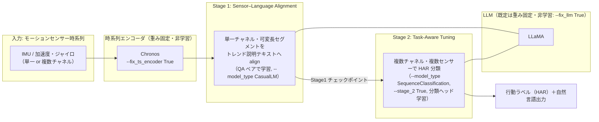
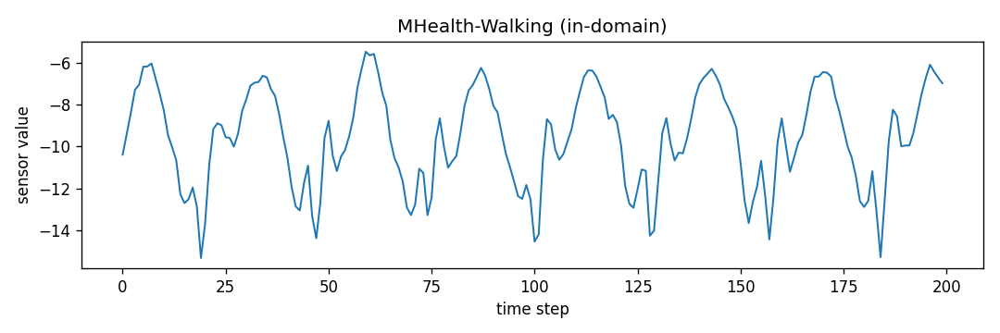
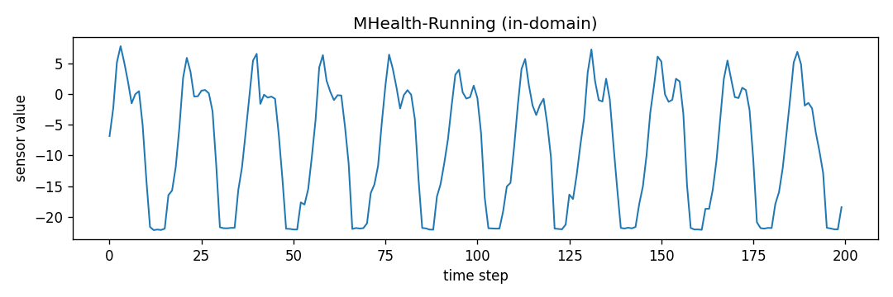
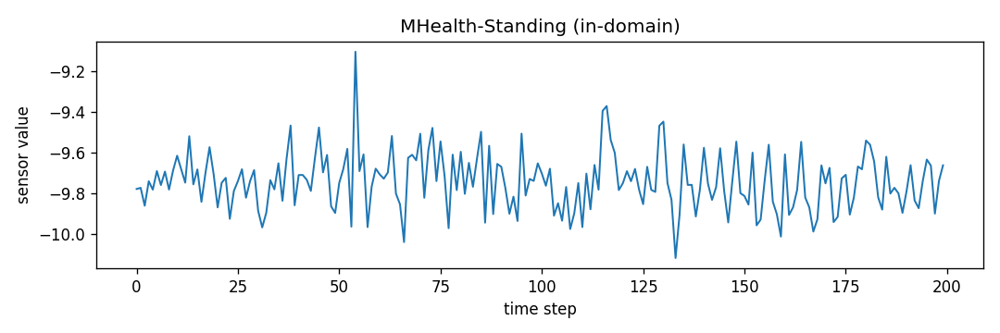
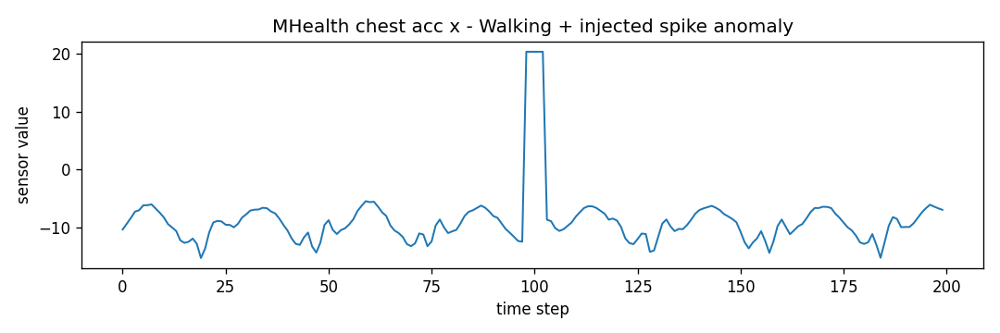
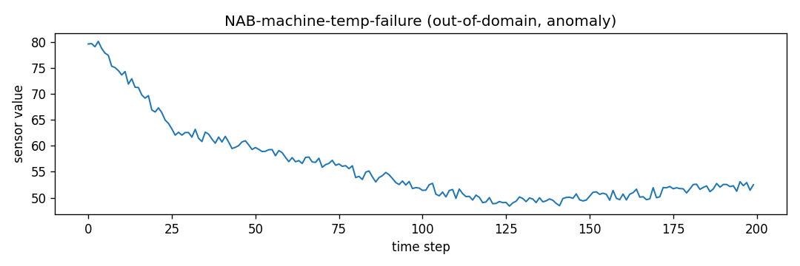
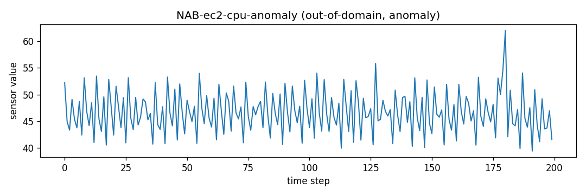

# SensorLLM（モーションセンサー時系列 × LLM）を実際に動かして、センサー信号からの行動認識（HAR）を行う

IMU（加速度・ジャイロ）などのモーションセンサー時系列を LLM に接続し、**人間が読める行動認識（HAR: Human Activity Recognition）**を行う代表的手法 [**SensorLLM**](https://github.com/cruiseresearchgroup/SensorLLM)（UNSW ほか, EMNLP 2025 Main）を、公式実装で実際に動かす手順をまとめる。

SensorLLM は、[時系列基盤モデル（Chronos）＋ LLM の 2 段構成でセンサー異常検知を行う Tip](https://github.com/Yagami360/ai-product-dev-tips/tree/master/nlp_processing/67) と同じく **Chronos を時系列エンコーダに使う**が、目的が異なる。67 が「Chronos で検知 → LLM で説明」という**推論時の役割分担**であるのに対し、SensorLLM は **センサーエンコーダ（Chronos）＋特殊トークンで LLM 側にセンサー表現を align する 2 段学習**（下表の系統 B）で、数値時系列そのものを LLM に「理解」させて HAR SOTA を狙う手法である。

> **⚠️ 注意点**: SensorLLM の**公式リポジトリ（[`cruiseresearchgroup/SensorLLM`](https://github.com/cruiseresearchgroup/SensorLLM), EMNLP 2025 の公式実装）は学習・評価・推論コードと依存をフル公開している**が、**著者の学習済みチェックポイントは配布されていない**（GitHub Releases 0 件・README に配布リンク無し）。つまり公式重みで「ロードしてすぐ推論」はできず、**Chronos エンコーダ＋LLaMA を用意して 2 段学習を自分で回す**のが基本（学習は bf16 + flash-attn 前提で **Ampere 以降の GPU が必須**）。
>
> ただし本 Tip では、**学習をスキップして推論だけ試す近道**も用意した（[後述](#stage-1-の推論手順)）: HF 上の**非公式** Stage1 チェックポイント（`1EE1/SensorLLM-Stage1-Backup`）を同梱の [`stage1_predict.py`](stage1_predict.py) でロードして単一サンプル推論する方法で、こちらは **T4/V100 でも `--dtype float16` で動く**（小型 1.1B ベースのため）。手軽に試すだけなら、学習済み 7B/13B とデータセットが公開されている [LLaSA](https://github.com/BASHLab/LLaSA) も選択肢。（公開状況は 2026-07-14 時点）

## センサー信号を LLM に接続する 5 系統の中での位置づけ

SensorLLM は、センサー専用エンコーダを LLM に align する**系統 B** の代表手法。

| 系統 | 中身 | 代表 | この Tip |
|------|------|------|---------|
| A. プロンプト直入力（訓練なし） | 生センサー値をテキスト化して LLM に直接推論させる | HARGPT, IoT-LLM | ― |
| **B. エンコーダ＋LLM アラインメント** | センサー専用エンコーダ＋特殊トークンで LLM へ接続し、2 段（align → task tuning）で学習 | **SensorLLM**, LLaSA | ★本 Tip |
| C. センサー言語基盤モデル | 大規模なセンサー–言語ペアで対照＋生成事前学習 | SensorLM（Google） | ― |
| D. マルチモーダル埋め込み統合 | センサー（IMU）を既存モダリティ空間へ bind し検索・対応付け | ImageBind, IMU2CLIP | ― |
| E. 時系列基盤モデル | センサーを含む汎用時系列の予測基盤（言語結合は限定的） | Chronos, TimesFM（[nlp_processing/67](https://github.com/Yagami360/ai-product-dev-tips/tree/master/nlp_processing/67) が該当） | ― |

## SensorLLM の 2 段構成（アーキテクチャ）

公式のモデル図（論文 [arXiv:2410.10624](https://arxiv.org/abs/2410.10624) / [公式リポジトリ](https://github.com/cruiseresearchgroup/SensorLLM) より）:


本 Tip 用に、上図を推論経路中心に簡略化すると次の 2 段構成になる:



- **Stage 1（センサー・言語アラインメント）**: **単一チャネル・可変長**のセンサーセグメントを、トレンドベースの自然言語説明に対応づける QA 学習。センサー表現を LLM の言語空間に揃えるのが目的。
- **Stage 2（タスク適応チューニング）**: **複数チャネル・複数センサー**を扱い、下流の HAR 分類を行う。Stage 1 の出力を初期値に、`SequenceClassification` として分類ヘッドを学習する。
- **重み固定の考え方**: 既定では LLM（`--fix_llm True`）と時系列エンコーダ（`--fix_ts_encoder True`）を重み固定（非学習）にし、主にアラインメント／分類ヘッドを学習する（Stage 2 では `--fix_cls_head False`）。

## 公開状況の整理（何が提供され、何が無いか）

| リソース | 公開 | 内容 |
|---|:---:|---|
| 学習・評価・推論コード | ✅ | `sensorllm/` に train / eval / model / data 一式（`train_mem.py`, `eval.py`, Chronos エンコーダ実装） |
| 実行例ノートブック | ✅ | [`mhealth_stage1.ipynb`](https://github.com/cruiseresearchgroup/SensorLLM/blob/main/mhealth_stage1.ipynb) / [`mhealth_stage2.ipynb`](https://github.com/cruiseresearchgroup/SensorLLM/blob/main/mhealth_stage2.ipynb)（QA ペア生成例） |
| 依存定義 | ✅ | `requirements.txt`（`torch==2.4.1`, `transformers==4.45.1`, `flash_attn==2.6.3` 等・固定） |
| 対応データセット | ✅（各自 DL） | USC-HAD / UCI-HAR / MHealth / Capture-24 / PAMAP2（リポジトリ非同梱） |
| バックボーン | ✅（外部） | 時系列 = Chronos（公開）、言語 = LLaMA（HF で利用同意の上 DL） |
| **著者の学習済みチェックポイント** | ❌ | **GitHub Releases 0 件・README に配布リンク無し** |

> **HF 上の「SensorLLM」モデルは全て非公式**（著者公式ではなく第三者の派生／バックアップ）で、信頼性は担保されない。公式の学習済み重みは存在しない前提で、下記の 2 段学習を自分で回すのが基本方針。

## 必要リソース（事前チェックリスト）

1. **GPU**: **2 段学習は Ampere 以降が必須**（`train_mem.py` が flash-attn 2 のモンキーパッチを強制 import。flash-attn 2 は Turing/Volta 非対応、bf16 も非対応のため T4・V100 では学習不可）。一方**推論（`eval.py` / 後述の `stage1_predict.py`）は flash-attn を import しない**ので、`--dtype float16` にすれば T4・V100 でも動く（下表参照）。VRAM はベース LLaMA サイズに依存。<br><br>

    | 用途 | 最低ライン | 目安 |
    |---|---|---|
    | 2 段学習（LLM 重み固定でも） | A100 40GB 級（Ampere+） | 論文はマルチ GPU（`torchrun`）。単一 A100 40GB でも小規模データなら可 |
    | 推論・小型 ckpt（後述の非公式 TinyLlama-1.1B ベース） | 8〜16GB（T4/V100 でも fp16 で可） | 本体 約 2GB + Chronos 約 1.5GB |
    | 推論・Llama-3-8B ベース | 24GB（Ampere 推奨） | bf16 推論で約 16GB + Chronos |
1. **ベース LLM**: LLaMA 系（Hugging Face で利用同意の上ダウンロード）。既定では `--fix_llm True` で LLM は重み固定され、学習は主にアラインメント／分類ヘッド。
1. **時系列エンコーダ**: Chronos のチェックポイント（公開。`--pt_encoder_backbone_ckpt` に指定）。
1. **データ**: 対応 5 データセット（USC-HAD / UCI-HAR / MHealth / Capture-24 / PAMAP2）のいずれかを各配布元から DL ＋ ノートブックで QA ペアを生成。他データセットに適用する場合は [`ts_backbone.yaml`](https://github.com/cruiseresearchgroup/SensorLLM/blob/main/sensorllm/model/ts_backbone.yaml) の該当エントリ修正と [`./sensorllm/data`](https://github.com/cruiseresearchgroup/SensorLLM/tree/main/sensorllm/data) のデータ読み込み実装の調整が必要。

## Stage 1 の推論手順

公式の学習済み重みは無いが、**HF 上の非公式 Stage1 ckpt `1EE1/SensorLLM-Stage1-Backup`**（MHealth 学習・**TinyLlama-1.1B 系ベース**・公式クラス `SensorLLMStage1LlamaForCausalLM` と互換）を使えば、2 段学習をスキップして推論だけ試せる。この Tip では **uv + Docker + Makefile** 一式を同梱し、GPU 実行を再現できるようにしている。

| 非公式 ckpt | ベース | この Tip で使うか |
|---|---|---|
| **`1EE1/SensorLLM-Stage1-Backup`** | TinyLlama-1.1B 系（LLaMA） | ✅ 公式 Stage1 クラスに素直にロード可 |
| `pixelworld17/sensorllm-lora` | Llama-3.2-1B（LoRA アダプタのみ） | △ base + PEFT マージが別途必要 |
| `Ganlen233/sensorllm` | Qwen3 系 | ✗ 公式クラスは LLaMA 専用で非互換 |

> **⚠️ 非公式のため信頼性は担保されない**。あくまで「配線が動くか」を確認するデモ用途で、本番評価には自分で 2 段学習した重みを使うこと。

1. HF トークンを設定する（**Xet DL の 403 回避に実質必須**、下記注意点参照）

    ```sh
    cp .env.sample .env    # .env に HF_TOKEN=hf_... を記入
    ```

1. イメージをビルドする（SensorLLM clone + 依存を焼き込み）

    ```sh
    make docker-build
    ```

1. モデルを取得する（認証付きなら標準 CLI でそのまま取得できる）

    ```sh
    make docker-model-download
    ```

1. 推論を実行する（A100 等・bfloat16）

    ```sh
    make docker-stage1-predict
    ```

> **⚠️ HF Xet ダウンロードの注意（実機で判明）**: 1EE1 のような Xet 配信リポジトリは、**匿名（トークン無し）だと** HF の CDN エッジ `us.gcp.cdn.hf.co` が署名鍵を `403 SignatureError: invalid key pair id` で拒否し、取得がハングすることがある（HF 側の一過性インフラ問題）。**`.env` に `HF_TOKEN` を設定すれば** resolve が正常な `cas-bridge.xethub.hf.co` に振られて回避できる（実測: 認証時は 10/10 成功、匿名時は約 9 割が 403）。

- `stage1_predict.py` の主なポイント
    - `load_model()`: `eval.py` の `init_model()` と同じ手順で Stage1 重み＋Chronos バックボーンをロードし、特殊トークン／チャネル設定をデータセットに合わせて初期化。
    - `build_prompt()`: `stage1_dataset.py` の `preprocess_time_series2` と同じ規則で `start_token + <ts>×(Chronos トークン長) + end_token + 質問` を構築。`<ts>` 数は生系列長ではなく **Chronos の実出力トークン長（EOS 込み `min(系列長, 512)+1`）に一致**させるため、context_length（既定 512）超の入力でも埋め込み数と一致する（実機で L=200/512/600/1000 を検証）。
    - `--dtype {bfloat16,float16,float32}` / `--device {cuda,cpu}`: A100 等は `bfloat16`、T4/V100 は `float16`、CPU なら `float32`。`--input <1次元 .npy>` で自前のセンサー系列も使える（未指定なら合成波形）。
    - **1EE1 ckpt は `chronos-t5-base`（d_model=768）で学習**されている。公式 `ts_backbone.yaml` の既定は `chronos-t5-large`(1024) で、そのままだと `ts_proj` で size mismatch になるため、`Dockerfile` で base/768 に調整済み（自分で学習した重みは、その学習時の Chronos サイズに合わせる）。

## Stage 1 の実行結果（GPU / A100 40GB で検証）

複数の実センサーデータ（各 200 点・1 チャネル）を `c_acc_x` チャネル扱いで Stage1 推論した結果。質問は共通で **`What is the overall trend of this sensor reading?`（このセンサー信号の全体的なトレンドは？）**。A100 / bfloat16。出力は非公式重みによるもので、内容の妥当性は保証されない。

### (A) in-domain: SensorLLM が想定するモーションセンサー（MHealth 胸部加速度 `c_acc_x`）

`make docker-prepare-data` が UCI から取得する MHealth の実データ。歩行 / 走行 / 静止の 3 活動を試すと、**周期的な加速度の上下を区間ごとにトレンド説明**できる（学習ドメイン内。走行は歩行より周期が速く、静止はほぼ平坦で微小変化）。

| 活動 | 入力波形 | 入力プロンプト（質問） | 出力（全文, max_new_tokens=160） |
|---|---|---|---|
| 歩行 Walking |  | `What is the overall trend of this sensor reading?`<br>（このセンサー信号の全体的なトレンドは？） | 0.0s→0.12s: ascending<br>0.12s→0.14s: descending<br>0.14s→0.18s: ascending<br>0.18s→0.24s: descending<br>0.24s→0.3s: ascending<br>0.3s→0.32s: descending<br>0.32s→0.36s: ascending<br>0.36s→0.46s: descending<br>0.46s→0.54s: ascending<br>0.54s→0.62s: descending<br>…（周期的に交互） |
| 走行 Running |  | `What is the overall trend of this sensor reading?`<br>（このセンサー信号の全体的なトレンドは？） | 0.0s→0.02s: rising<br>0.02s→0.14s: falling<br>0.14s→0.2s: rising<br>0.2s→0.24s: falling<br>0.24s→0.32s: rising<br>0.32s→0.42s: falling<br>0.42s→0.48s: rising<br>0.48s→0.54s: falling<br>0.54s→0.56s: rising<br>0.56s→0.62s: falling<br>…（歩行より速い周期） |
| 静止 Standing |  | `What is the overall trend of this sensor reading?`<br>（このセンサー信号の全体的なトレンドは？） | 0.0s→0.02s: increasing<br>0.02s→0.04s: decreasing<br>0.04s→0.06s: increasing<br>0.06s→0.08s: decreasing<br>0.08s→0.1s: increasing<br>0.1s→0.12s: decreasing<br>0.12s→0.14s: increasing<br>0.14s→0.16s: decreasing<br>0.16s→0.18s: increasing<br>0.18s→0.22s: decreasing<br>…（微小・ほぼ平坦） |

### (B) in-domain ＋ 異常データ: モーションセンサーにスパイク異常を注入

MHealth 歩行の `c_acc_x` の step≈100 に、通常域（約 -6〜-15）を大きく外れる**スパイク異常（+20）を注入**した実データ。異常は目視で明らか（下図の突出）だが、**モデルは前後と同じくトレンド説明を続けるだけで、スパイクを異常として指摘しない**。

| 系列 | 入力波形 | 入力プロンプト（質問） | 出力（全文, max_new_tokens=200） |
|---|---|---|---|
| 歩行＋スパイク注入（step≈100） |  | `What is the overall trend of this sensor reading?`<br>（このセンサー信号の全体的なトレンドは？） | 0.0s→0.06s: upward<br>0.06s→0.1s: downward<br>0.1s→0.12s: upward<br>0.12s→0.2s: downward<br>0.2s→0.3s: upward<br>0.3s→0.4s: downward<br>0.4s→0.42s: upward<br>0.42s→0.44s: downward<br>…（スパイク区間も通常のトレンド区間として処理し、異常は指摘しない） |

**質問を「異常を検知して報告せよ」に変えても挙動は同じ**で、モデルは指示を無視してトレンド区間を出力する（＝プロンプト工学では異常検知は引き出せない。実測）:

```text
Q: Detect anomalies in this sensor reading and report when they occur.
→ 0.0s to 0.02s: downward / 0.02s to 0.04s: downward / …（異常への言及は一切なし）
```

### (C) out-of-domain ＋ 異常データ: SensorLLM が想定しない非モーション時系列（NAB）

[NAB (Numenta Anomaly Benchmark)](https://github.com/numenta/NAB) の**異常を含む時系列**（システム故障・CPU 異常など。[nlp_processing/70](https://github.com/Yagami360/ai-product-dev-tips/tree/master/nlp_processing/70) のデータを流用）を、あえて `c_acc_x` チャネル扱いで入力した out-of-domain ケース。

| 系列（異常含む） | 入力波形 | 入力プロンプト（質問） | 出力（全文, max_new_tokens=160） |
|---|---|---|---|
| マシン温度・システム故障 |  | `What is the overall trend of this sensor reading?`<br>（このセンサー信号の全体的なトレンドは？） | 0.0s→0.02s: decreasing<br>0.02s→0.04s: increasing<br>0.04s→0.06s: decreasing<br>0.06s→0.08s: increasing<br>0.08s→0.1s: decreasing<br>0.1s→0.12s: increasing<br>0.12s→0.14s: decreasing<br>0.14s→0.18s: decreasing<br>0.18s→0.2s: increasing<br>0.2s→0.24s: decreasing<br>…（上下を繰り返すだけで異常は指摘しない） |
| EC2 CPU 使用率・異常スパイク（step≈180） |  | `What is the overall trend of this sensor reading?`<br>（このセンサー信号の全体的なトレンドは？） | 0.0s→0.02s: downward<br>0.02s→0.04s: downward<br>0.04s→0.06s: downward<br>0.06s→0.08s: downward<br>0.08s→0.1s: downward<br>0.1s→0.12s: downward<br>0.12s→0.14s: downward<br>0.14s→0.16s: downward<br>0.16s→0.18s: downward<br>0.18s→0.2s: downward<br>…（一様に downward。スパイク異常は捉えない） |

> **観察（重要）**: SensorLLM Stage1 は「センサー信号のトレンドを区間ごとに言語化する」モデルで、**トレンド説明の QA だけで学習**されている（公式の質問テンプレートも `What are the fundamental traits and trend arrangement in the {data}?` 等の trend 系のみ）。そのため **異常検知器ではない**。実測で、(1) in-domain のモーションデータに明確なスパイク異常を注入しても、(2) out-of-domain の NAB 異常系列（EC2 の step≈180 のスパイク等）でも、(3) 質問を「異常を検知して報告せよ」に変えても、**いずれも異常を指摘せずトレンド区間を出力するだけ**だった。推論経路は動くが、異常検知やドメイン理解の能力は無い。**異常検知＋自然言語レポート化が目的なら、TSFM(Chronos)+LLM の 2 段構成である [nlp_processing/67](https://github.com/Yagami360/ai-product-dev-tips/tree/master/nlp_processing/67) の方が適する**。

これにより、**実センサーデータの取得 → Chronos エンコード → 特殊トークン付きプロンプト構築 → LLaMA 生成**という推論経路全体が GPU（A100）上で動作すること、および in-domain / out-of-domain での挙動差を確認した（`<ts>` プレースホルダ数と埋め込み数の一致も実 forward で確認）。

## Stage 2 の推論手順（HAR 分類・要 2 段学習）

> **最終的な目的が HAR 分類（行動ラベル予測）＝ Stage 2 の推論**なら、公開の Stage 2 重みが無いため、Stage 1（センサー–言語アラインメント）→ Stage 2（タスク適応チューニング）の 2 段学習で自分で Stage 2 モデルを作る必要がある。Stage 1 のトレンド説明だけでよければ本節は不要（前述の「[Stage 1 の推論手順](#stage-1-の推論手順)」で完結）。以下は 2 段学習の手順。依存・SensorLLM 本体はイメージに焼き込み済みなので、手動の `git clone` / `pip install` は不要。

1. データと QA ペアを用意する（**学習の主な前提**）

    HAR データセット（例: MHealth）を DL し、公式ノートブックで学習/評価が要求する形式（前処理済み時系列 pkl ＋ チャネル別に Q/A/summary を持つ QA-JSON）を生成する。
    - `mhealth_stage1.ipynb`: Stage 1 用 QA ペア（単一チャネル × トレンド説明）
    - `mhealth_stage2.ipynb`: Stage 2 用テキスト（複数チャネル × HAR 分類）

    生成した時系列(`TS_TRAIN`/`TS_EVAL`)・QA(`QA_TRAIN`/`QA_EVAL`) のパスを make 変数で渡す。

1. Stage 1（センサー–言語アラインメント）を学習する

    ```sh
    make docker-stage1-train \
      LLM_PATH=TinyLlama/TinyLlama-1.1B-Chat-v1.0 \
      TS_TRAIN=... TS_EVAL=... QA_TRAIN=... QA_EVAL=... OUT1=./out_stage1
    ```

    base LLM は open な TinyLlama 等（gated な meta-llama を使う場合は `.env` の `HF_TOKEN` に利用同意済みトークンを設定）。

1. Stage 2（タスク適応チューニング・HAR 分類）を学習する

    ```sh
    make docker-stage2-train \
      STAGE1_CKPT=./out_stage1 NUM_LABELS=12 \
      TS_TRAIN=... TS_EVAL=... QA_TRAIN=... QA_EVAL=... OUT2=./out_stage2
    ```

> Stage 2 の推論（HAR 分類）は、公開の Stage2 重みが無く実機検証できないため、本 Tip では学習ターゲットのみ提供する（自分で Stage 2 を学習後、`sensorllm/eval` 等で評価する）。

<details>
<summary>参考: make が内部で実行している公式の生コマンド（torchrun）</summary>

Stage 1（アラインメント）:

```bash
torchrun --nproc_per_node=1 /opt/SensorLLM/sensorllm/train/train_mem.py \
  --model_name_or_path [LLM_PATH] --pt_encoder_backbone_ckpt ./chronos_t5_base \
  --tokenize_method 'StanNormalizeUniformBins' --dataset mhealth \
  --data_path [TS_TRAIN] --eval_data_path [TS_EVAL] --qa_path [QA_TRAIN] --eval_qa_path [QA_EVAL] \
  --output_dir ./out_stage1 --bf16 True --fix_llm True --fix_ts_encoder True \
  --model_type CasualLM --load_best_model_at_end True
```

Stage 2（HAR 分類）:

```bash
torchrun --nproc_per_node=1 /opt/SensorLLM/sensorllm/train/train_mem.py \
  --model_name_or_path ./out_stage1 --pt_encoder_backbone_ckpt ./chronos_t5_base \
  --model_type "SequenceClassification" --num_labels 12 --use_weighted_loss True \
  --tokenize_method 'StanNormalizeUniformBins' --dataset mhealth \
  --data_path [TS_TRAIN] --eval_data_path [TS_EVAL] --qa_path [QA_TRAIN] --eval_qa_path [QA_EVAL] \
  --output_dir ./out_stage2 --bf16 True --fix_llm True --fix_ts_encoder True --fix_cls_head False \
  --metric_for_best_model "f1_macro" --preprocess_type "smry+Q" --stage_2 True --shuffle True
```

`--preprocess_type` の全オプションは [`./sensorllm/data/utils.py`](https://github.com/cruiseresearchgroup/SensorLLM/blob/main/sensorllm/data/utils.py) を参照。

</details>

## 注意点・課題

- **公式の学習済み重みが無い**: 前述の通りゼロショットで即推論はできず、**Chronos ＋ LLaMA を用意して 2 段学習を自前で回す**必要がある。GPU（Ampere 以降）・データ整備・LLaMA の利用同意が前提。
- **⚠️ 業務利用で要注意なライセンス**: **ソースコードは MIT** で利用しやすいが、**成果物（work）は CC BY-NC-SA 4.0（非商用）**。→ 製品への商用組み込みには制約があり、商用検証に進む場合は非商用条項の扱い（著者への問い合わせ、または手法だけ参考に自前実装）を先に整理すべき。ベースラインとして含まれる各手法（LLaMA / Chronos 等）のライセンスも各公式リポジトリで確認する。
- **手軽さ比較**: 「配布済みモデルをロードしてすぐ推論」はできず GPU で 2 段学習が前提。**手軽に試すなら、学習済み 7B/13B ＋データセットが公開されている [LLaSA](https://github.com/BASHLab/LLaSA)** の方が起動ハードルは低い（GPT-4o-mini 超えを主張）。
- **数値表現のギャップ**: LLM は数値列の微細パターンを取りこぼしやすく、これが系統 A（テキスト化）に対して SensorLLM のような系統 B（専用エンコーダ＋align）が優位になる根本理由。
- **後発手法**: SensorLLM 以降、同じ研究グループから training-free の [ZARA](https://arxiv.org/abs/2508.04038)（ACL 2026 Oral）や、合成 IMU 生成・motion-language 整合を統合した AnyMo なども出ている。用途に応じて比較検討するとよい。

## 参考サイト

- https://github.com/cruiseresearchgroup/SensorLLM （SensorLLM 公式実装, ソースコード MIT）
- https://arxiv.org/abs/2410.10624 （論文: SensorLLM: Aligning Large Language Models with Motion Sensors for Human Activity Recognition, EMNLP 2025 Main）
- https://aclanthology.org/2025.emnlp-main.19/ （ACL Anthology 掲載ページ）
- https://github.com/amazon-science/chronos-forecasting （時系列エンコーダに使う Chronos の公式実装, Apache-2.0）
- https://huggingface.co/1EE1/SensorLLM-Stage1-Backup （`stage1_predict.py` で使う**非公式**の Stage1 チェックポイント。著者公式ではない点に注意）
- https://github.com/BASHLab/LLaSA （手軽に試せる代替: LLaSA。学習済み 7B/13B ＋データセット公開）
- https://arxiv.org/abs/2508.04038 （後発の training-free 手法 ZARA, ACL 2026 Oral）
