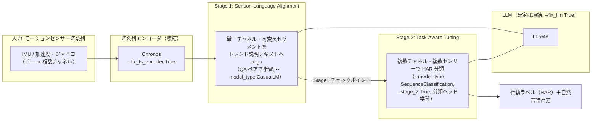

# SensorLLM（モーションセンサー時系列 × LLM）を実際に動かして、センサー信号からの行動認識（HAR）を行う

IMU（加速度・ジャイロ）などのモーションセンサー時系列を LLM に接続し、**人間が読める行動認識（HAR: Human Activity Recognition）**を行う代表的手法 [**SensorLLM**](https://github.com/cruiseresearchgroup/SensorLLM)（UNSW ほか, EMNLP 2025 Main）を、公式実装で実際に動かす手順をまとめる。

SensorLLM は、[時系列基盤モデル（Chronos）＋ LLM の 2 段構成でセンサー異常検知を行う Tip](https://github.com/Yagami360/ai-product-dev-tips/tree/master/nlp_processing/67) と同じく **Chronos を時系列エンコーダに使う**が、目的が異なる。67 が「Chronos で検知 → LLM で説明」という**推論時の役割分担**であるのに対し、SensorLLM は **センサーエンコーダ（Chronos）＋特殊トークンで LLM 側にセンサー表現を align する 2 段学習**（下表の系統 B）で、数値時系列そのものを LLM に「理解」させて HAR SOTA を狙う手法である。

> **⚠️ 先に結論（この Tip の一番の注意点）**: SensorLLM の**公式リポジトリ（[`cruiseresearchgroup/SensorLLM`](https://github.com/cruiseresearchgroup/SensorLLM), EMNLP 2025 の公式実装）は学習・評価・推論コードと依存をフル公開している**が、**著者の学習済みチェックポイントは配布されていない**（GitHub Releases 0 件・README に配布リンク無し）。つまり公式重みで「ロードしてすぐ推論」はできず、**Chronos エンコーダ＋LLaMA を用意して 2 段学習を自分で回す**のが基本（学習は bf16 + flash-attn 前提で **Ampere 以降の GPU が必須**）。
>
> ただし本 Tip では、**学習をスキップして推論だけ試す近道**も用意した（[後述](#学習をスキップして推論だけ試す非公式チェックポイント--predictpy)）: HF 上の**非公式** Stage1 チェックポイント（`1EE1/SensorLLM-Stage1-Backup`）を同梱の [`predict.py`](predict.py) でロードして単一サンプル推論する方法で、こちらは **T4/V100 でも `--dtype float16` で動く**（小型 1.1B ベースのため）。手軽に試すだけなら、学習済み 7B/13B とデータセットが公開されている [LLaSA](https://github.com/BASHLab/LLaSA) も選択肢。（公開状況は 2026-07-14 時点）

## センサー信号を LLM に接続する 5 系統の中での位置づけ

SensorLLM は、センサー専用エンコーダを LLM に align する**系統 B** の代表手法。

| 系統 | 中身 | 代表 | この Tip |
|------|------|------|---------|
| A. プロンプト直入力（訓練なし） | 生センサー値をテキスト化して LLM に直接推論させる | HARGPT, IoT-LLM | ― |
| **B. エンコーダ＋LLM アラインメント** | センサー専用エンコーダ＋特殊トークンで LLM へ接続し、2 段（align → task tuning）で学習 | **SensorLLM**, LLaSA | ★本 Tip |
| C. センサー言語基盤モデル | 大規模なセンサー–言語ペアで対照＋生成事前学習 | SensorLM（Google） | ― |
| D. マルチモーダル埋め込み統合 | センサー（IMU）を既存モダリティ空間へ bind し検索・対応付け | ImageBind, IMU2CLIP | ― |
| E. 時系列基盤モデル | センサーを含む汎用時系列の予測基盤（言語結合は限定的） | Chronos, TimesFM（[nlp_processing/67](https://github.com/Yagami360/ai-product-dev-tips/tree/master/nlp_processing/67) が該当） | ― |

## SensorLLM の 2 段構成（アーキテクチャ）



- **Stage 1（センサー・言語アラインメント）**: **単一チャネル・可変長**のセンサーセグメントを、トレンドベースの自然言語説明に対応づける QA 学習。センサー表現を LLM の言語空間に揃えるのが目的。
- **Stage 2（タスク適応チューニング）**: **複数チャネル・複数センサー**を扱い、下流の HAR 分類を行う。Stage 1 の出力を初期値に、`SequenceClassification` として分類ヘッドを学習する。
- **凍結の考え方**: 既定では LLM（`--fix_llm True`）と時系列エンコーダ（`--fix_ts_encoder True`）を凍結し、主にアラインメント／分類ヘッドを学習する（Stage 2 では `--fix_cls_head False`）。

## 公開状況の整理（何が提供され、何が無いか）

| リソース | 公開 | 内容 |
|---|:---:|---|
| 学習・評価・推論コード | ✅ | `sensorllm/` に train / eval / model / data 一式（`train_mem.py`, `eval.py`, Chronos エンコーダ実装） |
| 実行例ノートブック | ✅ | [`mhealth_stage1.ipynb`](https://github.com/cruiseresearchgroup/SensorLLM/blob/main/mhealth_stage1.ipynb) / [`mhealth_stage2.ipynb`](https://github.com/cruiseresearchgroup/SensorLLM/blob/main/mhealth_stage2.ipynb)（QA ペア生成例） |
| 依存定義 | ✅ | `requirements.txt`（`torch==2.4.1`, `transformers==4.45.1`, `flash_attn==2.6.3` 等・固定） |
| 対応データセット | ✅（各自 DL） | USC-HAD / UCI-HAR / MHealth / Capture-24 / PAMAP2（リポジトリ非同梱） |
| バックボーン | ✅（外部） | 時系列 = Chronos（公開）、言語 = LLaMA（HF で利用同意の上 DL） |
| **著者の学習済みチェックポイント** | ❌ | **GitHub Releases 0 件・README に配布リンク無し** |

> **HF 上の「SensorLLM」モデルは全て非公式**（著者公式ではなく第三者の派生／バックアップ）で、信頼性は担保されない。公式の学習済み重みは存在しない前提で、下記の 2 段学習を自分で回すのが基本方針。

## 必要リソース（事前チェックリスト）

1. **GPU**: **2 段学習は Ampere 以降が必須**（`train_mem.py` が flash-attn 2 のモンキーパッチを強制 import。flash-attn 2 は Turing/Volta 非対応、bf16 も非対応のため T4・V100 では学習不可）。一方**推論（`eval.py` / 後述の `predict.py`）は flash-attn を import しない**ので、`--dtype float16` にすれば T4・V100 でも動く（下表参照）。VRAM はベース LLaMA サイズに依存。<br><br>

    | 用途 | 最低ライン | 目安 |
    |---|---|---|
    | 2 段学習（LLM 凍結でも） | A100 40GB 級（Ampere+） | 論文はマルチ GPU（`torchrun`）。単一 A100 40GB でも小規模データなら可 |
    | 推論・小型 ckpt（後述の非公式 TinyLlama-1.1B ベース） | 8〜16GB（T4/V100 でも fp16 で可） | 本体 約 2GB + Chronos 約 1.5GB |
    | 推論・Llama-3-8B ベース | 24GB（Ampere 推奨） | bf16 推論で約 16GB + Chronos |
1. **ベース LLM**: LLaMA 系（Hugging Face で利用同意の上ダウンロード）。既定では `--fix_llm True` で LLM は凍結され、学習は主にアラインメント／分類ヘッド。
1. **時系列エンコーダ**: Chronos のチェックポイント（公開。`--pt_encoder_backbone_ckpt` に指定）。
1. **データ**: 対応 5 データセット（USC-HAD / UCI-HAR / MHealth / Capture-24 / PAMAP2）のいずれかを各配布元から DL ＋ ノートブックで QA ペアを生成。他データセットに適用する場合は [`ts_backbone.yaml`](https://github.com/cruiseresearchgroup/SensorLLM/blob/main/sensorllm/model/ts_backbone.yaml) の該当エントリ修正と [`./sensorllm/data`](https://github.com/cruiseresearchgroup/SensorLLM/tree/main/sensorllm/data) のデータ読み込み実装の調整が必要。

## 使用方法

> コマンド中の `[...]` は各自の環境に合わせて置き換えるプレースホルダ。以下は公式 README（2026-07-14 時点）のコマンドに準拠している。

1. リポジトリを clone して依存をインストールする

    ```sh
    git clone https://github.com/cruiseresearchgroup/SensorLLM
    cd SensorLLM
    pip install -r requirements.txt   # torch==2.4.1 / transformers==4.45.1 / flash_attn==2.6.3 等（固定）
    ```

1. バックボーンと HAR データセットを用意する

    - 時系列エンコーダ = Chronos のチェックポイント、言語モデル = LLaMA 重み（HF で利用同意の上 DL）を配置する。
    - HAR データセット（例: MHealth）を配布元から DL する。

1. センサー–言語 QA ペアを生成する（ノートブック）

    - `mhealth_stage1.ipynb`: 単一チャネルセグメントをトレンドベースの自然言語説明に対応づけた **Stage 1 用 QA ペア**を生成する。
    - `mhealth_stage2.ipynb`: 複数チャネルで HAR 分類を行う **Stage 2 用の統計情報テキスト**を生成する。
    - QA テンプレートはノートブック内でカスタマイズ・拡張できる。

1. Stage 1: センサー–言語アラインメントを学習する

    ```bash
    torchrun --nproc_per_node=[NUM_GPUS] sensorllm/train/train_mem.py \
      --model_name_or_path [LLM_PATH] \
      --pt_encoder_backbone_ckpt [TS_EMBEDDER_PATH] \
      --tokenize_method 'StanNormalizeUniformBins' \
      --dataset [DATASET_NAME] \
      --data_path [TS_TRAIN_PATH] --eval_data_path [TS_EVAL_PATH] \
      --qa_path [QA_TRAIN_PATH] --eval_qa_path [QA_EVAL_PATH] \
      --output_dir [OUTPUT_PATH] \
      --model_max_length [MAX_LEN] --num_train_epochs [EPOCH] \
      --per_device_train_batch_size [TRAIN_BATCH] --per_device_eval_batch_size [EVAL_BATCH] \
      --evaluation_strategy "steps" --save_strategy "steps" \
      --learning_rate 2e-3 --weight_decay 0.0 --warmup_ratio 0.03 --lr_scheduler_type "cosine" \
      --gradient_checkpointing True --bf16 True \
      --fix_llm True --fix_ts_encoder True \
      --model_type CasualLM --load_best_model_at_end True
    ```

1. Stage 1 の評価／推論を行う

    ```bash
    python sensorllm/eval/eval.py \
      --model_name_or_path [STAGE1_MODEL_PATH] \
      --pt_encoder_backbone_ckpt [TS_EMBEDDER_PATH] \
      --torch_dtype bfloat16 \
      --tokenize_method 'StanNormalizeUniformBins' \
      --dataset [DATASET_NAME] \
      --data_path [TS_DATASET_PATH] --qa_path [QA_DATASET_PATH] \
      --output_file_name [OUTPUT_FILE_NAME] \
      --model_max_length [MAX_LEN] --shuffle False
    ```

1. Stage 2: タスク適応チューニング（HAR 分類）を学習する

    ```bash
    torchrun --nproc_per_node=[NUM_GPUS] sensorllm/train/train_mem.py \
      --model_name_or_path [STAGE1_MODEL_PATH] \
      --pt_encoder_backbone_ckpt [TS_EMBEDDER_PATH] \
      --model_type "SequenceClassification" --num_labels [ACTIVITY_NUM] --use_weighted_loss True \
      --tokenize_method 'StanNormalizeUniformBins' \
      --dataset [DATASET_NAME] \
      --data_path [TS_TRAIN_PATH] --eval_data_path [TS_EVAL_PATH] \
      --qa_path [QA_TRAIN_PATH] --eval_qa_path [QA_EVAL_PATH] \
      --output_dir [OUTPUT_PATH] \
      --learning_rate 2e-3 --weight_decay 0.0 --warmup_ratio 0.03 --lr_scheduler_type "cosine" \
      --gradient_checkpointing True --bf16 True \
      --fix_llm True --fix_ts_encoder True --fix_cls_head False \
      --metric_for_best_model "f1_macro" --greater_is_better True \
      --preprocess_type "smry+Q" --stage_2 True --shuffle True
    ```

    - `--preprocess_type` の全オプションは [`./sensorllm/data/utils.py`](https://github.com/cruiseresearchgroup/SensorLLM/blob/main/sensorllm/data/utils.py) を参照。

<!-- TODO: 実際に 2 段学習を回した際の HAR 精度（f1_macro など）やログ・スクショが得られたら、ここに「実行結果」セクションとして追記する -->

## 学習をスキップして推論だけ試す（非公式チェックポイント + `predict.py`）

公式重みは無いが、**HF 上には第三者による非公式 Stage1 チェックポイントがある**ため、これを使えば 2 段学習をスキップして推論だけ試せる。3 つの候補のうち、公式クラス `SensorLLMStage1LlamaForCausalLM` にそのままロードできるのは **`1EE1/SensorLLM-Stage1-Backup`**（MHealth で学習された Stage1 フル重み・**TinyLlama-1.1B 系ベース**、`architectures` が公式クラスと一致、`<ts>`/`<chest_*>` 等の特殊トークン込み）である。

| 非公式 ckpt | ベース | この Tip で使うか |
|---|---|---|
| **`1EE1/SensorLLM-Stage1-Backup`** | TinyLlama-1.1B 系（LLaMA） | ✅ 公式 Stage1 クラスに素直にロード可 |
| `pixelworld17/sensorllm-lora` | Llama-3.2-1B（LoRA アダプタのみ） | △ base + PEFT マージが別途必要 |
| `Ganlen233/sensorllm` | Qwen3 系 | ✗ 公式クラスは LLaMA 専用で非互換 |

> **⚠️ 非公式のため信頼性は担保されない**。あくまで「配線が動くか」を確認するデモ用途で、本番評価には自分で 2 段学習した重みを使うこと。

同梱の [`predict.py`](predict.py) は、公式 `eval.py` のモデルロード・生成フローに忠実に、**1 チャネル分のセンサー時系列を Chronos で埋め込み → Stage1 モデルでその信号のトレンドを自然言語説明させる**単一サンプル推論を行う。

- 追加した Python コードの主なポイント
    - [`predict.py`](predict.py): 公式リポジトリの `sensorllm` パッケージを import して使う（`PYTHONPATH` に clone 先を通す）。
        - `load_model()`: `eval.py` の `init_model()` と同じ手順で、Stage1 重み＋Chronos バックボーン（既定 `amazon/chronos-t5-large`）をロードし、特殊トークン／チャネル設定をデータセットに合わせて初期化。
        - `build_prompt()`: `stage1_dataset.py` の `preprocess_time_series2` と同じ規則で、`start_token + <ts>×(Chronos トークン長+1) + end_token + 質問` のプロンプトと、`chronos_tokenizer.context_input_transform()` による ts トークンを構築。プレースホルダ数は生系列長ではなく Chronos の実出力トークン長から数えるため、context_length（既定 512）超の入力でも埋め込み数と一致する。
        - `--dtype {bfloat16,float16,float32}`: T4/V100 では `float16` を指定。`--input <1次元 .npy>` で自前のセンサー系列も使える（未指定なら合成波形）。
    - 実行スクリプト: [`run_predict.sh`](run_predict.sh)（公式リポジトリの clone → 依存インストール → 推論）。

1. GPU 環境で実行する（推論は T4/V100 でも `--dtype float16` で可、A100 等は `bfloat16`）

    ```sh
    sh run_predict.sh
    # もしくは、公式リポジトリを clone 済みなら直接:
    #   PYTHONPATH=./SensorLLM python predict.py --dataset mhealth --dtype bfloat16 --device cuda
    ```

<!-- TODO: A100 等で predict.py を実行した際の出力（センサー信号のトレンド説明テキスト）が得られたら、ここに「実行結果」として貼り付ける。作成環境（GPU 無し・Python 3.7）では実行検証できていない -->

## 注意点・課題

- **公式の学習済み重みが無い**: 前述の通りゼロショットで即推論はできず、**Chronos ＋ LLaMA を用意して 2 段学習を自前で回す**必要がある。GPU（Ampere 以降）・データ整備・LLaMA の利用同意が前提。
- **⚠️ 業務利用で要注意なライセンス**: **ソースコードは MIT** で利用しやすいが、**成果物（work）は CC BY-NC-SA 4.0（非商用）**。→ 製品への商用組み込みには制約があり、商用検証に進む場合は非商用条項の扱い（著者への問い合わせ、または手法だけ参考に自前実装）を先に整理すべき。ベースラインとして含まれる各手法（LLaMA / Chronos 等）のライセンスも各公式リポジトリで確認する。
- **手軽さ比較**: 「配布済みモデルをロードしてすぐ推論」はできず GPU で 2 段学習が前提。**手軽に試すなら、学習済み 7B/13B ＋データセットが公開されている [LLaSA](https://github.com/BASHLab/LLaSA)** の方が起動ハードルは低い（GPT-4o-mini 超えを主張）。
- **数値表現のギャップ**: LLM は数値列の微細パターンを取りこぼしやすく、これが系統 A（テキスト化）に対して SensorLLM のような系統 B（専用エンコーダ＋align）が優位になる根本理由。
- **後発手法**: SensorLLM 以降、同じ研究グループから training-free の [ZARA](https://arxiv.org/abs/2508.04038)（ACL 2026 Oral）や、合成 IMU 生成・motion-language 整合を統合した AnyMo なども出ている。用途に応じて比較検討するとよい。

## 参考サイト

- https://github.com/cruiseresearchgroup/SensorLLM （SensorLLM 公式実装, ソースコード MIT）
- https://arxiv.org/abs/2410.10624 （論文: SensorLLM: Aligning Large Language Models with Motion Sensors for Human Activity Recognition, EMNLP 2025 Main）
- https://aclanthology.org/2025.emnlp-main.19/ （ACL Anthology 掲載ページ）
- https://github.com/amazon-science/chronos-forecasting （時系列エンコーダに使う Chronos の公式実装, Apache-2.0）
- https://huggingface.co/1EE1/SensorLLM-Stage1-Backup （`predict.py` で使う**非公式**の Stage1 チェックポイント。著者公式ではない点に注意）
- https://github.com/BASHLab/LLaSA （手軽に試せる代替: LLaSA。学習済み 7B/13B ＋データセット公開）
- https://arxiv.org/abs/2508.04038 （後発の training-free 手法 ZARA, ACL 2026 Oral）
