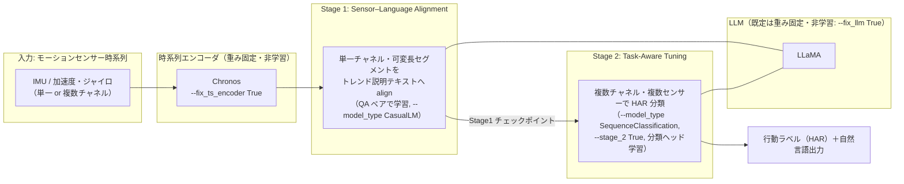
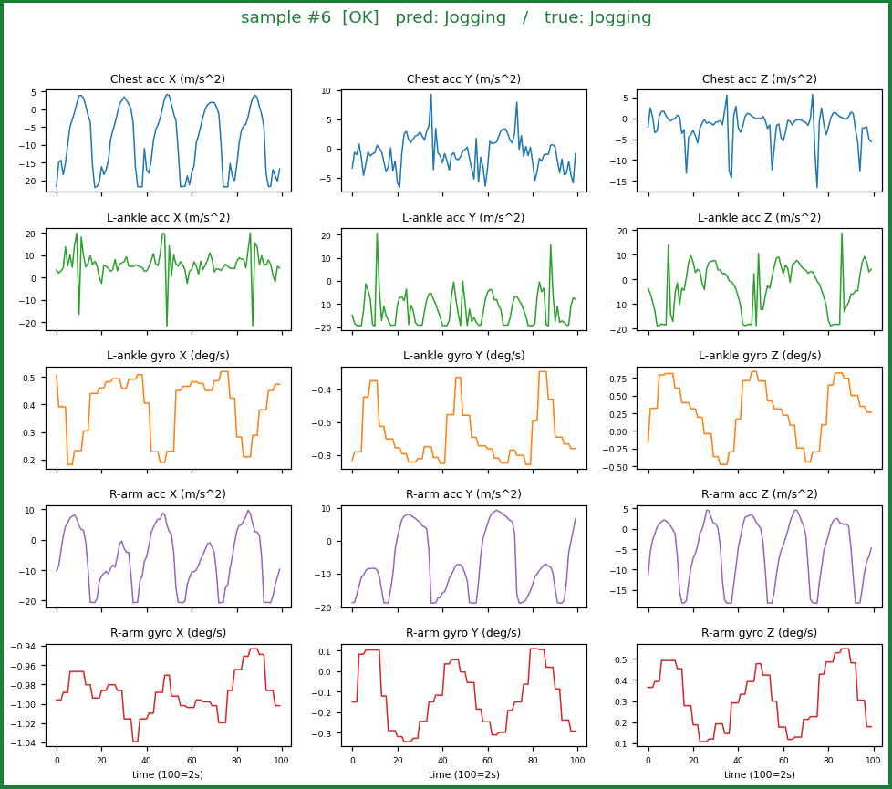
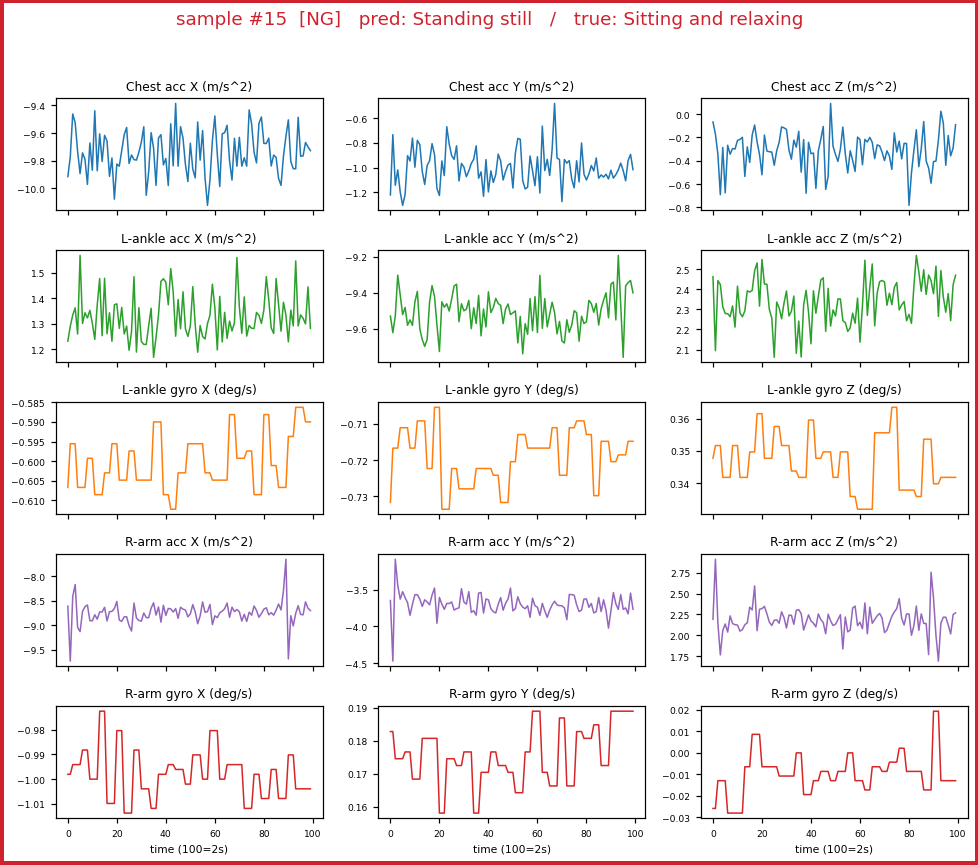

# SensorLLM を使用して、モーションセンサー信号からの行動認識（HAR）を行う

IMU（加速度・ジャイロ）などのモーションセンサー時系列を LLM に接続し、**人間が読める行動認識（HAR: Human Activity Recognition）**を行う代表的手法 [**SensorLLM**](https://github.com/cruiseresearchgroup/SensorLLM)（UNSW ほか, EMNLP 2025 Main）を、公式実装で実際に動かす手順をまとめる。動作には **NVIDIA A100（GPU メモリ 40GB）** を使用（学習コードが flash-attn 2 を使うため、学習時は Ampere 世代以降が必須）。

SensorLLM は、[時系列基盤モデル（Chronos）＋ LLM の 2 段構成でセンサー異常検知を行う Tip](https://github.com/Yagami360/ai-product-dev-tips/tree/master/nlp_processing/67) と同じく **Chronos を時系列エンコーダに使う**が、目的が異なる。67 が「Chronos で検知 → LLM で説明」という**推論時の役割分担**であるのに対し、SensorLLM は **センサーエンコーダ（Chronos）＋特殊トークンで LLM 側にセンサー表現を align する 2 段学習**（下表の系統 B）で、数値時系列そのものを LLM に「理解」させて HAR SOTA を狙う手法である。

> **⚠️ 注意点**: SensorLLM の**公式リポジトリ（[`cruiseresearchgroup/SensorLLM`](https://github.com/cruiseresearchgroup/SensorLLM), EMNLP 2025 の公式実装）は学習・評価・推論コードと依存をフル公開している**が、**著者の学習済みチェックポイントは配布されていない**（GitHub Releases 0 件・README に配布リンク無し）。つまり公式重みで「ロードしてすぐ推論」はできず、**Chronos エンコーダ＋LLaMA を用意して 2 段学習を自分で回す**のが基本（学習は bf16 + flash-attn 前提で **Ampere 以降の GPU が必須**）。
>
> ただし本 Tip では、**学習をスキップして推論だけ試す近道**も用意した（[後述](#stage-1-の推論手順)）: HF 上の**非公式** Stage1 チェックポイント（`1EE1/SensorLLM-Stage1-Backup`）を同梱の [`predict_stage1.py`](predict_stage1.py) でロードして単一サンプル推論する方法で、こちらは **T4/V100 でも `--dtype float16` で動く**（小型 1.1B ベースのため）。手軽に試すだけなら、学習済み 7B/13B とデータセットが公開されている [LLaSA](https://github.com/BASHLab/LLaSA) も選択肢。（公開状況は 2026-07-14 時点）

## 📑 目次

- [SensorLLM の位置づけとアーキテクチャ](#-sensorllm-の位置づけとアーキテクチャ)
- [使用方法](#-使用方法)
    - [Stage 1 の推論手順](#stage-1-の推論手順)
    - [Stage 2 の推論手順（HAR 分類・要 2 段学習）](#stage-2-の推論手順har-分類要-2-段学習)
- [実行結果](#-実行結果)
    - [Stage 1 の実行結果（GPU / A100 40GB で検証）](#stage-1-の実行結果gpu--a100-40gb-で検証)
    - [Stage 2 の実行結果（GPU / A100 40GB で検証）](#stage-2-の実行結果gpu--a100-40gb-で検証)
- [開発者向け情報](#-開発者向け情報)
- [参考サイト](#-参考サイト)

## 🏗️ SensorLLM の位置づけとアーキテクチャ

### SensorLLM のアーキテクチャ

公式のモデル図（論文 [arXiv:2410.10624](https://arxiv.org/abs/2410.10624) / [公式リポジトリ](https://github.com/cruiseresearchgroup/SensorLLM) より）:


本 Tip 用に、上図を推論経路中心に簡略化すると次の 2 段構成になる:



- **Stage 1（センサー・言語アラインメント）**: **単一チャネル・可変長**のセンサーセグメントを、トレンドベースの自然言語説明に対応づける QA 学習。センサー表現を LLM の言語空間に揃えるのが目的。
- **Stage 2（タスク適応チューニング）**: **複数チャネル・複数センサー**を扱い、下流の HAR 分類を行う。Stage 1 の出力を初期値に、`SequenceClassification` として分類ヘッドを学習する。
- **重み固定の考え方**: 既定では LLM（`--fix_llm True`）と時系列エンコーダ（`--fix_ts_encoder True`）を重み固定（非学習）にし、主にアラインメント／分類ヘッドを学習する（Stage 2 では `--fix_cls_head False`）。

### 公開状況の整理（何が提供され、何が無いか）

公式リポジトリは **学習・評価・推論コード / 依存定義 / QA 生成ノートブックをフル公開**（`train_mem.py`, `eval.py`, Chronos 実装, `mhealth_stage*.ipynb`）。ただし **著者の学習済みチェックポイントは非配布**（GitHub Releases 0 件）。対応データセット（USC-HAD / UCI-HAR / MHealth / Capture-24 / PAMAP2）とバックボーン（Chronos / LLaMA）は各自 DL。

> **公式重みで「即推論」はできない**。HF 上の「SensorLLM」モデルは全て非公式（第三者の派生）。基本は自分で 2 段学習を回す（または非公式 Stage1 ckpt で推論だけ試す）。

## 🚀 使用方法

### Stage 1 の推論手順

公式の学習済み重みは無いが、**HF 上の非公式 Stage1 ckpt `1EE1/SensorLLM-Stage1-Backup`**（MHealth 学習・**TinyLlama-1.1B 系ベース**・公式クラス `SensorLLMStage1LlamaForCausalLM` と互換）を使えば、2 段学習をスキップして推論だけ試せる。この Tip では **uv + Docker + Makefile** 一式を同梱し、GPU 実行を再現できるようにしている。

| 非公式 ckpt | ベース | この Tip で使うか |
|---|---|---|
| **`1EE1/SensorLLM-Stage1-Backup`** | TinyLlama-1.1B 系（LLaMA） | ✅ 公式 Stage1 クラスに素直にロード可 |
| `pixelworld17/sensorllm-lora` | Llama-3.2-1B（LoRA アダプタのみ） | △ base + PEFT マージが別途必要 |
| `Ganlen233/sensorllm` | Qwen3 系 | ✗ 公式クラスは LLaMA 専用で非互換 |

> **⚠️ 非公式のため信頼性は担保されない**。あくまで「配線が動くか」を確認するデモ用途で、本番評価には自分で 2 段学習した重みを使うこと。

1. HF トークンを設定する（**Xet DL の 403 回避に実質必須**、下記注意点参照）

    ```sh
    cp .env.sample .env    # .env に HF_TOKEN=hf_... を記入
    ```

1. イメージをビルドする（SensorLLM clone + 依存を焼き込み）

    ```sh
    make docker-build
    ```

1. モデルを取得する（認証付きなら標準 CLI でそのまま取得できる）

    ```sh
    make download-model
    ```

1. 推論を実行する（A100 等・bfloat16）

    ```sh
    make predict-stage1
    ```

> **⚠️ HF Xet ダウンロードの注意（実機で判明）**: 1EE1 のような Xet 配信リポジトリは、**匿名（トークン無し）だと** HF の CDN エッジ `us.gcp.cdn.hf.co` が署名鍵を `403 SignatureError: invalid key pair id` で拒否し、取得がハングすることがある（HF 側の一過性インフラ問題）。**`.env` に `HF_TOKEN` を設定すれば** resolve が正常な `cas-bridge.xethub.hf.co` に振られて回避できる（実測: 認証時は 10/10 成功、匿名時は約 9 割が 403）。

- `predict_stage1.py` の主なポイント
    - `load_model()`: `eval.py` の `init_model()` と同じ手順で Stage1 重み＋Chronos バックボーンをロードし、特殊トークン／チャネル設定をデータセットに合わせて初期化。
    - `build_prompt()`: `stage1_dataset.py` の `preprocess_time_series2` と同じ規則で `start_token + <ts>×(Chronos トークン長) + end_token + 質問` を構築。`<ts>` 数は生系列長ではなく **Chronos の実出力トークン長（EOS 込み `min(系列長, 512)+1`）に一致**させるため、context_length（既定 512）超の入力でも埋め込み数と一致する（実機で L=200/512/600/1000 を検証）。
    - `--dtype {bfloat16,float16,float32}` / `--device {cuda,cpu}`: A100 等は `bfloat16`、T4/V100 は `float16`、CPU なら `float32`。`--input <1次元 .npy>` で自前のセンサー系列も使える（未指定なら合成波形）。
    - **1EE1 ckpt は `chronos-t5-base`（d_model=768）で学習**されている。公式 `ts_backbone.yaml` の既定は `chronos-t5-large`(1024) で、そのままだと `ts_proj` で size mismatch になるため、`Dockerfile` で base/768 に調整済み（自分で学習した重みは、その学習時の Chronos サイズに合わせる）。

### Stage 2 の推論手順（HAR 分類・要 2 段学習）

> **最終的な目的が HAR 分類（行動ラベル予測）＝ Stage 2 の推論**なら、公開の Stage 2 重みが無いため、Stage 1（センサー–言語アラインメント）→ Stage 2（タスク適応チューニング）の 2 段学習で自分で Stage 2 モデルを作る必要がある。Stage 1 のトレンド説明だけでよければ本節は不要（前述の「[Stage 1 の推論手順](#stage-1-の推論手順)」で完結）。
>
> 公式リポジトリはデータ整形を Jupyter ノートブック（`mhealth_stage1.ipynb` / `mhealth_stage2.ipynb`）で行う想定だが、**手作業を無くすため本 Tip ではノートブック相当の Python スクリプト（[`create_dataset_stage1.py`](create_dataset_stage1.py) / [`create_dataset_stage2.py`](create_dataset_stage2.py)）と make ターゲットを用意し、データ生成 → 2 段学習 → HAR 推論までを自動化**した。依存・SensorLLM 本体・評価メトリクス（f1/accuracy 等）はイメージに同梱済みなので、手動の `git clone` / `pip install` は不要。

**以下は A100 40GB での実機検証済みフロー**（`make docker-build` → `make download-model` 済み前提）。

1. **学習用データ + QA ペアを生成**（GPU 不要・CPU で数分）

    ```sh
    make create-train-data
    ```

    MHealth（UCI 319, 全 10 被験者）を DL し、公式ノートと同じ前処理で以下を出力する（`create_dataset_stage1.py` / `create_dataset_stage2.py` を順に実行）。パスは make 側に既定値を埋めてあるので、以降のコマンドで指定不要。
    - `./datasets/mhealth_stage2/{train,test}/mhealth_*_stage2*.{pkl,json}`: **Stage 2 用**（15 チャネル × HAR 分類ラベル）※本フローで必須
    - `./datasets/mhealth_stage1/{train,test}/mhealth_*_stage1.{pkl,json}`: Stage 1 用（単一チャネル × トレンド説明 QA）※下記「自分で Stage 1 を学習する」場合のみ必要

1. **Stage 2 の初期値（Stage 1 モデル）を用意する**

    Stage 2 は Stage 1（アラインメント済み）モデルを初期値に学習する。**本フローでは、Stage 1 推論で使った学習済み ckpt `1EE1/SensorLLM-Stage1-Backup`（`make download-model` で取得済みの `checkpoints/ckpt_1EE1/`）をそのまま Stage 1 初期値に流用する**（MHealth 学習済みの Stage 1 モデルなので、Stage 1 学習を丸ごとスキップできる）。

    <details>
    <summary>自分で Stage 1 から学習する場合（任意・数時間〜）</summary>

    ```sh
    make train-stage1 LLM_PATH=TinyLlama/TinyLlama-1.1B-Chat-v1.0 EPOCHS=1 STAGE1_OUT=/app/checkpoints/sensorllm_stage1
    ```

    base LLM は open な TinyLlama 等（gated な meta-llama を使う場合は `.env` の `HF_TOKEN` に利用同意済みトークンを設定）。学習済み重みは `checkpoints/sensorllm_stage1/` に保存され、次段の `STAGE2_INIT` に指定できる。Stage 1 は単一チャネル QA のため学習サンプルが多く、全 10 被験者・1 epoch でも A100 で数時間かかる。

    </details>

1. **Stage 2（タスク適応チューニング・HAR 分類）を学習**（全 10 被験者・8 epoch）

    ```sh
    make train-stage2 STAGE2_INIT=/app/checkpoints/ckpt_1EE1 NUM_LABELS=12 EPOCHS=8 STAGE2_OUT=/app/checkpoints/sensorllm_stage2
    ```

    Stage 1 モデル（既定は `checkpoints/ckpt_1EE1`。自分で学習した場合は `/app/checkpoints/sensorllm_stage1`）を初期値に `SequenceClassification`（分類ヘッド）を学習。`checkpoints/sensorllm_stage2/`（`model.safetensors` ほか）に保存される。`--save_total_limit`（既定 2）で ckpt 数を制限し、多エポックでも容量が溢れないようにしている。

1. **Stage 2 の推論（HAR を 12 クラス分類）**

    ```sh
    make predict-stage2 STAGE2_MODEL=./checkpoints/sensorllm_stage2 NUM_SAMPLES=16
    ```

    学習済み Stage 2 モデルに MHealth の test 窓（15ch × 100 点）を入力し、行動ラベルを予測して正解と突き合わせる（[`predict_stage2.py`](predict_stage2.py)）。実測結果は次節「[Stage 2 の実行結果](#stage-2-の実行結果gpu--a100-40gb-で検証)」を参照。

<details>
<summary>参考: make が内部で実行している生コマンド（torchrun）</summary>

学習は公式の `train_mem.py`（flash-attn 2 使用。wheel をイメージに焼き込み済み）を使う。`train.py` は相対で `./sensorllm/model/ts_backbone.yaml` と `../metrics/*` を開くため **`cwd=/opt/SensorLLM` で実行**し、`uv` には `--project /app`（`pyproject.toml`/venv の場所）を渡す。

Stage 1（アラインメント）:

```bash
cd /opt/SensorLLM && uv run --project /app torchrun --nproc_per_node=1 \
  /opt/SensorLLM/sensorllm/train/train_mem.py \
  --model_name_or_path TinyLlama/TinyLlama-1.1B-Chat-v1.0 --pt_encoder_backbone_ckpt /app/checkpoints/chronos_t5_base \
  --tokenize_method 'StanNormalizeUniformBins' --dataset mhealth \
  --data_path /app/datasets/mhealth_stage1/train/mhealth_train_data_stage1.pkl \
  --eval_data_path /app/datasets/mhealth_stage1/test/mhealth_test_data_stage1.pkl \
  --qa_path /app/datasets/mhealth_stage1/train/mhealth_train_qa_stage1.json \
  --eval_qa_path /app/datasets/mhealth_stage1/test/mhealth_test_qa_stage1.json \
  --output_dir /app/checkpoints/sensorllm_stage1 --bf16 True --fix_llm True --fix_ts_encoder True \
  --model_type CasualLM --load_best_model_at_end True
```

Stage 2（HAR 分類）:

```bash
cd /opt/SensorLLM && uv run --project /app torchrun --nproc_per_node=1 \
  /opt/SensorLLM/sensorllm/train/train_mem.py \
  --model_name_or_path /app/checkpoints/sensorllm_stage1 --pt_encoder_backbone_ckpt /app/checkpoints/chronos_t5_base \
  --model_type "SequenceClassification" --num_labels 12 --use_weighted_loss True \
  --tokenize_method 'StanNormalizeUniformBins' --dataset mhealth \
  --data_path /app/datasets/mhealth_stage2/train/mhealth_train_data_stage2.pkl \
  --eval_data_path /app/datasets/mhealth_stage2/test/mhealth_test_data_stage2.pkl \
  --qa_path /app/datasets/mhealth_stage2/train/mhealth_train_qa_stage2_cls.json \
  --eval_qa_path /app/datasets/mhealth_stage2/test/mhealth_test_qa_stage2_cls.json \
  --output_dir /app/checkpoints/sensorllm_stage2 --bf16 True --fix_llm True --fix_ts_encoder True --fix_cls_head False \
  --metric_for_best_model "f1_macro" --preprocess_type "smry+Q" --stage_2 True --shuffle True
```

`--preprocess_type` の全オプションは [`./sensorllm/data/utils.py`](https://github.com/cruiseresearchgroup/SensorLLM/blob/main/sensorllm/data/utils.py) を参照。

</details>

## 📊 実行結果

### Stage 1 の実行結果（GPU / A100 40GB で検証）

複数の実センサーデータ（各 200 点・1 チャネル）を `c_acc_x` チャネル扱いで Stage1 推論した結果。質問は共通で **`What is the overall trend of this sensor reading?`（このセンサー信号の全体的なトレンドは？）**。A100 / bfloat16。出力は非公式重みによるもので、内容の妥当性は保証されない。

#### (A) in-domain: SensorLLM が想定するモーションセンサー（MHealth 胸部加速度 `c_acc_x`）

`make create-sample-data` が UCI から取得する MHealth の実データ。歩行 / 走行 / 静止の 3 活動を試すと、**周期的な加速度の上下を区間ごとにトレンド説明**できる（学習ドメイン内。走行は歩行より周期が速く、静止はほぼ平坦で微小変化）。

| 活動 | 入力波形 | 入力プロンプト（質問） | 出力（全文, max_new_tokens=160） |
|---|---|---|---|
| 歩行 Walking |  | `What is the overall trend of this sensor reading?`<br>（このセンサー信号の全体的なトレンドは？） | 0.0s→0.12s: ascending<br>0.12s→0.14s: descending<br>0.14s→0.18s: ascending<br>0.18s→0.24s: descending<br>0.24s→0.3s: ascending<br>0.3s→0.32s: descending<br>0.32s→0.36s: ascending<br>0.36s→0.46s: descending<br>0.46s→0.54s: ascending<br>0.54s→0.62s: descending<br>…（周期的に交互） |
| 走行 Running |  | `What is the overall trend of this sensor reading?`<br>（このセンサー信号の全体的なトレンドは？） | 0.0s→0.02s: rising<br>0.02s→0.14s: falling<br>0.14s→0.2s: rising<br>0.2s→0.24s: falling<br>0.24s→0.32s: rising<br>0.32s→0.42s: falling<br>0.42s→0.48s: rising<br>0.48s→0.54s: falling<br>0.54s→0.56s: rising<br>0.56s→0.62s: falling<br>…（歩行より速い周期） |
| 静止 Standing |  | `What is the overall trend of this sensor reading?`<br>（このセンサー信号の全体的なトレンドは？） | 0.0s→0.02s: increasing<br>0.02s→0.04s: decreasing<br>0.04s→0.06s: increasing<br>0.06s→0.08s: decreasing<br>0.08s→0.1s: increasing<br>0.1s→0.12s: decreasing<br>0.12s→0.14s: increasing<br>0.14s→0.16s: decreasing<br>0.16s→0.18s: increasing<br>0.18s→0.22s: decreasing<br>…（微小・ほぼ平坦） |

#### (B) in-domain ＋ 異常データ: モーションセンサーにスパイク異常を注入

MHealth 歩行の `c_acc_x` の step≈100 に、通常域（約 -6〜-15）を大きく外れる**スパイク異常（+20）を注入**した実データ。異常は目視で明らか（下図の突出）だが、**モデルは前後と同じくトレンド説明を続けるだけで、スパイクを異常として指摘しない**。

| 系列 | 入力波形 | 入力プロンプト（質問） | 出力（全文, max_new_tokens=200） |
|---|---|---|---|
| 歩行＋スパイク注入（step≈100） |  | `What is the overall trend of this sensor reading?`<br>（このセンサー信号の全体的なトレンドは？） | 0.0s→0.06s: upward<br>0.06s→0.1s: downward<br>0.1s→0.12s: upward<br>0.12s→0.2s: downward<br>0.2s→0.3s: upward<br>0.3s→0.4s: downward<br>0.4s→0.42s: upward<br>0.42s→0.44s: downward<br>…（スパイク区間も通常のトレンド区間として処理し、異常は指摘しない） |

**質問を「異常を検知して報告せよ」に変えても挙動は同じ**で、モデルは指示を無視してトレンド区間を出力する（＝プロンプト工学では異常検知は引き出せない。実測）:

```text
Q: Detect anomalies in this sensor reading and report when they occur.
→ 0.0s to 0.02s: downward / 0.02s to 0.04s: downward / …（異常への言及は一切なし）
```

#### (C) out-of-domain ＋ 異常データ: SensorLLM が想定しない非モーション時系列（NAB）

[NAB (Numenta Anomaly Benchmark)](https://github.com/numenta/NAB) の**異常を含む時系列**（システム故障・CPU 異常など。[nlp_processing/70](https://github.com/Yagami360/ai-product-dev-tips/tree/master/nlp_processing/70) のデータを流用）を、あえて `c_acc_x` チャネル扱いで入力した out-of-domain ケース。

| 系列（異常含む） | 入力波形 | 入力プロンプト（質問） | 出力（全文, max_new_tokens=160） |
|---|---|---|---|
| マシン温度・システム故障 |  | `What is the overall trend of this sensor reading?`<br>（このセンサー信号の全体的なトレンドは？） | 0.0s→0.02s: decreasing<br>0.02s→0.04s: increasing<br>0.04s→0.06s: decreasing<br>0.06s→0.08s: increasing<br>0.08s→0.1s: decreasing<br>0.1s→0.12s: increasing<br>0.12s→0.14s: decreasing<br>0.14s→0.18s: decreasing<br>0.18s→0.2s: increasing<br>0.2s→0.24s: decreasing<br>…（上下を繰り返すだけで異常は指摘しない） |
| EC2 CPU 使用率・異常スパイク（step≈180） |  | `What is the overall trend of this sensor reading?`<br>（このセンサー信号の全体的なトレンドは？） | 0.0s→0.02s: downward<br>0.02s→0.04s: downward<br>0.04s→0.06s: downward<br>0.06s→0.08s: downward<br>0.08s→0.1s: downward<br>0.1s→0.12s: downward<br>0.12s→0.14s: downward<br>0.14s→0.16s: downward<br>0.16s→0.18s: downward<br>0.18s→0.2s: downward<br>…（一様に downward。スパイク異常は捉えない） |

> **観察（重要）**: SensorLLM Stage1 は「センサー信号のトレンドを区間ごとに言語化する」モデルで、**トレンド説明の QA だけで学習**されている（公式の質問テンプレートも `What are the fundamental traits and trend arrangement in the {data}?` 等の trend 系のみ）。そのため **異常検知器ではない**。実測で、(1) in-domain のモーションデータに明確なスパイク異常を注入しても、(2) out-of-domain の NAB 異常系列（EC2 の step≈180 のスパイク等）でも、(3) 質問を「異常を検知して報告せよ」に変えても、**いずれも異常を指摘せずトレンド区間を出力するだけ**だった。推論経路は動くが、異常検知やドメイン理解の能力は無い。**異常検知＋自然言語レポート化が目的なら、TSFM(Chronos)+LLM の 2 段構成である [nlp_processing/67](https://github.com/Yagami360/ai-product-dev-tips/tree/master/nlp_processing/67) の方が適する**。

これにより、**実センサーデータの取得 → Chronos エンコード → 特殊トークン付きプロンプト構築 → LLaMA 生成**という推論経路全体が GPU（A100）上で動作すること、および in-domain / out-of-domain での挙動差を確認した（`<ts>` プレースホルダ数と埋め込み数の一致も実 forward で確認）。

### Stage 2 の実行結果（GPU / A100 40GB で検証）

上記フロー（データ生成 → **1EE1 を Stage 1 初期値に流用** → Stage 2 学習 → Stage 2 推論）を A100 40GB で通しで実行した実測結果。**Stage 2 学習は全 10 被験者データで 8 epoch を完走**（38,168 ステップ・約 2.4 時間）し、チェックポイント（`checkpoints/sensorllm_stage2/model.safetensors` ほか）を保存した上での推論。

#### 学習時の評価（`make train-stage2` がメトリクスで自動計測）

test 全 2,039 件（被験者 subject1/3/6）に対する評価。**エポックを追うごとに精度が単調に上昇し、最終的に `eval_accuracy=0.863` / `eval_f1_macro=0.871` に到達**（ランダム＝1/12≒8.3% を大きく上回る。Stage 1 に学習済み 1EE1 を使ったことが効いている）。

| epoch | eval_accuracy | eval_f1_macro |
|---|---|---|
| 1 | 0.687 | 0.602 |
| 2 | 0.731 | 0.714 |
| 3 | 0.755 | 0.737 |
| 4 | 0.801 | 0.794 |
| 5 | 0.843 | 0.849 |
| 6 | 0.846 | 0.850 |
| 7 | 0.863 | 0.869 |
| **8** | **0.863** | **0.871** |

クラス別の **正解率（recall = そのクラスの実サンプルを正しく分類できた割合）** と F1（最終 epoch）。**周期・振幅の特徴が明確な動作系はほぼ完璧**、静止・着座系（互いに信号が似る）が相対的に弱い:

| クラス | 正解率 | F1 |
|---|---|---|
| 6 Frontal elevation of arms | 1.000 | 1.000 |
| 3 Walking | 1.000 | 0.997 |
| 8 Cycling | 0.995 | 0.997 |
| 11 Jump front & back | 0.984 | 0.992 |
| 4 Climbing stairs | 0.978 | 0.978 |
| 7 Knees bending (crouching) | 0.977 | 0.945 |
| 5 Waist bends forward | 0.929 | 0.963 |
| 10 Running | 0.967 | 0.829 |
| 0 Standing still | 0.787 | 0.735 |
| 2 Lying down | 0.634 | 0.678 |
| 9 Jogging | 0.634 | 0.761 |
| 1 Sitting and relaxing | 0.574 | 0.575 |

（例: **Jogging は正解率 0.634 と低く、多くが Running と誤判定**される＝その分 Running の precision が下がる。静止系の Sitting/Lying/Standing も互いに混同しやすい。）

#### Stage 2 推論（`make predict-stage2`, test から 16 サンプル）

```text
Stage2 HAR 分類推論: test から 16 サンプル（全 2039 件）
[ 0] OK  pred= 0 (Standing still)             true= 0 (Standing still)
[ 1] OK  pred= 6 (Frontal elevation of arms)  true= 6 (Frontal elevation of arms)
[ 2] OK  pred= 4 (Climbing stairs)            true= 4 (Climbing stairs)
[ 3] OK  pred= 5 (Waist bends forward)        true= 5 (Waist bends forward)
[ 4] OK  pred= 7 (Knees bending (crouching))  true= 7 (Knees bending (crouching))
[ 6] OK  pred= 9 (Jogging)                    true= 9 (Jogging)
[ 7] OK  pred= 2 (Lying down)                 true= 2 (Lying down)
[14] OK  pred=11 (Jump front & back)          true=11 (Jump front & back)
[15] NG  pred= 0 (Standing still)             true= 1 (Sitting and relaxing)
Accuracy (先頭 16 件): 15/16 = 0.938
```

> **Stage 2 の出力は 12 クラスの「行動ラベル」のみ**（`SequenceClassification`）。時系列の値を予測・生成するわけではない。下図の波形は**入力の実測センサーデータ**で、`pred:`/`true:` は予測ラベル／正解ラベル。

`make predict-stage2` は 1 サンプルにつき 1 枚の図を `outputs/plots/stage2_samples/` に出力する（[`predict_stage2.py`](predict_stage2.py)。下の掲載図は代表 2 枚を `assets/` にコミットしたもの）。各図は **15 チャネルを個別サブプロットで表示**（行＝身体部位×センサー種別: 胸部加速度／左足首 加速度・ジャイロ／右前腕 加速度・ジャイロ、列＝軸 X/Y/Z）。図全体の枠色が緑＝正解・赤＝誤り、上部に `pred:`（予測ラベル）/ `true:`（正解ラベル）。横軸＝時間（100 点＝2 秒 @ 50Hz）、縦軸＝各チャネルのセンサー値（加速度 m/s²・ジャイロ deg/s）。

正解例（sample #6, Jogging）— 体幹・四肢の加速度が周期的に振動:



誤り例（sample #15, 唯一の誤分類）— **Sitting を Standing と誤判定**。ともに静止姿勢で全チャネルがほぼ平坦（振幅が極小）なため混同している:



動作系（歩行・階段・ジャンプ・ジョギング等）は明瞭な波形の違いから正しく分類できており、誤りは静止姿勢どうしに限られる。推論を再実行せず図だけ作り直す場合は、保存済み結果（`outputs/` 配下・git 管理外）から `make plot-stage2`。

> **⚠️ 精度についての注意**: この結果は **Stage 1 に非公式 ckpt `1EE1`（TinyLlama-1.1B ベース）を流用**し、MHealth 全 10 被験者・8 epoch で Stage 2 を学習したもの。**データ生成 → 2 段学習 → 分類 → 正解比較のフローが実機で最後まで通り、HAR 分類が高精度（acc 0.863 / macro-F1 0.871）で機能することを確認済み**。ただし論文はより大きな LLaMA ベース・全データセットで学習しており、本 Tip の値がそのまま論文値と一致するわけではない（ベース LLM・Stage 1 の質・被験者分割に依存）。より高精度を狙う場合は、ベース LLM を大型化し Stage 1 も自前で十分に学習する。

## 🛠️ 開発者向け情報

### 📁 ディレクトリ構成

```
nlp_processing/68/
├── Dockerfile / pyproject.toml / Makefile   # uv + Docker + make の実行環境
├── predict_stage1.py          # Stage1 推論（センサー信号のトレンド説明）
├── predict_stage2.py          # Stage2 推論（HAR 分類）＋サンプル別可視化
├── create_dataset_stage1.py   # Stage1 学習データ(QA)生成
├── create_dataset_stage2.py   # Stage2 学習データ(分類)生成
├── create_sample_data.py      # Stage1 推論用サンプル生成
├── download_dataset.py        # データセット取得（mhealth / nab）
├── assets/                    # README 掲載図（コミット対象）
├── checkpoints/  ※git 管理外  # ckpt_1EE1 / chronos_t5_base / sensorllm_stage1 / sensorllm_stage2
├── datasets/     ※git 管理外  # MHEALTHDATASET / mhealth_stage1 / mhealth_stage2 / nab
└── outputs/      ※git 管理外  # sample .npy / predict_stage2_results.npz / plots/
```

### 🧰 利用可能コマンド（`make <target>`）

| コマンド | 説明 |
|---|---|
| `make docker-build` | Docker イメージをビルド（SensorLLM 焼き込み） |
| `make download-model` | Stage1 ckpt(1EE1) と Chronos を取得 |
| `make download-mhealth-dataset` | MHealth 生データを取得 |
| `make download-nab-dataset` | NAB の該当 CSV を取得 |
| `make create-sample-data` | Stage1 推論用サンプル(.npy)を生成 |
| `make create-train-data` | Stage1/Stage2 の学習データを生成 |
| `make predict-stage1` | Stage1 推論（トレンド説明） |
| `make train-stage1` | Stage1 学習（アラインメント） |
| `make train-stage2` | Stage2 学習（HAR 分類） |
| `make predict-stage2` | Stage2 推論（HAR 分類）＋可視化 |
| `make plot-stage2` | 保存済み結果から図だけ再生成（推論不要） |
| `make install` / `make lint` / `make format` | dev ツール導入 / flake8・mypy / black・isort |
| `make clean` | 生成物（checkpoints/datasets/outputs）を削除 |

> 各 `make` 変数（`EPOCHS`・`STAGE2_INIT`・`STAGE1_OUT`/`STAGE2_OUT`・`NUM_SAMPLES` 等）は `make <target> VAR=値` またはコマンド前の `export VAR=値` で上書きできる。

## ⚠️ 注意点・課題

- **公式の学習済み重みが無い**: 前述の通りゼロショットで即推論はできず、**Chronos ＋ LLaMA を用意して 2 段学習を自前で回す**必要がある。GPU（Ampere 以降）・データ整備・LLaMA の利用同意が前提。
- **⚠️ 業務利用で要注意なライセンス**: **ソースコードは MIT** で利用しやすいが、**成果物（work）は CC BY-NC-SA 4.0（非商用）**。→ 製品への商用組み込みには制約があり、商用検証に進む場合は非商用条項の扱い（著者への問い合わせ、または手法だけ参考に自前実装）を先に整理すべき。ベースラインとして含まれる各手法（LLaMA / Chronos 等）のライセンスも各公式リポジトリで確認する。
- **手軽さ比較**: 「配布済みモデルをロードしてすぐ推論」はできず GPU で 2 段学習が前提。**手軽に試すなら、学習済み 7B/13B ＋データセットが公開されている [LLaSA](https://github.com/BASHLab/LLaSA)** の方が起動ハードルは低い（GPT-4o-mini 超えを主張）。
- **数値表現のギャップ**: LLM は数値列の微細パターンを取りこぼしやすく、これが系統 A（テキスト化）に対して SensorLLM のような系統 B（専用エンコーダ＋align）が優位になる根本理由。
- **後発手法**: SensorLLM 以降、同じ研究グループから training-free の [ZARA](https://arxiv.org/abs/2508.04038)（ACL 2026 Oral）や、合成 IMU 生成・motion-language 整合を統合した AnyMo なども出ている。用途に応じて比較検討するとよい。

## 🔗 参考サイト

- https://github.com/cruiseresearchgroup/SensorLLM （SensorLLM 公式実装, ソースコード MIT）
- https://arxiv.org/abs/2410.10624 （論文: SensorLLM: Aligning Large Language Models with Motion Sensors for Human Activity Recognition, EMNLP 2025 Main）
- https://aclanthology.org/2025.emnlp-main.19/ （ACL Anthology 掲載ページ）
- https://github.com/amazon-science/chronos-forecasting （時系列エンコーダに使う Chronos の公式実装, Apache-2.0）
- https://huggingface.co/1EE1/SensorLLM-Stage1-Backup （`predict_stage1.py` で使う**非公式**の Stage1 チェックポイント。著者公式ではない点に注意）
- https://github.com/BASHLab/LLaSA （手軽に試せる代替: LLaSA。学習済み 7B/13B ＋データセット公開）
- https://arxiv.org/abs/2508.04038 （後発の training-free 手法 ZARA, ACL 2026 Oral）
