# SensorLLM を使用して、モーションセンサー信号からの行動認識（HAR）を行う

IMU（加速度・ジャイロ）などのモーションセンサー時系列を LLM に接続し、**人間が読める行動認識（HAR: Human Activity Recognition）**を行う代表的手法 [**SensorLLM**](https://github.com/cruiseresearchgroup/SensorLLM)（UNSW ほか, EMNLP 2025 Main）を、公式実装で実際に動かす手順をまとめる。動作には **NVIDIA A100（GPU メモリ 40GB）** を使用（学習コードが flash-attn 2 を使うため、学習時は Ampere 世代以降が必須）。

> **⚠️ 注意点**: SensorLLM の**公式リポジトリ（[`cruiseresearchgroup/SensorLLM`](https://github.com/cruiseresearchgroup/SensorLLM), EMNLP 2025 の公式実装）は学習・評価・推論コードと依存をフル公開している**が、**著者の学習済みチェックポイントは配布されていない**。つまり公式重みで「ロードしてすぐ推論」はできず、**Chronos エンコーダ＋LLaMA を用意して 2 段学習を自分で回す**のが基本（学習は bf16 + flash-attn 前提で **Ampere 以降の GPU が必須**）。
>
> **推論だけ試す近道**（[後述](#stage-1-の推論手順)）: 2 段学習をスキップし、HF 上の非公式 Stage1 ckpt `1EE1/SensorLLM-Stage1-Backup`（TinyLlama-1.1B ベース）を [`predict_stage1.py`](predict_stage1.py)（`make predict-stage1`）でロードして単一サンプルのトレンド説明推論だけ行える（T4/V100 でも `--dtype float16` で可）。

## 📑 目次

- [SensorLLM のアーキテクチャ](#-sensorllm-のアーキテクチャ)
- [使用方法](#-使用方法)
    - [Stage 1 の推論手順](#stage-1-の推論手順)
    - [Stage 2 の学習手順](#stage-2-の学習手順)
    - [Stage 2 の推論手順](#stage-2-の推論手順)
- [実行結果](#-実行結果)
    - [Stage 1 の実行結果](#stage-1-の実行結果)
    - [Stage 2 の実行結果](#stage-2-の実行結果)
- [開発者向け情報](#-開発者向け情報)
- [参考サイト](#-参考サイト)

## 🏗️ SensorLLM のアーキテクチャ

公式のモデル図（論文 [arXiv:2410.10624](https://arxiv.org/abs/2410.10624) / [公式リポジトリ](https://github.com/cruiseresearchgroup/SensorLLM) より）:


本 Tip 用に、上図を推論経路中心に簡略化すると次の 2 段構成になる:

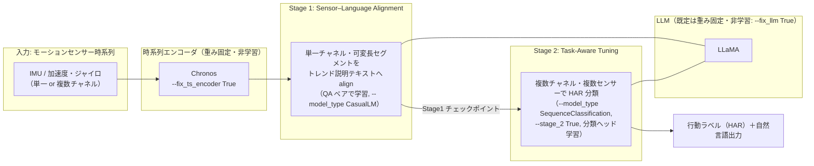

- **Stage 1（センサー・言語アラインメント）**: **単一チャネル・可変長**のセンサーセグメントを、トレンドベースの自然言語説明に対応づける QA 学習。センサー表現を LLM の言語空間に揃えるのが目的。
- **Stage 2（タスク適応チューニング）**: **複数チャネル・複数センサー**を扱い、下流の HAR 分類を行う。Stage 1 の出力を初期値に、`SequenceClassification` として分類ヘッドを学習する。
- **重み固定の考え方**: 既定では LLM（`--fix_llm True`）と時系列エンコーダ（`--fix_ts_encoder True`）を重み固定（非学習）にし、主にアラインメント／分類ヘッドを学習する（Stage 2 では `--fix_cls_head False`）。

## 🚀 使用方法

### Stage 1 の推論手順

公式の学習済み重みは無いが、**HF 上の非公式 Stage1 ckpt `1EE1/SensorLLM-Stage1-Backup`** を使えば、2 段学習をスキップして単一サンプルのトレンド説明推論だけを試せる。

1. 環境変数を設定する（HF_TOKEN 等）

    ```sh
    cp .env.sample .env    # .env に HF_TOKEN=hf_... を記入
    ```

1. イメージをビルドする（SensorLLM clone + 依存を焼き込み）

    ```sh
    make docker-build
    ```

1. モデルを取得する（認証付きなら標準 CLI でそのまま取得できる）

    公式クラス `SensorLLMStage1LlamaForCausalLM` に素直にロードできるのは `1EE1/SensorLLM-Stage1-Backup`（MHealth 学習・**TinyLlama-1.1B 系ベース**）。他の非公式 ckpt は下表のとおり互換性に難がある。

    | 非公式 ckpt | ベース | この Tip で使うか |
    |---|---|---|
    | **[`1EE1/SensorLLM-Stage1-Backup`](https://huggingface.co/1EE1/SensorLLM-Stage1-Backup)** | TinyLlama-1.1B 系（LLaMA） | ✅ 公式 Stage1 クラスに素直にロード可 |
    | [`pixelworld17/sensorllm-lora`](https://huggingface.co/pixelworld17/sensorllm-lora) | Llama-3.2-1B（LoRA アダプタのみ） | △ base + PEFT マージが別途必要 |
    | [`Ganlen233/sensorllm`](https://huggingface.co/Ganlen233/sensorllm) | Qwen3 系 | ✗ 公式クラスは LLaMA 専用で非互換 |

    ```sh
    make download-stage1-model
    ```

    > **⚠️ 非公式のため信頼性は担保されない**。あくまで「配線が動くか」を確認するデモ用途で、本番評価には自分で 2 段学習した重みを使うこと。

1. 推論を実行する（A100 等・bfloat16）

    ```sh
    make predict-stage1
    ```


### Stage 2 の学習手順

> **Stage 2 の学習済みチェックポイントは公開されていない**ため、Stage 2 の推論前に自分で Stage 2 を学習する必要がある。

1. **Stage 2 の学習用データ + QA ペアを生成**

    ```sh
    export SUBJECTS=2   # 生成する被験者数（既定 10。少なくすると生成・学習が速い）
    make create-train-data-stage2
    ```


1. **Stage 2 の初期値（Stage 1 モデル）を用意する**

    Stage 2 は Stage 1（アラインメント済み）モデルを初期値に学習する。**本フローでは、Stage 1 推論で使った学習済み ckpt `1EE1/SensorLLM-Stage1-Backup`（`make download-stage1-model` で取得済みの `checkpoints/ckpt_1EE1/`）をそのまま Stage 1 初期値に流用する**（MHealth 学習済みの Stage 1 モデルなので、Stage 1 学習を丸ごとスキップできる）。

    <details>
    <summary>自分で Stage 1 から学習する場合（任意・数時間〜）</summary>

    ```sh
    make create-train-data-stage1   # Stage 1 用データ+QA を生成（SUBJECTS で被験者数を変更可）
    make train-stage1               # 変数は既定値。変える場合は export STAGE1_EPOCHS=... 等
    ```

    base LLM は open な TinyLlama 等（gated な meta-llama を使う場合は `.env` の `HF_TOKEN` に利用同意済みトークンを設定）。学習済み重みは `checkpoints/sensorllm_stage1/` に保存され、次段の `STAGE1_CHECKPOINTS_DIR` に指定できる。Stage 1 は単一チャネル QA のため学習サンプルが多く、全 10 被験者・1 epoch でも A100 で数時間かかる。

    </details>

1. **Stage 2（タスク適応チューニング・HAR 分類）を学習**（全 10 被験者・8 epoch）

    ```sh
    export STAGE1_CHECKPOINTS_DIR=/app/checkpoints/ckpt_1EE1   # Stage1 初期値に 1EE1 を流用（既定は自前学習の sensorllm_stage1）
    make train-stage2
    ```
    （`STAGE2_EPOCHS`(既定 8) / `NUM_LABELS`(12) / `STAGE2_OUT` は既定値なので省略。変更時は `export STAGE2_EPOCHS=3` 等）

    Stage 1 モデル（既定は `checkpoints/ckpt_1EE1`。自分で学習した場合は `/app/checkpoints/sensorllm_stage1`）を初期値に `SequenceClassification`（分類ヘッド）を学習。`checkpoints/sensorllm_stage2/`（`model.safetensors` ほか）に保存される。`--save_total_limit`（既定 2）で ckpt 数を制限し、多エポックでも容量が溢れないようにしている。

### Stage 2 の推論手順

学習済み Stage 2 モデル（前節で `checkpoints/sensorllm_stage2/` に保存）に MHealth の test 窓（15ch × 100 点）を入力し、行動ラベルを 12 クラス分類して正解と突き合わせる。

```sh
export NUM_SAMPLES=16   # 推論する test サンプル数（既定 16）
make predict-stage2
```

推論（[`predict_stage2.py`](predict_stage2.py)）は結果を npz に保存し、続けて作図（[`plot_stage2.py`](plot_stage2.py)）まで行う。実測結果は次節「[Stage 2 の実行結果](#stage-2-の実行結果)」を参照。

## 📊 実行結果

### Stage 1 の実行結果

複数の実センサーデータ（各 200 点・1 チャネル）を `c_acc_x` チャネル扱いで Stage1 推論した結果。質問は共通で **`What is the overall trend of this sensor reading?`（このセンサー信号の全体的なトレンドは？）**。A100 / bfloat16。出力は非公式重みによるもので、内容の妥当性は保証されない。

#### (A) in-domain: SensorLLM が想定するモーションセンサー（MHealth 胸部加速度 `c_acc_x`）

`make create-sample-data` が UCI から取得する MHealth の実データ。歩行 / 走行 / 静止の 3 活動を試すと、**周期的な加速度の上下を区間ごとにトレンド説明**できる（学習ドメイン内。走行は歩行より周期が速く、静止はほぼ平坦で微小変化）。

| 活動 | 入力波形 | 入力プロンプト（質問） | 出力（全文, max_new_tokens=160） |
|---|---|---|---|
| 歩行 Walking |  | `What is the overall trend of this sensor reading?`<br>（このセンサー信号の全体的なトレンドは？） | 0.0s→0.12s: ascending<br>0.12s→0.14s: descending<br>0.14s→0.18s: ascending<br>0.18s→0.24s: descending<br>0.24s→0.3s: ascending<br>0.3s→0.32s: descending<br>0.32s→0.36s: ascending<br>0.36s→0.46s: descending<br>0.46s→0.54s: ascending<br>0.54s→0.62s: descending<br>…（周期的に交互） |
| 走行 Running |  | `What is the overall trend of this sensor reading?`<br>（このセンサー信号の全体的なトレンドは？） | 0.0s→0.02s: rising<br>0.02s→0.14s: falling<br>0.14s→0.2s: rising<br>0.2s→0.24s: falling<br>0.24s→0.32s: rising<br>0.32s→0.42s: falling<br>0.42s→0.48s: rising<br>0.48s→0.54s: falling<br>0.54s→0.56s: rising<br>0.56s→0.62s: falling<br>…（歩行より速い周期） |
| 静止 Standing |  | `What is the overall trend of this sensor reading?`<br>（このセンサー信号の全体的なトレンドは？） | 0.0s→0.02s: increasing<br>0.02s→0.04s: decreasing<br>0.04s→0.06s: increasing<br>0.06s→0.08s: decreasing<br>0.08s→0.1s: increasing<br>0.1s→0.12s: decreasing<br>0.12s→0.14s: increasing<br>0.14s→0.16s: decreasing<br>0.16s→0.18s: increasing<br>0.18s→0.22s: decreasing<br>…（微小・ほぼ平坦） |

#### (B) in-domain ＋ 異常データ: モーションセンサーにスパイク異常を注入

MHealth 歩行の `c_acc_x` の step≈100 に、通常域（約 -6〜-15）を大きく外れる**スパイク異常（+20）を注入**した実データ。異常は目視で明らか（下図の突出）だが、**モデルは前後と同じくトレンド説明を続けるだけで、スパイクを異常として指摘しない**。

| 系列 | 入力波形 | 入力プロンプト（質問） | 出力（全文, max_new_tokens=200） |
|---|---|---|---|
| 歩行＋スパイク注入（step≈100） |  | `What is the overall trend of this sensor reading?`<br>（このセンサー信号の全体的なトレンドは？） | 0.0s→0.06s: upward<br>0.06s→0.1s: downward<br>0.1s→0.12s: upward<br>0.12s→0.2s: downward<br>0.2s→0.3s: upward<br>0.3s→0.4s: downward<br>0.4s→0.42s: upward<br>0.42s→0.44s: downward<br>…（スパイク区間も通常のトレンド区間として処理し、異常は指摘しない） |

**質問を「異常を検知して報告せよ」に変えても挙動は同じ**で、モデルは指示を無視してトレンド区間を出力する（＝プロンプト工学では異常検知は引き出せない。実測）:

```text
Q: Detect anomalies in this sensor reading and report when they occur.
→ 0.0s to 0.02s: downward / 0.02s to 0.04s: downward / …（異常への言及は一切なし）
```

#### (C) out-of-domain ＋ 異常データ: SensorLLM が想定しない非モーション時系列（NAB）

[NAB (Numenta Anomaly Benchmark)](https://github.com/numenta/NAB) の**異常を含む時系列**（システム故障・CPU 異常など）を、あえて `c_acc_x` チャネル扱いで入力した out-of-domain ケース。

| 系列（異常含む） | 入力波形 | 入力プロンプト（質問） | 出力（全文, max_new_tokens=160） |
|---|---|---|---|
| マシン温度・システム故障 |  | `What is the overall trend of this sensor reading?`<br>（このセンサー信号の全体的なトレンドは？） | 0.0s→0.02s: decreasing<br>0.02s→0.04s: increasing<br>0.04s→0.06s: decreasing<br>0.06s→0.08s: increasing<br>0.08s→0.1s: decreasing<br>0.1s→0.12s: increasing<br>0.12s→0.14s: decreasing<br>0.14s→0.18s: decreasing<br>0.18s→0.2s: increasing<br>0.2s→0.24s: decreasing<br>…（上下を繰り返すだけで異常は指摘しない） |
| EC2 CPU 使用率・異常スパイク（step≈180） |  | `What is the overall trend of this sensor reading?`<br>（このセンサー信号の全体的なトレンドは？） | 0.0s→0.02s: downward<br>0.02s→0.04s: downward<br>0.04s→0.06s: downward<br>0.06s→0.08s: downward<br>0.08s→0.1s: downward<br>0.1s→0.12s: downward<br>0.12s→0.14s: downward<br>0.14s→0.16s: downward<br>0.16s→0.18s: downward<br>0.18s→0.2s: downward<br>…（一様に downward。スパイク異常は捉えない） |

> **観察（重要）**: SensorLLM Stage1 は「センサー信号のトレンドを区間ごとに言語化する」モデルで、**トレンド説明の QA だけで学習**されている（公式の質問テンプレートも `What are the fundamental traits and trend arrangement in the {data}?` 等の trend 系のみ）。そのため **異常検知器ではない**。実測で、(1) in-domain のモーションデータに明確なスパイク異常を注入しても、(2) out-of-domain の NAB 異常系列（EC2 の step≈180 のスパイク等）でも、(3) 質問を「異常を検知して報告せよ」に変えても、**いずれも異常を指摘せずトレンド区間を出力するだけ**だった。推論経路は動くが、異常検知やドメイン理解の能力は無い。**異常検知＋自然言語レポート化が目的なら、TSFM(Chronos)+LLM の 2 段構成である [nlp_processing/67](https://github.com/Yagami360/ai-product-dev-tips/tree/master/nlp_processing/67) の方が適する**。

これにより、**実センサーデータの取得 → Chronos エンコード → 特殊トークン付きプロンプト構築 → LLaMA 生成**という推論経路全体が GPU（A100）上で動作すること、および in-domain / out-of-domain での挙動差を確認した（`<ts>` プレースホルダ数と埋め込み数の一致も実 forward で確認）。

### Stage 2 の実行結果

上記フロー（データ生成 → **1EE1 を Stage 1 初期値に流用** → Stage 2 学習 → Stage 2 推論）を A100 40GB で通しで実行した実測結果。**Stage 2 学習は全 10 被験者データで 8 epoch を完走**（38,168 ステップ・約 2.4 時間）し、チェックポイント（`checkpoints/sensorllm_stage2/model.safetensors` ほか）を保存した上での推論。

#### 学習時の評価（`make train-stage2` がメトリクスで自動計測）

test 全 2,039 件（被験者 subject1/3/6）に対する評価。**エポックを追うごとに精度が単調に上昇し、最終的に `eval_accuracy=0.863` / `eval_f1_macro=0.871` に到達**（ランダム＝1/12≒8.3% を大きく上回る。Stage 1 に学習済み 1EE1 を使ったことが効いている）。

エポック別の全体スコア（正解率＝eval_accuracy、macro-F1＝eval_f1_macro）と、代表クラスの **正解率（recall = そのクラスの実サンプルを正しく分類できた割合）**:

| epoch | 正解率（平均） | macro-F1（平均） | Walking | Cycling | Jump | Climbing | Sitting | Lying | Standing |
|---|---|---|---|---|---|---|---|---|---|
| 1 | 0.687 | 0.602 | 1.000 | 1.000 | 0.000 | 0.514 | 0.033 | 0.995 | 0.011 |
| 4 | 0.801 | 0.794 | 1.000 | 0.995 | 1.000 | 0.907 | 0.749 | 0.082 | 0.781 |
| 6 | 0.846 | 0.850 | 1.000 | 0.973 | 0.967 | 0.934 | 0.393 | 0.880 | 0.749 |
| **8** | **0.863** | **0.871** | 1.000 | 0.995 | 0.984 | 0.978 | 0.574 | 0.634 | 0.787 |

**周期・振幅の特徴が明確な動作系（Walking / Cycling / Jump / Climbing）はほぼ完璧**、静止・着座系（Sitting / Lying / Standing）は互いに信号が似るため相対的に弱い（学習途中はクラスごとに上下しつつ、最終的に全体で収束）。

#### Stage 2 推論（`make predict-stage2`, test から 16 サンプル）

test からシャッフルした 16 サンプルの分類結果（全 2,039 件中）。**15/16 = 0.938**:

**入力波形**列は各サンプルの実測センサー窓（身体 3 箇所の加速度の大きさ `|acc|`＝<span style="color:#1f77b4">■</span> 胸部 / <span style="color:#2ca02c">■</span> 左足首 / <span style="color:#d62728">■</span> 右前腕、横軸＝時間 100 点＝2 秒）。

| # | 入力波形（\|acc\|×3） | 予測（pred） | 正解（true） | 判定 |
|---|---|---|---|---|
| 0 | 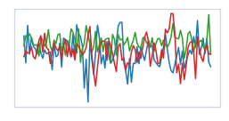 | 0 Standing still | 0 Standing still | ✅ |
| 1 | 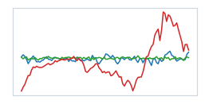 | 6 Frontal elevation of arms | 6 Frontal elevation of arms | ✅ |
| 2 | 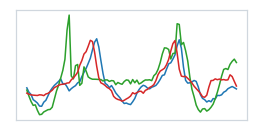 | 4 Climbing stairs | 4 Climbing stairs | ✅ |
| 3 | 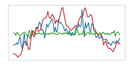 | 5 Waist bends forward | 5 Waist bends forward | ✅ |
| 4 | 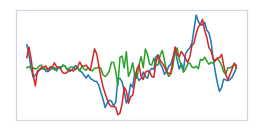 | 7 Knees bending | 7 Knees bending | ✅ |
| 5 | 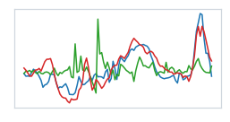 | 7 Knees bending | 7 Knees bending | ✅ |
| 6 | 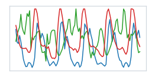 | 9 Jogging | 9 Jogging | ✅ |
| 7 | 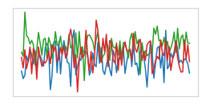 | 2 Lying down | 2 Lying down | ✅ |
| 8 | 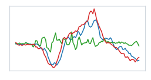 | 7 Knees bending | 7 Knees bending | ✅ |
| 9 | 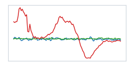 | 6 Frontal elevation of arms | 6 Frontal elevation of arms | ✅ |
| 10 | 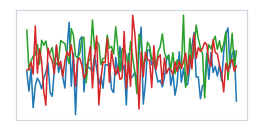 | 2 Lying down | 2 Lying down | ✅ |
| 11 | 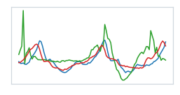 | 4 Climbing stairs | 4 Climbing stairs | ✅ |
| 12 | 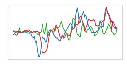 | 7 Knees bending | 7 Knees bending | ✅ |
| 13 | 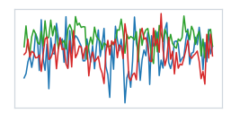 | 0 Standing still | 0 Standing still | ✅ |
| 14 | 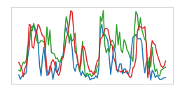 | 11 Jump front & back | 11 Jump front & back | ✅ |
| 15 | 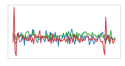 | 0 Standing still | 1 Sitting and relaxing | ❌ |

> **Stage 2 の出力は 12 クラスの「行動ラベル」のみ**（`SequenceClassification`）。時系列の値を予測・生成するわけではない。上表・下図の波形は**入力の実測センサーデータ**で、`pred:`/`true:` は予測ラベル／正解ラベル。

`make predict-stage2` は 1 サンプルにつき 1 枚の図を `outputs/plots/stage2_samples/` に出力する（[`predict_stage2.py`](predict_stage2.py)。下の掲載図は代表 2 枚を `assets/` にコミットしたもの）。各図は **15 チャネルを個別サブプロットで表示**（行＝身体部位×センサー種別: 胸部加速度／左足首 加速度・ジャイロ／右前腕 加速度・ジャイロ、列＝軸 X/Y/Z）。図全体の枠色が緑＝正解・赤＝誤り、上部に `pred:`（予測ラベル）/ `true:`（正解ラベル）。横軸＝時間（100 点＝2 秒 @ 50Hz）、縦軸＝各チャネルのセンサー値（加速度 m/s²・ジャイロ deg/s）。

正解例（sample #6, Jogging）— 体幹・四肢の加速度が周期的に振動:


誤り例（sample #15, 唯一の誤分類）— **Sitting を Standing と誤判定**。ともに静止姿勢で全チャネルがほぼ平坦（振幅が極小）なため混同している:


動作系（歩行・階段・ジャンプ・ジョギング等）は明瞭な波形の違いから正しく分類できており、誤りは静止姿勢どうしに限られる。推論を再実行せず図だけ作り直す場合は、保存済み結果（`outputs/` 配下・git 管理外）から `make plot-stage2`。

> **⚠️ 精度についての注意**: この結果は **Stage 1 に非公式 ckpt `1EE1`（TinyLlama-1.1B ベース）を流用**し、MHealth 全 10 被験者・8 epoch で Stage 2 を学習したもの。**データ生成 → 2 段学習 → 分類 → 正解比較のフローが実機で最後まで通り、HAR 分類が高精度（acc 0.863 / macro-F1 0.871）で機能することを確認済み**。ただし論文はより大きな LLaMA ベース・全データセットで学習しており、本 Tip の値がそのまま論文値と一致するわけではない（ベース LLM・Stage 1 の質・被験者分割に依存）。より高精度を狙う場合は、ベース LLM を大型化し Stage 1 も自前で十分に学習する。

## 🛠️ 開発者向け情報

### 📁 ディレクトリ構成

```
nlp_processing/68/
├── Dockerfile / pyproject.toml / Makefile   # uv + Docker + make の実行環境
├── predict_stage1.py          # Stage1 推論（センサー信号のトレンド説明）
├── predict_stage2.py          # Stage2 推論（HAR 分類）＋結果を npz 保存
├── plot_stage2.py             # Stage2 推論結果(npz)の作図（torch 非依存・CPU 可）
├── create_dataset_stage1.py   # Stage1 学習データ(QA)生成
├── create_dataset_stage2.py   # Stage2 学習データ(分類)生成
├── create_sample_data.py      # Stage1 推論用サンプル生成
├── download_dataset.py        # データセット取得（mhealth / nab）
├── assets/                    # README 掲載図（コミット対象）
├── checkpoints/  ※git 管理外  # ckpt_1EE1 / chronos_t5_base / sensorllm_stage1 / sensorllm_stage2
├── datasets/     ※git 管理外  # MHEALTHDATASET / mhealth_stage1 / mhealth_stage2 / nab
└── outputs/      ※git 管理外  # sample .npy / predict_stage2_results.npz / plots/
```

### 🧰 利用可能コマンド（`make <target>`）

| コマンド | 説明 |
|---|---|
| `make docker-build` | Docker イメージをビルド（SensorLLM 焼き込み） |
| `make download-stage1-model` | Stage1 ckpt(1EE1) と Chronos を取得 |
| `make download-mhealth-dataset` | MHealth 生データを取得 |
| `make download-nab-dataset` | NAB の該当 CSV を取得 |
| `make create-sample-data` | Stage1 推論用サンプル(.npy)を生成 |
| `make create-train-data-stage1` | Stage1 の学習データ+QA を生成 |
| `make create-train-data-stage2` | Stage2 の学習データ+QA を生成 |
| `make predict-stage1` | Stage1 推論（トレンド説明） |
| `make train-stage1` | Stage1 学習（アラインメント） |
| `make train-stage2` | Stage2 学習（HAR 分類） |
| `make predict-stage2` | Stage2 推論（HAR 分類）＋作図（plot_stage2.py） |
| `make plot-stage2` | 保存済み結果から図だけ再生成（推論不要） |
| `make install` / `make lint` / `make format` | dev ツール導入 / flake8・mypy / black・isort |
| `make clean` | 生成物（checkpoints/datasets/outputs）を削除 |

> 各 `make` 変数（`SUBJECTS`・`STAGE1_EPOCHS`/`STAGE2_EPOCHS`・`STAGE1_CHECKPOINTS_DIR`・`STAGE1_OUT`/`STAGE2_OUT`・`NUM_SAMPLES` 等）は `make <target> VAR=値` またはコマンド前の `export VAR=値` で上書きできる。

## ⚠️ 注意点・課題

- **公式の学習済み重みが無い**: 前述の通りゼロショットで即推論はできず、**Chronos ＋ LLaMA を用意して 2 段学習を自前で回す**必要がある。GPU（Ampere 以降）・データ整備・LLaMA の利用同意が前提。
- **⚠️ 業務利用で要注意なライセンス**: **ソースコードは MIT** で利用しやすいが、**成果物（work）は CC BY-NC-SA 4.0（非商用）**。→ 製品への商用組み込みには制約があり、商用検証に進む場合は非商用条項の扱い（著者への問い合わせ、または手法だけ参考に自前実装）を先に整理すべき。ベースラインとして含まれる各手法（LLaMA / Chronos 等）のライセンスも各公式リポジトリで確認する。
- **手軽さ比較**: 「配布済みモデルをロードしてすぐ推論」はできず GPU で 2 段学習が前提。**手軽に試すなら、学習済み 7B/13B ＋データセットが公開されている [LLaSA](https://github.com/BASHLab/LLaSA)** の方が起動ハードルは低い（GPT-4o-mini 超えを主張）。
- **数値表現のギャップ**: LLM は数値列の微細パターンを取りこぼしやすく、これが系統 A（テキスト化）に対して SensorLLM のような系統 B（専用エンコーダ＋align）が優位になる根本理由。
- **後発手法**: SensorLLM 以降、同じ研究グループから training-free の [ZARA](https://arxiv.org/abs/2508.04038)（ACL 2026 Oral）や、合成 IMU 生成・motion-language 整合を統合した AnyMo なども出ている。用途に応じて比較検討するとよい。

## 🔗 参考サイト

- https://github.com/cruiseresearchgroup/SensorLLM （SensorLLM 公式実装, ソースコード MIT）
- https://arxiv.org/abs/2410.10624 （論文: SensorLLM: Aligning Large Language Models with Motion Sensors for Human Activity Recognition, EMNLP 2025 Main）
- https://aclanthology.org/2025.emnlp-main.19/ （ACL Anthology 掲載ページ）
- https://github.com/amazon-science/chronos-forecasting （時系列エンコーダに使う Chronos の公式実装, Apache-2.0）
- https://huggingface.co/1EE1/SensorLLM-Stage1-Backup （`predict_stage1.py` で使う**非公式**の Stage1 チェックポイント。著者公式ではない点に注意）
- https://github.com/BASHLab/LLaSA （手軽に試せる代替: LLaSA。学習済み 7B/13B ＋データセット公開）
- https://arxiv.org/abs/2508.04038 （後発の training-free 手法 ZARA, ACL 2026 Oral）
