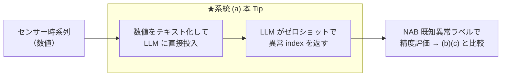
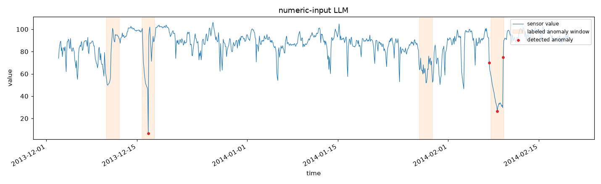

# LLM に数値時系列を直接読ませてセンサーの異常検知を行い、画像化→VLM / TSFM+LLM 方式と精度比較する

センサー時系列の異常検知に LLM を絡める 3 系統のうち、**最も軽量な系統 (a) 数値直接入力**（SigLLM / LLMAD / LLMTime 系）を実際に動かす。数値系列をそのままテキスト化して LLM に渡し、**LLM 自身がゼロショットで異常点を検出**する。検知精度を **[NAB](https://github.com/numenta/NAB) の既知異常区間ラベル**で評価し、**系統 (b) 画像化→VLM（[nlp_processing/70](https://github.com/Yagami360/ai-product-dev-tips/tree/master/nlp_processing/70)）**・**系統 (c) TSFM+LLM（[nlp_processing/67](https://github.com/Yagami360/ai-product-dev-tips/tree/master/nlp_processing/67)）**と**同一データ・同一指標で公正に比較**する。

> **系統 (a) の位置づけ**: 実装が最軽量（TSFM も画像化も不要、学習不要）だが、**「LLM 単体は生の数値時系列の理解が苦手」という否定的結果が査読付きで複数報告**されている（SigLLM は専用 DL 比 約30% 劣後と自己報告）。ICL/CoT の足場が無いと精度が出にくく、トークン長も系列長に比例して爆発する。この Tip はその特性を実データで体感し、他系統と比較するのが目的。

## 3 系統の中での位置づけ



## しくみ

1. NAB のセンサー時系列（実データ）を読み込み、CPU 実行・トークン量の都合で間引く（`--downsample`, 既定 24）。
2. 系列を `index,timestamp,value` のテキストにして、システムプロンプト（[`prompts.yaml`](prompts.yaml)）とともに LLM に渡す。
3. LLM は**異常点の index を JSON 配列**（`[{"index":.., "reason":".."}, ...]`）で返す。
4. 返ってきた index を点フラグに変換し、**NAB の既知異常区間ラベルで評価**（[`nab_common.py`](nab_common.py) の `evaluate`）。

> **LLM に入力するのは数値系列そのもの**（系統 (c) が「異常点の数値サマリだけ」を渡すのと対照的）。系統 (a) は検知そのものを LLM に委ねる。

## コードの主なポイント

- 検知スクリプト: [`detect_numeric_llm.py`](detect_numeric_llm.py)（数値テキスト化 → LLM → 異常 index → 評価 → 可視化・レポート保存）
- 共通処理: [`nab_common.py`](nab_common.py)（NAB ローダ／正解ラベルでの評価／可視化。系統 (b)(c) と共通の評価指標）
- プロンプト定義: [`prompts.yaml`](prompts.yaml)（コードから分離して管理）

## 使用方法（uv + Makefile）

```sh
make install                 # 依存を uv で同期（pyproject.toml）
cp .env.sample .env          # OPENAI_API_KEY を設定（既定は Google Gemini）
make run                     # 検知 → NAB ラベルで評価（既定=機械温度センサー）
make run NAB_KEY=cpu         # 別センサー
```

## 実行結果（機械温度センサー, NAB machine-temp, 946 点）

```
[detect] 系統(a) 数値直接入力: 異常 3 点検出
[eval] {'windows_total': 4, 'windows_detected': 2, 'window_recall': 0.5, 'false_alarms': 0, 'pa_f1': 0.662, 'n_pred': 3}
```

数値だけを見て、**4 区間中 2 区間を検出（誤検知 0）**。精密だが検出は疎で、半分の異常を見逃した。オレンジ帯=既知異常区間（正解）、赤点=LLM が検出した異常点。



## 3 系統の公正な精度比較

同一データ・同一正解・同一指標・同一 LLM で 3 系統を比較した（本 Tip の実測）。

- **データ**: NAB 機械温度センサー（`machine-temp`）を `--downsample 24` で 946 点に間引き、既知異常区間 4 個。
- **正解**: NAB の `combined_windows` ラベル。
- **指標**（[`nab_common.py`](nab_common.py) の `evaluate`）: `window_recall`（既知異常区間のうち区間内に検出点が 1 つ以上ある割合）／ `false_alarms`（区間外での誤検知点数）／ `PA-F1`（point-adjust F1。TSAD の慣習指標だが甘めなので注意）。
- **検知器**: (a)(b) は同じ **Gemini 3.5 Flash**、(c) は **Chronos-Bolt**（`amazon/chronos-bolt-base`）。

| 系統 | 検知の主体 | 検出区間 | window recall | 誤検知点 | PA-F1 | 検出点数 |
|------|-----------|---------|--------------|---------|-------|---------|
| (a) 数値直接入力（本 Tip） | LLM（数値） | 2/4 | 0.50 | 0 | 0.662 | 3 |
| (b) 画像化→VLM（[70](https://github.com/Yagami360/ai-product-dev-tips/tree/master/nlp_processing/70)） | VLM（画像） | **4/4** | **1.00** | 9 | **0.954** | 86 |
| (c) TSFM+LLM（[67](https://github.com/Yagami360/ai-product-dev-tips/tree/master/nlp_processing/67)） | Chronos（TSFM） | 2/4 | 0.50 | 5 | 0.639 | 9 |

### 考察（この結果の読み方 — 重要）

上表を「(b) が (c) より優れている」と一般化してはいけない。以下の理由で、この比較は検知単独・粗い設定・甘い指標の一例にすぎない。

- **学術的にも「どの手法も万能に最良」ではない**: ベンチマーク mTSBench は「どの検出器も全データセットで優位に立てない」、TSB-AD（NeurIPS 2024）は「単純な統計手法がしばしば深層学習を上回り、基盤モデル系（Chronos 等）は**点異常で有望**」と報告。TSFM は有望株だが全ベンチで常勝ではない。
- **この設定は (c) TSFM に不利**: 3 系統を公平に回すため系列を粗く間引いた（`--downsample 24` / 946 点）。これは Chronos が得意な**細かい時間構造を潰す**ため検出力を下げる。実際 [67](https://github.com/Yagami360/ai-product-dev-tips/tree/master/nlp_processing/67) の細かい設定（downsample 6 / 3783 点）では (c) の検出はより強い。しきい値も未調整。
- **指標が「広く当てる」方式に有利**: `window_recall` と `PA-F1` は区間内に 1 点でも当たれば高得点になるため、広い時間帯を返す (b) が有利、精密に少数点を返す (a)/(c) が不利に出る（PA-F1 は point-adjust による水増し傾向。本来は VUS-PR / PATE 等の閾値フリー指標が望ましい）。
- **この比較は「検知精度」だけを見ている**: (c) TSFM+LLM 本来の価値は「数値に強い TSFM で検知 → 言語に強い LLM で説明」の**役割分担**と、**検知＋説明＋コスト＋商用実証の両立**にある。ここでは説明品質（[67](https://github.com/Yagami360/ai-product-dev-tips/tree/master/nlp_processing/67) の LLM-as-judge で 5/5）・コスト・頑健性は測っていないため、検知 F1 だけで (c) を評価すると過小評価になる。

→ まとめると、**(c) TSFM+LLM が「検知＋説明のバランス」で実務的に有力**という位置づけは変わらない。本表は「検知単独・単一データ・粗い設定・甘い指標での一例」として読むこと（`--downsample`・しきい値・プロンプト・モデル・複数データ／試行で結果は変わる）。

## 注意点・課題

- **LLM 単体の数値時系列理解は弱い**: 系統 (a) は専用手法に精度で劣後しやすい（SigLLM: 約30% 劣後の自己報告）。ICL/CoT・few-shot の足場が精度を左右する（本 Tip は素朴なゼロショット）。
- **トークン長の爆発**: 系列長に比例して入力トークンが増える。長い系列はそのまま渡せず、間引き・窓分割が必要（本 Tip は `--downsample` で対処）。
- **モデル依存が大きい**: 使う LLM でも精度が変わる（調査でも GPT-4→GPT-3.5/Llama で F1 半減）。
- **評価指標の注意**: 上記のとおり PA-F1 は甘い。厳密評価は閾値フリー指標＋複数データで。

## 参考サイト

- https://github.com/numenta/NAB （Numenta Anomaly Benchmark: 実世界のセンサー異常検知データ）
- https://arxiv.org/abs/2405.14755 （SigLLM: Time Series Anomaly Detection with LLMs, MIT）
- https://arxiv.org/abs/2405.15370 （LLMAD: few-shot + Anomaly CoT で LLM の TSAD 精度を上げる）
- https://arxiv.org/abs/2310.07820 （LLMTime: LLMs Are Zero-Shot Time Series Forecasters）
- https://github.com/sintel-dev/sigllm （SigLLM 公式実装, MIT）
- https://arxiv.org/abs/2409.01980 （サーベイ: LLMs for Time Series Anomaly Detection, NAACL 2025 Findings）
