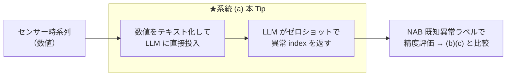
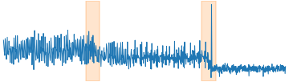
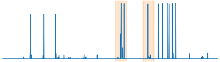
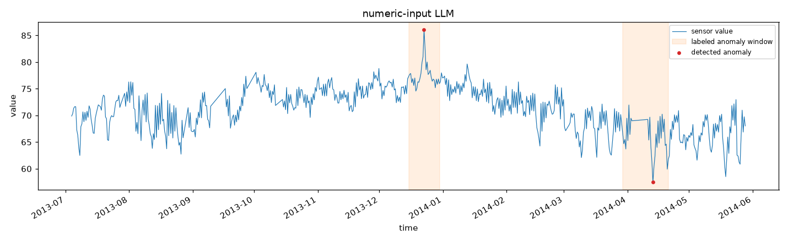
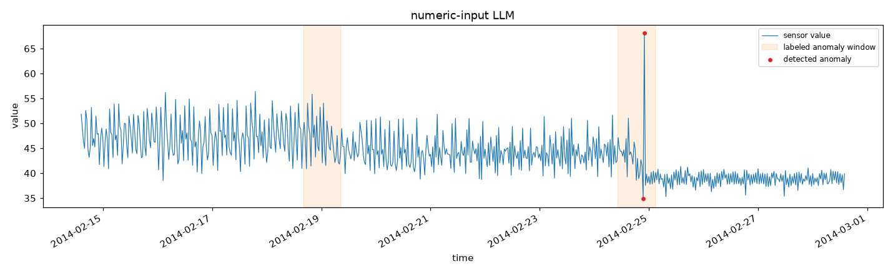
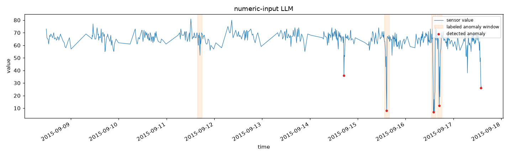
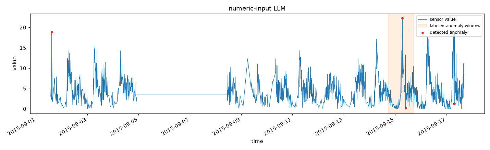
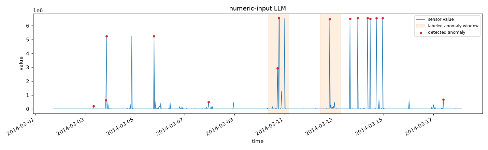

# LLM への数値直接入力で、センサーデータの異常検知から自然言語レポート化までを行う

センサー時系列の異常検知に LLM を絡める 3 系統のうち、**最も軽量な系統 (a) 数値直接入力**（SigLLM / LLMAD / LLMTime 系）を実際に動かす。数値系列をそのままテキスト化して LLM に渡し、**LLM 自身がゼロショットで異常点を検出**、続けてその検出結果から**運用向けの自然言語レポートを生成**する。検知精度は **[NAB](https://github.com/numenta/NAB) の既知異常区間ラベル**で評価する。GPU 不要（LLM は API 経由）。

> **⚠️ 系統 (a) の位置づけ**: 実装が最軽量（TSFM も画像化も不要、学習不要）だが、**「LLM 単体は生の数値時系列の理解が苦手」という否定的結果が査読付きで複数報告**されている（SigLLM は専用 DL 比 約30% 劣後と自己報告）。ICL/CoT の足場が無いと精度が出にくく、トークン長も系列長に比例して爆発する。この Tip はその特性を実データで体感し、他系統と比較するのが目的。

## 📑 目次

- [アーキテクチャ](#-アーキテクチャ)
- [使用方法](#-使用方法)
- [実行結果](#-実行結果)
    - [① 検知（数値直接入力）](#-検知数値直接入力)
    - [② 検知結果から自然言語レポートを生成](#-検知結果から自然言語レポートを生成)
    - [③ レポート品質の評価（LLM-as-judge）](#-レポート品質の評価llm-as-judge)
    - [④ 3 系統の公正な精度比較（全 6 センサー）](#-3-系統の公正な精度比較全-6-センサー)
- [開発者向け情報](#-開発者向け情報)
- [参考サイト](#-参考サイト)

## 🏗️ アーキテクチャ

| 系統 | 仕組み | 代表手法 | 位置づけ |
|------|--------|---------|---------|
| **(a) 数値直接入力**（★本 Tip） | **数値系列をテキスト化して LLM に投入** | SigLLM / LLMAD / LLMTime | **最軽量（学習不要・追加モデル不要）だが、LLM 単体は数値時系列に弱く、ICL/CoT の足場が無いと精度が出ない** |
| (b) 画像化 → VLM（[70](https://github.com/Yagami360/ai-product-dev-tips/tree/master/nlp_processing/70)） | 折れ線グラフ画像を VLM に見せて検知＋説明 | TAMA / AnomLLM / ChatTS | 説明は自然に出るが季節性異常に弱い・画像化設計に敏感 |
| (c) TSFM + LLM 2 段（[67](https://github.com/Yagami360/ai-product-dev-tips/tree/master/nlp_processing/67)） | TSFM で異常スコア → LLM が解釈・レポート化 | Chronos/TimesFM/TSPulse + LLM（商用: Datadog Toto + Bits AI SRE） | 検知は数値に強い TSFM、説明は言語に強い LLM と役割分担。商用実証あり |

センサー時系列の異常検知に LLM を絡める 3 系統の中で、本 Tip が実装するのは系統 (a) の経路。



推論経路は次の 4 ステップ。

1. NAB のセンサー時系列（実データ）を読み込み、CPU 実行・トークン量の都合で間引く（`--downsample`, 既定 24）。
2. 系列を `index,timestamp,value` のテキストにして、システムプロンプト（[`prompts.yaml`](prompts.yaml)）とともに LLM に渡す。
3. LLM は**異常点の index を JSON 配列**（`[{"index":.., "reason":".."}, ...]`）で返す。
4. 返ってきた index を点フラグに変換し、**NAB の既知異常区間ラベルで評価**（[`nab_common.py`](nab_common.py) の `evaluate`）。

- **LLM に入力するのは数値系列そのもの**（系統 (c) が「異常点の数値サマリだけ」を渡すのと対照的）。系統 (a) は**検知そのものを LLM に委ねる**のが特徴。
- **検知層を持たない**ため、TSFM（系統 (c)）や画像レンダリング（系統 (b)）の実装・依存が一切不要。その代わり精度は LLM の数値理解力に直接依存する。

## 🚀 使用方法

1. 依存を uv で仮想環境に同期する

    ```sh
    make install
    ```

1. API キーを設定する（`.env` は git 管理外）

    ```sh
    cp .env.sample .env    # .env に OPENAI_API_KEY=... を記入
    ```

    既定は Google Gemini（`gemini-3.5-flash`）。API キーは https://aistudio.google.com/apikey で取得できる。`BASE_URL` / `LLM_MODEL` を変えれば OpenAI 互換の任意プロバイダを使える。

1. 実センサーデータ（NAB）を取得する

    ```sh
    make download-nab-dataset                  # 全 6 センサー＋正解ラベルを datasets/nab へ
    make download-nab-dataset DOWNLOAD_KEY=cpu # 単体で取得
    ```

    検知スクリプトは初回実行時に自動ダウンロードするのでこの手順は必須ではないが、事前にまとめて取得しておきたいとき（オフライン実行の準備など）に使う。

1. 検知 → NAB ラベルで評価する

    ```sh
    make run                     # 既定=機械温度センサー
    make run NAB_KEY=cpu         # 別センサー
    ```

    入力には、実世界のセンサー異常検知ベンチマーク **[NAB](https://github.com/numenta/NAB)** の公開データ（`timestamp,value` 形式・既知の異常区間ラベル付き）を使う。`NAB_KEY` で対象センサーを選ぶ（3 系統で共通）。

    | `NAB_KEY` | センサー | 内容 | 入力波形例（<span style="color:#ff7f0e">■</span> 帯＝既知異常区間） |
    |---|---|---|---|
    | `machine-temp`（既定） | 産業機械の温度 | 実機の温度センサー。既知の故障あり |  |
    | `ambient-temp` | 室温 | 室温センサー。故障イベントあり |  |
    | `cpu` | サーバ CPU 使用率 | AWS EC2 の CPU 使用率メトリクス |  |
    | `traffic-speed` | 道路の車速 | 交通センサーの速度（渋滞・異常で急落） |  |
    | `traffic-occupancy` | 道路の占有率 | 交通センサーの占有率 |  |
    | `network` | サーバ受信ネットワーク量 | EC2 の network-in メトリクス |  |

    検知結果の図を `images/<センサー>_numeric_llm.png` に、自然言語レポートを `reports/<センサー>.md` に出力する。

## 📊 実行結果

機械温度センサー（NAB `machine-temp`, `--downsample 24` で 946 点）に対する実測。LLM は Gemini 3.5 Flash。

### ① 検知（数値直接入力）

```
[data] NAB: realKnownCause/machine_temperature_system_failure.csv（946 点, 既知異常区間 4 個）
[detect] 系統(a) 数値直接入力: 異常 3 点検出
[eval] {'windows_total': 4, 'windows_detected': 2, 'window_recall': 0.5, 'false_alarms': 0, 'pa_f1': 0.662, 'n_pred': 3}
```

数値だけを見て **4 区間中 2 区間を検出**。精密（誤検知 0）だが検出は疎で、半分の異常を見逃した。


図の見方:

- <span style="color:#1f77b4">─</span> **青線**: センサー値（LLM に数値テキストとして渡した入力そのもの）
- <span style="color:#ff7f0e">■</span> **オレンジ帯**: NAB があらかじめ「ここが異常」と定義している区間。**採点基準であって、モデルが当てた箇所ではない**
- <span style="color:#d62728">●</span> **赤点**: LLM が異常と判定した点。**オレンジ帯に入っていれば命中、帯の外にあれば誤検知**

#### 全 6 センサーでの検知結果

同じパイプラインを全センサーで実行した結果（間引きは後述の 3 系統比較と同一）。

| センサー（データ数） | 検知結果（<span style="color:#ff7f0e">■</span> 帯＝NAB が定義する異常区間／<span style="color:#d62728">●</span>＝LLM の検知点。クリックで原寸） | NAB スコア | 異常区間の検出率 | 誤検知点 |
|---|---|---|---|---|
| `machine-temp` (946) | <a href="images/machine-temp_numeric_llm.png"></a> | **52.0** | 2/4 = 0.50 | 1 |
| `ambient-temp` (606) | <a href="images/ambient-temp_numeric_llm.png"></a> | **93.5** | 2/2 = 1.00 | 0 |
| `cpu` (672) | <a href="images/cpu_numeric_llm.png"></a> | **42.9** | 1/2 = 0.50 | 0 |
| `traffic-speed` (564) | <a href="images/traffic-speed_numeric_llm.png"></a> | **69.2** | 3/4 = 0.75 | 2 |
| `traffic-occupancy` (1190) | <a href="images/traffic-occupancy_numeric_llm.png"></a> | **82.1** | 1/1 = 1.00 | 3 |
| `network` (789) | <a href="images/network_numeric_llm.png"></a> | **70.9** | 2/2 = 1.00 | 12 |

各列の**スコアの意味**（[`nab_common.py`](nab_common.py) の `evaluate` が算出。後述の 3 系統比較でも同じ指標を使う）:

| 指標 | 何を測るか | 良い方向 |
|---|---|---|
| **NAB スコア**（`nab_official`） | **業界標準**。NAB 公式スコアラー（[`nab_sweeper.py`](nab_sweeper.py)）による採点。異常窓の**早い位置**で検知するほど高得点、窓の見逃しは FN ペナルティ、窓外の検知は FP ペナルティ | **高いほど良い**（100 = 完璧、0 = 無検出と同等、**マイナス = 無検出より悪い**） |
| 異常区間の検出率（`window_recall`） | 既知異常区間のうち、区間内に 1 点以上を異常と判定できた区間の割合 | 高いほど良い（NAB スコアの TP 項に対応する**内訳**） |
| 誤検知点（`false_alarms`） | 正解区間の外で異常と判定した点数 | 少ないほど良い（NAB スコアの FP 項に対応する**内訳**） |

> **NAB スコアは 3 つのプロファイルで採点する**（誤検知と見逃しのどちらを重く見るかで重みが違う）。表には汎用の `standard` を載せている。
>
> | プロファイル | tp | fp | fn | 用途 |
> |---|---|---|---|---|
> | `standard` | 1.0 | 0.11 | 1.0 | 汎用 |
> | `reward_low_FP_rate` | 1.0 | 0.22 | 1.0 | 誤検知のコストが高い現場 |
> | `reward_low_FN_rate` | 1.0 | 0.11 | 2.0 | 見逃しのコストが高い現場 |
>
> **PA-F1 は載せない**。TSAD で慣習的に使われてきた指標だが、**一様乱数の異常スコアが SOTA を上回る**ことが示され過大評価が実証されている。実際 [70](https://github.com/Yagami360/ai-product-dev-tips/tree/master/nlp_processing/70) の traffic-occupancy は PA-F1 で 0.891 と高得点だが、NAB スコアでは **-40.6**（無検出より悪い）だった。読者を誤導するため業界標準の NAB スコアに一本化している。

**検出は総じて疎**（検出点数は 2〜15 点）で、そのぶん誤検知が少なく NAB スコアは全センサーでプラス。レベル変化が明確な ambient-temp は **93.5** と高得点だが、周期の中に異常が埋もれる cpu は **42.9** に留まる（2 窓中 1 窓しか当てられない）。**LLM は `temperature=0.0` でも非決定的**で、実行ごとに検知点が 3〜4 点で揺れ NAB スコアも数点変わる。

### ② 検知結果から自然言語レポートを生成

検出した異常点の要約を LLM に渡し、運用向けレポートを `reports/machine-temp.md` に生成する（Gemini 3.5 Flash 実出力の抜粋）。

```text
## サマリ（重要度: 高、件数: 4件、対象時間帯: 2013-12-16 17:15 ～ 2014-02-09 12:15）
本期間において計4件の異常値が検知されました。特に2月7〜9日に極端な高温と低温の検知が繰り返されており、
システムに重大な異常が発生している可能性が高いため、重要度「高」として報告します。
## 検知イベント（重要度順）
1. 2014-02-09 12:15 | 値: 74.70（重要度: 高）  …
## 根本原因の仮説（確度付き）  / ## 推奨アクション（優先度順）  / ## 補足・限界
```

### ③ レポート品質の評価（LLM-as-judge）

`make evaluate` は、生成レポートを **LLM-as-judge**（別の LLM を審査員に）で採点する（[`evaluate_report.py`](evaluate_report.py)）。**審査員には「検知結果（数値の事実）」と「生成レポート」の両方を渡し、前者を根拠に後者を採点させる**（レポート単体では忠実性を検証できないため）。採点は `temperature=0.0`・JSON 強制で行い、4 観点を 1〜5 で評価する。判定基準は 3 系統（[69](https://github.com/Yagami360/ai-product-dev-tips/tree/master/nlp_processing/69) / [70](https://github.com/Yagami360/ai-product-dev-tips/tree/master/nlp_processing/70) / [67](https://github.com/Yagami360/ai-product-dev-tips/tree/master/nlp_processing/67)）で共通（[`prompts.yaml`](prompts.yaml) の `judge_system`）。

| センサー | 忠実性 | 有用性 | 可読性 | 準拠 | 総合 |
|---|---|---|---|---|---|
| machine-temp | **3** | 4 | 5 | 5 | 4.25 |
| ambient-temp | 5 | 5 | 5 | 5 | 5.0 |
| cpu | **2** | 3 | 5 | 5 | 3.75 |
| traffic-speed | 5 | 5 | 5 | 5 | 5.0 |
| traffic-occupancy | 4 | 5 | 5 | 5 | 4.75 |
| network | 5 | 5 | 5 | 5 | 5.0 |
| **平均** | 4.0 | 4.5 | 5.0 | 5.0 | **4.63** |

- **可読性・フォーマット準拠は常に満点**だが、**忠実性が弱点**（cpu で 2、machine-temp で 3）。審査員は cpu について「元の事実である『値の低下』を『上昇』と誤認し、元データにない『CPU 使用率』『EC2 インスタンス』という前提を断定的に導入している」と指摘した。
- 原因は**系統 (a) が LLM に渡す事実の粒度**にある。本 Tip のサマリは「時刻: 値=X」だけ（[`nab_common.py`](nab_common.py) の `summary_from_flags`）で、**その値が高いのか低いのか、期待値からどれだけ外れたのかを渡していない**。判断材料が無いため LLM が文脈を補完（＝捏造）してしまう。
- 対して系統 (c)（[67](https://github.com/Yagami360/ai-product-dev-tips/tree/master/nlp_processing/67)）は期待中央値・期待区間・逸脱スコアまで渡すため、**同じモデル・同じ審査基準で全 6 センサー満点（忠実性すべて 5）**。この差は後述の考察を参照。

### ④ 3 系統の公正な精度比較（全 6 センサー）

**全 6 センサー**で、同一正解（NAB ラベル）・同一指標（[`nab_common.py`](nab_common.py) の `evaluate`）・同一 LLM（(a)(b) は Gemini 3.5 Flash、(c) は Chronos-Bolt）で 3 系統を比較した。センサーごとにデータ数が数百になる `--downsample`（24 / 12 / 6 / 2 / 2 / 6）を用い、3 系統は同一設定で回している。

> **表の「データ数」は検知層への入力数**であり、LLM が見る量とは異なる。**(a) は全点をテキストで LLM に渡す**（machine-temp なら 946 行）。**(b) は全点を描画した PNG 画像 1 枚**を VLM に渡す（数値は渡さない）。**(c) は全点を Chronos にのみ渡し、LLM には逸脱スコア上位 15 点の数値サマリだけ**を渡す。この違いが後述のレポート忠実性の差に直結する。
>
> **なぜ間引く（`--downsample`）のか**: 理由は系統で異なる。**(a) はトークン長の制約**（machine-temp の生データ 22,695 点をテキスト化すると約 68 万トークンに達する）、**(b) は視覚的分解能の制約**（22,695 点を横 1,300px に描くと 1px あたり 17 点が潰れ、VLM が読めない）で、いずれも**手法の構造的な制約**。一方 **(c) は CPU 実行時間の都合**（22,599 窓の Chronos 推論に数時間かかる）で、**GPU なら間引き不要**。
>
> **間引きは (c) に不利に働く**点に注意。実測で、67 の ambient-temp は `--downsample 6`（1,212 点）なら 8 点検知できるが、この比較表の `--downsample 12`（606 点）では**検知 0 件（NAB スコア 0.0）**になった。**間引きが Chronos の得意な細かい構造を潰している**。

各セルは上記 3 指標（異常区間の検出率 / 誤検知点 / PA-F1）を併記したもの（各行の最良 PA-F1 を太字）:

| センサー（データ数） | 数値直接入力（本 Tip） | 画像→VLM（[70](https://github.com/Yagami360/ai-product-dev-tips/tree/master/nlp_processing/70)） | TSFM Chronos（[67](https://github.com/Yagami360/ai-product-dev-tips/tree/master/nlp_processing/67)） |
|---|---|---|---|
| machine-temp (946) | NAB スコア=**52.0**<br><sub>検出率=0.50 / 誤検知=1</sub> | NAB スコア=-5.1<br><sub>検出率=0.50 / 誤検知=50</sub> | NAB スコア=36.5<br><sub>検出率=0.50 / 誤検知=5</sub> |
| ambient-temp (606) | NAB スコア=93.5<br><sub>検出率=1.00 / 誤検知=0</sub> | NAB スコア=**94.6**<br><sub>検出率=1.00 / 誤検知=0</sub> | NAB スコア=0.0<br><sub>検出率=0.00 / 誤検知=0</sub> |
| cpu (672) | NAB スコア=42.9<br><sub>検出率=0.50 / 誤検知=0</sub> | NAB スコア=**47.0**<br><sub>検出率=0.50 / 誤検知=0</sub> | NAB スコア=37.4<br><sub>検出率=0.50 / 誤検知=2</sub> |
| traffic-speed (564) | NAB スコア=**69.2**<br><sub>検出率=0.75 / 誤検知=2</sub> | NAB スコア=23.6<br><sub>検出率=0.75 / 誤検知=43</sub> | NAB スコア=47.6<br><sub>検出率=0.50 / 誤検知=1</sub> |
| traffic-occupancy (1190) | NAB スコア=**82.1**<br><sub>検出率=1.00 / 誤検知=3</sub> | NAB スコア=-40.6<br><sub>検出率=1.00 / 誤検知=29</sub> | NAB スコア=-30.3<br><sub>検出率=1.00 / 誤検知=25</sub> |
| network (789) | NAB スコア=**70.9**<br><sub>検出率=1.00 / 誤検知=12</sub> | NAB スコア=-149.1<br><sub>検出率=0.50 / 誤検知=74</sub> | NAB スコア=15.0<br><sub>検出率=1.00 / 誤検知=33</sub> |
| **平均** | **68.4** | -4.9 | 17.7 |

> **考察（この結果の読み方 — 重要）**
>
> - **検知精度では系統 (a)（本 Tip）が最も安定**（平均 68.4、全センサーでプラス）。意外に思えるが理由は明快で、**LLM の検知が疎だから**（2〜15 点しか返さない）。NAB スコアは誤検知を強く罰するため、「自信のある少数だけを挙げる」戦略が有利に働く。
> - **画像→VLM（(b)）は 6 センサー中 4 つでマイナス**（平均 -4.9）。マイナスは「**無検出（0 点）より悪い**」ことを意味する。VLM は「この辺り」と広い時間帯を返すため誤検知が爆発し（network で 74 点、machine-temp で 50 点）、FP ペナルティが TP 報酬を食い潰す。
> - **TSFM（(c)）も平均 17.7 と振るわない**。ambient-temp は間引き後の系列で予測区間を超えられず検知 0 件（0.0）、traffic-occupancy は誤検知 25 点で -30.3。**「TSFM だから検知精度が高い」とは言えない**。学術的にも mTSBench の「どの検出器も全データで優位に立てない」と整合する。
> - **ただし検知精度だけで系統を選ぶべきではない**。上記 ③ のとおり、**レポート品質（LLM-as-judge）は (c) が全 6 センサー満点（5.00）**で、(a) は 4.63、(b) は 4.08。**同じモデル・同じプロンプト・同じ `temperature=0.0`** での差なので、違いは**LLM に渡す事実の粒度**だけに起因する。(c) だけが期待区間・逸脱スコアという検証可能な事実を渡すため、幻覚が起きない。
> - **単発測定である点に注意**。LLM/VLM は `temperature=0.0` でも非決定的で、本 Tip の machine-temp は実行ごとに検知 3〜4 点で揺れた。順位の一般化には複数試行が要る。

→ **結論: 「検知が得意な系統」と「説明が得意な系統」は一致しない。** 検知の素の精度では疎に当てる (a) が有利だが、**運用で使えるレポートを幻覚なしに書けるのは (c) だけ**（忠実性が全て 5）。実務では「(c) の TSFM で検証可能な事実を作り、それを LLM に言語化させる」構成が、検知と説明の両立という点で依然有力。

## 🛠️ 開発者向け情報

### 📁 ディレクトリ構成

```
nlp_processing/69/
├── pyproject.toml / Makefile / .env.sample   # uv + make の実行環境 / API キーのひな形
├── .flake8                    # lint 設定（flake8。black と競合する規則は無効化）
├── detect_numeric_llm.py      # 数値テキスト化 → LLM → 異常 index → 評価 → 可視化・レポート保存
├── evaluate_report.py         # 生成レポートを LLM-as-judge で品質評価
├── download_dataset.py        # NAB データを datasets/nab へ取得
├── nab_common.py              # NAB ローダ／正解ラベルでの評価／可視化（系統 (b)(c) と共通の評価指標）
├── nab_score.py               # NAB 公式スコア（業界標準・3 プロファイル）の算出
├── nab_sweeper.py             # ※NAB 公式実装をそのまま流用（MIT, Numenta Inc.）。lint/format 対象外
├── prompts.yaml               # プロンプト定義（検知用・レポート生成用・judge 用。コードから分離）
├── images/                    # README 掲載図（コミット対象）
├── reports/                   # 生成された自然言語レポート
└── datasets/nab/ ※git 管理外  # NAB の CSV・正解ラベル（make download-nab-dataset で取得）
```

### 🧰 利用可能コマンド（`make <target>`）

| コマンド | 説明 |
|---|---|
| `make install` | 依存(+dev ツール)を uv で仮想環境に同期 |
| `make download-nab-dataset` | NAB の実センサーデータ・正解ラベルを `datasets/nab` へ取得（既定は全 6 センサー） |
| `make run` | 数値直接入力で検知 → NAB ラベルで評価（`NAB_KEY=cpu` で別センサー） |
| `make evaluate` | 生成レポートを LLM-as-judge で品質評価（`NAB_KEY=cpu` で別センサー） |
| `make lint` / `make format` | flake8・mypy で静的チェック / black・isort で自動整形 |
| `make format-check` | 整形済みか確認（CI 用・変更しない） |
| `make clean` | ダウンロードしたデータ（`datasets/`）を削除 |

主な変数（`make run VAR=値` または `.env` で上書き）: `NAB_KEY`（既定 `machine-temp`）/ `DOWNSAMPLE`（24）/ `BASE_URL` / `LLM_MODEL`（`gemini-3.5-flash`）/ `REASONING_EFFORT`（`low`）。

## ⚠️ 注意点・課題

- **LLM 単体の数値時系列理解は弱い**: 系統 (a) は専用手法に精度で劣後しやすい（SigLLM: 約30% 劣後の自己報告）。ICL/CoT・few-shot の足場が精度を左右する（本 Tip は素朴なゼロショット）。
- **トークン長の爆発**: 系列長に比例して入力トークンが増える。長い系列はそのまま渡せず、間引き・窓分割が必要（本 Tip は `--downsample` で対処）。
- **モデル依存が大きい**: 使う LLM でも精度が変わる（調査でも GPT-4→GPT-3.5/Llama で F1 半減）。
- **評価指標の注意**: 上記のとおり PA-F1 は甘い。厳密評価は閾値フリー指標＋複数データで。
- **API キーの管理**: API キーは `.env`（git 管理外）や環境変数で渡し、コードやリポジトリに直書きしない。

## 🔗 参考サイト

- https://github.com/numenta/NAB （Numenta Anomaly Benchmark: 実世界のセンサー異常検知データ）
- https://arxiv.org/abs/2405.14755 （SigLLM: Time Series Anomaly Detection with LLMs, MIT）
- https://arxiv.org/abs/2405.15370 （LLMAD: few-shot + Anomaly CoT で LLM の TSAD 精度を上げる）
- https://arxiv.org/abs/2310.07820 （LLMTime: LLMs Are Zero-Shot Time Series Forecasters）
- https://github.com/sintel-dev/sigllm （SigLLM 公式実装, MIT）
- https://arxiv.org/abs/2405.12096 （PATE: 近接を考慮した TSAD 評価指標。PA-F1 の過大評価を指摘）
- https://arxiv.org/abs/2607.11969 （PA 後継指標の独立検証: 11 指標中 5 個がゲーム可能。PR 系と PA%K のみ頑健）
- https://arxiv.org/abs/2409.01980 （サーベイ: LLMs for Time Series Anomaly Detection, NAACL 2025 Findings）
- https://ai.google.dev/gemini-api/docs/openai （Gemini の OpenAI 互換エンドポイント）
- https://docs.astral.sh/uv/ （uv: Python パッケージ管理）
