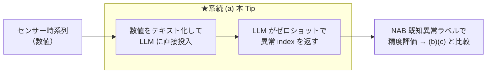

# LLM への数値直接入力で、センサーデータの異常検知から自然言語レポート化までを行う

センサー時系列の異常検知に LLM を絡める 3 系統のうち、**最も軽量な系統 (a) 数値直接入力**（SigLLM / LLMAD / LLMTime 系）を実際に動かす。数値系列をそのままテキスト化して LLM に渡し、**LLM 自身がゼロショットで異常点を検出**、続けてその検出結果から**運用向けの自然言語レポートを生成**する。検知精度は **[NAB](https://github.com/numenta/NAB) の既知異常区間ラベル**で評価する。

> **系統 (a) の位置づけ**: 実装が最軽量（TSFM も画像化も不要、学習不要）だが、**「LLM 単体は生の数値時系列の理解が苦手」という否定的結果が査読付きで複数報告**されている（SigLLM は専用 DL 比 約30% 劣後と自己報告）。ICL/CoT の足場が無いと精度が出にくく、トークン長も系列長に比例して爆発する。この Tip はその特性を実データで体感し、他系統と比較するのが目的。

## 3 系統の中での位置づけ



## しくみ

1. NAB のセンサー時系列（実データ）を読み込み、CPU 実行・トークン量の都合で間引く（`--downsample`, 既定 24）。
2. 系列を `index,timestamp,value` のテキストにして、システムプロンプト（[`prompts.yaml`](prompts.yaml)）とともに LLM に渡す。
3. LLM は**異常点の index を JSON 配列**（`[{"index":.., "reason":".."}, ...]`）で返す。
4. 返ってきた index を点フラグに変換し、**NAB の既知異常区間ラベルで評価**（[`nab_common.py`](nab_common.py) の `evaluate`）。

> **LLM に入力するのは数値系列そのもの**（系統 (c) が「異常点の数値サマリだけ」を渡すのと対照的）。系統 (a) は検知そのものを LLM に委ねる。

## コードの主なポイント

- 検知スクリプト: [`detect_numeric_llm.py`](detect_numeric_llm.py)（数値テキスト化 → LLM → 異常 index → 評価 → 可視化・レポート保存）
- 共通処理: [`nab_common.py`](nab_common.py)（NAB ローダ／正解ラベルでの評価／可視化。系統 (b)(c) と共通の評価指標）
- プロンプト定義: [`prompts.yaml`](prompts.yaml)（コードから分離して管理）

## 使用方法（uv + Makefile）

```sh
make install                 # 依存を uv で同期（pyproject.toml）
cp .env.sample .env          # OPENAI_API_KEY を設定（既定は Google Gemini）
make run                     # 検知 → NAB ラベルで評価（既定=機械温度センサー）
make run NAB_KEY=cpu         # 別センサー
```

## 実行結果（機械温度センサー, NAB machine-temp, 946 点）

### ① 検知（数値直接入力）

```
[detect] 数値直接入力: 異常 4 点検出
[eval] {'windows_total': 4, 'windows_detected': 2, 'window_recall': 0.5, 'false_alarms': 1, 'pa_f1': 0.657, 'n_pred': 4}
```

数値だけを見て **4 区間中 2 区間を検出**。精密だが検出は疎で、半分の異常を見逃した。オレンジ帯=既知異常区間（正解）、赤点=LLM が検出した異常点。


### ② 検知結果から自然言語レポートを生成

検出した異常点の要約を LLM に渡し、運用向けレポートを `reports/machine-temp.md` に生成する（Gemini 3.5 Flash 実出力の抜粋）。

```text
## サマリ（重要度: 高、件数: 4件、対象時間帯: 2013-12-16 17:15 ～ 2014-02-09 12:15）
本期間において計4件の異常値が検知されました。特に2月7〜9日に極端な高温と低温の検知が繰り返されており、
システムに重大な異常が発生している可能性が高いため、重要度「高」として報告します。
## 検知イベント（重要度順）
1. 2014-02-09 12:15 | 値: 74.70（重要度: 高）  …
## 根本原因の仮説（確度付き）  / ## 推奨アクション（優先度順）  / ## 補足・限界
```

## 3 系統の公正な精度比較（全 6 センサー）

`data/` の**全センサー**で、同一正解（NAB ラベル）・同一指標（[`nab_common.py`](nab_common.py) の `evaluate`）・同一 LLM（(a)(b) は Gemini 3.5 Flash、(c) は Chronos-Bolt）で 3 系統を比較した（各セル `window_recall / 誤検知点 / PA-F1`。各行の最良 PA-F1 を太字）。センサーごとに点数が数百になる `--downsample` を用い、3 系統は同一設定で回している。

| センサー（点数） | 数値直接入力（本 Tip） | 画像→VLM（[70](https://github.com/Yagami360/ai-product-dev-tips/tree/master/nlp_processing/70)） | TSFM Chronos（[67](https://github.com/Yagami360/ai-product-dev-tips/tree/master/nlp_processing/67)） |
|---|---|---|---|
| machine-temp (946) | 0.50 / 1 / 0.657 | 1.00 / 9 / **0.954** | 0.50 / 5 / 0.639 |
| ambient-temp (606) | 1.00 / 0 / **1.00** | 1.00 / 0 / **1.00** | 0.00 / 0 / 0.00 |
| cpu (672) | 0.50 / 0 / **0.673** | 0.50 / 166 / 0.255 | 0.50 / 0 / **0.673** |
| traffic-speed (564) | 0.75 / 3 / **0.835** | 0.75 / 25 / 0.688 | 0.50 / 1 / 0.651 |
| traffic-occupancy (1190) | 1.00 / 3 / 0.988 | 1.00 / 29 / 0.891 | 1.00 / 2 / **0.992** |
| network (789) | 1.00 / 5 / **0.969** | 0.50 / 86 / 0.39 | 1.00 / 33 / 0.827 |

### 考察（この結果の読み方 — 重要）

- **どの手法も万能に最良ではない**（実測で明確）: machine-temp では画像→VLM、traffic-occupancy では TSFM、ambient/cpu/traffic-speed/network では数値直接入力、が最良。**逆に各手法に明確な失敗もある**——TSFM は ambient で全く検出できず（0/2）、画像→VLM は cpu/network の高分散データで誤検知が爆発（166 / 86 点）。学術的にも mTSBench「どの検出器も全データで優位に立てない」、TSB-AD「基盤モデル系は点異常で有望」と一致する。**「TSFM が常に最高品質」とは言えない**。
- **平均でランク付けしない**: 単純平均 PA-F1 は (a)≈0.85 / (b)≈0.70 / (c)≈0.63 だが、これは**粗い間引きが (c) に不利**（Chronos が得意な細かい構造を潰す。[67](https://github.com/Yagami360/ai-product-dev-tips/tree/master/nlp_processing/67) の downsample 6 では (c) はより強い）、**PA-F1 が「広く当てる」方式に甘い**、(b) の誤検知爆発が平均を下げる、等の設定要因で決まっており、順位の一般化はできない。厳密には VUS-PR / PATE 等の閾値フリー指標＋複数試行が必要。
- **この比較は「検知精度」だけを見ている**: (c) TSFM+LLM 本来の価値は「数値に強い TSFM で検知 → 言語に強い LLM で説明」の**役割分担**と、**検知＋説明＋コスト＋商用実証の両立**にある。説明品質（[67](https://github.com/Yagami360/ai-product-dev-tips/tree/master/nlp_processing/67) の LLM-as-judge で 5/5）・コスト・頑健性は本表では測っていない。

→ **結論: 検知単独では万能な系統は無く、データ特性に依存する。実務では (c) TSFM+LLM の「検知＋説明のバランス」が有力**という位置づけは変わらない。本表は設定依存の一例として読むこと（LLM/VLM は非決定的で実行ごとに数値は多少変わる）。

## 注意点・課題

- **LLM 単体の数値時系列理解は弱い**: 系統 (a) は専用手法に精度で劣後しやすい（SigLLM: 約30% 劣後の自己報告）。ICL/CoT・few-shot の足場が精度を左右する（本 Tip は素朴なゼロショット）。
- **トークン長の爆発**: 系列長に比例して入力トークンが増える。長い系列はそのまま渡せず、間引き・窓分割が必要（本 Tip は `--downsample` で対処）。
- **モデル依存が大きい**: 使う LLM でも精度が変わる（調査でも GPT-4→GPT-3.5/Llama で F1 半減）。
- **評価指標の注意**: 上記のとおり PA-F1 は甘い。厳密評価は閾値フリー指標＋複数データで。

## 参考サイト

- https://github.com/numenta/NAB （Numenta Anomaly Benchmark: 実世界のセンサー異常検知データ）
- https://arxiv.org/abs/2405.14755 （SigLLM: Time Series Anomaly Detection with LLMs, MIT）
- https://arxiv.org/abs/2405.15370 （LLMAD: few-shot + Anomaly CoT で LLM の TSAD 精度を上げる）
- https://arxiv.org/abs/2310.07820 （LLMTime: LLMs Are Zero-Shot Time Series Forecasters）
- https://github.com/sintel-dev/sigllm （SigLLM 公式実装, MIT）
- https://arxiv.org/abs/2409.01980 （サーベイ: LLMs for Time Series Anomaly Detection, NAACL 2025 Findings）
