# 折れ線グラフ画像 × VLM で、センサーデータの異常検知から自然言語レポート化までを行う

センサー時系列の異常検知に LLM を絡める 3 系統のうち、**系統 (b) 画像化 → マルチモーダル LLM（VLM）**（TAMA / AnomLLM 系）を実際に動かす。センサー値を**折れ線グラフ画像**にして VLM に見せ、**VLM が視覚的に異常な時間帯を読み取り**、続けてその検出結果から**運用向けの自然言語レポートを生成**する。検知精度は **[NAB](https://github.com/numenta/NAB) の既知異常区間ラベル**で評価する。GPU 不要（VLM は API 経由）。

> **⚠️ 系統 (b) の位置づけ**: 「数値をテキストで渡す」系統 (a) より**頑健**という報告が複数論文で一致（人間が折れ線グラフの異常を見抜くのと同じで、VLM は視覚パターンから異常を捉えやすい）。説明も自然に出る。一方で**季節性異常には弱い**（TAMA 論文で季節性異常の分類精度 29.0%）、**画像化の設計（1 枚に描く期間・重ね方・解像度）に敏感**、**検出範囲が広くなりがち**という弱点がある。

## 📑 目次

- [アーキテクチャ](#-アーキテクチャ)
- [使用方法](#-使用方法)
- [実行結果](#-実行結果)
    - [① 検知（画像化 → VLM）](#-検知画像化--vlm)
    - [② 検知結果から自然言語レポートを生成](#-検知結果から自然言語レポートを生成)
    - [③ レポート品質の評価（LLM-as-judge）](#-レポート品質の評価llm-as-judge)
    - [④ 3 系統の公正な精度比較（全 6 センサー）](#-3-系統の公正な精度比較全-6-センサー)
- [開発者向け情報](#-開発者向け情報)
- [参考サイト](#-参考サイト)

## 🏗️ アーキテクチャ

| 系統 | 仕組み | 代表手法 | 位置づけ |
|------|--------|---------|---------|
| (a) 数値直接入力（[69](https://github.com/Yagami360/ai-product-dev-tips/tree/master/nlp_processing/69)） | 数値系列をテキスト化して LLM に投入 | SigLLM / LLMAD / LLMTime | 最軽量だが LLM 単体は数値時系列に弱く、ICL/CoT の足場が無いと精度が出ない |
| **(b) 画像化 → VLM**（★本 Tip） | **折れ線グラフ画像を VLM に見せて検知＋説明** | TAMA / AnomLLM / ChatTS | **数値テキストより頑健と複数論文が報告。説明も自然に出るが、季節性異常に弱く画像化設計に敏感** |
| (c) TSFM + LLM 2 段（[67](https://github.com/Yagami360/ai-product-dev-tips/tree/master/nlp_processing/67)） | TSFM で異常スコア → LLM が解釈・レポート化 | Chronos/TimesFM/TSPulse + LLM（商用: Datadog Toto + Bits AI SRE） | 検知は数値に強い TSFM、説明は言語に強い LLM と役割分担。商用実証あり |

センサー時系列の異常検知に LLM を絡める 3 系統の中で、本 Tip が実装するのは系統 (b) の経路。

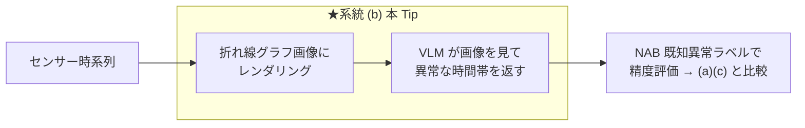

推論経路は次の 5 ステップ。

1. NAB のセンサー時系列（実データ）を読み込み、間引く（`--downsample`, 既定 24）。
2. **検知対象の生の折れ線グラフを PNG にレンダリング**（`images/<センサー>_input.png`。検知結果は重畳しない）。
3. その画像を base64 の data URI にして、システムプロンプト（[`prompts.yaml`](prompts.yaml)）とともに**マルチモーダル LLM（VLM）に渡す**。
4. VLM は**異常な時間帯を JSON 配列**（`[{"start":"..","end":"..","reason":".."}, ...]`）で返す。
5. 返ってきた時間帯を点フラグに変換し、**NAB の既知異常区間ラベルで評価**（[`nab_common.py`](nab_common.py) の `evaluate`）。

- **画像は OpenAI SDK の `image_url`（data URI）で渡す**。VLM（例: Gemini 3.5 Flash はネイティブ・マルチモーダル）が画像を直接読む。
- **LLM に入力するのはグラフ画像**（系統 (a) が数値系列そのものを、(c) が「異常点の数値サマリだけ」を渡すのと対照的）。系統 (b) も**検知そのものを VLM に委ねる**。
- **VLM が返すのは「点」ではなく「時間帯」**。人間がグラフを見て「この辺りがおかしい」と言うのと同じ粒度なので、点単位に落とすと検出範囲が広くなりやすい（後述の誤検知増の原因）。

## 🚀 使用方法

1. 依存を uv で仮想環境に同期する

    ```sh
    make install
    ```

1. API キーを設定する（`.env` は git 管理外）

    ```sh
    cp .env.sample .env    # .env に OPENAI_API_KEY=... を記入
    ```

    既定は Google Gemini（`gemini-3.5-flash`）。API キーは https://aistudio.google.com/apikey で取得できる。**画像を読ませるため、モデルはマルチモーダル対応（VLM）である必要がある**。

1. 実センサーデータ（NAB）を取得する

    ```sh
    make download-nab-dataset                  # 全 6 センサー＋正解ラベルを datasets/nab へ
    make download-nab-dataset DOWNLOAD_KEY=cpu # 単体で取得
    ```

    検知スクリプトは初回実行時に自動ダウンロードするのでこの手順は必須ではないが、事前にまとめて取得しておきたいとき（オフライン実行の準備など）に使う。

1. 画像化 → VLM 検知 → NAB ラベルで評価する

    ```sh
    make run                     # 既定=機械温度センサー
    make run NAB_KEY=cpu         # 別センサー
    ```

    入力には、実世界のセンサー異常検知ベンチマーク **[NAB](https://github.com/numenta/NAB)** の公開データ（`timestamp,value` 形式・既知の異常区間ラベル付き）を使う。`NAB_KEY` で対象センサーを選ぶ（3 系統で共通）。

    | `NAB_KEY` | センサー | 内容 | 入力波形例（<span style="color:#ff7f0e">■</span> 帯＝既知異常区間） |
    |---|---|---|---|
    | `machine-temp`（既定） | 産業機械の温度 | 実機の温度センサー。既知の故障あり | 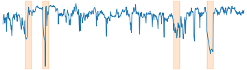 |
    | `ambient-temp` | 室温 | 室温センサー。故障イベントあり | 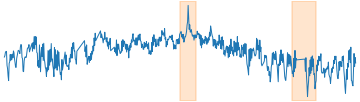 |
    | `cpu` | サーバ CPU 使用率 | AWS EC2 の CPU 使用率メトリクス |  |
    | `traffic-speed` | 道路の車速 | 交通センサーの速度（渋滞・異常で急落） | 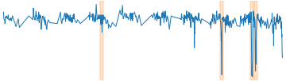 |
    | `traffic-occupancy` | 道路の占有率 | 交通センサーの占有率 | 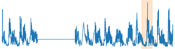 |
    | `network` | サーバ受信ネットワーク量 | EC2 の network-in メトリクス |  |

    VLM に見せた入力画像を `images/<センサー>_input.png`、検知結果の図を `images/<センサー>_vlm_image.png`、自然言語レポートを `reports/<センサー>.md` に出力する。

## 📊 実行結果

機械温度センサー（NAB `machine-temp`, `--downsample 24` で 946 点）に対する実測。VLM は Gemini 3.5 Flash。

### ① 検知（画像化 → VLM）

VLM は折れ線グラフから**異常な「時間帯」**を返す。返された時間帯を点に展開して NAB 公式スコアで採点した、**全 6 センサー × 10 回実行**の結果:

| センサー（データ数） | 検知結果（<span style="color:#ff7f0e">■</span> 帯＝NAB が定義する異常区間／<span style="color:#d62728">●</span>＝VLM の検知点。クリックで原寸） | N=10 平均 | 10 回の分布（NAB スコア） |
|---|---|---|---|
| `machine-temp` (946) | <a href="images/machine-temp_vlm_image.png">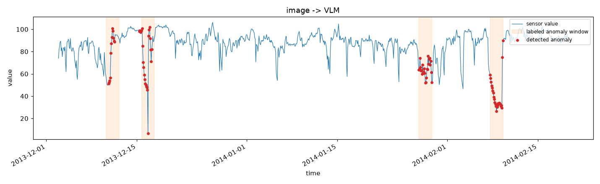</a> | 異常区間の検出率=0.80<br>誤検知点=25.4<br>**NAB スコア=42.6** | 74.4 が 6 回 / -5.1 が 4 回 |
| `ambient-temp` (606) | <a href="images/ambient-temp_vlm_image.png">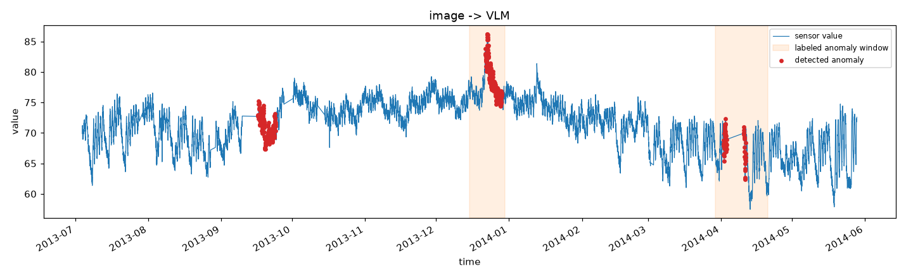</a> | 異常区間の検出率=1.00<br>誤検知点=0.0<br>**NAB スコア=95.3** | 95.7 が 6 回 / 94.6 が 4 回 |
| `cpu` (672) | <a href="images/cpu_vlm_image.png">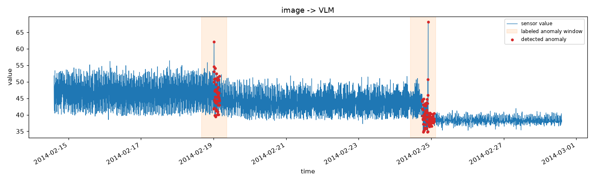</a> | 異常区間の検出率=0.50<br>誤検知点=83.0<br>**NAB スコア=-169.3** | **47.0 が 5 回 / -385.7 が 5 回** |
| `traffic-speed` (564) | <a href="images/traffic-speed_vlm_image.png">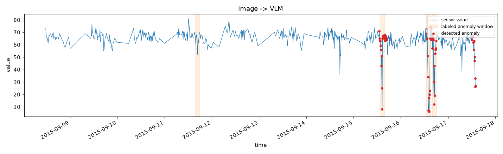</a> | 異常区間の検出率=0.75<br>誤検知点=37.6<br>**NAB スコア=30.8** | 23.6 が 7 回 / 47.7 が 3 回 |
| `traffic-occupancy` (1190) | <a href="images/traffic-occupancy_vlm_image.png">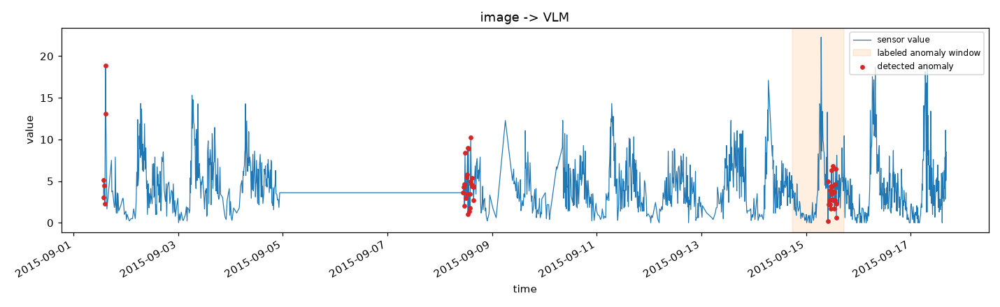</a> | 異常区間の検出率=1.00<br>誤検知点=29.0<br>**NAB スコア=-36.3** | -40.6 が 6 回 / -29.8 が 4 回 |
| `network` (789) | <a href="images/network_vlm_image.png">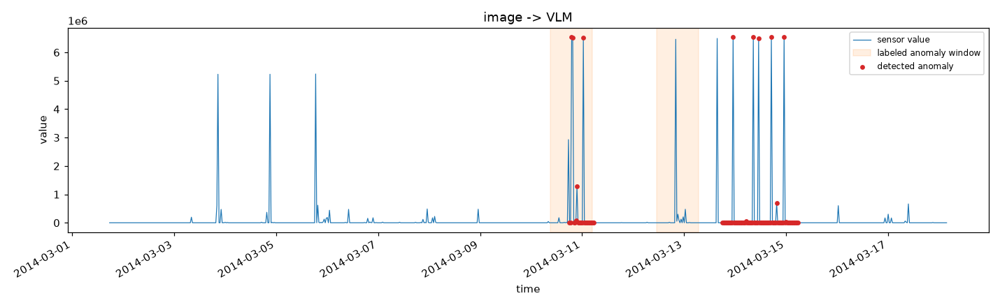</a> | 異常区間の検出率=0.50<br>誤検知点=81.2<br>**NAB スコア=-163.1** | -172.5 が 6 回 / -149.1 が 4 回 |

図は **10 回のうち平均に最も近い試行**を掲載している（最良でも最悪でもない代表例）。図の見方:

- <span style="color:#1f77b4">─</span> **青線**: センサー値（VLM にはこの折れ線を PNG 画像にして見せている）
- <span style="color:#ff7f0e">■</span> **オレンジ帯**: NAB が「ここが異常」と定義している区間。**採点基準であって、モデルが当てた箇所ではない**
- <span style="color:#d62728">●</span> **赤点**: VLM が返した時間帯に含まれる点。**オレンジ帯に入っていれば命中、帯の外にあれば誤検知**

> **⚠️ VLM の出力は二峰性**: 上表の「分布」列のとおり、**ランダムに揺れるのではなく 2 つの答えを行き来する**。cpu は **47.0 と -385.7 のコイン投げ**で、同じ画像を見せても「当たり」と「大外れ」が半々。**2 回連続で同じ値が出ることも多いため、少数回の測定では安定していると誤認しやすい**。

#### 間引き（`--downsample`）の影響

`--downsample 1`（生解像度）でも 10 回測定した結果、**全体では間引きありが優る**（平均 -33.3 対 -279.6）が、**センサーによっては逆転する**:

| センサー | 間引きあり | 間引きなし | 差 |
|---|---|---|---|
| machine-temp | **42.6** | -982.5 | 間引きあり |
| ambient-temp | **95.3** | -368.0 | 間引きあり |
| **cpu** | -169.3 | **93.2** | **間引きなしが大幅改善**（しかも 92.9〜94.0 と安定） |
| traffic-speed | **30.8** | -51.6 | 間引きあり |
| traffic-occupancy | -36.3 | **-21.5** | 間引きなし |
| network | **-163.1** | -347.5 | 間引きあり |

**間引きは VLM の「読み取り」を妨げていない**（machine-temp の異常区間検出率は間引きなしで 0.50 → 0.75 に向上した）。悪化の原因は**点密度**で、VLM が返す時間帯の幅は同じでも、そこに含まれる点が 24 倍になれば誤検知の絶対数も膨らむ（96 点 → 3,459 点、誤検知 50 → 1,818）。**間引きは VLM のためではなく、粗く返す方式を点単位で採点する副作用を抑えるためのもの**。

> 後述の 3 系統比較では**全系統・全センサーで間引きあり**に統一している（(a) はトークン長の制約で間引きが必然なため、条件を揃えないと公平な比較にならない）。

### ② 検知結果から自然言語レポートを生成

検出した異常時間帯の要約を LLM に渡し、運用向けレポートを `reports/machine-temp.md` に生成する（サマリ → 検知イベント → 根本原因の仮説（確度付き）→ 推奨アクション（P1/P2/P3）→ 補足・限界 の実用フォーマット）。

### ③ レポート品質の評価（LLM-as-judge）

`make evaluate` は、生成レポートを **LLM-as-judge**（別の LLM を審査員に）で採点する（[`evaluate_report.py`](evaluate_report.py)）。**審査員には「検知結果（数値の事実）」と「生成レポート」の両方を渡し、前者を根拠に後者を採点させる**。採点は `temperature=0.0`・JSON 強制で行い、4 観点を 1〜5 で評価する。判定基準は 3 系統で共通（[`prompts.yaml`](prompts.yaml) の `judge_system`）。

| センサー | 忠実性 | 有用性 | 可読性 | 準拠 | 総合 |
|---|---|---|---|---|---|
| machine-temp | 4 | 5 | 5 | 5 | 4.75 |
| ambient-temp | **2** | 4 | 5 | 5 | 4.0 |
| cpu | **2** | 4 | 5 | 5 | 4.0 |
| traffic-speed | **1** | 4 | 5 | 5 | 3.75 |
| traffic-occupancy | **1** | 2 | 4 | 5 | 3.0 |
| network | 5 | 5 | 5 | 5 | 5.0 |
| **平均** | **2.5** | 4.0 | 4.8 | 5.0 | **4.08** |

- **可読性・フォーマット準拠は常に高いのに、忠実性が壊滅的**（6 件中 4 件が 1〜2）。**読みやすく整っているのに中身が捏造**という、運用上もっとも危険なパターン。
- 審査員の指摘は一貫している。traffic-occupancy では「検知結果にない数値（18.83 や 0.22 など）や『毎週火曜日に集中』といった分析が多数捏造されている」、cpu では「元の事実である『水準の急激な低下』とは逆に『高めの中位値が継続している』と解釈している」。
- 原因は**渡す事実の粒度**にある。本 Tip が LLM に渡すサマリは「時刻: 値=X」だけ（[`nab_common.py`](nab_common.py) の `summary_from_flags`）で、しかも VLM が返した**広い時間帯を点に展開した大量の点**が並ぶ。期待値も逸脱度も無いため、LLM が数値を埋めてしまう。
- 対して系統 (c)（[67](https://github.com/Yagami360/ai-product-dev-tips/tree/master/nlp_processing/67)）は期待中央値・期待区間・逸脱スコアを渡すため、**同じモデル・同じ審査基準で全 6 センサー満点（忠実性すべて 5）**。

### ④ 3 系統の公正な精度比較（全 6 センサー）

**全 6 センサー**で、同一正解（NAB ラベル）・同一指標（NAB 公式スコア）・同一 LLM（3 系統とも `gemini-3.5-flash`。(c) の検知層のみ Chronos-Bolt）・同一 `temperature=0.0` で比較した。センサーごとにデータ数が数百になる `--downsample`（24 / 12 / 6 / 2 / 2 / 6）を用い、3 系統は同一設定で回している。

> **表の「データ数」は検知層への入力数**であり、LLM が見る量とは異なる。**(a) は全点をテキストで LLM に渡す**（machine-temp なら 946 行）。**(b) は全点を描画した PNG 画像 1 枚**を VLM に渡す（数値は渡さない）。**(c) は全点を Chronos にのみ渡し、LLM には逸脱スコア上位 15 点の数値サマリだけ**を渡す。この違いが後述のレポート忠実性の差に直結する。
>
> **なぜ間引く（`--downsample`）のか**: **間引きが必然なのは (a) だけ**。(a) はトークン長の制約で、machine-temp の生データ 22,695 点をテキスト化すると約 68 万トークンに達する。**(b)(c) は手法として間引きを必要としない**——3 系統を同一入力で比較するために揃えているだけで、実測でも次のとおり間引きは (b)(c) の性能を上げていない。
>
> - **(c) は間引きが不利**: ambient-temp は `--downsample 6`（1,212 点）なら 8 点検知できるが、この比較表の `--downsample 12`（606 点）では**検知 0 件（NAB スコア 0.0）**。**間引きが Chronos の得意な細かい構造を潰している**。単独で使うなら GPU で間引きなしが望ましい（CPU だと 1 点ずつ 22,599 回の予測が必要で数時間かかるのが唯一の理由）。
> - **(b) は間引きなしの方が「見えて」いる**: machine-temp を `--downsample 1`（22,695 点）で実測すると**異常区間の検出率は 0.50 → 0.75 に向上**した（VLM は生解像度のグラフでもちゃんと読める）。ただし **NAB スコアは -5.1 → -2003.0 に悪化**する。VLM が返す「時間帯」は同じでも、点密度が 24 倍になるとその時間帯に含まれる点が 96 → 3,459 に膨れ、誤検知が 50 → 1,818 になるため。**(b) の間引きは VLM のためではなく、粗く返す方式を点単位で採点する副作用を抑えるためのもの**。

主指標は **NAB 公式スコア**（`standard` プロファイル）。**100 = 完璧、0 = 無検出と同等、マイナス = 無検出より悪い**。括弧内は内訳（異常区間の検出率 / 誤検知点）。

各セルは **異常区間の検出率 / 誤検知点 / NAB スコア** の 3 指標。**LLM/VLM は `temperature=0.0` でも決定的にならない**ため、**(a)(b) は N=10 回実行した平均**。(c) の検知層 Chronos は決定的で 10 回とも完全同一だったため N=1（🏆 = その行の最良）。

> **なぜ温度を下げても揺れるのか**: Gemini の OpenAI 互換エンドポイントは**再現性のための `seed` を受け付けない**（実測で 400 `Unknown name "seed"`）。`top_k` も非対応、`system_fingerprint` も返らない。加えてホスト型 LLM 推論では、同時実行される他リクエストでバッチ構成が変わり、浮動小数点演算の非結合性から数値がわずかにブレる。**パラメータでは抑制できないため、統計的に扱うしかない**。

| センサー（データ数） | 数値直接入力（[69](https://github.com/Yagami360/ai-product-dev-tips/tree/master/nlp_processing/69)）<br>N=10 平均 | 画像→VLM（本 Tip）<br>N=10 平均 | TSFM Chronos（[67](https://github.com/Yagami360/ai-product-dev-tips/tree/master/nlp_processing/67)）<br>決定的（N=1 で十分） |
|---|---|---|---|
| machine-temp (946) | 異常区間の検出率=0.50<br>誤検知点=0.5<br>**NAB スコア=53.4** 🏆 | 異常区間の検出率=0.80<br>誤検知点=25.4<br>**NAB スコア=42.6** | 異常区間の検出率=0.50<br>誤検知点=5<br>**NAB スコア=36.5** |
| ambient-temp (606) | 異常区間の検出率=1.00<br>誤検知点=0.0<br>**NAB スコア=93.5** | 異常区間の検出率=1.00<br>誤検知点=0.0<br>**NAB スコア=95.3** 🏆 | 異常区間の検出率=0.00<br>誤検知点=0<br>**NAB スコア=0.0** |
| cpu (672) | 異常区間の検出率=0.50<br>誤検知点=0.0<br>**NAB スコア=42.3** 🏆 | 異常区間の検出率=0.50<br>誤検知点=83.0<br>**NAB スコア=-169.3** | 異常区間の検出率=0.50<br>誤検知点=2<br>**NAB スコア=37.4** |
| traffic-speed (564) | 異常区間の検出率=0.75<br>誤検知点=2.6<br>**NAB スコア=68.8** 🏆 | 異常区間の検出率=0.75<br>誤検知点=37.6<br>**NAB スコア=30.8** | 異常区間の検出率=0.50<br>誤検知点=1<br>**NAB スコア=47.6** |
| traffic-occupancy (1190) | 異常区間の検出率=1.00<br>誤検知点=3.0<br>**NAB スコア=82.1** 🏆 | 異常区間の検出率=1.00<br>誤検知点=29.0<br>**NAB スコア=-36.3** | 異常区間の検出率=1.00<br>誤検知点=25<br>**NAB スコア=-30.3** |
| network (789) | 異常区間の検出率=1.00<br>誤検知点=8.2<br>**NAB スコア=81.0** 🏆 | 異常区間の検出率=0.50<br>誤検知点=81.2<br>**NAB スコア=-163.1** | 異常区間の検出率=1.00<br>誤検知点=33<br>**NAB スコア=15.0** |
| **全体平均** | **NAB スコア=70.2** 🏆 | **NAB スコア=-33.3** | **NAB スコア=17.7** |

> **考察（この結果の読み方 — 重要）**
>
> - **検知精度は (a) 数値直接入力が最良**（全体平均 70.2、全センサーでプラス）。理由は「**LLM の検知が疎だから**」で、2〜15 点しか返さない。NAB スコアは誤検知を強く罰するため、「自信のある少数だけを挙げる」戦略が有利に働く。
> - **(b) 画像→VLM は全体平均 -33.3**。マイナスは「**無検出（0 点）より悪い**」ことを意味する。**注目すべきは検出率と誤検知点の対比**——machine-temp では (b) の検出率 0.80 が (a) の 0.50 を上回っており、**VLM は異常を「見つける」能力では勝っている**。それでもスコアが負けるのは誤検知が 25.4 点（(a) は 0.5 点）に達するため。**「この辺り」と広い時間帯を返す方式が、点単位の採点で罰される**という構造がはっきり出ている。
> - **(c) TSFM も全体平均 17.7 と振るわない**。ambient-temp は間引き後の系列で予測区間を超えられず**検知 0 件（0.0）**。**「TSFM だから検知精度が高い」とは言えない**。学術的にも mTSBench の「どの検出器も全データで優位に立てない」と整合する。
>
> **⚠️ 再現性が系統で決定的に違う（10 回測定で判明）**
>
> | 系統 | 10 回の挙動 |
> |---|---|
> | (a) 数値直接入力 | **ほぼ安定**。ambient-temp / traffic-occupancy は 10 回とも完全同一。他も振れ幅は数点 |
> | (b) 画像→VLM | **二峰性で極端に不安定**。cpu は **47.0 と -385.7 のコイン投げ**（振れ幅 432 点）、machine-temp は -5.1 と 74.4（80 点） |
> | (c) TSFM | **完全に決定的**。10 回とも同一値 |
>
> **(b) はランダムに揺れているのではなく、2 つの解釈を行き来する**（例: スパイクを異常と見るか周期の一部と見るか）。そのため 2 回連続で同じ値が出ることも多く、**少数回の測定では「安定している」と誤認しやすい**。実際この Tip の執筆時も 2 回同じ値が出た時点で「再現する」と誤判断し、3 回目で 80 点違う値が出て誤りに気づいた。**運用では「昨日と同じデータなら同じアラートが出る」ことが前提**なので、この不安定さは (b) の致命的な弱点。
>
> - **検知精度だけで系統を選ぶべきではない**。**レポート品質（LLM-as-judge）は (c) が全 6 センサー満点（5.00）**、(a) は 4.63、(b) は 4.08（忠実性は平均 2.5）。**同一モデル・同一プロンプト・同一 temperature での差**なので、違いは**LLM に渡す事実の粒度**だけに起因する。

→ **結論: 「検知が得意な系統」「再現性がある系統」「説明が得意な系統」は一致しない。** 検知の素の精度では疎に当てる (a) が有利、**再現性と説明品質では (c) が唯一実用に耐える**（決定的かつ忠実性が全て 5）。実務では「(c) の TSFM で検証可能な事実を作り、それを LLM に言語化させる」構成が、**再現性と説明の両立**という点で有力。検知精度を上げたいなら (c) の検知層を差し替える（TSPulse 等の異常検知特化 TSFM、しきい値の自動調整）のが筋で、2 段構成そのものは維持する価値がある。

## 🛠️ 開発者向け情報

### 📁 ディレクトリ構成

```
nlp_processing/70/
├── pyproject.toml / Makefile / .env.sample   # uv + make の実行環境 / API キーのひな形
├── .flake8                    # lint 設定（flake8。black と競合する規則は無効化）
├── detect_vlm_image.py        # グラフ画像化 → VLM → 異常時間帯 → 点フラグ → 評価 → 可視化・レポート保存
├── evaluate_report.py         # 生成レポートを LLM-as-judge で品質評価
├── download_dataset.py        # NAB データを datasets/nab へ取得
├── nab_common.py              # NAB ローダ／正解ラベルでの評価／可視化（系統 (a)(c) と共通の評価指標）
├── nab_score.py               # NAB 公式スコア（3 プロファイル）の算出
├── nab_sweeper.py             # ※NAB 公式実装をそのまま流用（MIT, Numenta Inc.）。lint/format 対象外
├── prompts.yaml               # プロンプト定義（検知用・レポート生成用・judge 用。コードから分離）
├── images/                    # VLM への入力画像・README 掲載図（コミット対象）
├── reports/                   # 生成された自然言語レポート
└── datasets/nab/ ※git 管理外  # NAB の CSV・正解ラベル（make download-nab-dataset で取得）
```

### 🧰 利用可能コマンド（`make <target>`）

| コマンド | 説明 |
|---|---|
| `make install` | 依存(+dev ツール)を uv で仮想環境に同期 |
| `make download-nab-dataset` | NAB の実センサーデータ・正解ラベルを `datasets/nab` へ取得（既定は全 6 センサー） |
| `make run` | 画像化 → VLM で検知 → NAB ラベルで評価（`NAB_KEY=cpu` で別センサー） |
| `make evaluate` | 生成レポートを LLM-as-judge で品質評価（`NAB_KEY=cpu` で別センサー） |
| `make lint` / `make format` | flake8・mypy で静的チェック / black・isort で自動整形 |
| `make format-check` | 整形済みか確認（CI 用・変更しない） |
| `make clean` | ダウンロードしたデータ（`datasets/`）を削除 |

主な変数（`make run VAR=値` または `.env` で上書き）: `NAB_KEY`（既定 `machine-temp`）/ `DOWNSAMPLE`（24）/ `BASE_URL` / `LLM_MODEL`（`gemini-3.5-flash`）/ `REASONING_EFFORT`（`low`）。

## ⚠️ 注意点・課題

- **季節性異常に弱い**: 折れ線の見た目では周期からの微妙なずれを捉えにくい（TAMA 論文: 季節性異常の分類 29.0%）。
- **画像化の設計に敏感**: 1 枚に描く期間・重ね方・解像度・軸の描き方で VLM の読み取りが変わる。長い系列を 1 枚に詰め込むと分解能が落ちる。
- **検出範囲が広くなりがち**: VLM は「この辺り」を返すため、点単位の精度は粗く誤検知が増える。時刻の読み取り精度にも依存する。
- **画像対応モデルが必要**: 検知・説明に使う LLM がマルチモーダル（VLM）である必要がある。
- **点単位の評価では無検出より悪くなり得る**: 実測で 6 センサー中 4 つが NAB スコアでマイナス。「時間帯」を返す方式は誤検知として強く罰される。**異常が起きた「時間帯」を大まかに見つける用途には向くが、異常点をピンポイントで特定する用途には向かない**。
- **レポートの忠実性が最下位**: 渡せる事実が「時刻と値」だけのため、LLM が数値を捏造しやすい（忠実性 平均 2.5）。
- **API キーの管理**: API キーは `.env`（git 管理外）や環境変数で渡し、コードやリポジトリに直書きしない。

## 🔗 参考サイト

- https://github.com/numenta/NAB （Numenta Anomaly Benchmark: 実世界のセンサー異常検知データ）
- https://arxiv.org/abs/2411.02465 （TAMA: See it, Think it, Sorted — 折れ線画像を MLLM に見せる TSAD）
- https://arxiv.org/abs/2410.05440 （Can LLMs Understand Time Series Anomalies?, ICLR。画像の方が頑健と報告）
- https://arxiv.org/abs/2502.17812 （Can Multimodal LLMs Perform Time Series Anomaly Detection?, WWW 2026）
- https://github.com/Rose-STL-Lab/AnomLLM （AnomLLM 実装, MIT）
- https://arxiv.org/abs/2405.12096 （PATE: 近接を考慮した TSAD 評価指標。PA-F1 の過大評価を指摘）
- https://arxiv.org/abs/2607.11969 （PA 後継指標の独立検証: 11 指標中 5 個がゲーム可能。PR 系と PA%K のみ頑健）
- https://arxiv.org/abs/2409.01980 （サーベイ: LLMs for Time Series Anomaly Detection, NAACL 2025 Findings）
- https://ai.google.dev/gemini-api/docs/openai （Gemini の OpenAI 互換エンドポイント）
- https://docs.astral.sh/uv/ （uv: Python パッケージ管理）
