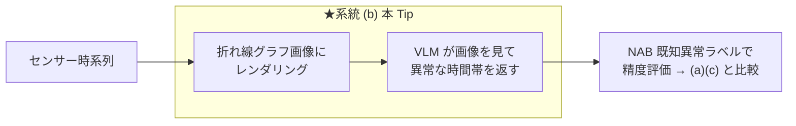

# 折れ線グラフ画像を VLM に見せてセンサーの異常検知を行い、数値直接入力 / TSFM+LLM 方式と精度比較する

センサー時系列の異常検知に LLM を絡める 3 系統のうち、**系統 (b) 画像化 → マルチモーダル LLM（VLM）**（TAMA / AnomLLM 系）を実際に動かす。センサー値を**折れ線グラフ画像**にして VLM に見せ、**VLM が視覚的に異常な時間帯を読み取る**。検知精度を **[NAB](https://github.com/numenta/NAB) の既知異常区間ラベル**で評価し、**系統 (a) 数値直接入力（[nlp_processing/69](https://github.com/Yagami360/ai-product-dev-tips/tree/master/nlp_processing/69)）**・**系統 (c) TSFM+LLM（[nlp_processing/67](https://github.com/Yagami360/ai-product-dev-tips/tree/master/nlp_processing/67)）**と**同一データ・同一指標で公正に比較**する。

> **系統 (b) の位置づけ**: 「数値をテキストで渡す」系統 (a) より**頑健**という報告が複数論文で一致（人間が折れ線グラフの異常を見抜くのと同じで、VLM は視覚パターンから異常を捉えやすい）。説明も自然に出る。一方で**季節性異常には弱い**（TAMA 論文で季節性異常の分類精度 29.0%）、**画像化の設計（窓幅・重畳・解像度）に敏感**、**検出範囲が広くなりがち**という弱点がある。

## 3 系統の中での位置づけ



## しくみ

1. NAB のセンサー時系列（実データ）を読み込み、間引く（`--downsample`, 既定 24）。
2. **検知対象の生の折れ線グラフを PNG にレンダリング**（`images/<センサー>_input.png`。検知結果は重畳しない）。
3. その画像を base64 の data URI にして、システムプロンプト（[`prompts.yaml`](prompts.yaml)）とともに**マルチモーダル LLM（VLM）に渡す**。
4. VLM は**異常な時間帯を JSON 配列**（`[{"start":"..","end":"..","reason":".."}, ...]`）で返す。
5. 返ってきた時間帯を点フラグに変換し、**NAB の既知異常区間ラベルで評価**（[`nab_common.py`](nab_common.py) の `evaluate`）。

## コードの主なポイント

- 検知スクリプト: [`detect_vlm_image.py`](detect_vlm_image.py)（グラフ画像化 → VLM → 異常時間帯 → 点フラグ → 評価 → 可視化・レポート保存）
    - 画像は OpenAI SDK の `image_url`（data URI）で渡す。VLM（例: Gemini 3.5 Flash はネイティブ・マルチモーダル）が画像を直接読む。
- 共通処理: [`nab_common.py`](nab_common.py)（NAB ローダ／正解ラベルでの評価／可視化。系統 (a)(c) と共通の評価指標）
- プロンプト定義: [`prompts.yaml`](prompts.yaml)

## 使用方法（uv + Makefile）

```sh
make install                 # 依存を uv で同期（pyproject.toml）
cp .env.sample .env          # OPENAI_API_KEY を設定（VLM は画像対応モデルが必要。既定は Gemini）
make run                     # 画像化 → VLM 検知 → NAB ラベルで評価（既定=機械温度センサー）
make run NAB_KEY=cpu         # 別センサー
```

## 実行結果（機械温度センサー, NAB machine-temp, 946 点）

```
[detect] 系統(b) 画像化→VLM: 異常時間帯 4 個 / 異常 86 点
[eval] {'windows_total': 4, 'windows_detected': 4, 'window_recall': 1.0, 'false_alarms': 9, 'pa_f1': 0.954, 'n_pred': 86}
```

VLM は折れ線グラフを見て、**4 区間すべてを検出（recall 1.0）**。ただし検出時間帯が広く、区間外の誤検知も 9 点出た。オレンジ帯=既知異常区間（正解）、赤点=VLM が異常と判定した時間帯内の点。


## 3 系統の公正な精度比較

同一データ・同一正解・同一指標・同一 LLM で 3 系統を比較した（本 Tip の実測）。

- **データ**: NAB 機械温度センサー（`machine-temp`）を `--downsample 24` で 946 点に間引き、既知異常区間 4 個。
- **正解**: NAB の `combined_windows` ラベル。
- **指標**（[`nab_common.py`](nab_common.py) の `evaluate`）: `window_recall`（既知異常区間のうち区間内に検出点が 1 つ以上ある割合）／ `false_alarms`（区間外での誤検知点数）／ `PA-F1`（point-adjust F1。TSAD の慣習指標だが甘めなので注意）。
- **検知器**: (a)(b) は同じ **Gemini 3.5 Flash**、(c) は **Chronos-Bolt**（`amazon/chronos-bolt-base`）。

| 系統 | 検知の主体 | 検出区間 | window recall | 誤検知点 | PA-F1 | 検出点数 |
|------|-----------|---------|--------------|---------|-------|---------|
| (a) 数値直接入力（[69](https://github.com/Yagami360/ai-product-dev-tips/tree/master/nlp_processing/69)） | LLM（数値） | 2/4 | 0.50 | 0 | 0.662 | 3 |
| (b) 画像化→VLM（本 Tip） | VLM（画像） | **4/4** | **1.00** | 9 | **0.954** | 86 |
| (c) TSFM+LLM（[67](https://github.com/Yagami360/ai-product-dev-tips/tree/master/nlp_processing/67)） | Chronos（TSFM） | 2/4 | 0.50 | 5 | 0.639 | 9 |

- この設定では **(b) 画像化→VLM が全 4 区間を検出し最高の recall**。研究でも「数値テキストより画像の方が頑健」と一致する結果。ただし検出範囲が広く**誤検知も増える**傾向（実運用では検出時間帯の絞り込みが要る）。
- **注意（結果を過度に一般化しない）**: これは**単一データ・単一設定・1 回実行**の例示であり、厳密なベンチマークではない。`--downsample`・プロンプト・モデル・画像化の設計で結果は大きく変わる。特に系統 (b) は**季節性異常に弱い**（TAMA で 29.0%）ため、周期性の強い別データでは順位が入れ替わりうる。**PA-F1 は water-mark 的に甘い**ので、本来は VUS-PR / PATE 等の閾値フリー指標・複数データ・複数試行での評価が望ましい。

## 注意点・課題

- **季節性異常に弱い**: 折れ線の見た目では周期からの微妙なずれを捉えにくい（TAMA 論文: 季節性異常の分類 29.0%）。
- **画像化の設計に敏感**: 窓幅・重畳・解像度・軸の描き方で VLM の読み取りが変わる。長い系列を 1 枚に詰め込むと分解能が落ちる。
- **検出範囲が広くなりがち**: VLM は「この辺り」を返すため、点単位の精度は粗く誤検知が増える。時刻の読み取り精度にも依存する。
- **画像対応モデルが必要**: 説明層に使う LLM がマルチモーダル（VLM）である必要がある。
- **評価指標の注意**: PA-F1 は甘い。厳密評価は閾値フリー指標＋複数データで。

## 参考サイト

- https://github.com/numenta/NAB （Numenta Anomaly Benchmark: 実世界のセンサー異常検知データ）
- https://arxiv.org/abs/2411.02465 （TAMA: See it, Think it, Sorted — 折れ線画像を MLLM に見せる TSAD）
- https://arxiv.org/abs/2410.05440 （Can LLMs Understand Time Series Anomalies?, ICLR。画像の方が頑健と報告）
- https://arxiv.org/abs/2502.17812 （Can Multimodal LLMs Perform Time Series Anomaly Detection?, WWW 2026）
- https://github.com/Rose-STL-Lab/AnomLLM （AnomLLM 実装, MIT）
- https://arxiv.org/abs/2409.01980 （サーベイ: LLMs for Time Series Anomaly Detection, NAACL 2025 Findings）
