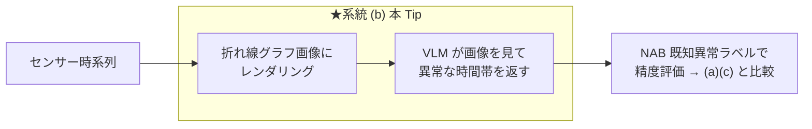

# 折れ線グラフ画像 × VLM で、センサーデータの異常検知から自然言語レポート化までを行う

センサー時系列の異常検知に LLM を絡める 3 系統のうち、**系統 (b) 画像化 → マルチモーダル LLM（VLM）**（TAMA / AnomLLM 系）を実際に動かす。センサー値を**折れ線グラフ画像**にして VLM に見せ、**VLM が視覚的に異常な時間帯を読み取り**、続けてその検出結果から**運用向けの自然言語レポートを生成**する。検知精度は **[NAB](https://github.com/numenta/NAB) の既知異常区間ラベル**で評価する。

> **系統 (b) の位置づけ**: 「数値をテキストで渡す」系統 (a) より**頑健**という報告が複数論文で一致（人間が折れ線グラフの異常を見抜くのと同じで、VLM は視覚パターンから異常を捉えやすい）。説明も自然に出る。一方で**季節性異常には弱い**（TAMA 論文で季節性異常の分類精度 29.0%）、**画像化の設計（窓幅・重畳・解像度）に敏感**、**検出範囲が広くなりがち**という弱点がある。

## 3 系統の中での位置づけ



## しくみ

1. NAB のセンサー時系列（実データ）を読み込み、間引く（`--downsample`, 既定 24）。
2. **検知対象の生の折れ線グラフを PNG にレンダリング**（`images/<センサー>_input.png`。検知結果は重畳しない）。
3. その画像を base64 の data URI にして、システムプロンプト（[`prompts.yaml`](prompts.yaml)）とともに**マルチモーダル LLM（VLM）に渡す**。
4. VLM は**異常な時間帯を JSON 配列**（`[{"start":"..","end":"..","reason":".."}, ...]`）で返す。
5. 返ってきた時間帯を点フラグに変換し、**NAB の既知異常区間ラベルで評価**（[`nab_common.py`](nab_common.py) の `evaluate`）。

## コードの主なポイント

- 検知スクリプト: [`detect_vlm_image.py`](detect_vlm_image.py)（グラフ画像化 → VLM → 異常時間帯 → 点フラグ → 評価 → 可視化・レポート保存）
    - 画像は OpenAI SDK の `image_url`（data URI）で渡す。VLM（例: Gemini 3.5 Flash はネイティブ・マルチモーダル）が画像を直接読む。
- 共通処理: [`nab_common.py`](nab_common.py)（NAB ローダ／正解ラベルでの評価／可視化。系統 (a)(c) と共通の評価指標）
- プロンプト定義: [`prompts.yaml`](prompts.yaml)

## 使用方法（uv + Makefile）

```sh
make install                 # 依存を uv で同期（pyproject.toml）
cp .env.sample .env          # OPENAI_API_KEY を設定（VLM は画像対応モデルが必要。既定は Gemini）
make run                     # 画像化 → VLM 検知 → NAB ラベルで評価（既定=機械温度センサー）
make run NAB_KEY=cpu         # 別センサー
```

## 実行結果（機械温度センサー, NAB machine-temp, 946 点）

### ① 検知（画像化 → VLM）

```
[detect] 画像化→VLM: 異常時間帯 4 個 / 異常 86 点
[eval] {'windows_total': 4, 'windows_detected': 4, 'window_recall': 1.0, 'false_alarms': 9, 'pa_f1': 0.954, 'n_pred': 86}
```

VLM は折れ線グラフを見て、**4 区間すべてを検出（recall 1.0）**。ただし検出時間帯が広く、区間外の誤検知も 9 点出た。オレンジ帯=既知異常区間（正解）、赤点=VLM が異常と判定した時間帯内の点。


### ② 検知結果から自然言語レポートを生成

検出した異常時間帯の要約を LLM に渡し、運用向けレポートを `reports/machine-temp.md` に生成する（サマリ → 検知イベント → 根本原因の仮説（確度付き）→ 推奨アクション（P1/P2/P3）→ 補足・限界 の実用フォーマット）。

## 3 系統の公正な精度比較（全 6 センサー）

`data/` の**全センサー**で、同一正解（NAB ラベル）・同一指標（[`nab_common.py`](nab_common.py) の `evaluate`）・同一 LLM（(a)(b) は Gemini 3.5 Flash、(c) は Chronos-Bolt）で 3 系統を比較した（各セル `window_recall / 誤検知点 / PA-F1`。各行の最良 PA-F1 を太字）。

| センサー（点数） | 数値直接入力（[69](https://github.com/Yagami360/ai-product-dev-tips/tree/master/nlp_processing/69)） | 画像→VLM（本 Tip） | TSFM Chronos（[67](https://github.com/Yagami360/ai-product-dev-tips/tree/master/nlp_processing/67)） |
|---|---|---|---|
| machine-temp (946) | 0.50 / 1 / 0.657 | 1.00 / 9 / **0.954** | 0.50 / 5 / 0.639 |
| ambient-temp (606) | 1.00 / 0 / **1.00** | 1.00 / 0 / **1.00** | 0.00 / 0 / 0.00 |
| cpu (672) | 0.50 / 0 / **0.673** | 0.50 / 166 / 0.255 | 0.50 / 0 / **0.673** |
| traffic-speed (564) | 0.75 / 3 / **0.835** | 0.75 / 25 / 0.688 | 0.50 / 1 / 0.651 |
| traffic-occupancy (1190) | 1.00 / 3 / 0.988 | 1.00 / 29 / 0.891 | 1.00 / 2 / **0.992** |
| network (789) | 1.00 / 5 / **0.969** | 0.50 / 86 / 0.39 | 1.00 / 33 / 0.827 |

### 考察（この結果の読み方 — 重要）

- **どの手法も万能に最良ではない**（実測で明確）: machine-temp では画像→VLM、traffic-occupancy では TSFM、ambient/cpu/traffic-speed/network では数値直接入力、が最良。**各手法に明確な失敗もある**——本方式（画像→VLM）は **cpu / network の高分散データで誤検知が爆発**（166 / 86 点）、TSFM は ambient で全く検出できず（0/2）。学術的にも mTSBench「どの検出器も全データで優位に立てない」、TSB-AD「基盤モデル系は点異常で有望」と一致する。
- **平均でランク付けしない**: 単純平均 PA-F1 は (a)≈0.85 / (b)≈0.70 / (c)≈0.63 だが、これは**粗い間引きが (c) に不利**（[67](https://github.com/Yagami360/ai-product-dev-tips/tree/master/nlp_processing/67) の downsample 6 では (c) はより強い）、**PA-F1 が「広く当てる」方式に甘い**、本方式の誤検知爆発が平均を下げる、等の設定要因で決まっており順位の一般化はできない。厳密には VUS-PR / PATE 等＋複数試行が必要。
- **本方式 (b) 固有の弱点**: 「数値テキストより画像の方が頑健」という報告と一致し recall は高いが、**季節性異常に弱く**（TAMA で 29.0%）、検出範囲が広く**誤検知が増える**（cpu/network で顕著）。
- **この比較は「検知精度」だけを見ている**: (c) TSFM+LLM の価値は「検知＋説明＋コスト＋商用実証の両立」にあり、説明品質（[67](https://github.com/Yagami360/ai-product-dev-tips/tree/master/nlp_processing/67) の LLM-as-judge で 5/5）・コストは未計測。

→ **結論: 検知単独では万能な系統は無く、データ特性に依存する。実務では (c) TSFM+LLM の「検知＋説明のバランス」が有力**という位置づけは変わらない。本表は設定依存の一例として読むこと（LLM/VLM は非決定的で数値は多少変わる）。

## 注意点・課題

- **季節性異常に弱い**: 折れ線の見た目では周期からの微妙なずれを捉えにくい（TAMA 論文: 季節性異常の分類 29.0%）。
- **画像化の設計に敏感**: 窓幅・重畳・解像度・軸の描き方で VLM の読み取りが変わる。長い系列を 1 枚に詰め込むと分解能が落ちる。
- **検出範囲が広くなりがち**: VLM は「この辺り」を返すため、点単位の精度は粗く誤検知が増える。時刻の読み取り精度にも依存する。
- **画像対応モデルが必要**: 説明層に使う LLM がマルチモーダル（VLM）である必要がある。
- **評価指標の注意**: PA-F1 は甘い。厳密評価は閾値フリー指標＋複数データで。

## 参考サイト

- https://github.com/numenta/NAB （Numenta Anomaly Benchmark: 実世界のセンサー異常検知データ）
- https://arxiv.org/abs/2411.02465 （TAMA: See it, Think it, Sorted — 折れ線画像を MLLM に見せる TSAD）
- https://arxiv.org/abs/2410.05440 （Can LLMs Understand Time Series Anomalies?, ICLR。画像の方が頑健と報告）
- https://arxiv.org/abs/2502.17812 （Can Multimodal LLMs Perform Time Series Anomaly Detection?, WWW 2026）
- https://github.com/Rose-STL-Lab/AnomLLM （AnomLLM 実装, MIT）
- https://arxiv.org/abs/2409.01980 （サーベイ: LLMs for Time Series Anomaly Detection, NAACL 2025 Findings）
