# 異常検知を公式サポートする時系列基盤モデル（TSPulse）＋ LLM の 2 段構成で、センサーデータの異常検知から自然言語レポート化までを行う

[nlp_processing/67](https://github.com/Yagami360/ai-product-dev-tips/tree/master/nlp_processing/67) と同じ **TSFM + LLM の 2 段構成**だが、**検知層を Chronos から [TSPulse](https://huggingface.co/ibm-granite/granite-timeseries-tspulse-r1)（IBM, Apache-2.0）に差し替えた**版。67 / [69](https://github.com/Yagami360/ai-product-dev-tips/tree/master/nlp_processing/69) / [70](https://github.com/Yagami360/ai-product-dev-tips/tree/master/nlp_processing/70) と同一条件（NAB 全 6 センサー・区間単位 P/R/F1・誤検知率）で比較する。

## 📑 目次

- [アーキテクチャ](#-アーキテクチャ)
- [使用方法](#-使用方法)
- [実行結果](#-実行結果)
    - [① 検知（TSPulse）](#-検知tspulse)
    - [② レポート品質の評価（LLM-as-judge）](#-レポート品質の評価llm-as-judge)
    - [③ 4 系統の比較（全 6 センサー）](#-4-系統の比較全-6-センサー)
- [開発者向け情報](#-開発者向け情報)
- [参考サイト](#-参考サイト)

## 🏗️ アーキテクチャ

67 と同じ 2 段構成で、**検知層のモデルだけが違う**。

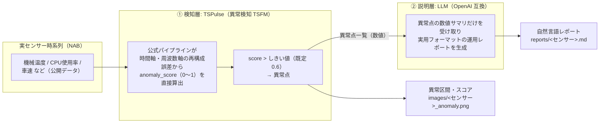

推論経路は次の 4 ステップ。

1. NAB のセンサー時系列（実データ）を読み込む。**間引きは既定で行わない**（`--downsample`, 既定 1。TSPulse の異常検知はベースコンテキスト長 512 の 3〜4 倍＝約 1,536〜2,048 点以上を要求するため）。
2. **TSPulse の公式パイプライン**（`TimeSeriesAnomalyDetectionPipeline`）に系列を渡し、**anomaly_score（0〜1）を直接得る**。既定では時間軸の再構成誤差（`time`）と周波数軸の再構成誤差（`fft`）の 2 モードを `max` で統合する。
3. `anomaly_score > --threshold`（既定 **0.6**、公式 notebook 準拠）を異常点とする。
4. 異常点だけの**数値サマリ**を LLM に渡し、運用向けの自然言語レポートを生成する（67 と同じ設計）。

- **異常スコアの式を自作しなくてよい**のが 67 との最大の違い。67 は Chronos の予測区間からの逸脱を band 幅で正規化する式を自前で書いており、これは特定論文の再現ではない簡易実装だった。TSPulse は異常検知タスクで学習済みなので、パイプラインが返すスコアをそのまま使える。
- **しきい値は 0〜1 で全センサー共通に使える**。67 は異常スコアのスケールがセンサーで桁違い（実測の最大値は ambient-temp 1.22 / network 660）だったため、[`Makefile`](../67/Makefile) にセンサー別のしきい値を持たせる必要があった。TSPulse はスコアが正規化されるため、**本 Tip は全 6 センサーで同一のしきい値 0.6**（公式既定）を使っている。
- **ただし「しきい値調整が不要」ではない**。公式パイプラインが返すのは `timestamp / value / anomaly_score` の 3 列だけで、**検知フラグは含まれない**。どこから異常とみなすかは利用者が決める（公式 notebook も `anomaly_score > 0.6` としている）。後述のとおり**しきい値感度は高い**。
- **LLM に渡すのは「異常点の数値サマリ」だけ**（生の時系列は渡さない）。67 と同じく、検証可能な事実だけを言語化させることで幻覚を抑える。TSPulse は期待区間を返さないため、代わりに**系列全体の中央値と、そこからの差**を添えて LLM が値の高低を判断できるようにしている。

## 🚀 使用方法

パッケージ管理は [uv](https://docs.astral.sh/uv/)、実行は `make` で行う。API キーは `.env`（git 管理外）に置く。

1. 依存を uv で仮想環境に同期する

    ```sh
    make install
    ```

    検知層は IBM 公式の TSFM ツールキット [`granite-tsfm`](https://github.com/ibm-granite/granite-tsfm)（Apache-2.0）を使う。TSPulse 本体と異常検知パイプラインが含まれる。

1. API キーを設定する（`.env` は git 管理外）

    ```sh
    cp .env.sample .env    # .env に OPENAI_API_KEY=... を記入
    ```

    既定は Google Gemini（`gemini-3.5-flash`）。API キーは https://aistudio.google.com/apikey で取得できる。`BASE_URL` / `LLM_MODEL` を変えれば OpenAI 互換の任意プロバイダを使える。

1. 実センサーデータ（NAB）を取得する

    ```sh
    make download-nab-dataset                  # 全 6 センサー＋正解ラベルを datasets/nab へ
    make download-nab-dataset DOWNLOAD_KEY=cpu # 単体で取得
    ```

    初回実行時に自動ダウンロードされるので必須ではない。

1. 検知 → レポート生成を実行する

    ```sh
    make run                       # 既定=機械温度センサー
    make run NAB_KEY=cpu           # 別センサー
    make run THRESHOLD=0.3         # しきい値を変える
    ```

    入力には、実世界のセンサー異常検知ベンチマーク **[NAB](https://github.com/numenta/NAB)** の公開データ（`timestamp,value` 形式・既知の異常区間ラベル付き）を使う。`NAB_KEY` で対象センサーを選ぶ（67 / 69 / 70 と共通）。

    | `NAB_KEY` | センサー | 内容 | データ数（生データ） | 入力波形例（<span style="color:#ff7f0e">■</span> 帯＝既知異常区間） |
    |---|---|---|---|---|
    | `machine-temp`（既定） | 産業機械の温度 | 実機の温度センサー。既知の故障あり | 22,695 | 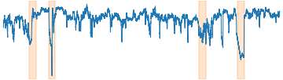 |
    | `ambient-temp` | 室温 | 室温センサー。故障イベントあり | 7,267 | 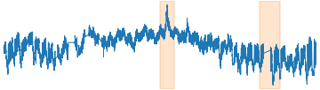 |
    | `cpu` | サーバ CPU 使用率 | AWS EC2 の CPU 使用率メトリクス | 4,032 |  |
    | `traffic-speed` | 道路の車速 | 交通センサーの速度（渋滞・異常で急落） | 1,127 | 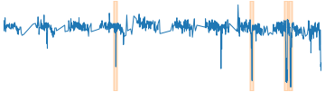 |
    | `traffic-occupancy` | 道路の占有率 | 交通センサーの占有率 | 2,380 | 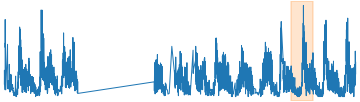 |
    | `network` | サーバ受信ネットワーク量 | EC2 の network-in メトリクス | 4,730 | 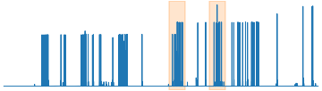 |

    検知結果の図を `images/<センサー>_anomaly.png` に、自然言語レポートを `reports/<センサー>.md` に出力する。`--input <csv>`（ヘッダなし・数値のみの 1 変量 CSV）で自前のセンサーデータも使える。

1. 生成レポートを LLM-as-judge で品質評価する（任意）

    ```sh
    make evaluate NAB_KEY=machine-temp
    ```

## 📊 実行結果

全 6 センサーを**生データ（間引きなし）・しきい値 0.6（公式既定）で統一**して実行した結果。TSPulse は決定的なモデルなので、10 回実行しても同じ結果になる（N=1 で十分）。

### ① 検知（TSPulse）

| センサー（データ数） | 検知結果（<span style="color:#ff7f0e">■</span> 帯＝NAB が定義する異常区間／<span style="color:#d62728">●</span>＝TSPulse の検知点。クリックで原寸） | スコア |
|---|---|---|
| `machine-temp` (22,695) | <a href="images/machine-temp_anomaly.png">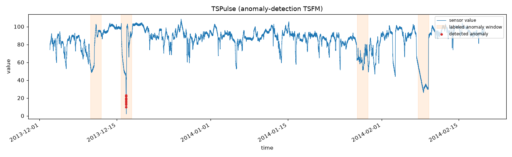</a> | 検出率=25.00% / 適合率=100.00%<br>**F1=0.400**<br><sub>誤検知率=0.00%</sub> |
| `ambient-temp` (7,267) | <a href="images/ambient-temp_anomaly.png">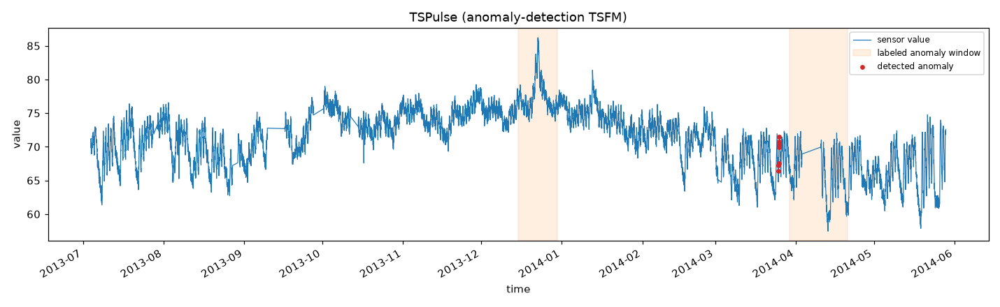</a> | 検出率=0.00% / 適合率=0.00%<br>**F1=0.000**<br><sub>誤検知率=0.12%</sub> |
| `cpu` (4,032) | <a href="images/cpu_anomaly.png">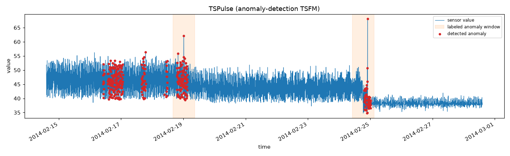</a> | 検出率=100.00% / 適合率=18.00%<br>**F1=0.308**<br><sub>誤検知率=5.51%</sub> |
| `traffic-speed` (1,127) | <a href="images/traffic-speed_anomaly.png">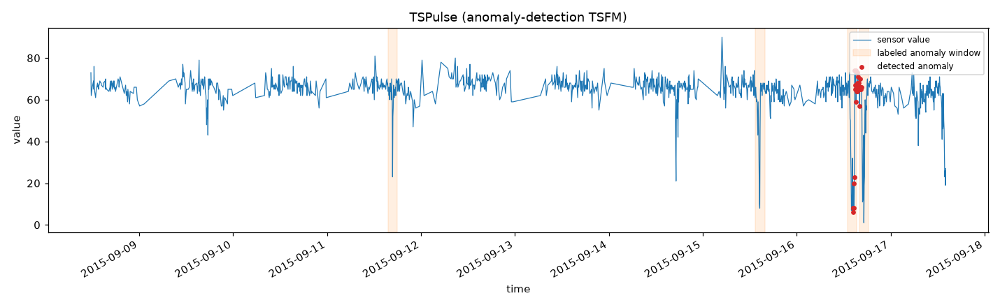</a> | 検出率=50.00% / 適合率=67.00%<br>**F1=0.571**<br><sub>誤検知率=0.69%</sub> |
| `traffic-occupancy` (2,380) | <a href="images/traffic-occupancy_anomaly.png">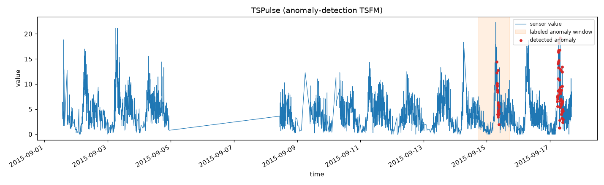</a> | 検出率=100.00% / 適合率=50.00%<br>**F1=0.667**<br><sub>誤検知率=2.52%</sub> |
| `network` (4,730) | <a href="images/network_anomaly.png">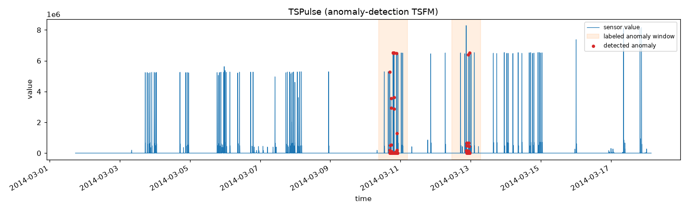</a> | 検出率=100.00% / 適合率=100.00%<br>**F1=1.000**<br><sub>誤検知率=0.00%</sub> |
| **全体平均** | — | **F1=0.491**<br><sub>誤検知率=1.47%</sub> |

各スコアの意味は次のとおり。

- **異常区間の検出率**: 正解の異常区間のうち、区間内に 1 点以上を検知できた区間の割合（＝見逃さなかったか）。高いほど良い
- **適合率**: 検知した区間のうち、本当に異常だった割合（＝空振りしないか）。高いほど良い
- **F1**: 上 2 つの調和平均。**主指標**。高いほど良い
- **誤検知率**: 正常点のうち誤って異常と判定した割合（＝正常データ 100 点あたり何点誤報するか）。低いほど良い

**結果は両極端**。`network` は **F1=1.00**（検出率・適合率とも 1.00、誤検知 0）と完璧だが、`ambient-temp` は**検知 0**（F1 0.000）。全体として**適合率は高いが見逃しやすい**傾向（machine-temp は 4 区間中 1 区間のみ検知）。

### ⚠️ しきい値感度が高い

しきい値 0.6 は公式 notebook の値だが、**最適とは限らない**。実測のしきい値感度:

| しきい値 | machine-temp | cpu |
|---|---|---|
| 0.6（既定） | F1=0.400 / 誤検知率 0.00% | F1=0.308 / 誤検知率 **5.51%** |
| 0.3 | **F1=0.571** / 誤検知率 0.06% | F1=0.182 / 誤検知率 **64.19%** |
| 0.2 | F1=0.571 / 誤検知率 0.26% | F1=0.667 / 誤検知率 **72.42%** |

**machine-temp は 0.3 に下げると F1 が 0.400 → 0.571 に改善**するが、**cpu は下げるほど誤検知が爆発**する（72% ＝ 4,032 点中 3,005 点を異常と判定）。**センサーごとに最適値が違う**ため、「TSPulse ならしきい値調整が不要」とは言えない。

> **⚠️ F1 だけを見てはいけない**: 上表の cpu `th=0.2` は **F1=0.667 と最高値なのに誤検知率 72.42%** という壊れた設定。異常区間が 2 つしかないため、**全点を異常と判定すれば検出率 1.00・誤検知も 1 塊にまとまって適合率 0.5 となり、F1 が高く出てしまう**。区間単位 F1 は「全部異常と言う」戦略でゲームできるため、**誤検知率との併記が必須**。

### ② レポート品質の評価（LLM-as-judge）

`make evaluate` で、生成レポートを別の LLM に採点させた結果（`temperature=0.0`）。**4 系統すべて同一のプロンプト**（[`prompts.yaml`](prompts.yaml) の `system` / `user_template` / `judge_system`）・同一モデル（`gemini-3.5-flash`）で測定している。

| センサー | 忠実性 | 総合 |
|---|---|---|
| machine-temp | **5** | **5.00** |
| ambient-temp | **5** | **5.00** |
| cpu | **5** | **5.00** |
| traffic-speed | **5** | **5.00** |
| traffic-occupancy | **5** | **5.00** |
| network | 4 | 4.75 |
| **平均** | **4.8** | **4.96** |

**忠実性が 6 センサー中 5 つで満点**。TSPulse は期待区間を返さないため、代わりに**系列全体の中央値とそこからの差**を渡している（[`build_anomaly_summary`](create_report.py)）だけだが、それでも LLM が数値を捏造しない。**「値の高低を判断できる基準を 1 つ添える」だけで十分**なことを示している。

### ③ 4 系統の比較（全 6 センサー）

同一データ（NAB 全 6 センサー）・同一指標・**同一プロンプト**・同一 LLM（`gemini-3.5-flash`）での比較。検知精度は (a)(b) が非決定的なため N=10 平均、(c)(d) は決定的なため N=1。

| 系統 | 検知 F1 | 誤検知率 | レポート品質<br>（judge 総合） | 忠実性が<br>1〜2 に落ちた回数 |
|---|---|---|---|---|
| **(a) 数値直接入力**（[69](https://github.com/Yagami360/ai-product-dev-tips/tree/master/nlp_processing/69)） | **0.619** | **0.33%** | 4.46 | 2 / 6 |
| **(b) 画像→VLM**（[70](https://github.com/Yagami360/ai-product-dev-tips/tree/master/nlp_processing/70)） | 0.588 | 6.38% | 3.96 | **4 / 6** |
| **(c) TSFM: Chronos**（[67](https://github.com/Yagami360/ai-product-dev-tips/tree/master/nlp_processing/67)） | 0.255 | 1.40% | 4.83 | **0 / 6** |
| **(d) TSFM: TSPulse**（本 Tip） | **0.491** | 1.47% | **4.96** 🏆 | **0 / 6** |

> **考察 1: 「TSFM だから弱い」ではなく「Chronos の転用だから弱かった」**
>
> - **TSPulse は Chronos の約 2 倍の F1**（0.491 対 0.255）。**67 の低スコアは TSFM 一般の限界ではなく、予測モデルの転用と自作スコア式に起因していた**ことが実測で切り分けられた。適合率の改善が顕著（Chronos は traffic-occupancy 0.04 / network 0.06 だったが、TSPulse は network で 1.00）。
> - **それでも (a) 数値直接入力（F1 0.619）には及ばない**。TSPulse は**見逃しやすい**（machine-temp 0.25、ambient-temp 0.00）のが主因。**TSB-AD で SOTA というベンチマーク結果が、NAB の 6 センサーでそのまま再現するわけではない**。
> - **運用面の利点は大きい**: しきい値が**全センサー共通**（0〜1 正規化。67 はセンサー別に 0.5〜1.5 の調整が必要で、スコア最大値は 500 倍差があった）、**108 万パラメータで CPU 動作**、**決定的**（LLM/VLM 系のような実行ごとのブレがない）。
>
> **考察 2: レポート品質を決めるのは「LLM に渡す事実の粒度」**
>
> **4 系統すべて同じプロンプト・同じ LLM・同じ temperature** での差なので、違いは**検知層が LLM に渡せる事実**だけに起因する。
>
> | 系統 | LLM に渡す事実 | 忠実性が 1〜2 に落ちた回数 |
> |---|---|---|
> | (a) 数値直接入力 | 時刻・値 | 2 / 6 |
> | (b) 画像→VLM | 時刻・値 | **4 / 6** |
> | (c) Chronos | 時刻・値・**期待中央値・期待区間・逸脱スコア** | **0 / 6** |
> | (d) TSPulse | 時刻・値・**中央値との差・異常スコア** | **0 / 6**（忠実性は 6 中 5 つで満点） |
>
> **判断材料を持つ (c)(d) は、一度も忠実性 1〜2 に落ちない**。対して (a)(b) は「時刻と値」しか渡せないため、LLM が文脈を補完（＝捏造）する。judge の指摘も一貫しており、(b) の cpu では「元の事実である『水準の急激な低下』とは逆に『高めの中位値が継続している』と解釈」という**方向の反転**まで起きた。
>
> **TSPulse は期待区間を返さない**ため、本 Tip では代わりに**系列全体の中央値とそこからの差**を渡している（[`build_anomaly_summary`](create_report.py)）。それでも **4 系統で最高の 4.96** を達成しており、**「値の高低を判断できる基準を 1 つ添える」だけで十分**なことを示している。

→ **結論: 検知層を Chronos から TSPulse に替える価値はある**（F1 が約 2 倍、しきい値がスケール非依存、決定的、CPU で軽い）。ただし**検知精度だけなら (a) 数値直接入力が依然として最良**。**TSFM + LLM の 2 段構成の価値は「幻覚のないレポート」にあり**、そこは検知層を替えても揺るがない（(c)(d) とも忠実性が 1〜2 に落ちた回数ゼロ）。実務では **「検知は (a) か (b)、説明は TSFM + LLM 方式」** という役割分担か、**見逃しを許容できるなら (d) TSPulse で一気通貫**が現実的。

## 🛠️ 開発者向け情報

### 📁 ディレクトリ構成

```
nlp_processing/71/
├── pyproject.toml / Makefile / .env.sample   # uv + make の実行環境 / API キーのひな形
├── .flake8                    # lint 設定（flake8。black と競合する規則は無効化）
├── create_report.py           # NAB 読み込み → TSPulse で検知 → 評価 → 数値サマリ → LLM でレポート生成
├── evaluate_report.py         # 生成レポートを LLM-as-judge で品質評価
├── download_dataset.py        # NAB データを datasets/nab へ取得
├── prompts.yaml               # プロンプト定義（生成用 system/user_template・評価用 judge_*）
├── images/                    # README 掲載図（コミット対象）
├── reports/                   # 生成された自然言語レポート
└── datasets/nab/ ※git 管理外  # NAB の CSV・正解ラベル（make download-nab-dataset で取得）
```

検知は IBM 公式の `TimeSeriesAnomalyDetectionPipeline` をそのまま使う（自前の異常スコア実装は持たない）。評価関数 `evaluate` は [69 の `nab_common.py`](../69/nab_common.py) と同一ロジックで、4 系統を同じ指標で比較できるようにしている。

### 🧰 利用可能コマンド（`make <target>`）

| コマンド | 説明 |
|---|---|
| `make install` | 依存(+dev ツール)を uv で仮想環境に同期 |
| `make download-nab-dataset` | NAB の実センサーデータ・正解ラベルを `datasets/nab` へ取得（既定は全 6 センサー） |
| `make run` | 検知 → レポート生成（`NAB_KEY=cpu` で別センサー、`THRESHOLD=0.3` でしきい値変更） |
| `make evaluate` | 生成レポートを LLM-as-judge で品質評価 |
| `make lint` / `make format` | flake8・mypy で静的チェック / black・isort で自動整形 |
| `make format-check` | 整形済みか確認（CI 用・変更しない） |
| `make clean` | ダウンロードしたデータ（`datasets/`）を削除 |

主な変数: `NAB_KEY`（既定 `machine-temp`）/ `THRESHOLD`（0.6）/ `DOWNSAMPLE`（1 = 間引きなし）/ `BASE_URL` / `LLM_MODEL`（`gemini-3.5-flash`）/ `REASONING_EFFORT`（`low`）。

## ⚠️ 注意点・課題

- **しきい値は依然として要調整**: スコアが 0〜1 に正規化されるため 67 のような桁違いの調整は不要になったが、**最適値はセンサーごとに違う**（machine-temp は 0.3、cpu は 0.6 でも誤検知率 5.51%）。公式既定の 0.6 が最適とは限らない。
- **見逃しやすい**: 既定設定では適合率は高いが検出率が低い（machine-temp 0.25、ambient-temp 0.00）。見逃しが許容できない用途ではしきい値を下げる必要があり、その代償として誤検知が増える。
- **入力に長い系列が必要**: 異常検知はベースコンテキスト長 512 の 3〜4 倍（**約 1,536〜2,048 点以上**）を要求する。短い系列（本 Tip の `traffic-speed` は生データで 1,127 点）では想定より精度が落ちる可能性がある。
- **ベンチマーク結果がそのまま再現するとは限らない**: TSB-AD で SOTA と報告されているが、本 Tip の NAB 6 センサーでは F1 0.491 で、数値直接入力（0.619）に及ばなかった。**ベンチマークの順位を自分のデータで検証せずに採用しない**。
- **評価指標の罠**: 区間単位 F1 は「全部異常と言う」戦略でゲームできる（実測で F1 0.667・誤検知率 72%）。**必ず誤検知率と併記する**。
- **API キーの管理**: API キーは `.env`（git 管理外）や環境変数で渡し、コードやリポジトリに直書きしない。

## 🔗 参考サイト

- https://huggingface.co/ibm-granite/granite-timeseries-tspulse-r1 （TSPulse モデルカード, Apache-2.0）
- https://github.com/ibm-granite/granite-tsfm （IBM 公式 TSFM ツールキット。異常検知パイプラインの実装, Apache-2.0）
- https://github.com/ibm-granite/granite-tsfm/blob/main/notebooks/hfdemo/tspulse_anomaly_detection.ipynb （公式の異常検知 notebook）
- https://research.ibm.com/blog/tspulse-time-series-ai-model （IBM Research: TSPulse の解説。TSB-AD での結果）
- https://github.com/numenta/NAB （Numenta Anomaly Benchmark: 実世界のセンサー異常検知データ）
- https://arxiv.org/abs/2409.01980 （サーベイ: Large Language Models for Time Series Anomaly Detection, NAACL 2025 Findings）
- https://ai.google.dev/gemini-api/docs/openai （Gemini の OpenAI 互換エンドポイント）
- https://docs.astral.sh/uv/ （uv: Python パッケージ管理）
